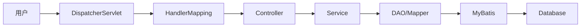
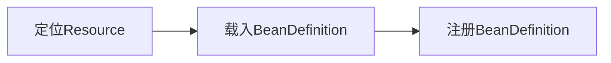
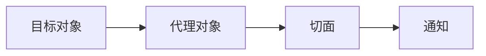
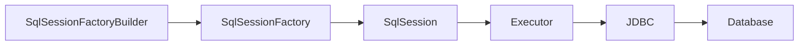

# 基于SSM的医院管理系统

## 1. 背景介绍

### 1.1 医院管理系统的重要性

在现代医疗体系中,医院管理系统扮演着至关重要的角色。高效、可靠的医院管理系统能够显著提升医院的运营效率,改善患者就医体验,降低医疗成本。随着信息技术的飞速发展,传统的人工管理模式已经难以满足现代化医院管理的需求。因此,开发一套功能完善、性能优异的医院管理系统势在必行。

### 1.2 SSM框架介绍

SSM框架是Java Web开发领域的经典框架,由Spring、Spring MVC和MyBatis三大框架组成。其中:

- Spring是一个轻量级的控制反转(IoC)和面向切面(AOP)的容器框架
- Spring MVC分离了控制器、模型对象、分派器以及处理程序对象的角色,这种分离让它们更容易进行定制
- MyBatis是一个支持普通SQL查询、存储过程和高级映射的优秀持久层框架

SSM框架具有易于上手、开发效率高、可扩展性强等优点,非常适合企业级Web应用的开发。

### 1.3 基于SSM的医院管理系统的优势

基于SSM框架开发医院管理系统具有如下优势:

1. 模块化设计,系统结构清晰,易于维护和扩展
2. 应用分层架构,使得系统具有更好的可重用性和灵活性
3. 采用MVC设计模式,实现了表现层和业务层的解耦
4. 利用Spring IoC实现了对象的自动管理,简化了开发流程
5. 使用MyBatis简化了数据库访问层的开发,提高了开发效率
6. 使用Spring AOP实现了系统日志、权限控制等功能,增强了系统的非功能性需求

## 2. 核心概念与联系

### 2.1 Spring框架

#### 2.1.1 IoC容器

IoC(Inversion of Control)即"控制反转",是Spring的核心概念。传统的Java开发中,对象的创建与依赖关系的管理通常由程序自身控制。而在IoC模式下,对象的创建与依赖关系的管理交由Spring IoC容器来完成。IoC容器负责对象的创建、初始化、装配和管理对象之间的依赖关系。这种控制权的转移,使得程序结构更加清晰,对象之间的耦合度大大降低。

#### 2.1.2 AOP

AOP(Aspect Oriented Programming),即面向切面编程,是对OOP(面向对象编程)的补充和完善。AOP引入"切面"的概念,通过预编译方式和运行期动态代理实现在不修改源代码的情况下给程序动态添加功能。AOP主要应用于日志记录、性能统计、安全控制、事务处理等方面。Spring AOP是基于代理模式实现的,在运行期间,Spring通过动态代理技术动态地生成代理对象来实现功能的增强。

### 2.2 Spring MVC框架

Spring MVC是Spring提供的一个轻量级Web开发框架,遵循MVC(Model-View-Controller)设计模式。

- Model:模型,承载数据,并对用户提交请求进行计算的模块。其分为两类,一类是数据承载Bean,一类是业务处理Bean
- View:视图,是提供给用户的操作界面,是程序的外壳
- Controller:控制器,负责根据用户的请求控制模型的更新和视图的更新

Spring MVC将Web层进行职责解耦,基于请求响应模型,使用前端控制器模式,并以松耦合的方式整合了其他框架,让开发变得更加简单。

### 2.3 MyBatis框架

MyBatis是一款优秀的持久层框架,支持定制化SQL、存储过程和高级映射。MyBatis避免了几乎所有的JDBC代码和手动设置参数以及获取结果集。MyBatis可以使用简单的XML或注解来配置和映射原生信息,将接口和Java的POJOs映射成数据库中的记录。

### 2.4 三大框架的关系

在SSM框架中,三大框架各司其职,又相互配合,形成一个完整的MVC请求处理流程。

1. 用户发送请求到前端控制器DispatcherServlet
2. DispatcherServlet收到请求后,调用HandlerMapping处理器映射器
3. 处理器映射器根据请求URL找到具体的处理器,生成处理器对象及处理器拦截器,再一起返回给DispatcherServlet
4. DispatcherServlet调用HandlerAdapter处理器适配器
5. HandlerAdapter经过适配调用具体的处理器(Controller)
6. Controller执行完成后,返回ModelAndView
7. HandlerAdapter将Controller执行结果ModelAndView返回给DispatcherServlet
8. DispatcherServlet将ModelAndView传给ViewReslover视图解析器
9. ViewReslover解析后返回具体View
10. DispatcherServlet对View进行渲染视图
11. DispatcherServlet响应用户

其中,Controller层调用Service层,Service层调用DAO层。DAO层通过MyBatis与数据库交互,实现数据的持久化。整个流程贯穿了Spring IoC容器,实现了各层之间的松耦合。同时,利用Spring AOP,很方便地实现如日志记录、权限控制等系统功能。

下图展示了SSM框架的整体架构:



## 3. 核心算法原理具体操作步骤

### 3.1 Spring IoC容器的初始化

Spring IoC容器的初始化主要分为三个步骤:Resource定位、BeanDefinition的载入和注册。

1. Resource定位。Spring IoC容器先通过ResourceLoader完成资源的定位,由Resource接口完成具体资源的定义。
2. BeanDefinition的载入。将用户定义好的Bean表示为IoC容器内部的数据结构BeanDefinition。
3. BeanDefinition的注册。将载入过程中解析得到的BeanDefinition向IoC容器进行注册。



### 3.2 Spring AOP的实现原理

Spring AOP的实现原理是动态代理,具体包括JDK动态代理和CGLIB动态代理。

- JDK动态代理:基于反射机制实现,要求被代理的类必须实现接口。JDK动态代理通过反射生成一个实现代理接口的匿名类,在调用具体方法前调用InvokeHandler来处理
- CGLIB动态代理:基于ASM框架实现,通过生成业务类的子类作为代理类,因此不要求被代理类必须实现接口

Spring AOP在运行时生成代理类,将切面(Aspect)织入到目标对象(Target)中。当目标方法被调用时,通过拦截器(Interceptor)执行通知(Advice)。



### 3.3 MyBatis的执行流程

MyBatis的执行流程主要分为3步:

1. 创建SqlSessionFactory。通过SqlSessionFactoryBuilder解析配置文件,创建Configuration对象,再通过Configuration创建SqlSessionFactory。
2. 创建SqlSession。由SqlSessionFactory创建SqlSession,SqlSession是一个接口,具体实现类是DefaultSqlSession。
3. 执行SQL语句。通过SqlSession执行SQL语句,实际执行者是Executor。Executor基于JDBC实现与数据库的交互。



## 4. 数学模型和公式详细讲解举例说明

在医院管理系统中,我们可以利用数学模型来优化资源调度、预测患者流量等。下面以患者流量预测为例,介绍一下ARIMA时间序列模型。

ARIMA(Autoregressive Integrated Moving Average)模型是一种常用的时间序列预测模型,它是在ARMA(Autoregressive Moving Average)模型的基础上,加入差分环节而形成的。ARIMA(p,d,q)模型可以表示为:

$$ \Phi(B)(1-B)^dX_t = \Theta(B)\varepsilon_t $$

其中:
- $\Phi(B)$是p阶自回归系数多项式
- $\Theta(B)$是q阶移动平均系数多项式
- $(1-B)^d$是d阶差分算子
- $\varepsilon_t$是白噪声序列

ARIMA模型的构建步骤如下:

1. 平稳性检验。通过时序图、自相关图和单位根检验判断时间序列是否平稳,若不平稳需要进行差分运算。
2. 模型识别。根据差分后序列的自相关图和偏自相关图,识别ARMA(p,q)模型的阶数。
3. 模型估计。利用最小二乘法、极大似然估计等方法估计模型参数。
4. 模型检验。对拟合模型进行残差检验,判断模型是否可用。
5. 模型预测。利用拟合好的模型对未来进行预测。

例如,我们可以利用ARIMA模型对医院未来一周的门诊量进行预测:

```python
import pandas as pd
from statsmodels.tsa.arima.model import ARIMA

# 导入历史数据
data = pd.read_csv('hospital.csv', index_col='date', parse_dates=True)

# 拟合ARIMA(1,1,1)模型
model = ARIMA(data, order=(1,1,1)) 
result = model.fit()

# 预测未来7天的门诊量
forecast = result.forecast(7)
print(forecast)
```

通过ARIMA模型预测得到的患者流量,可以帮助医院提前做好人力、物资等方面的准备,提高服务效率。

## 5. 项目实践:代码实例和详细解释说明

下面我们通过一个简单的医生管理模块,演示SSM框架的基本用法。

### 5.1 数据库设计

创建`doctor`表:

```sql
CREATE TABLE `doctor` (
  `id` int(11) NOT NULL AUTO_INCREMENT,
  `name` varchar(20) DEFAULT NULL,
  `dept` varchar(20) DEFAULT NULL,
  `phone` varchar(20) DEFAULT NULL,
  PRIMARY KEY (`id`)
) ENGINE=InnoDB DEFAULT CHARSET=utf8;
```

### 5.2 创建实体类

```java
public class Doctor {
    private Integer id;
    private String name;
    private String dept;
    private String phone;
    // 省略getter、setter方法
}
```

### 5.3 Mapper接口与配置文件

```java
public interface DoctorMapper {
    List<Doctor> selectAll();
    Doctor selectById(Integer id);
    void insert(Doctor doctor);
    void update(Doctor doctor);
    void delete(Integer id);
}
```

DoctorMapper.xml:

```xml
<mapper namespace="com.example.mapper.DoctorMapper">
    <select id="selectAll" resultType="com.example.entity.Doctor">
        select * from doctor
    </select>
    
    <select id="selectById" parameterType="int" resultType="com.example.entity.Doctor">
        select * from doctor where id = #{id}
    </select>
    
    <insert id="insert" parameterType="com.example.entity.Doctor">
        insert into doctor(name,dept,phone) values(#{name},#{dept},#{phone})
    </insert>
    
    <update id="update" parameterType="com.example.entity.Doctor">
        update doctor set name=#{name},dept=#{dept},phone=#{phone} where id=#{id}
    </update>
    
    <delete id="delete" parameterType="int">
        delete from doctor where id = #{id}
    </delete>
</mapper>
```

### 5.4 Service接口与实现类

```java
public interface DoctorService {
    List<Doctor> getAllDoctors();
    Doctor getDoctorById(Integer id);
    void addDoctor(Doctor doctor);
    void updateDoctor(Doctor doctor);
    void deleteDoctor(Integer id);
}
```

```java
@Service
public class DoctorServiceImpl implements DoctorService {
    
    @Autowired
    private DoctorMapper doctorMapper;

    @Override
    public List<Doctor> getAllDoctors() {
        return doctorMapper.selectAll();
    }

    @Override
    public Doctor getDoctorById(Integer id) {
        return doctorMapper.selectById(id);
    }

    @Override
    public void addDoctor(Doctor doctor) {
        doctorMapper.insert(doctor);
    }

    @Override
    public void updateDoctor(Doctor doctor) {
        doctorMapper.update(doctor);
    }

    @Override
    public void deleteDoctor(Integer id) {
        doctorMapper.delete(id);
    }
}
```

### 5.5 Controller

```java
@Controller
@RequestMapping("/doctor")
public class DoctorController {

    @Autowired
    private DoctorService doctorService;

    @GetMapping("/list")
    public String list(Model model