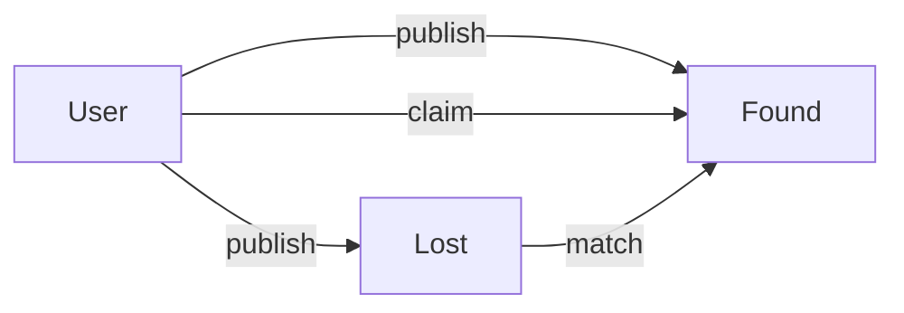

# 基于ssm的失物招领系统

## 1.背景介绍

在校园、商场、机场等人流密集的公共场所,失物招领是一个非常常见且重要的需求。传统的失物招领方式效率低下,难以实现失主和拾主的有效匹配。随着互联网和移动互联网的发展,开发一套高效便捷的失物招领系统显得尤为重要和紧迫。

本文将介绍一个基于SSM(Spring + Spring MVC + MyBatis)框架的失物招领系统,旨在提高失物招领的效率,方便失主快速找回遗失物品。我们将详细阐述系统的需求分析、架构设计、核心算法、关键实现等,并给出具体的代码示例。

### 1.1 失物招领系统的必要性

失物招领系统有助于:
- 提高失物找回效率,减少失主的损失
- 方便失主和拾主快速建立联系
- 减轻管理部门的工作量,提高管理效率
- 提升公共场所的服务质量和品牌形象

### 1.2 系统目标

本系统力求实现:
- 失物信息和拾物信息的快速录入和检索
- 精准匹配失物和拾物,自动推送匹配结果
- 用户实名认证,确保信息真实可靠
- 界面友好,操作便捷,适配PC和移动端

### 1.3 技术选型

本系统采用SSM框架,具体技术栈如下:

- 前端:HTML5、CSS3、JavaScript、jQuery、Bootstrap
- 后端:Spring、Spring MVC、MyBatis 
- 数据库:MySQL
- 服务器:Tomcat
- 开发工具:Eclipse、Maven

SSM框架是Java Web开发的经典组合,成熟稳定,社区生态丰富,可以显著提升开发效率。

## 2.核心概念与关系

在失物招领系统中,核心概念包括:

- 失物(Lost):失主遗失的物品,包括名称、特征、遗失时间地点等信息
- 拾物(Found):拾主捡到的物品,包括名称、特征、拾获时间地点等信息
- 用户(User):使用失物招领系统的用户,包括失主和拾主,用户需要实名认证
- 认领(Claim):失主认领拾主发布的Found物品
- 匹配(Match):系统自动将相似的Lost物品和Found物品匹配

这些核心概念之间的关系如下:



即用户可以发布Lost和Found信息,也可以认领Found物品。系统会自动将Lost物品和Found物品进行匹配。

### 2.1 失物和拾物的信息结构

Lost和Found的信息结构非常相似,包含以下字段:

- id:唯一标识
- name:物品名称
- category:物品分类
- description:详细描述
- characteristic:特征描述
- images:物品照片
- time:遗失/拾获时间
- location:遗失/拾获地点
- publishTime:信息发布时间
- status:状态 (LOST/FOUND/RETURNED)
- userId:发布人ID

### 2.2 用户信息结构

User代表系统用户,包含以下字段:  

- id:唯一标识
- username:用户名
- password:密码
- realName:真实姓名
- idNumber:身份证号
- email:邮箱
- phone:手机号
- avatar:头像
- status:状态(NORMAL/BANNED)

用户注册时需要提供以上信息,并通过实名认证,确保身份真实有效。

## 3.核心算法原理和步骤

失物招领系统的核心算法是自动匹配Lost和Found信息。匹配算法需要从多个维度评估两个物品的相似度,综合考虑名称、分类、特征等因素。

### 3.1 文本相似度算法

对于物品的名称、分类、描述等文本信息,我们可以使用如下算法计算相似度:

- 编辑距离算法:计算两个字符串的编辑距离,编辑距离越小说明越相似
- 余弦相似度:将文本转为词频向量,计算两个向量的夹角余弦值,越接近1说明越相似
- Jaccard相似度:提取文本的关键词集合,计算两个集合的交集/并集,越接近1说明越相似

### 3.2 图像相似度算法

对于物品的图像信息,可以使用如下算法计算相似度:  

- 感知哈希算法:缩放图像并转为灰度图,计算哈希值,比较两个哈希值的汉明距离
- SIFT特征提取:提取图像的尺度不变特征,计算两组特征的匹配度
- 直方图比较:统计图像在不同颜色通道下的像素分布直方图,计算直方图的相似度

### 3.3 时空相似度

除了物品本身的特征,遗失/拾获的时间地点也是重要线索。我们可以比较两个物品Lost和Found的时间差和空间距离:

- 时间差:两个物品的Lost和Found时间差越小,可能性越大
- 空间距离:两个物品的Lost和Found地点距离越近,可能性越大

### 3.4 综合相似度计算

我们可以对以上各维度的相似度分别赋予权重,加权求和得到综合相似度:

$$
similarity = w_1 * text_similarity + w_2 * image_similarity + w_3 * time_diff + w_4 * geo_distance
$$

其中$w_1, w_2, w_3, w_4$为各维度的权重系数,可以根据实际情况进行调整。

### 3.5 匹配和推荐

对于每个新发布的Lost物品,我们可以遍历现有的Found物品,计算综合相似度,按照相似度从高到低排序。相似度超过阈值(如0.6)的Found物品,可以推荐给Lost物品的发布者。

同理,新发布的Found物品也可以与现有的Lost物品匹配计算,将结果推送给Found物品的发布者。

## 4.数学模型和公式详解

上一节提到的相似度计算公式,这里进一步展开。

### 4.1 编辑距离

编辑距离用于衡量两个字符串的差异程度,它表示通过插入、删除、替换等操作,将一个字符串变换为另一个字符串所需的最少步骤数。

设有两个字符串$S_1$和$S_2$,长度分别为$m$和$n$,则$S_1$和$S_2$的编辑距离$d(i,j)$可以递归地定义为:

$$
d(i,j)=
\begin{cases}
max(i,j) & if\ min(i,j)=0 \\
min\begin{cases}
d(i-1,j)+1 \\
d(i,j-1)+1 \\
d(i-1,j-1)+I(S_1[i]\neq S_2[j])
\end{cases} & otherwise
\end{cases}
$$

其中$I(S_1[i]\neq S_2[j])$表示如果$S_1$的第$i$个字符不等于$S_2$的第$j$个字符,则为1,否则为0。

编辑距离的取值范围为$[0, max(m,n)]$,可以将其归一化到$[0,1]$区间:

$$
similarity = 1 - \frac{d(m,n)}{max(m,n)}
$$

### 4.2 余弦相似度

余弦相似度用于衡量两个向量的夹角大小。对于两个文本,我们可以将其转化为词频向量,然后计算向量夹角的余弦值。

设词频向量$\vec{v_1}=(x_1,x_2,...,x_n)$和$\vec{v_2}=(y_1,y_2,...,y_n)$,则两个向量的余弦相似度为:

$$
similarity=cos(\theta)=\frac{\vec{v_1} \cdot \vec{v_2}}{||\vec{v_1}|| \times ||\vec{v_2}||}=\frac{\sum_{i=1}^n x_i y_i}{\sqrt{\sum_{i=1}^n x_i^2} \sqrt{\sum_{i=1}^n y_i^2}}
$$

余弦相似度的取值范围为$[-1,1]$,值越接近1,说明两个向量方向越一致,对应的文本越相似。

### 4.3 Jaccard相似度

Jaccard相似度衡量两个集合的交集和并集的比值。对于两个文本,我们可以提取其中的关键词集合,然后比较两个集合的交并比。

设集合$A$和$B$,则Jaccard相似度定义为:

$$
J(A,B) = \frac{|A \cap B|}{|A \cup B|} = \frac{|A \cap B|}{|A| + |B| - |A \cap B|}
$$

其中$|A|$表示集合$A$中元素的个数。

Jaccard相似度的取值范围为$[0,1]$,值越接近1,说明两个集合越相似,对应的文本越相似。

## 5.项目实践

接下来我们使用SSM框架,实现一个简单的失物招领系统。

### 5.1 数据库设计

首先设计Lost、Found、User三张核心表。

Lost表:
```sql
CREATE TABLE `lost` (
  `id` int(11) unsigned NOT NULL AUTO_INCREMENT,
  `name` varchar(50) NOT NULL DEFAULT '' COMMENT '物品名称',
  `category` varchar(20) DEFAULT NULL COMMENT '分类',
  `description` varchar(500) DEFAULT NULL COMMENT '描述',
  `characteristic` varchar(500) DEFAULT NULL COMMENT '特征',
  `images` varchar(1000) DEFAULT NULL COMMENT '图片URL',
  `lost_time` datetime DEFAULT NULL COMMENT '遗失时间',
  `lost_location` varchar(100) DEFAULT NULL COMMENT '遗失地点',
  `publish_time` datetime DEFAULT NULL COMMENT '发布时间',
  `status` varchar(20) DEFAULT NULL COMMENT '状态',
  `user_id` int(11) unsigned DEFAULT NULL COMMENT '发布人ID',
  PRIMARY KEY (`id`),
  KEY `user_id` (`user_id`)
) ENGINE=InnoDB DEFAULT CHARSET=utf8;
```

Found表结构与Lost表类似,不再赘述。

User表:
```sql
CREATE TABLE `user` (
  `id` int(11) unsigned NOT NULL AUTO_INCREMENT,
  `username` varchar(50) NOT NULL DEFAULT '' COMMENT '用户名',
  `password` varchar(50) NOT NULL DEFAULT '' COMMENT '密码',
  `real_name` varchar(20) DEFAULT NULL COMMENT '真实姓名',
  `id_number` varchar(18) DEFAULT NULL COMMENT '身份证号',
  `email` varchar(50) DEFAULT NULL COMMENT '邮箱',
  `phone` varchar(20) DEFAULT NULL COMMENT '手机号',
  `avatar` varchar(200) DEFAULT NULL COMMENT '头像URL',
  `status` varchar(20) DEFAULT NULL COMMENT '状态',
  PRIMARY KEY (`id`),
  UNIQUE KEY `username` (`username`)
) ENGINE=InnoDB DEFAULT CHARSET=utf8;
```

### 5.2 Spring MVC控制器

编写LostController和FoundController,分别处理Lost和Found相关的CRUD请求。

以发布Lost为例:

```java
@Controller
@RequestMapping("/lost")
public class LostController {
    
    @Autowired
    private LostService lostService;
    
    @PostMapping("/publish")
    @ResponseBody
    public Result publish(Lost lost, @SessionAttribute("user") User user) {
        lost.setUserId(user.getId());
        lost.setPublishTime(new Date());
        lost.setStatus(LostStatus.LOST.getName());
        lostService.save(lost);
        return Result.success();
    }
    
    // 其他方法省略
}
```

### 5.3 MyBatis数据访问

编写LostMapper和FoundMapper,使用MyBatis实现对数据库的CRUD操作。

以保存Lost为例:

```java
@Repository
public interface LostMapper {
    
    @Insert("INSERT INTO lost(name, category, description, characteristic, images, lost_time, lost_location, publish_time, status, user_id) " +
            "VALUES (#{name}, #{category}, #{description}, #{characteristic}, #{images}, #{lostTime}, #{lostLocation}, #{publishTime}, #{status}, #{userId})")
    @Options(useGeneratedKeys = true, keyProperty = "id")
    void save(Lost lost);
    
    // 其他方法省略
}
```

### 5.4 物品匹配算法

编写物品自动匹配算法,实现新Lost物品和现有Found物品的匹配计算。

以计算文本相似度为例:

```java
@Service
public class MatchService {
    
    /**
     * 计算编辑距离相似度
     */
    public double editDistanceScore(String text1, String text2) {
        int m = text1.length();
        int n = text2.length();
        int[][] dp = new int[m + 1][n + 1];
        for (int i = 0; i <= m; i++) {
            dp[i][0] = i;
        }
        for (int j = 0; j <= n; j++) {
            dp[0][j] = j;
        }
        for (int i = 1; i <= m; i++) {
            for (int j = 1; j <= n; j++) {
                if (text1.charAt(i - 1)