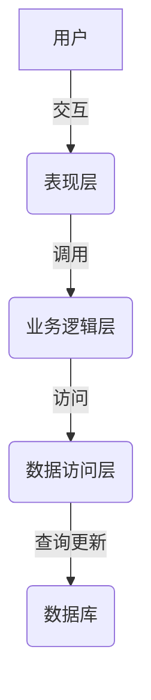
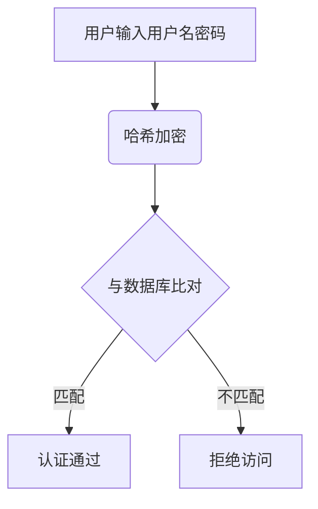
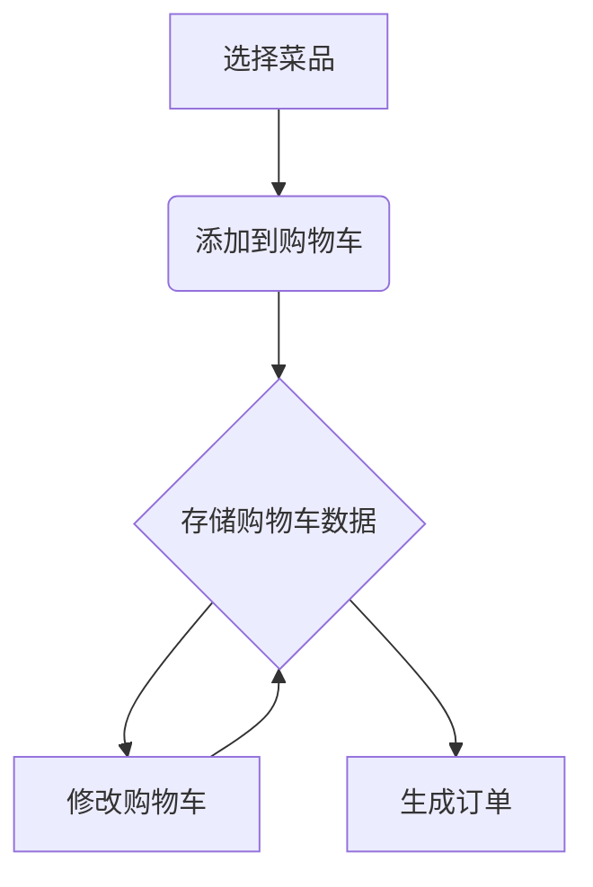
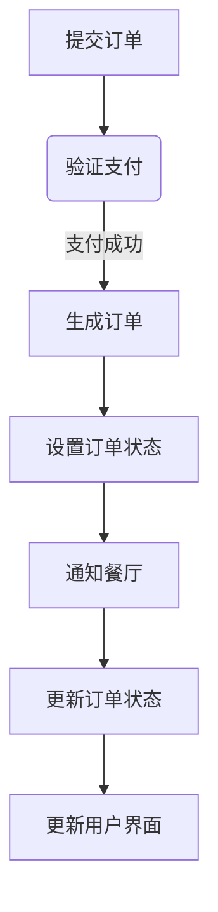

# 基于Web的订餐系统的设计与实现

## 1. 背景介绍

### 1.1 餐饮行业的发展趋势

随着人们生活节奏的加快和消费习惯的改变,外卖订餐服务越来越受欢迎。传统的餐馆经营模式已经难以满足现代消费者的需求,他们追求便捷、高效的用餐体验。在这种背景下,基于Web的订餐系统应运而生,为餐饮企业提供了一种全新的经营模式。

### 1.2 订餐系统的优势

基于Web的订餐系统具有以下优势:

- **无缝用户体验**: 用户可以通过网站或移动应用程序轻松浏览菜单、下单和支付,无需排队等候。
- **提高运营效率**: 系统自动化处理订单,减少人工干预,提高了订单处理效率。
- **数据分析**: 系统可以收集用户订单数据,为餐馆提供宝贵的消费者行为分析,优化经营策略。
- **扩大市场覆盖范围**: 不受地理位置的限制,可以覆盖更广阔的市场。

### 1.3 系统架构概览

基于Web的订餐系统通常采用客户端-服务器架构,包括以下几个主要组件:

- **前端**: 基于HTML、CSS和JavaScript开发的用户界面,运行在浏览器或移动应用程序中。
- **后端**: 处理业务逻辑、数据存储和检索的服务器端应用程序。
- **数据库**: 存储菜单信息、订单记录和用户数据。

## 2. 核心概念与联系

### 2.1 系统用例

订餐系统的核心用例包括:

- 用户注册和登录
- 浏览菜单和添加到购物车
- 下单和支付
- 订单状态跟踪
- 管理员管理菜单和订单

### 2.2 系统架构

订餐系统的架构可以概括为三层结构:

1. **表现层(Presentation Layer)**: 用户界面,负责数据展示和用户交互。
2. **业务逻辑层(Business Logic Layer)**: 处理系统的核心业务逻辑,如订单处理、支付验证等。
3. **数据访问层(Data Access Layer)**: 负责与数据库进行交互,执行数据存储和检索操作。



### 2.3 关键技术

实现订餐系统需要综合运用多种技术,包括但不限于:

- **前端技术**: HTML、CSS、JavaScript、React/Angular/Vue等前端框架
- **后端技术**: Java、Python、Node.js等服务器端语言,Spring、Flask、Express等Web框架
- **数据库技术**: MySQL、PostgreSQL、MongoDB等关系型和非关系型数据库
- **支付集成**: 第三方支付平台API集成,如PayPal、Stripe等
- **安全**: 用户认证、授权、数据加密等安全措施

## 3. 核心算法原理具体操作步骤

### 3.1 用户认证

用户认证是订餐系统的基础,确保只有合法用户才能访问系统资源。常见的用户认证流程如下:

1. 用户提供用户名和密码
2. 系统对密码进行哈希加密
3. 将加密后的密码与数据库中存储的密码进行比对
4. 如果匹配,则认证通过,否则拒绝访问



### 3.2 购物车管理

购物车是订餐系统的核心功能之一,它允许用户临时存储所选菜品,并在结账时一次性下单。购物车管理算法通常包括以下步骤:

1. 用户选择菜品,将其添加到购物车
2. 系统在会话或数据库中存储购物车数据
3. 用户可以修改购物车内容,如增加/减少数量或删除菜品
4. 在结账时,系统从购物车中读取数据,生成订单



### 3.3 订单处理

订单处理是订餐系统的另一个核心功能,它涉及多个步骤,包括订单生成、支付验证、订单状态更新等。订单处理算法可以概括为以下步骤:

1. 用户提交订单和支付信息
2. 系统验证支付信息,如果支付成功,则生成订单
3. 将订单状态设置为"已下单"
4. 通知餐厅接收并处理订单
5. 根据订单状态更新,更新用户界面



## 4. 数学模型和公式详细讲解举例说明

在订餐系统中,数学模型和公式主要应用于以下几个方面:

### 4.1 菜品价格计算

对于每个订单,系统需要计算总价格。假设一个订单包含 $n$ 个菜品,第 $i$ 个菜品的价格为 $p_i$,数量为 $q_i$,则订单总价格 $P$ 可以用以下公式计算:

$$P = \sum_{i=1}^{n} p_i \times q_i$$

### 4.2 配送费用计算

许多订餐系统会根据配送距离和订单金额计算配送费用。假设基本配送费为 $f_0$,每增加 $d$ 公里增加 $f_d$ 的配送费,订单金额低于 $P_0$ 时需要支付小费 $t$,则配送费用 $F$ 可以用以下公式计算:

$$F = f_0 + f_d \times \left\lceil\frac{distance}{d}\right\rceil + \begin{cases}
t, & \text{if } P < P_0\\
0, & \text{otherwise}
\end{cases}$$

其中 $\lceil x \rceil$ 表示向上取整。

### 4.3 推荐系统

为了提高用户体验,订餐系统通常会基于用户的历史订单记录,使用协同过滤算法为用户推荐菜品。假设用户 $u$ 的历史评分记录为 $R_u = \{r_{u1}, r_{u2}, \ldots, r_{um}\}$,其中 $r_{ui}$ 表示对第 $i$ 个菜品的评分。我们可以计算用户 $u$ 与其他用户 $v$ 的相似度 $s_{uv}$,例如使用皮尔逊相关系数:

$$s_{uv} = \frac{\sum_{i \in I}(r_{ui} - \overline{r_u})(r_{vi} - \overline{r_v})}{\sqrt{\sum_{i \in I}(r_{ui} - \overline{r_u})^2}\sqrt{\sum_{i \in I}(r_{vi} - \overline{r_v})^2}}$$

其中 $I$ 是用户 $u$ 和 $v$ 都评分过的菜品集合, $\overline{r_u}$ 和 $\overline{r_v}$ 分别表示用户 $u$ 和 $v$ 的平均评分。

基于相似用户的评分,我们可以预测用户 $u$ 对未评分菜品 $j$ 的评分:

$$p_{uj} = \overline{r_u} + \frac{\sum_{v \in S(j,k)}s_{uv}(r_{vj} - \overline{r_v})}{\sum_{v \in S(j,k)}|s_{uv}|}$$

其中 $S(j,k)$ 表示对菜品 $j$ 评分的 $k$ 个最相似用户集合。

## 5. 项目实践: 代码实例和详细解释说明

在这一节,我们将提供一些核心功能的代码示例,并对其进行详细解释。

### 5.1 用户认证

以下是使用 Node.js 和 Express 框架实现用户认证的示例代码:

```javascript
const express = require('express');
const bcrypt = require('bcrypt');
const jwt = require('jsonwebtoken');

const app = express();
const users = []; // 模拟用户数据库

// 注册新用户
app.post('/register', async (req, res) => {
  const { username, password } = req.body;
  const hashedPassword = await bcrypt.hash(password, 10);
  users.push({ username, password: hashedPassword });
  res.status(201).send('User registered');
});

// 用户登录
app.post('/login', async (req, res) => {
  const { username, password } = req.body;
  const user = users.find(u => u.username === username);
  if (!user) {
    return res.status(401).send('Invalid username or password');
  }
  const isPasswordValid = await bcrypt.compare(password, user.password);
  if (!isPasswordValid) {
    return res.status(401).send('Invalid username or password');
  }
  const token = jwt.sign({ username }, 'secretKey');
  res.send({ token });
});

// 验证Token中间件
const verifyToken = (req, res, next) => {
  const token = req.headers.authorization?.split(' ')[1];
  if (!token) {
    return res.status(401).send('No token provided');
  }
  try {
    const decoded = jwt.verify(token, 'secretKey');
    req.user = decoded;
    next();
  } catch (err) {
    res.status(401).send('Invalid token');
  }
};

// 受保护的路由
app.get('/protected', verifyToken, (req, res) => {
  res.send(`Hello, ${req.user.username}!`);
});

app.listen(3000, () => console.log('Server started on port 3000'));
```

在这个示例中,我们使用 `bcrypt` 库对用户密码进行哈希加密,并将用户信息存储在内存中的 `users` 数组中。在登录时,我们使用 `bcrypt.compare` 函数验证用户输入的密码是否与存储的哈希密码匹配。如果匹配,我们使用 `jsonwebtoken` 库生成一个 JWT 令牌,并将其返回给客户端。

对于需要身份验证的路由,我们使用 `verifyToken` 中间件验证请求头中的 JWT 令牌是否有效。如果令牌有效,我们从令牌中解码出用户信息,并将其存储在 `req.user` 中,以供后续路由使用。

### 5.2 购物车管理

以下是使用 React 和 React Router 实现购物车管理的示例代码:

```jsx
import React, { useState } from 'react';
import { BrowserRouter as Router, Switch, Route, Link } from 'react-router-dom';

const Menu = ({ addToCart }) => {
  const menuItems = [
    { id: 1, name: 'Pizza', price: 10 },
    { id: 2, name: 'Burger', price: 8 },
    { id: 3, name: 'Salad', price: 6 },
  ];

  return (
    <div>
      <h2>Menu</h2>
      <ul>
        {menuItems.map(item => (
          <li key={item.id}>
            {item.name} - ${item.price}
            <button onClick={() => addToCart(item)}>Add to Cart</button>
          </li>
        ))}
      </ul>
    </div>
  );
};

const Cart = ({ cart, removeFromCart }) => {
  const total = cart.reduce((acc, item) => acc + item.price, 0);

  return (
    <div>
      <h2>Cart</h2>
      <ul>
        {cart.map(item => (
          <li key={item.id}>
            {item.name} - ${item.price}
            <button onClick={() => removeFromCart(item.id)}>Remove</button>
          </li>
        ))}
      </ul>
      <p>Total: ${total}</p>
    </div>
  );
};

const App = () => {
  const [cart, setCart] = useState([]);

  const addToCart = item => {
    setCart([...cart, item]);
  };

  const removeFromCart = id => {
    setCart(cart.filter(item => item.id !== id));
  };

  return (
    <Router>
      <div>
        <nav>
          <ul>
            <li>
              <Link to="/">Menu</Link>
            </li>
            <li>
              <Link to="/cart">Cart</Link>
            </li>
          </ul>
        </nav>

        <Switch>
          <Route path="/cart">
            <Cart cart={cart} removeFromCart={removeFromCart} />
          </Route>
          <Route path="/">
            <Menu addToCart={addToCart} />
          