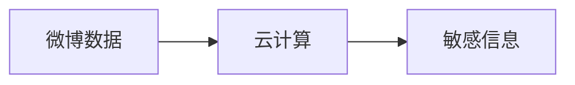

## 1.背景介绍

在互联网的信息海洋中，微博作为一种新型的社交媒体，日益成为人们获取和传播信息的重要途径。然而，随着微博信息的爆炸性增长，如何有效地挖掘和利用这些信息，特别是敏感信息，已经成为了一个重要的问题。为了解决这个问题，我们提出了一种基于云计算的微博敏感信息挖掘系统。

云计算是一种新型的计算模式，它将计算资源作为服务通过网络提供给用户，用户无需关心底层的硬件和软件细节，只需按需使用和支付。借助云计算的强大计算能力和存储能力，我们可以有效处理大量的微博数据，挖掘出其中的敏感信息。

## 2.核心概念与联系

在这个系统中，我们主要关注两个核心概念：微博敏感信息和云计算。

微博敏感信息是指在微博中可能对个人、团体或社会产生不良影响的信息。这些信息可能涉及政治、宗教、种族、性别等敏感话题，也可能涉及虚假信息、谣言、恶意攻击等不良行为。

云计算则是我们处理这些数据的工具。通过云计算，我们可以快速、灵活、经济地处理大量的微博数据，挖掘出其中的敏感信息。在这个过程中，我们主要利用了云计算的两个特性：弹性和可伸缩性。弹性允许我们根据需要动态调整计算资源，而可伸缩性则保证了我们可以有效处理大规模的数据。

这两个概念之间的关系可以用以下的 Mermaid 流程图来表示：



## 3.核心算法原理具体操作步骤

我们的系统主要包括四个步骤：数据收集、预处理、敏感信息检测和结果展示。

1. 数据收集：我们通过微博的公开API收集微博数据。这些数据包括微博的内容、发布时间、作者信息等。

2. 预处理：我们对收集到的数据进行预处理，包括去除噪声、去除重复数据、分词等。

3. 敏感信息检测：我们使用机器学习算法对预处理后的数据进行敏感信息检测。具体的算法包括朴素贝叶斯、支持向量机、深度学习等。

4. 结果展示：我们将检测结果通过网页或API的形式展示给用户。

## 4.数学模型和公式详细讲解举例说明

在敏感信息检测阶段，我们主要使用了朴素贝叶斯算法。朴素贝叶斯是一种基于贝叶斯定理的分类算法，它假设特征之间相互独立。

贝叶斯定理的公式为：

$$ P(A|B) = \frac{P(B|A)P(A)}{P(B)} $$

在我们的问题中，A代表某条微博是敏感信息，B代表微博的特征。我们的目标是计算出给定特征的情况下，微博是敏感信息的概率。

由于特征之间相互独立，我们可以将公式简化为：

$$ P(A|B) = \frac{P(B_1|A)P(B_2|A)...P(B_n|A)P(A)}{P(B)} $$

其中，$B_1,B_2,...,B_n$是微博的特征。

## 5.项目实践：代码实例和详细解释说明

以下是我们使用Python和sklearn库实现朴素贝叶斯算法的代码示例：

```python
from sklearn.feature_extraction.text import CountVectorizer
from sklearn.naive_bayes import MultinomialNB

# 创建词袋模型
vectorizer = CountVectorizer()

# 将微博内容转换为词袋向量
X = vectorizer.fit_transform(weibos)

# 创建朴素贝叶斯模型
clf = MultinomialNB()

# 使用微博的标签（是否为敏感信息）训练模型
clf.fit(X, labels)

# 对新的微博进行预测
new_weibo = ["这是一条新的微博"]
new_X = vectorizer.transform(new_weibo)
prediction = clf.predict(new_X)
```

在这段代码中，我们首先使用`CountVectorizer`将微博的内容转换为词袋向量。然后，我们使用`MultinomialNB`创建一个朴素贝叶斯模型，并使用微博的标签（是否为敏感信息）来训练这个模型。最后，我们对新的微博进行预测。

## 6.实际应用场景

我们的系统可以应用于多种场景，包括但不限于：

1. 社交媒体监控：我们的系统可以帮助社交媒体平台监控用户发布的内容，及时发现和处理敏感信息。

2. 公共安全：政府部门可以使用我们的系统监控社交媒体，发现可能的社会稳定风险。

3. 企业品牌管理：企业可以使用我们的系统监控社交媒体上关于自己的讨论，及时发现和处理可能对品牌产生负面影响的信息。

## 7.工具和资源推荐

如果你对我们的系统感兴趣，以下是一些可能会对你有用的工具和资源：

1. Python：我们的系统主要使用Python进行开发。Python是一种易学且功能强大的编程语言，特别适合数据分析和机器学习。

2. sklearn：这是一个Python的机器学习库，包含了大量的机器学习算法。

3. TensorFlow：这是一个由Google开发的深度学习框架，可以用于更复杂的敏感信息检测模型。

4. AWS：我们的系统部署在AWS上。AWS提供了强大的云计算服务，包括计算、存储、数据库、机器学习等。

## 8.总结：未来发展趋势与挑战

随着互联网的发展和微博用户的增长，微博敏感信息的挖掘将会越来越重要。同时，云计算的发展也为我们提供了更强大的工具。

然而，我们也面临着一些挑战。首先，微博数据的爆炸性增长使得数据处理的难度越来越大。其次，敏感信息的定义和检测标准可能会随着社会的变化而变化，我们需要不断更新我们的模型和算法。最后，我们需要考虑到用户的隐私权，确保我们的系统在挖掘敏感信息的同时，不会侵犯用户的隐私。

尽管有这些挑战，我们相信，通过不断的努力和创新，我们可以构建出更强大、更有效的微博敏感信息挖掘系统。

## 9.附录：常见问题与解答

1. 我们的系统会侵犯用户的隐私吗？

我们的系统只会处理公开的微博数据，不会处理用户的私人数据。同时，我们会严格遵守相关的法律和政策，确保用户的隐私权。

2. 我们的系统可以实时处理微博数据吗？

我们的系统可以实时收集和处理微博数据，但是由于数据量的限制，可能无法实时显示所有的结果。我们会定期更新我们的结果。

3. 我们的系统可以处理其他语言的微博吗？

目前我们的系统主要处理中文微博，但是我们的算法和模型是通用的，可以处理其他语言的微博。我们计划在未来支持更多的语言。

作者：禅与计算机程序设计艺术 / Zen and the Art of Computer Programming