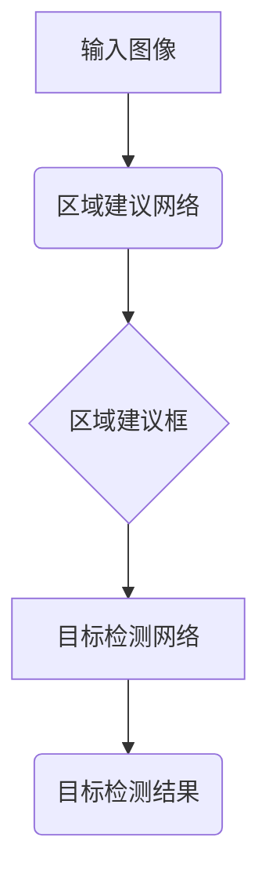
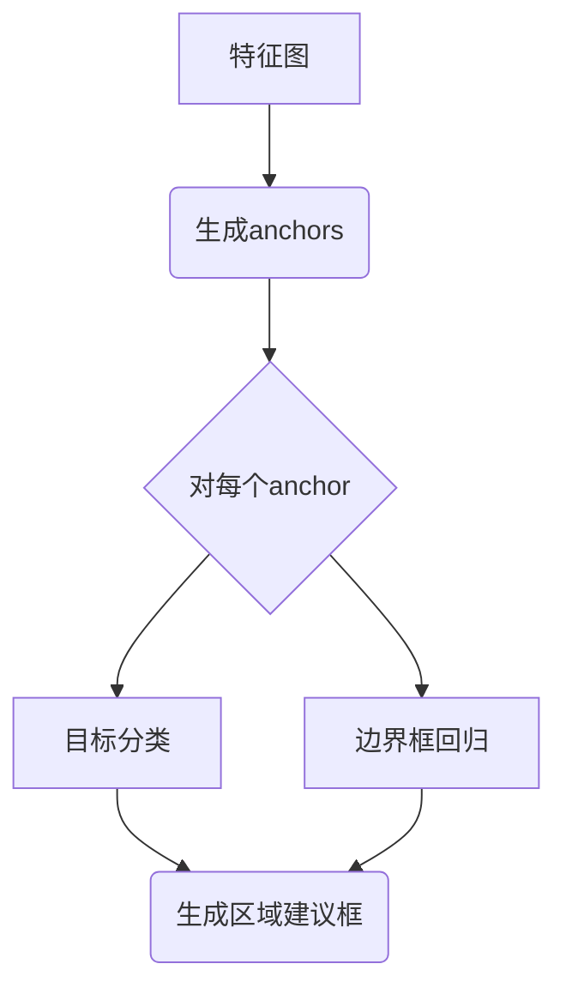
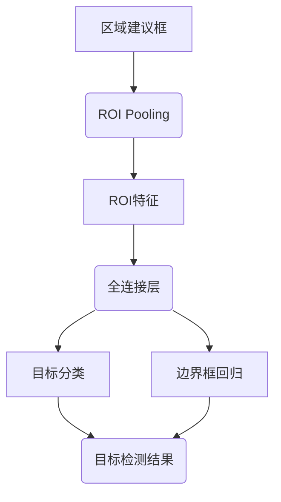
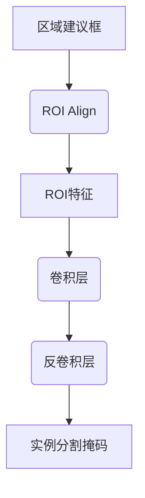

# 基于区域建议的目标检测算法剖析

## 1. 背景介绍

### 1.1 目标检测的重要性

在计算机视觉领域,目标检测是一项极其重要的基础任务。它旨在从图像或视频中定位并识别出感兴趣的目标对象,并为每个检测到的目标生成一个边界框。准确高效的目标检测技术对于许多应用领域都具有重要意义,如自动驾驶、安防监控、人脸识别等。

### 1.2 传统目标检测方法的局限性

早期的目标检测算法主要基于手工设计的特征和滑动窗口的方式,如Viola-Jones算法、DPM(Deformable Part Model)等。这些算法虽然在特定场景下表现良好,但通常存在以下局限:

1. 计算效率低下,检测速度慢
2. 对目标的尺度、方向、形变等变化不够鲁棒
3. 依赖复杂的数据预处理和特征工程

### 1.3 基于深度学习的目标检测算法

近年来,深度学习技术在计算机视觉领域取得了巨大成功,也推动了目标检测算法的飞速发展。基于深度卷积神经网络(CNN)的目标检测算法能够自动从数据中学习特征表示,显著提高了检测精度,同时也在一定程度上解决了传统方法的局限性。

## 2. 核心概念与联系

### 2.1 基于区域建议的目标检测框架

基于区域建议(Region Proposal)的目标检测框架是当前主流的目标检测算法范式,主要分为以下两个阶段:

1. **区域建议网络(Region Proposal Network, RPN)**: 生成可能包含目标的区域建议框(Region Proposals)
2. **目标检测网络**: 对每个区域建议框进行目标分类和边界框回归

该框架的核心思想是先生成区域建议,然后在这些有价值的区域中进行目标检测,从而极大地减少了搜索空间,提高了检测效率。



### 2.2 主要算法

基于区域建议的目标检测算法主要包括以下几种:

- R-CNN
- Fast R-CNN
- Faster R-CNN
- Mask R-CNN
- ...

其中,R-CNN是最早提出的基于区域建议的目标检测算法,Fast R-CNN和Faster R-CNN则在它的基础上进行了改进和加速。Mask R-CNN不仅能够检测目标,还能生成实例分割掩码。这些算法在精度和速度上都有不同的权衡,为后续算法的发展奠定了基础。

## 3. 核心算法原理具体操作步骤

### 3.1 Faster R-CNN 算法原理

Faster R-CNN 是当前最为广泛使用的基于区域建议的目标检测算法之一。它的核心思想是:

1. 使用共享的卷积特征提取网络(如VGG、ResNet等)对输入图像进行特征提取
2. 在提取到的特征图上应用区域建议网络(RPN)生成区域建议框
3. 对每个区域建议框进行目标分类和边界框回归

Faster R-CNN 算法的关键创新点在于引入了区域建议网络(RPN),使得区域建议的生成也可以通过端到端的方式来学习,从而大大提高了检测速度。

#### 3.1.1 区域建议网络(RPN)原理

RPN 本质上是一个滑动窗口,在特征图的每个位置上滑动,生成anchors(锚框)。对于每个anchor,RPN会判断它是否包含目标,并进行边界框回归以获得更精确的建议框。

具体操作步骤如下:

1. 在特征图上均匀采样一些anchor框,设定不同的长宽比
2. 对于每个anchor框,利用卷积核对其进行目标分类(是否包含目标)和边界框回归
3. 根据分类得分和回归结果,过滤并调整anchor框,生成最终的区域建议框



#### 3.1.2 目标检测网络原理

对于每个区域建议框,目标检测网络会进行以下操作:

1. 在特征图上对应的区域进行ROI Pooling,获取固定大小的特征
2. 将ROI特征输入全连接层,进行目标分类和边界框回归
3. 根据分类得分和回归结果,过滤并调整区域建议框,生成最终的目标检测结果



### 3.2 Mask R-CNN 算法原理

Mask R-CNN 是在 Faster R-CNN 的基础上增加了实例分割任务,能够同时完成目标检测和实例分割。它的主要流程如下:

1. 使用共享的卷积特征提取网络对输入图像进行特征提取
2. 在提取到的特征图上应用RPN生成区域建议框
3. 对每个区域建议框进行:
    - 目标分类
    - 边界框回归
    - 实例分割掩码生成

Mask R-CNN 在 Faster R-CNN 的基础上增加了一个分支,用于生成实例分割掩码。这个分支与分类和回归分支并行,共享特征提取网络和RPN。

#### 3.2.1 实例分割掩码生成原理

对于每个区域建议框,Mask R-CNN 会进行以下操作来生成实例分割掩码:

1. 在特征图上对应的区域进行ROI Align,获取对齐后的特征
2. 将ROI特征输入卷积层和反卷积层,生成与目标大小相同的二值掩码

ROI Align 是 Mask R-CNN 提出的一种改进的 ROI Pooling 操作,能够更好地保留特征的空间信息,从而提高实例分割的精度。



## 4. 数学模型和公式详细讲解举例说明

### 4.1 RPN 损失函数

RPN 的损失函数由两部分组成:分类损失和回归损失。

#### 4.1.1 分类损失

对于每个 anchor,RPN 需要判断它是否包含目标。这是一个二分类问题,可以使用交叉熵损失函数:

$$
L_{cls}(p, p^*) = -\sum_{i} p_i^* \log(p_i)
$$

其中 $p_i$ 是预测的包含目标的概率, $p_i^*$ 是真实标签(0或1)。

#### 4.1.2 回归损失

对于包含目标的 anchor,RPN 还需要预测一个边界框回归值,使得预测框更加精确地包围目标。通常使用平滑 L1 损失函数:

$$
L_{reg}(t_u, t_u^*) = \sum_i \text{smooth}_{L_1}(t_u^i - \hat{t}_u^{i*})
$$

$$
\text{smooth}_{L_1}(x) = \begin{cases}
0.5x^2 & \text{if } |x| < 1 \\
|x| - 0.5 & \text{otherwise}
\end{cases}
$$

其中 $t_u$ 是预测的边界框回归值, $t_u^*$ 是真实的边界框回归目标值。

RPN 的总损失函数为分类损失和回归损失的加权和:

$$
L(\{p_i\}, \{t_u\}) = \frac{1}{N_{cls}} \sum_i L_{cls}(p_i, p_i^*) + \lambda \frac{1}{N_{reg}} \sum_i p_i^* L_{reg}(t_u, t_u^*)
$$

其中 $N_{cls}$ 和 $N_{reg}$ 分别是归一化的分类器和回归器的总个数, $\lambda$ 是平衡两个损失项的权重系数。

### 4.2 ROI Pooling 和 ROI Align

ROI Pooling 和 ROI Align 是两种常用的特征提取方法,用于从特征图中提取固定大小的 ROI 特征。

#### 4.2.1 ROI Pooling

ROI Pooling 的操作步骤如下:

1. 将输入的区域建议框投影到特征图上,获得对应的区域
2. 将该区域等分为 $k \times k$ 个子窗口
3. 在每个子窗口内,计算最大池化值作为该子窗口的输出
4. 将所有子窗口的输出拼接,形成固定大小的 ROI 特征

ROI Pooling 虽然简单高效,但存在以下缺陷:

- 由于采用量化操作,会引入一定的噪声
- 对目标的空间信息保留不够好

#### 4.2.2 ROI Align

ROI Align 是 Mask R-CNN 提出的一种改进方法,它避免了 ROI Pooling 中的量化操作,从而能够更好地保留特征的空间信息。

ROI Align 的操作步骤如下:

1. 将输入的区域建议框投影到特征图上,获得对应的区域
2. 将该区域等分为 $k \times k$ 个子窗口
3. 对于每个子窗口,通过双线性插值计算其确切的数值
4. 将所有子窗口的输出拼接,形成固定大小的 ROI 特征

ROI Align 虽然计算量略大于 ROI Pooling,但能够显著提高实例分割的精度。

## 5. 项目实践: 代码实例和详细解释说明

在这一部分,我们将通过一个基于 PyTorch 的实现示例,来更好地理解 Faster R-CNN 算法的细节。

### 5.1 导入必要的库

```python
import torch
import torchvision
from torchvision.models.detection import FasterRCNN
from torchvision.models.detection.rpn import AnchorGenerator
```

### 5.2 定义模型

```python
# 加载预训练的 ResNet-50 作为骨干网络
backbone = torchvision.models.resnet50(pretrained=True)

# 构建 RPN
anchor_generator = AnchorGenerator(sizes=((32, 64, 128, 256, 512),),
                                   aspect_ratios=((0.5, 1.0, 2.0),))
rpn = torchvision.ops.RegionProposalNetwork(
    anchor_generator=anchor_generator,
    head=torchvision.ops.RPNHead(
        out_channels=backbone.out_channels,
        num_anchors=anchor_generator.num_anchors_per_location()[0]
    )
)

# 构建 Faster R-CNN 模型
model = FasterRCNN(backbone=backbone,
                   rpn=rpn,
                   box_head=torchvision.ops.FastRCNNConvFCHead(),
                   box_scorer=torchvision.ops.FastRCNNBoxScorer())
```

在这个示例中,我们使用 ResNet-50 作为骨干网络,并构建了 RPN 和 Faster R-CNN 模型。`AnchorGenerator` 用于生成不同尺度和长宽比的 anchors,`RPNHead` 则负责对每个 anchor 进行分类和回归。

### 5.3 模型前向传播

```python
import torchvision.transforms as T

# 定义图像预处理
transform = T.Compose([
    T.ToTensor()
])

# 加载示例图像
img = Image.open('example.jpg')
img_tensor = transform(img)

# 模型前向传播
outputs = model(img_tensor.unsqueeze(0))
```

在前向传播过程中,输入图像首先经过预处理,然后输入到 Faster R-CNN 模型中。模型会输出以下结果:

- `outputs.boxes`: 检测到的目标边界框
- `outputs.labels`: 每个边界框对应的类别标签
- `outputs.scores`: 每个边界框对应的置信度分数

### 5.4 可视化结果

```python
import matplotlib.pyplot as plt
import torchvision.transforms.functional as F

# 将检测结果可视化
img = F.to_pil_image(img_tensor)
boxes = outputs.boxes.cpu().detach().numpy()
labels = outputs.labels.cpu().detach().numpy()

plt.figure(fig