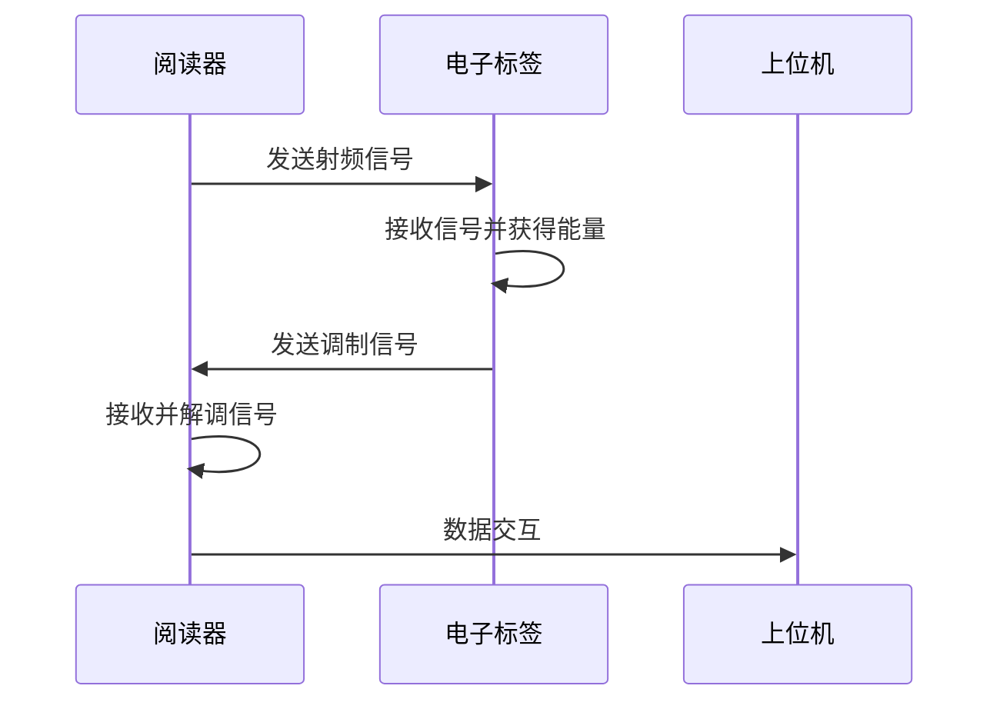
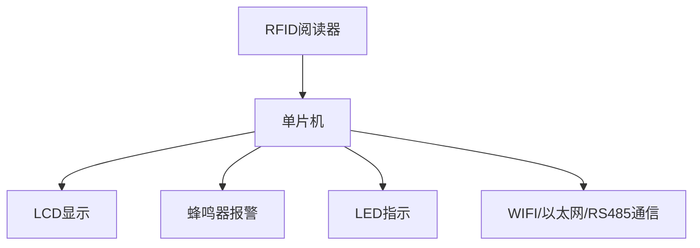

# 基于单片机RFID智能人流量计数统计的设计与实现

## 1.背景介绍
### 1.1 人流量统计的重要性
在现代社会中,人流量统计在商业、交通、安全等领域扮演着至关重要的角色。准确高效地统计人流量,可以帮助商家优化营销策略、改善客户体验;帮助交通管理部门合理调配资源、缓解拥堵;帮助安全部门及时预警、防范风险。因此,开发一套智能化的人流量统计系统,对提升管理效率、优化资源配置、保障公共安全具有重要意义。

### 1.2 RFID技术在人流量统计中的应用优势
RFID(Radio Frequency Identification,射频识别)技术以其非接触性、穿透性强、识别距离远、数据读写方便等优点,在人流量统计领域得到广泛应用。相比传统的红外、摄像头等方式,基于RFID的人流量统计具有识别精度高、数据实时性强、系统集成度高、扩展性好等优势,能够很好地满足智能化、信息化的发展需求。

### 1.3 基于单片机的RFID人流量统计系统的研究意义
当前,大多数商用RFID人流量统计系统成本较高,且缺乏针对性的优化设计,在中小场所的普及应用受到限制。而采用单片机作为核心控制器,可以大幅降低系统成本,提高性价比。同时,单片机灵活的外设接口和可编程特性,为系统的定制化设计提供了便利。因此,研究并实现一套基于单片机的RFID智能人流量计数统计系统,对于拓展RFID人流量统计的应用领域、推动行业智能化发展具有重要意义。

## 2.核心概念与联系
### 2.1 RFID系统组成
一个完整的RFID系统由阅读器(Reader)、电子标签(Tag)、天线(Antenna)三个基本部分组成。
- 阅读器:是整个系统的核心,负责对标签进行读写操作,并与上位机进行数据交互。
- 电子标签:附着在被识别物体上,存储物体的相关信息。当进入阅读器工作区域时,通过耦合实现与阅读器的通信。
- 天线:是阅读器和电子标签进行通信的媒介,负责发送和接收射频信号,一般集成在阅读器内部。

### 2.2 RFID的工作原理
RFID系统的工作原理是电磁感应耦合。阅读器通过天线向周围发送一定频率的射频信号,当电子标签进入阅读器工作区域时,通过自身天线接收射频信号,并由此获得能量,激活标签芯片开始工作。标签将自身存储的信息调制到载波上,通过天线反向发送给阅读器。阅读器接收并解调信号,获取标签信息,再通过某种接口与上位机通信,完成数据交互。

### 2.3 单片机在RFID系统中的作用
在RFID人流量统计系统中,单片机作为核心控制器,协调各个部件工作,实现数据采集、处理、存储、显示和上传等功能。一方面,单片机通过UART等接口与RFID阅读器通信,获取标签数据;另一方面,单片机可外接LCD、蜂鸣器、LED等,实现人流量的实时显示和报警提示;同时,单片机还可通过WIFI、以太网、RS485等接口与上位机通信,实现数据的远程传输和监控。

## 3.核心算法原理具体操作步骤
### 3.1 RFID数据的采集与预处理
1. 单片机通过UART接口,以一定的波特率与RFID阅读器建立通信连接。
2. 单片机向阅读器发送读取命令,轮询检测标签数据。
3. 当阅读器探测到电子标签时,将标签的UID(唯一识别码)等信息通过UART返回给单片机。
4. 单片机接收并解析数据包,提取出有效的UID信息。
5. 单片机对获取的UID进行校验,判断数据的合法性和完整性。
6. 单片机对有效UID进行去重处理,避免同一标签多次计数。

### 3.2 人流量的统计算法
1. 定义两个计数器变量:进入人数counter_in和离开人数counter_out,初始值为0。
2. 定义一个时间窗口变量time_window,用于判断标签的进出状态,初始值为0。
3. 定义一个标签状态数组tag_state[],用于记录每个标签的状态(0表示离开,1表示进入),初始值为0。
4. 当检测到一个新的有效标签UID时,判断该标签是否在tag_state[]数组中:
   - 如果不存在,将该标签加入数组,并置状态为1,counter_in加1,更新time_window为当前时间。
   - 如果已存在,判断该标签的状态和time_window:
     - 如果状态为1,且time_window小于设定的阈值(如1秒),则认为该标签仍处于进入状态,不做处理。
     - 如果状态为1,且time_window大于等于阈值,则将该标签状态置为0,counter_out加1。
     - 如果状态为0,则更新time_window为当前时间,不做其他处理。
5. 定时(如每分钟)将counter_in和counter_out的值累加到总的进出人数中,并清零。
6. 定时(如每小时)将总的进出人数上传到服务器或本地存储,并清零。

### 3.3 人流量数据的本地存储
1. 定义一个结构体,包含时间戳、进入人数、离开人数等字段。
2. 定义一个环形缓冲区,用于存储每个时间段的人流量数据结构体。
3. 当一个时间段结束后,将该时间段的人流量数据写入缓冲区。
4. 当缓冲区写满后,将数据批量写入单片机外扩的EEPROM或Flash中。
5. 当EEPROM或Flash存满后,可选择循环覆盖或停止存储。
6. 定时(如每天)将EEPROM或Flash中的数据导出到U盘或上传到服务器,并清空存储空间。

### 3.4 人流量数据的显示与报警
1. 定义LCD显示的布局,如总进出人数、当前进出人数、峰值时间段等。
2. 定时(如每秒)刷新LCD显示的数据。
3. 设置人流量的阈值,如每分钟进出人数超过100,或总人数超过1000等。
4. 当检测到人流量超过阈值时:
   - 触发蜂鸣器报警,并设置报警持续时间。
   - 点亮红色LED,表示当前人流量过高。
   - 在LCD上显示报警信息。
5. 当人流量恢复正常后,关闭蜂鸣器,熄灭红色LED,在LCD上显示正常信息。

## 4.数学模型和公式详细讲解举例说明
### 4.1 RFID标签碰撞概率模型
在实际应用中,当多个RFID标签同时进入阅读器工作区域时,可能会发生标签碰撞,导致数据读取失败。因此,需要建立数学模型来评估标签碰撞概率,指导系统参数的设置。

假设阅读器的工作范围内有$n$个标签,每个标签被读取到的概率为$p$,则至少有一个标签被读取到的概率为:

$$
P = 1 - (1-p)^n
$$

进一步,假设每个标签被读取到的概率服从泊松分布,则读取到$k$个标签的概率为:

$$
P(X=k) = \frac{\lambda^k e^{-\lambda}}{k!}
$$

其中,$\lambda$为单位时间内标签被读取到的平均次数,可以通过实验测量得到。

例如,假设阅读器的工作范围为2m,标签的密度为1个/m²,阅读器的读取周期为0.1s,单个标签被读取到的概率为0.8,则单位时间内标签被读取到的平均次数为:

$$
\lambda = 2 \times 2 \times 1 \times 0.1 \times 0.8 = 0.32
$$

则读取到0个、1个、2个标签的概率分别为:

$$
\begin{aligned}
P(X=0) &= \frac{0.32^0 e^{-0.32}}{0!} = 0.7261 \\
P(X=1) &= \frac{0.32^1 e^{-0.32}}{1!} = 0.2323 \\
P(X=2) &= \frac{0.32^2 e^{-0.32}}{2!} = 0.0372
\end{aligned}
$$

可见,在该场景下,读取到1个标签的概率最大,为23.23%,读取到2个或更多标签的概率较小,说明标签碰撞的概率较低,系统可以稳定工作。

### 4.2 人流量统计的误差分析
在实际应用中,由于环境噪声、标签摆放位置、人员移动速度等因素的影响,RFID人流量统计会存在一定的误差。因此,需要建立误差模型,量化分析各种因素对统计结果的影响,并采取相应的优化措施。

假设系统的漏读率为$\alpha$,误读率为$\beta$,则实际人数$N$与统计人数$N'$的关系为:

$$
N' = N \times (1-\alpha) + N \times \beta
$$

其中,漏读率$\alpha$表示实际通过的人未被统计到的比例,误读率$\beta$表示未通过的人被错误统计的比例。

进一步,假设漏读率和误读率服从正态分布,则实际人数的置信区间为:

$$
N \in [N' \times (1-\alpha-\beta), N' \times (1+\alpha+\beta)]
$$

其中,置信度取决于正态分布的参数。

例如,某场所在1小时内统计到1000人次,经测试,系统的漏读率为5%,误读率为2%,则实际人数的95%置信区间为:

$$
N \in [1000 \times (1-0.05-0.02), 1000 \times (1+0.05+0.02)] = [930, 1070]
$$

即可以95%的置信度认为,实际人数在930到1070之间。

为了减小误差,可以采取以下优化措施:
1. 选择合适的RFID标签和阅读器,提高读取的可靠性和稳定性。
2. 优化标签的摆放位置和角度,确保标签能够正确进入阅读器的工作范围。
3. 调整阅读器的工作参数,如功率、灵敏度、读取周期等,提高读取的成功率。
4. 在人流量较大的区域增加阅读器的数量,减小单个阅读器的负载,提高统计的准确性。
5. 对原始数据进行滤波和去噪处理,剔除明显的异常值和干扰信号。
6. 定期对系统进行校准和维护,及时发现和解决潜在的问题。

通过建立合适的数学模型,并采取有效的优化措施,可以大大提高RFID人流量统计系统的准确性和可靠性,为相关决策提供有力的数据支撑。

## 5.项目实践：代码实例和详细解释说明
下面以STM32单片机和RC522模块为例,给出RFID人流量统计系统的核心代码实现。

### 5.1 硬件连接
- RC522模块的SDA引脚连接STM32的PA4引脚
- RC522模块的SCK引脚连接STM32的PA5引脚
- RC522模块的MOSI引脚连接STM32的PA7引脚
- RC522模块的MISO引脚连接STM