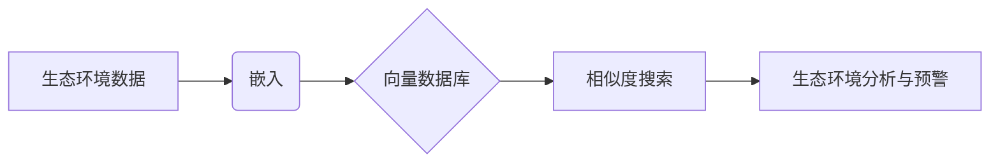

# 基于向量数据库的生态环境监测系统

## 1. 背景介绍

近年来,随着全球工业化进程的加速,生态环境问题日益突出。为了更好地保护生态环境,实现可持续发展,建立高效、智能的生态环境监测系统势在必行。传统的生态环境监测系统存在数据量大、检索效率低、实时性差等问题。而基于向量数据库的生态环境监测系统,通过引入向量化、相似度搜索等技术,能够有效解决上述难题,为生态环境保护提供有力的技术支撑。

### 1.1 生态环境监测的重要性

#### 1.1.1 保护生物多样性

#### 1.1.2 防治环境污染

#### 1.1.3 应对气候变化

### 1.2 传统生态环境监测系统的局限性

#### 1.2.1 数据量大,存储困难

#### 1.2.2 检索效率低下

#### 1.2.3 实时性不足

### 1.3 向量数据库在生态环境监测中的优势

#### 1.3.1 高效存储海量数据

#### 1.3.2 毫秒级相似度检索  

#### 1.3.3 实时更新与分析

## 2. 核心概念与联系

### 2.1 向量数据库

向量数据库是一种针对高维向量数据的数据库系统。不同于传统的关系型、非关系型数据库,向量数据库采用向量化的方式存储和检索数据,每条数据记录都被表示为一个高维向量。向量之间的相似度可以通过计算它们的距离(如欧氏距离、余弦相似度)来衡量。

### 2.2 嵌入(Embedding)

嵌入是一种将高维数据映射到低维空间的方法。通过嵌入,我们可以将非结构化数据(如文本、图像)转换为语义丰富的向量表示。常见的嵌入模型有 Word2Vec、GloVe、BERT 等。在生态环境监测场景下,我们可以将传感器数据、遥感影像等转换为向量,便于后续存储和检索。

### 2.3 相似度搜索

相似度搜索是向量数据库的核心操作之一。给定一个查询向量,向量数据库可以快速地在海量数据中找出与之最相似的 K 个向量(K 近邻搜索),或是找出与之相似度超过某个阈值的所有向量(范围搜索)。高效的相似度搜索算法(如 HNSW、IVF)使得向量数据库能够在毫秒级响应用户查询。

### 2.4 核心概念之间的联系

在基于向量数据库的生态环境监测系统中,这些核心概念是紧密相连、相辅相成的:



首先,原始的生态环境数据(如传感器读数、卫星图像)需要通过嵌入转换为语义向量。然后,这些向量被存储到向量数据库中。当用户提出查询时,系统利用相似度搜索算法快速找出与查询最相关的数据。最后,基于检索出的数据进行分析和预警,为生态环境保护提供决策支持。

## 3. 核心算法原理与具体操作步骤

### 3.1 数据预处理与特征提取

#### 3.1.1 数据清洗与标准化

#### 3.1.2 特征选择与降维

#### 3.1.3 数据增强

### 3.2 嵌入模型训练

#### 3.2.1 Word2Vec/GloVe

#### 3.2.2 BERT/RoBERTa

#### 3.2.3 CNN/ViT

### 3.3 向量数据库索引构建

#### 3.3.1 HNSW

HNSW (Hierarchical Navigable Small World Graphs) 是一种基于图的近似最近邻搜索算法。它通过构建多层次的导航图,实现了高效的 K 近邻查询。

算法步骤:

1. 建立多层次的导航图。每一层都是一个 NSW (Navigable Small World) 图,节点之间通过长距离和短距离的边相连。
2. 自底向上逐层构建索引。对于插入的新节点,先在底层找到其最近邻,然后递归地在上层图中选择合适的邻居节点。
3. 搜索时,从顶层图开始,不断地向下移动直到达到底层图。在每一层,选择与查询节点距离最近的邻居节点作为下一步的起点。
4. 达到底层图后,在当前节点的邻域内进行局部搜索,直到找到查询节点的 K 个最近邻。

#### 3.3.2 IVF

IVF (Inverted File) 是一种基于聚类的近似最近邻搜索算法。它先对数据进行聚类,然后对每个类别建立倒排索引。

算法步骤:

1. 使用 K-Means 等聚类算法将数据划分为 M 个类别。每个类别形成一个 Voronoi 单元。 
2. 对每个 Voronoi 单元建立倒排索引。倒排索引记录了属于该单元的所有向量的 ID。
3. 搜索时,先找出查询向量所属的 Voronoi 单元,然后在该单元的倒排索引中进行精确搜索。
4. 为了提高召回率,可以增大搜索范围,检索查询向量相邻的多个 Voronoi 单元。

### 3.4 相似度搜索

#### 3.4.1 KNN 查询

#### 3.4.2 范围查询

## 4. 数学模型与公式详解

### 4.1 向量空间模型

在向量空间模型中,每个对象(如文档、图像)都被表示为一个 n 维实值向量。向量之间的相似度可以用内积或余弦相似度来衡量:

$$
\text{sim}(\mathbf{x},\mathbf{y}) = \frac{\mathbf{x} \cdot \mathbf{y}}{\|\mathbf{x}\| \|\mathbf{y}\|} = \frac{\sum_{i=1}^n x_i y_i}{\sqrt{\sum_{i=1}^n x_i^2} \sqrt{\sum_{i=1}^n y_i^2}}
$$

其中 $\mathbf{x}$ 和 $\mathbf{y}$ 是两个 n 维向量。余弦相似度的取值范围为 [-1, 1],数值越大表示两个向量方向越接近。

### 4.2 嵌入模型

以 Word2Vec 为例,它通过训练一个浅层神经网络来学习单词的嵌入向量。网络的输入是one-hot 编码的中心词,输出是其上下文词的概率分布。优化目标是最大化如下的对数似然函数:

$$
\mathcal{L} = \sum_{t=1}^T \sum_{-c \leq j \leq c, j \neq 0} \log p(w_{t+j} | w_t)
$$

其中 $w_t$ 是中心词,$w_{t+j}$ 是其上下文词,$c$ 是上下文窗口大小。通过反向传播算法更新网络参数,最终得到每个单词的嵌入向量。

### 4.3 近邻搜索

K 近邻搜索可以形式化为如下的优化问题:

$$
\mathcal{N}_k(\mathbf{q}) = \underset{\mathbf{x} \in \mathcal{X}}{\operatorname{argmin}} \|\mathbf{q} - \mathbf{x}\|
$$

其中 $\mathbf{q}$ 是查询向量,$\mathcal{X}$ 是向量数据库,$\|\cdot\|$ 是距离度量(如欧氏距离)。直接穷举所有向量的时间复杂度为 $O(nd)$,其中 $n$ 是数据库大小,$d$ 是向量维度。为了加速搜索,可以采用局部敏感哈希(LSH)、KD 树等近似算法,将时间复杂度降低到 $O(d \log n)$ 甚至 $O(d)$。

## 5. 项目实践:代码实例与详解

下面是一个使用 Python 和 Faiss 库构建向量数据库的简单示例:

```python
import numpy as np
import faiss

# 随机生成 10000 个 128 维的向量
data = np.random.rand(10000, 128).astype('float32')

# 创建 IndexFlatL2 索引,使用 L2 距离作为度量
index = faiss.IndexFlatL2(128)

# 将向量添加到索引中  
index.add(data)

# 随机生成 5 个查询向量
query = np.random.rand(5, 128).astype('float32')

# 进行 KNN 搜索,k=10
k = 10
distances, indices = index.search(query, k)

print("查询结果:")
for i in range(5):
    print(f"查询向量 {i}:")
    for j in range(k):
        print(f"  第 {j} 近邻:索引 {indices[i, j]},距离 {distances[i, j]}")
```

在这个例子中,我们首先随机生成了一个包含 10000 个 128 维向量的数据集。然后,创建了一个基于 L2 距离的 `IndexFlatL2` 索引,并将数据集中的所有向量添加到索引中。

接下来,我们随机生成了 5 个查询向量,并使用 `index.search()` 方法进行 KNN 搜索。搜索结果包括每个查询向量的 K 个最近邻的索引和距离。

最后,我们打印出了搜索结果,包括每个查询向量的 K 个最近邻的具体信息。

这只是一个简单的示例,实际应用中还需要考虑数据预处理、特征提取、索引优化等诸多因素。但核心思路是一致的:将原始数据转换为语义向量,构建高效的索引结构,然后使用相似度搜索算法进行查询。

## 6. 实际应用场景

### 6.1 水质监测

在水质监测中,传感器会持续采集各种指标(如 pH 值、溶解氧、浊度等)的数据。我们可以将这些时序数据转换为向量,存储到向量数据库中。当某个位置出现异常水质时,可以快速检索出与之相似的历史数据,分析污染原因,预测污染趋势。

### 6.2 生物多样性保护

利用物种识别模型,我们可以将动植物图像嵌入到语义空间中。向量数据库可以帮助我们快速检索出与目标物种相似的图像,监测物种分布和数量的变化。当发现濒危物种或外来入侵物种时,可以及时采取保护措施。

### 6.3 空气质量预测

影响空气质量的因素错综复杂,包括气象条件、污染源排放、地形地貌等。将这些异构数据映射到同一向量空间中,可以揭示它们之间的内在联系。通过相似度搜索和聚类分析,我们可以发现影响空气质量的关键因子,建立预测模型,提前预警重污染天气。

## 7. 工具与资源推荐

### 7.1 向量数据库

- Faiss:Facebook 开源的高效相似度搜索库,支持 CPU 和 GPU。
- Annoy:Spotify 开源的近似最近邻库,使用随机投影树。
- NMSLIB:非度量空间库,实现了多种 ANN 算法。
- Milvus:基于 Faiss 构建的开源向量数据库,提供了存储、分区、索引等功能。

### 7.2 嵌入模型

- Word2Vec/GloVe:经典的词嵌入模型。
- BERT/RoBERTa:基于 Transformer 的上下文词嵌入模型。
- ResNet/EfficientNet:用于图像嵌入的卷积神经网络。
- ViT:将 Transformer 架构引入图像领域的视觉 Transformer 模型。

### 7.3 相关开源项目

- Haystack:基于 Transformer 的开源问答系统。
- Jina:云原生的神经搜索框架。
- Vespa:Yahoo 开源的大规模向量搜索引擎。

## 8. 总结:未来发展趋势与挑战

基于向量数据库的生态环境监测系统展现了广阔的应用前景。它突破了传统系统的瓶颈,实现了海量异构数据的高效存储与检索。同时,得益于嵌入模型的语义表示能力,