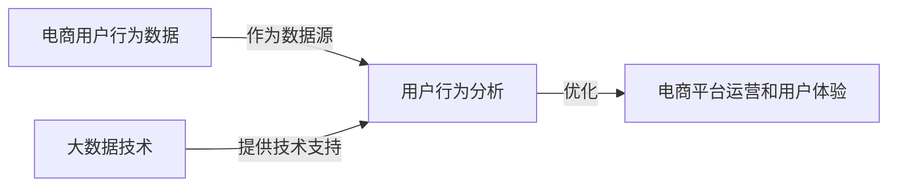
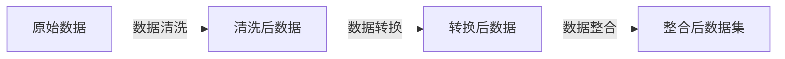
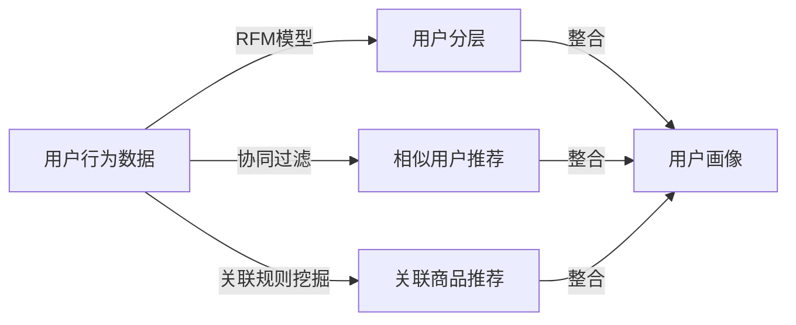
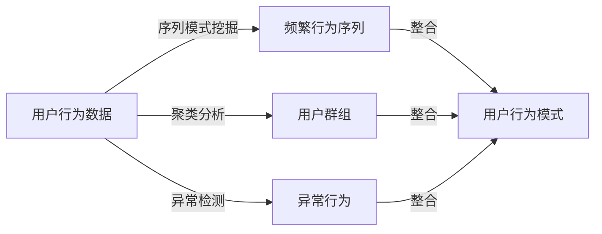
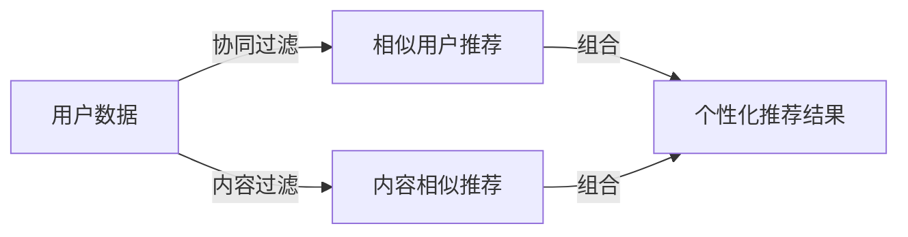

# 基于大数据的电商平台用户行为的分析与应用研究

## 1.背景介绍

### 1.1 电子商务的发展与挑战

随着互联网和移动互联网的快速发展,电子商务(E-commerce)已经成为了一种日益普及的商业模式。电商平台为消费者提供了更加便捷的购物体验,同时也为企业带来了新的商机。然而,随着电商用户规模的不断扩大,用户行为数据也呈现出爆炸式增长,如何高效地分析和利用这些海量数据,成为电商企业面临的一大挑战。

### 1.2 大数据技术的兴起

大数据(Big Data)技术的兴起为解决上述挑战提供了有力支持。大数据技术能够高效地存储、处理和分析海量的结构化和非结构化数据,从中发现隐藏的模式和洞见。通过对电商平台用户行为数据进行大数据分析,企业可以深入了解用户需求,优化产品和服务,提高用户体验,从而获得竞争优势。

### 1.3 研究目的和意义

本文旨在探讨如何基于大数据技术,对电商平台用户行为数据进行深入分析,并将分析结果应用于实际场景,以提高电商平台的运营效率和用户体验。具体包括:

1. 介绍电商用户行为数据的特点及其分析的重要性
2. 阐述大数据技术在电商用户行为分析中的应用
3. 探讨用户行为分析的核心算法和数学模型
4. 展示基于大数据的用户行为分析实践案例
5. 总结用户行为分析的发展趋势和挑战

本研究对于电商企业优化运营策略,提高用户体验,增强竞争力具有重要意义。同时,也为大数据技术在其他领域的应用提供了借鉴。

## 2.核心概念与联系

### 2.1 电商用户行为数据

电商用户行为数据是指用户在电商平台上的各种操作行为所产生的数据,包括但不限于:

- 浏览记录
- 购买记录
- 搜索记录
- 评论记录
- 社交互动记录

这些数据反映了用户的偏好、需求和购买习惯,对于电商平台的个性化推荐、营销策略制定等具有重要意义。

### 2.2 大数据技术

大数据技术是指用于存储、处理和分析海量数据的一系列技术和工具,主要包括:

- 分布式存储系统(如HDFS)
- 分布式计算框架(如Spark、MapReduce)
- 数据处理工具(如Hive、Pig)
- 数据可视化工具(如Tableau、Qlik)
- 机器学习算法(如决策树、聚类、神经网络)

这些技术和工具能够高效地处理结构化和非结构化的海量数据,从中发现隐藏的模式和洞见。

### 2.3 用户行为分析

用户行为分析是指通过对用户行为数据进行分析,了解用户的偏好、需求和购买习惯,从而优化产品和服务,提高用户体验。常见的用户行为分析任务包括:

- 用户画像构建
- 用户行为模式挖掘
- 个性化推荐
- 用户价值评估
- 营销策略优化

用户行为分析需要结合大数据技术和机器学习算法,才能高效地处理海量数据,并获得有价值的洞见。

### 2.4 核心概念关系

电商用户行为数据是用户行为分析的基础数据源,大数据技术为高效处理和分析这些海量数据提供了技术支持,而用户行为分析则是将分析结果应用于实际场景,优化电商平台的运营和用户体验。这三者之间存在紧密的联系,相互依赖、相辅相成。

## 3.核心算法原理具体操作步骤

### 3.1 用户行为数据预处理

在进行用户行为分析之前,需要对原始数据进行预处理,包括数据清洗、数据转换和数据整合等步骤。

1. **数据清洗**:去除重复数据、异常值和缺失值等脏数据,提高数据质量。
2. **数据转换**:将原始数据转换为适合分析的格式,如将时间戳转换为可读的日期时间。
3. **数据整合**:将来自不同数据源的数据进行整合,形成统一的数据集。

### 3.2 用户画像构建

用户画像是对用户的综合描述,包括用户的基本信息、兴趣爱好、购买习惯等,是进行个性化推荐和营销策略制定的基础。构建用户画像的常见算法包括:

1. **RFM模型**:根据用户的最近访问时间(Recency)、访问频率(Frequency)和消费金额(Monetary)对用户进行分层。
2. **协同过滤算法**:基于用户之间的相似度,推荐相似用户喜欢的商品。
3. **关联规则挖掘**:发现用户购买行为之间的关联规则,用于交叉推荐。

### 3.3 用户行为模式挖掘

用户行为模式挖掘旨在发现用户行为数据中隐藏的模式和规律,为优化产品和服务提供依据。常用的算法包括:

1. **序列模式挖掘**:发现用户行为序列中的频繁模式,如"浏览-加购物车-购买"。
2. **聚类分析**:根据用户行为的相似性,将用户划分为不同的群组或簇。
3. **异常检测**:识别偏离正常模式的异常用户行为,如欺诈行为。

### 3.4 个性化推荐算法

个性化推荐是电商平台的核心功能之一,旨在为用户推荐感兴趣的商品或内容。常用的推荐算法包括:

1. **协同过滤算法**:基于用户之间的相似度或商品之间的相似度进行推荐。
2. **内容过滤算法**:根据用户的历史偏好和商品的内容特征进行推荐。
3. **组合推荐算法**:将协同过滤和内容过滤相结合,提高推荐的准确性。

$$
\begin{aligned}
\text{sim}(u, v) &= \frac{\sum_{i \in I_{uv}}(r_{ui} - \overline{r_u})(r_{vi} - \overline{r_v})}{\sqrt{\sum_{i \in I_{uv}}(r_{ui} - \overline{r_u})^2} \sqrt{\sum_{i \in I_{uv}}(r_{vi} - \overline{r_v})^2}} \\
\hat{r}_{ui} &= \overline{r_u} + \frac{\sum_{v \in N(u, i)}(r_{vi} - \overline{r_v})\text{sim}(u, v)}{\sum_{v \in N(u, i)}|\text{sim}(u, v)|}
\end{aligned}
$$

其中:
- $\text{sim}(u, v)$ 表示用户 $u$ 和用户 $v$ 之间的相似度
- $r_{ui}$ 表示用户 $u$ 对商品 $i$ 的评分
- $\overline{r_u}$ 表示用户 $u$ 的平均评分
- $N(u, i)$ 表示对商品 $i$ 进行过评分且与用户 $u$ 相似的用户集合
- $\hat{r}_{ui}$ 表示对用户 $u$ 对商品 $i$ 的预测评分

## 4.数学模型和公式详细讲解举例说明

### 4.1 协同过滤算法

协同过滤算法是个性化推荐中最常用的算法之一,它基于用户之间或商品之间的相似度进行推荐。常见的协同过滤算法包括基于用户的协同过滤和基于商品的协同过滤。

#### 4.1.1 基于用户的协同过滤

基于用户的协同过滤算法的核心思想是:对于目标用户,找到与其兴趣爱好相似的其他用户,然后根据这些相似用户对商品的评分,预测目标用户对该商品的兴趣程度,并推荐评分较高的商品。

算法步骤如下:

1. 计算任意两个用户之间的相似度,常用的相似度计算方法是余弦相似度或皮尔逊相关系数。
2. 对于目标用户 $u$ 和商品 $i$,找到对商品 $i$ 进行过评分且与用户 $u$ 相似的用户集合 $N(u, i)$。
3. 根据相似用户的评分,预测目标用户 $u$ 对商品 $i$ 的评分 $\hat{r}_{ui}$,计算公式如下:

$$
\hat{r}_{ui} = \overline{r_u} + \frac{\sum_{v \in N(u, i)}(r_{vi} - \overline{r_v})\text{sim}(u, v)}{\sum_{v \in N(u, i)}|\text{sim}(u, v)|}
$$

其中:
- $\overline{r_u}$ 表示用户 $u$ 的平均评分
- $r_{vi}$ 表示用户 $v$ 对商品 $i$ 的评分
- $\overline{r_v}$ 表示用户 $v$ 的平均评分
- $\text{sim}(u, v)$ 表示用户 $u$ 和用户 $v$ 之间的相似度

4. 根据预测评分 $\hat{r}_{ui}$ 的大小,为目标用户 $u$ 推荐评分较高的商品。

#### 4.1.2 基于商品的协同过滤

基于商品的协同过滤算法与基于用户的协同过滤算法类似,不同之处在于它是基于商品之间的相似度进行推荐。

算法步骤如下:

1. 计算任意两个商品之间的相似度,常用的相似度计算方法是余弦相似度或皮尔逊相关系数。
2. 对于目标用户 $u$ 和商品 $i$,找到用户 $u$ 曾经评分过且与商品 $i$ 相似的商品集合 $N(i, u)$。
3. 根据相似商品的评分,预测目标用户 $u$ 对商品 $i$ 的评分 $\hat{r}_{ui}$,计算公式如下:

$$
\hat{r}_{ui} = \overline{r_u} + \frac{\sum_{j \in N(i, u)}(r_{uj} - \overline{r_u})\text{sim}(i, j)}{\sum_{j \in N(i, u)}|\text{sim}(i, j)|}
$$

其中:
- $\overline{r_u}$ 表示用户 $u$ 的平均评分
- $r_{uj}$ 表示用户 $u$ 对商品 $j$ 的评分
- $\text{sim}(i, j)$ 表示商品 $i$ 和商品 $j$ 之间的相似度

4. 根据预测评分 $\hat{r}_{ui}$ 的大小,为目标用户 $u$ 推荐评分较高的商品。

协同过滤算法的优点是能够发现隐式的用户兴趣,不需要对商品进行内容分析。但它也存在数据稀疏、冷启动等问题,因此在实际应用中通常会与其他算法相结