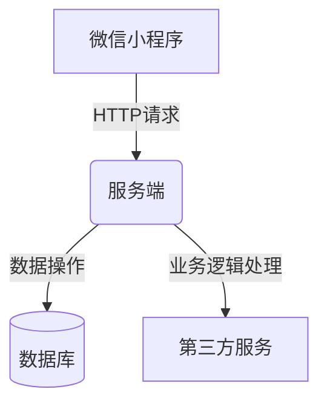

# 基于微信小程序的养老服务系统的设计与实现

## 1.背景介绍

### 1.1 人口老龄化趋势

随着医疗卫生水平的不断提高和生活质量的改善,人口老龄化问题日益突出。据统计,2022年我国60岁及以上老年人口占总人口的比例已超过18.9%,进入了老龄社会行列。这一趋势将持续加剧,预计到2050年,我国老年人口将达到4.87亿,占总人口的比例将高达35%。

老龄化给社会带来了诸多挑战,如医疗保障、养老服务、社会参与等。传统的养老模式难以满足日益增长的养老需求,迫切需要创新的解决方案。

### 1.2 移动互联网在养老服务中的作用

移动互联网技术的飞速发展为解决养老难题提供了新思路。老年人群体对智能手机的使用率不断攀升,为基于移动互联网的养老服务奠定了坚实基础。微信小程序作为一种轻量级的移动应用,具有开发成本低、使用门槛低、无需安装即可使用等优势,非常适合于满足老年人群体的养老服务需求。

本文将探讨基于微信小程序的养老服务系统的设计与实现,旨在为老年人提供线上线下一体化的养老服务解决方案。

## 2.核心概念与联系

### 2.1 微信小程序

微信小程序是一种无需下载安装即可使用的小型应用程序,运行在微信客户端上。它们具有传统应用的绝大部分功能,如本地数据存储、调用硬件接口等,同时也继承了微信社交平台的优势,如分享、支付等。

微信小程序的开发采用前端技术栈,主要包括HTML5、CSS3、JavaScript等,并提供了专门的框架和API供开发者调用。开发者只需编写前端代码,无需关注服务器端的开发,极大地降低了开发门槛。

### 2.2 养老服务系统

养老服务系统是为满足老年人生活、医疗、娱乐等多方面需求而设计的一整套服务体系。它通常包括以下几个方面:

- **生活照料**:包括膳食、起居、家政等日常生活服务。
- **医疗保健**:包括医疗护理、康复理疗、用药指导等。
- **精神慰藉**:包括娱乐活动、社交交往、心理疏导等。
- **紧急救援**:为老年人提供24小时应急救援服务。

养老服务系统可以采用多种形式,如社区日间照料中心、养老院、上门服务等。

### 2.3 微信小程序与养老服务系统的结合

将微信小程序与养老服务系统相结合,可以构建一个线上线下一体化的养老服务平台。老年人可以通过微信小程序轻松获取各类养老服务信息,预约服务,并进行线上支付。服务机构则可以通过小程序与用户进行实时交互,提高服务效率。

此外,微信小程序还可以集成各种智能硬件设备,实现远程监控、健康数据采集等功能,为老年人提供更加智能化、个性化的服务体验。

该模式的优势在于:

- 降低了老年人使用门槛
- 实现了线上线下服务的无缝对接
- 提高了服务的可及性和便利性
- 有利于个性化服务和大数据分析

## 3.核心算法原理具体操作步骤

### 3.1 用户身份认证

为了确保系统的安全性和可靠性,需要对用户进行身份认证。微信小程序提供了多种认证方式,如微信授权登录、手机号码登录等。

具体步骤如下:

1. 用户打开小程序,选择登录方式(微信授权登录或手机号码登录)。
2. 如选择微信授权登录,小程序将向微信服务器发送授权请求,获取用户的基本信息(头像、昵称等)。
3. 如选择手机号码登录,小程序将引导用户输入手机号码,并通过短信验证码或其他方式进行验证。
4. 服务器端对用户信息进行校验,如果合法则生成用户令牌(token),返回给小程序。
5. 小程序将token存储在本地,后续的所有请求都需携带该token,以保证请求的合法性。

该算法保证了用户身份的真实性,并通过令牌机制实现了无状态的身份校验,提高了系统的安全性和可扩展性。

### 3.2 服务推荐算法

为了为用户推荐合适的养老服务,系统需要采用一定的推荐算法。常见的推荐算法包括协同过滤算法、基于内容的推荐算法等。

以基于用户的协同过滤算法为例,具体步骤如下:

1. 收集用户的历史服务记录和评分数据。
2. 计算任意两个用户之间的相似度,可采用皮尔逊相关系数、余弦相似度等。
3. 对于目标用户,找到与其最相似的K个用户(nearest neighbors)。
4. 根据这K个用户对服务的评分,预测目标用户对其他服务的兴趣程度。
5. 将预测兴趣值较高的服务推荐给目标用户。

该算法的优点是能够发现用户的潜在兴趣,提供个性化的服务推荐。缺点是对于新用户或新服务,由于缺乏历史数据,推荐效果会受到影响(冷启动问题)。

### 3.3 路径规划算法

对于上门服务类型,系统需要合理规划服务人员的行程路线,以提高工作效率。这可以通过路径规划算法来实现。

常见的路径规划算法有:

- **Dijkstra算法**: 用于计算单源最短路径
- **Floyd算法**: 用于计算任意两点间的最短路径
- **遗传算法**: 用于求解旅行商问题(TSP)的近似最优解

以Dijkstra算法为例,具体步骤如下:

1. 构建路网的加权有向图模型,顶点表示地点,边表示道路,权重为距离。
2. 设定服务起点S作为源点,将其加入集合U。
3. 从源点S出发,计算到所有其他顶点的最短路径估计值,并将这些顶点加入集合V。
4. 从V中选取一个估计值最小的顶点W,将其加入U,并更新从S到V中其他顶点的最短路径估计值。
5. 重复步骤4,直到V为空,此时U中顶点的最终值就是从S到该顶点的最短路径长度。

该算法可以有效地计算出服务人员的最优行程路线,从而节省时间和成本。

## 4.数学模型和公式详细讲解举例说明

### 4.1 用户相似度计算

在推荐算法中,需要计算任意两个用户之间的相似度。常用的相似度计算方法有:

1. **皮尔逊相关系数**

$$r_{xy} = \frac{\sum_{i=1}^{n}(x_i - \overline{x})(y_i - \overline{y})}{\sqrt{\sum_{i=1}^{n}(x_i - \overline{x})^2}\sqrt{\sum_{i=1}^{n}(y_i - \overline{y})^2}}$$

其中$x_i$和$y_i$分别表示用户x和用户y对第i个服务的评分,$\overline{x}$和$\overline{y}$分别表示用户x和用户y的平均评分。

皮尔逊相关系数的取值范围为[-1,1]。值越接近1,表示两个用户的兴趣越相似;值越接近-1,表示两个用户的兴趣越不相似。

2. **余弦相似度**

$$sim(x,y) = \frac{\sum_{i=1}^{n}x_iy_i}{\sqrt{\sum_{i=1}^{n}x_i^2}\sqrt{\sum_{i=1}^{n}y_i^2}}$$

其中$x_i$和$y_i$分别表示用户x和用户y对第i个服务的评分。

余弦相似度的取值范围为[0,1]。值越接近1,表示两个用户的兴趣越相似;值越接近0,表示两个用户的兴趣越不相似。

### 4.2 路径规划中的最短路径算法

在路径规划算法中,需要计算出从起点到其他所有点的最短路径。常用的算法有Dijkstra算法和Floyd算法。

1. **Dijkstra算法**

Dijkstra算法是一种计算加权有向图中单源最短路径的算法。设G=(V,E)为一个加权有向图,V是顶点集合,E是边的集合。对于任意边(u,v)∈E,w(u,v)表示该边的权重(距离)。

算法步骤如下:

1) 初始化:
    - 定义集合S,初始时只有源点s∈S,其余顶点都在集合V-S中。
    - 对每个顶点v∈V,定义d[v]表示从源点s到v的最短路径估计值,初始时d[s]=0,其余d[v]=∞。
2) 选取V-S中d[v]最小的顶点u,将u加入集合S。
3) 更新集合V-S中其余顶点的最短路径估计值:对于每个v∈V-S,如果d[v] > d[u] + w(u,v),则更新d[v] = d[u] + w(u,v)。
4) 重复步骤2和3,直到所有顶点都加入集合S。此时d[v]就是从源点s到v的最短路径长度。

该算法的时间复杂度为O(n^2)。

2. **Floyd算法**

Floyd算法是一种计算加权有向图中任意两点间最短路径的算法。设G=(V,E)为一个加权有向图,V是顶点集合,E是边的集合。对于任意边(u,v)∈E,w(u,v)表示该边的权重(距离)。

算法步骤如下:

1) 初始化:定义一个n×n的矩阵D,D[i,j]表示从顶点i到顶点j的最短路径长度。对于任意i,j∈V,如果(i,j)∈E,则D[i,j]=w(i,j);否则D[i,j]=∞。对角线元素D[i,i]=0。
2) 执行以下三重循环:

```
for k = 1 to n
    for i = 1 to n
        for j = 1 to n
            D[i,j] = min(D[i,j], D[i,k] + D[k,j])
```

该循环的作用是检查是否存在一条经过顶点k的更短路径,从而更新D[i,j]的值。
3) 循环结束后,D[i,j]即为从顶点i到顶点j的最短路径长度。

该算法的时间复杂度为O(n^3)。

通过上述算法,我们可以有效地计算出服务人员的最优行程路线,从而提高工作效率,降低运营成本。

## 5.项目实践:代码实例和详细解释说明

### 5.1 系统架构

基于微信小程序的养老服务系统采用了经典的三层架构,包括表现层(小程序端)、业务逻辑层(服务端)和数据访问层(数据库)。



其中:

- **微信小程序**:提供用户界面,接收用户输入,发送HTTP请求到服务端。
- **服务端**:处理小程序发送的请求,执行业务逻辑,操作数据库,调用第三方服务(如地图服务、短信服务等)。
- **数据库**:存储系统所需的各种数据,如用户信息、服务信息等。
- **第三方服务**:提供地图路径规划、短信验证码发送等功能。

### 5.2 关键模块实现

#### 5.2.1 用户模块

用户模块主要实现用户的注册、登录、个人信息管理等功能。

**1. 注册**

```javascript
// 小程序端
wx.login({
  success: res => {
    // 发送用户的code到服务端
    wx.request({
      url: 'https://example.com/register',
      method: 'POST',
      data: {
        code: res.code
      },
      success: res => {
        //