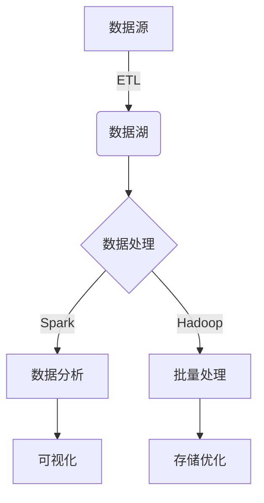

# 基于期货大数据的成交量优化分析研究

## 1.背景介绍

### 1.1 期货市场概述

期货市场是一个重要的金融衍生品交易场所,允许参与者根据未来的价格变动进行投资和风险管理。在这个市场中,成交量是一个关键指标,反映了市场活跃程度和流动性水平。随着金融科技的发展,大数据分析技术在期货市场中的应用越来越广泛,为优化成交量提供了新的思路和方法。

### 1.2 成交量重要性

成交量是衡量期货市场活跃程度的重要指标。高成交量意味着市场流动性好,交易更加顺畅,价格发现机制更有效。相反,低成交量可能导致价格波动加大,交易者难以实现有效的头寸管理。因此,对于期货交易所、经纪商和投资者而言,优化成交量都是一个重要的目标。

### 1.3 大数据在期货市场中的应用

传统的成交量分析方法主要依赖于历史数据和人工经验,但这种方式存在局限性。大数据技术的出现为期货市场带来了新的分析思路,通过收集和处理海量的市场数据,可以发现隐藏的模式和规律,从而更好地预测和优化成交量。

## 2.核心概念与联系

### 2.1 期货大数据

期货大数据是指与期货市场相关的海量数据集合,包括:

- 交易数据:成交价格、成交量、买卖盘口等
- 衍生数据:技术指标、基本面数据等
- 新闻事件数据:与期货品种相关的重大事件
- 社交媒体数据:投资者情绪、观点等

这些数据来源庞大、种类繁多、格式复杂,需要先进的大数据技术进行收集、存储、处理和分析。

### 2.2 成交量优化

成交量优化是指通过分析和利用大数据,采取有效措施提高期货市场的成交活跃度,改善流动性水平。主要包括以下几个方面:

- 交易策略优化:根据历史数据,优化量化交易策略,增加成交量
- 产品设计优化:分析投资者需求,设计更有吸引力的期货产品
- 市场营销优化:利用大数据洞察投资者行为,制定更有针对性的营销策略
- 风险管理优化:提高风险计量和压力测试的精确度,吸引更多交易者参与

### 2.3 大数据分析技术

实现成交量优化需要多种大数据分析技术的支持:

- 数据采集和存储:分布式存储系统、流式计算等
- 数据处理和转换:Spark、Hadoop等大数据框架
- 数据挖掘和机器学习:聚类、分类、回归等算法
- 可视化和报告:数据可视化工具、BI报表等

这些技术相互配合,形成了完整的大数据分析流程。

## 3.核心算法原理具体操作步骤

### 3.1 数据采集和存储



1. 从各种渠道采集原始数据,包括交易所数据、新闻数据、社交媒体数据等
2. 使用ETL(Extract,Transform,Load)工具进行数据抽取、转换和加载
3. 将处理后的数据存储到分布式数据湖(如Hadoop HDFS)中,实现大规模数据存储

### 3.2 数据处理和转换

1. 使用Spark等大数据框架进行实时流式数据处理
2. 对数据进行清洗、规范化、特征提取等转换操作
3. 构建特征工程管道,生成适合于机器学习的数据集

### 3.3 数据挖掘和机器学习

1. 应用聚类算法(如K-Means)对投资者进行细分,发现潜在的客户群体
2. 使用分类算法(如逻辑回归)对用户行为进行分类,预测其交易意向
3. 基于时间序列预测模型(如ARIMA)对未来成交量进行预测
4. 结合强化学习等技术,优化交易策略以提高成交量

### 3.4 可视化和报告

1. 使用数据可视化工具(如Tableau)将分析结果以图表等形式呈现
2. 生成BI报表,向决策者提供洞见和建议
3. 构建在线分析处理(OLAP)系统,支持多维数据分析

### 3.5 持续优化

1. 收集用户反馈,评估优化效果
2. 根据新的市场变化,持续优化数据和模型
3. 将优化成果应用到实际的交易系统和产品设计中

## 4.数学模型和公式详细讲解举例说明

### 4.1 时间序列模型

时间序列模型是预测成交量的重要工具,常用的有自回归移动平均模型(ARIMA)、指数平滑模型等。以ARIMA为例:

$$
y_t = c + \phi_1 y_{t-1} + \phi_2 y_{t-2} + ... + \phi_p y_{t-p} + \theta_1 \epsilon_{t-1} + \theta_2 \epsilon_{t-2} + ... + \theta_q \epsilon_{t-q} + \epsilon_t
$$

其中:
- $y_t$是时间t的成交量观测值
- $\phi_i(i=1,2,...,p)$是自回归项的系数
- $\theta_j(j=1,2,...,q)$是移动平均项的系数
- $\epsilon_t$是时间t的残差项,服从正态分布

通过对历史成交量数据进行拟合,可以估计出各个系数的值,并用于未来值的预测。

### 4.2 分类模型

分类模型常用于对用户行为进行分类,比如预测某用户是否会进行交易。逻辑回归是一种常用的分类模型:

$$
P(Y=1|X) = \frac{1}{1+e^{-(\beta_0 + \beta_1 X_1 + \beta_2 X_2 + ... + \beta_n X_n)}}
$$

其中:
- $Y$是二值变量,表示用户是否交易
- $X_i(i=1,2,...,n)$是影响因素,如用户年龄、交易历史等
- $\beta_i(i=0,1,...,n)$是对应的系数,需要通过训练数据进行估计

根据用户特征$X$,模型可以计算出交易的概率$P(Y=1|X)$,将概率大于某个阈值的用户划分为交易用户。

### 4.3 聚类模型

聚类模型用于发现潜在的用户群体,以K-Means为例:

1. 随机选择K个初始质心$\mu_1,\mu_2,...,\mu_K$
2. 对每个数据点$x_i$,计算其与各个质心的距离$d(x_i,\mu_j)$,将其归入最近的簇
3. 更新每个簇的质心为该簇所有点的均值
4. 重复步骤2和3,直至收敛

通过聚类,可以将用户按照交易行为、偏好等特征划分为多个群体,为定制化营销和产品设计提供依据。

### 4.4 强化学习

强化学习可用于优化交易策略,以提高成交量。智能体(交易算法)与环境(市场)进行互动,根据获得的回报调整策略,目标是最大化累计回报(成交量)。

$$
Q(s_t,a_t) \leftarrow Q(s_t,a_t) + \alpha[r_t + \gamma \max_a Q(s_{t+1},a) - Q(s_t,a_t)]
$$

上式是Q-Learning算法的核心更新规则,用于估计在状态$s_t$执行动作$a_t$的行为价值函数$Q(s_t,a_t)$。其中$\alpha$是学习率,$\gamma$是折现因子,$r_t$是立即回报。通过不断尝试和学习,算法可以找到最优的交易策略。

## 5.项目实践:代码实例和详细解释说明

以下是一个使用Python和相关库实现ARIMA时间序列预测的示例:

```python
import pandas as pd
from pmdarima import auto_arima

# 加载成交量数据
data = pd.read_csv('volume.csv', index_col='date', parse_dates=True)

# 拆分训练集和测试集
train = data[:int(len(data)*0.8)]
test = data[int(len(data)*0.8):]

# 自动选择ARIMA模型参数
model = auto_arima(train, seasonal=False, trace=True)

# 在测试集上进行预测
forecasts = model.predict(n_periods=len(test))

# 评估模型表现
from sklearn.metrics import mean_squared_error
mse = mean_squared_error(test, forecasts)
print(f'MSE: {mse}')
```

1. 首先导入所需的库,包括Pandas用于数据处理,pmdarima用于ARIMA建模。
2. 加载成交量历史数据,将日期设置为索引。
3. 将数据拆分为训练集和测试集,训练集占80%。
4. 使用auto_arima函数自动选择ARIMA模型的参数p、d、q。
5. 在测试集上进行预测,得到预测值序列forecasts。
6. 使用均方误差(MSE)指标评估模型的预测性能。

上述代码仅为示例,在实际应用中需要根据具体数据和需求进行调整和优化。

## 6.实际应用场景

### 6.1 交易所优化成交量

- 分析投资者的交易行为和偏好,设计更有吸引力的期货产品
- 优化交易系统和算法,提高系统的吞吐量和响应速度
- 利用大数据洞见制定营销策略,吸引更多投资者参与交易
- 改进风险管理模型,增强投资者的信心

### 6.2 经纪商提高交易量

- 对客户进行细分,提供个性化的产品和服务
- 分析客户的交易习惯,优化交易策略和建议
- 利用大数据预测客户流失风险,及时采取留存措施
- 通过数据分析发现新的潜在客户群体,开拓新市场

### 6.3 量化投资优化策略

- 利用大数据技术构建高频交易系统,捕捉短期机会
- 挖掘大量另类数据,构建有效的预测模型
- 通过强化学习等技术自动优化交易策略
- 提高策略的可解释性,满足合规要求

## 7.工具和资源推荐

### 7.1 大数据框架

- Apache Hadoop: 分布式存储和计算框架
- Apache Spark: 快速、通用的大数据分析引擎
- Apache Kafka: 分布式流式处理平台
- Apache Flink: 统一流批处理框架

### 7.2 机器学习库

- TensorFlow: 谷歌开源的机器学习框架
- PyTorch: 基于Python的机器学习库
- Scikit-learn: 简单高效的机器学习库
- XGBoost: 高效的梯度提升树算法库

### 7.3 数据可视化

- Tableau: 领先的商业智能和数据可视化工具
- D3.js: 基于Web标准的数据可视化JavaScript库
- Matplotlib: Python的绘图库
- Bokeh: 基于Web的交互式数据可视化库

### 7.4 在线学习资源

- Coursera机器学习专业证书
- edX数据科学课程
- DataCamp交互式数据科学教程
- 机器学习掘金小册

## 8.总结:未来发展趋势与挑战

### 8.1 发展趋势

- 人工智能与大数据的深度融合
  - 利用深度学习等技术提取更复杂的数据特征
  - 通过强化学习优化更高级的交易策略
- 边缘计算与实时分析
  - 利用5G和边缘计算提高分析响应速度
  - 实现对交易行为的实时监控和决策
- 隐私计算与联邦学习
  - 保护个人数据隐私,满足合规要求
  - 在不共享原始数据的情况下进行联合建模
- 可解释AI
  - 提高AI模型的可解释性和可信度
  - 满足金融监管的要求,获得人们的信任

### 8.2 面临的挑战

- 数据质量和标准化
  -