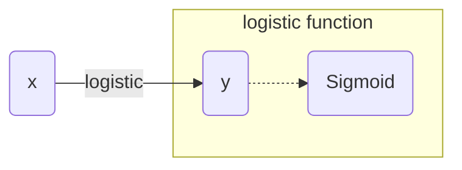

# 基于机器学习的电信防骚扰模型设计与实现

## 1. 背景介绍

### 1.1 骚扰电话的危害

骚扰电话一直是电信行业的一大痛点问题。骚扰电话不仅给用户带来巨大困扰,也给运营商造成了严重的声誉和经济损失。骚扰电话的危害主要体现在以下几个方面:

#### 1.1.1 侵犯用户隐私

骚扰电话往往在未经允许的情况下频繁打扰用户,侵犯了用户的隐私权。这不仅给用户带来了精神困扰,也可能导致用户个人信息泄露,引发安全隐患。

#### 1.1.2 破坏通信秩序

大量骚扰电话占用了宝贵的通信资源,影响了正常用户的通话质量,破坏了电信网络的正常运行秩序。

#### 1.1.3 损害运营商声誉

骚扰电话给用户带来了极差的通信体验,这严重损害了运营商的品牌形象和声誉。

#### 1.1.4 造成经济损失

骚扰电话不仅浪费了运营商的通信资源,也导致大量用户流失,给运营商带来了巨大的经济损失。

### 1.2 传统防骚扰方法的不足

为了解决骚扰电话问题,运营商采取了一些传统的防骚扰措施,如黑名单拦截、人工审核等,但这些方法存在以下不足:

#### 1.2.1 覆盖面有限

传统方法主要针对已知的骚扰号码,对于新出现的骚扰号码则无能为力。

#### 1.2.2 效率低下

人工审核效率低下,无法及时发现和处理骚扰电话。

#### 1.2.3 成本高昂

人工审核需要大量人力,运营成本高昂。

#### 1.2.4 准确率不高

人工判断存在主观性,准确率难以保证。

因此,亟需一种高效、准确的自动化防骚扰解决方案来应对日益严峻的骚扰电话问题。

## 2. 核心概念与联系

### 2.1 机器学习概述

机器学习是人工智能的一个重要分支,它赋予计算机在没有明确程序的情况下,通过学习数据获取知识,从而对未知数据做出准确判断的能力。机器学习算法通过建立数学模型,从大量历史数据中自动分析获取规律,并将其应用于新的数据上。

机器学习在电信防骚扰领域的应用主要包括以下几个方面:

#### 2.1.1 自动识别骚扰号码

通过分析已知骚扰号码的特征,训练出能够自动识别新骚扰号码的模型。

#### 2.1.2 自动识别骚扰内容

通过分析已知骚扰通话内容的特征,训练出能够自动识别新骚扰通话内容的模型。

#### 2.1.3 自动识别骚扰行为

通过分析已知骚扰行为的特征,训练出能够自动识别新骚扰行为的模型。

#### 2.1.4 用户画像分析

通过分析用户通话记录、上网记录等数据,对用户进行画像分析,发现可能的骚扰行为。

### 2.2 常用机器学习算法

在电信防骚扰领域,常用的机器学习算法包括:

#### 2.2.1 监督学习算法

- 逻辑回归
- 支持向量机
- 决策树
- 随机森林
- 神经网络

监督学习算法需要大量已标注的训练数据,通过学习训练数据中的特征与标签之间的映射关系,建立预测模型。

#### 2.2.2 无监督学习算法

- 聚类算法
- 关联规则挖掘

无监督学习算法不需要标注数据,通过发现数据内在的模式和规律,对数据进行分类或者挖掘关联规则。

#### 2.2.3 半监督学习算法

- 生成对抗网络
- 自训练

半监督学习算法结合了监督学习和无监督学习的优点,利用少量标注数据和大量未标注数据进行训练,可以提高模型的准确性和泛化能力。

#### 2.2.4 强化学习算法

- Q-Learning
- 策略梯度

强化学习算法通过与环境的交互,自动学习最优策略,可以应用于动态环境下的决策问题。

### 2.3 机器学习在防骚扰中的应用流程

机器学习在电信防骚扰中的应用流程通常包括以下几个步骤:

1. **数据采集与预处理**
   收集用户通话记录、短信记录、上网记录等原始数据,并对数据进行清洗、去重、标注等预处理操作。

2. **特征工程**
   从原始数据中提取有效的特征,如通话时长、通话频率、号码归属地等,作为模型的输入。

3. **模型训练**
   选择合适的机器学习算法,使用已标注的训练数据训练模型。

4. **模型评估**
   使用测试数据对训练好的模型进行评估,计算模型的准确率、召回率等指标。

5. **模型优化**
   根据评估结果,通过调整算法参数、特征选择等方式优化模型。

6. **模型上线**
   将优化后的模型部署到线上系统,用于实时预测和拦截骚扰电话。

7. **模型更新**
   定期使用新的数据对模型进行重训练,保证模型的时效性和准确性。

## 3. 核心算法原理具体操作步骤

在电信防骚扰领域,常用的核心算法包括逻辑回归、支持向量机、决策树、随机森林和神经网络等。下面以逻辑回归算法为例,介绍其具体的原理和操作步骤。

### 3.1 逻辑回归算法原理

逻辑回归算法是一种广泛应用的监督学习算法,它可以用于二分类问题,即根据输入的特征向量预测输出属于正类还是负类。

逻辑回归算法的核心思想是:通过对数据进行拟合,得到一个最优的分类模型,使用该模型对新的数据进行预测。

具体来说,逻辑回归算法首先构建一个逻辑函数(Logistic Function),将输入的特征向量 $\boldsymbol{x}$ 映射到 $(0,1)$ 区间内的一个值 $y$,表示输出为正类的概率:

$$y = \frac{1}{1 + e^{-(\boldsymbol{w}^T\boldsymbol{x} + b)}}$$

其中, $\boldsymbol{w}$ 是特征权重向量, $b$ 是偏置项。

然后,通过最大似然估计的方法,求解出最优的 $\boldsymbol{w}$ 和 $b$,使得训练数据的似然函数值最大。

对于新的输入 $\boldsymbol{x}$,将其代入上式计算出 $y$ 的值。如果 $y \geq 0.5$,则判定为正类,否则为负类。

### 3.2 逻辑回归算法步骤

逻辑回归算法的具体操作步骤如下:

#### 3.2.1 数据预处理

将原始数据进行标准化或归一化处理,使特征数据落在相近的数值范围内,避免某些特征对模型的影响过大。

#### 3.2.2 构建模型

1. 初始化模型参数 $\boldsymbol{w}$ 和 $b$,通常将它们设置为小的随机值。

2. 定义逻辑函数:
   $$y = \frac{1}{1 + e^{-(\boldsymbol{w}^T\boldsymbol{x} + b)}}$$

3. 定义代价函数(损失函数),通常使用交叉熵损失函数:
   $$J(\boldsymbol{w},b) = -\frac{1}{m}\sum_{i=1}^{m}[y^{(i)}\log(h_\boldsymbol{w,b}(\boldsymbol{x}^{(i)})) + (1-y^{(i)})\log(1-h_\boldsymbol{w,b}(\boldsymbol{x}^{(i)}))]$$

   其中, $m$ 是训练样本数, $y^{(i)}$ 是第 $i$ 个样本的实际标签, $h_\boldsymbol{w,b}(\boldsymbol{x}^{(i)})$ 是第 $i$ 个样本的预测值。

#### 3.2.3 模型训练

使用梯度下降法或其他优化算法,求解能够使代价函数最小的 $\boldsymbol{w}$ 和 $b$。

具体步骤如下:

1. 计算代价函数对 $\boldsymbol{w}$ 和 $b$ 的偏导数:

   $$\begin{aligned}
   \frac{\partial J}{\partial w_j} &= \frac{1}{m}\sum_{i=1}^{m}(h_\boldsymbol{w,b}(\boldsymbol{x}^{(i)}) - y^{(i)})x_j^{(i)}\\
   \frac{\partial J}{\partial b} &= \frac{1}{m}\sum_{i=1}^{m}(h_\boldsymbol{w,b}(\boldsymbol{x}^{(i)}) - y^{(i)})
   \end{aligned}$$

2. 更新 $\boldsymbol{w}$ 和 $b$:
   $$\begin{aligned}
   w_j &\leftarrow w_j - \alpha\frac{\partial J}{\partial w_j}\\
   b &\leftarrow b - \alpha\frac{\partial J}{\partial b}
   \end{aligned}$$

   其中, $\alpha$ 是学习率,控制每次更新的步长。

3. 重复执行步骤 1 和 2,直到收敛或达到最大迭代次数。

#### 3.2.4 模型评估

使用测试数据对训练好的模型进行评估,计算准确率、精确率、召回率、F1 分数等指标,检验模型的性能。

#### 3.2.5 模型调优

根据评估结果,通过以下方式对模型进行调优:

- 特征选择:去除冗余特征,添加新的有效特征。
- 参数调整:调整正则化参数,控制模型复杂度,避免过拟合。
- 算法选择:尝试其他分类算法,如决策树、随机森林等。

#### 3.2.6 模型上线

将调优后的模型部署到线上系统,用于实时预测和拦截骚扰电话。

## 4. 数学模型和公式详细讲解举例说明

在逻辑回归算法中,涉及到了一些重要的数学模型和公式,下面将对它们进行详细的讲解和举例说明。

### 4.1 逻辑函数(Logistic Function)

逻辑函数是逻辑回归算法的核心,它将输入的特征向量 $\boldsymbol{x}$ 映射到 $(0,1)$ 区间内的一个值 $y$,表示输出为正类的概率:

$$y = \frac{1}{1 + e^{-(\boldsymbol{w}^T\boldsymbol{x} + b)}}$$

其中, $\boldsymbol{w}$ 是特征权重向量, $b$ 是偏置项。

逻辑函数的图像如下所示:

可以看到,逻辑函数是一种 S 形的曲线,它将输入值压缩到了 $(0,1)$ 区间内。当输入值很大时,函数值趋近于 1;当输入值很小时,函数值趋近于 0。这种特性使得逻辑函数非常适合于二分类问题。

**举例说明**

假设我们有一个二分类问题,需要根据一个特征 $x$ 预测一个样本是正类还是负类。我们将特征 $x$ 代入逻辑函数:

$$y = \frac{1}{1 + e^{-(0.5x + 0.2)}}$$

计算不同 $x$ 值对应的 $y$ 值:

- 当 $x = -2$ 时, $y = 0.27$
- 当 $x = 0$ 时, $y = 0.55$
- 当 $x = 2$ 时, $y = 0.82$

我们可以设置一个阈值,如 0.5。当 $y \geq 0.5$ 时,判定为正类;否则为负类。

因此