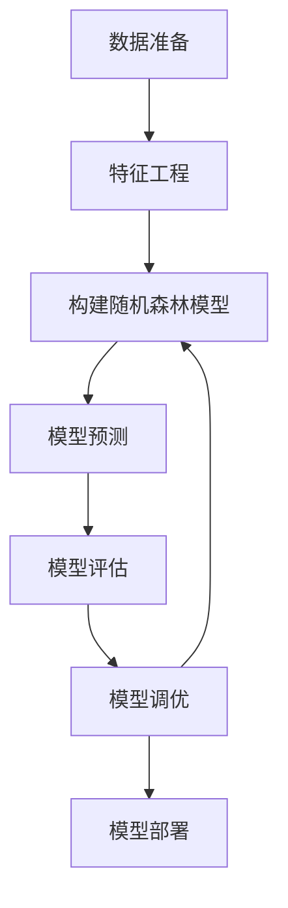
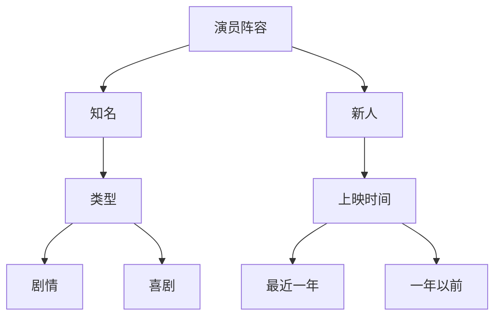

# 基于机器学习的电视剧类型点击量数据分析研究

## 1. 背景介绍

### 1.1 电视剧行业概况

在当今的娱乐时代,电视剧已经成为人们获取信息和娱乐的重要渠道之一。随着网络技术和流媒体平台的快速发展,观众可以更加便捷地观看各种类型的电视剧。然而,电视剧的制作和发行也面临着巨大的挑战,需要满足观众日益多样化的需求。

### 1.2 数据分析在电视剧行业中的重要性

为了更好地了解观众的喜好,制作出符合市场需求的优质电视剧,数据分析在这一过程中扮演着关键角色。通过分析观众的点击量、观看时长、评论等数据,电视剧制作方可以深入了解不同类型电视剧的受欢迎程度,从而优化内容策略,提高制作质量。

### 1.3 机器学习在数据分析中的应用

机器学习作为一种先进的数据分析技术,可以从海量数据中发现隐藏的模式和规律,为决策提供有价值的洞见。在电视剧行业,机器学习可以应用于多个领域,如观众行为预测、内容推荐、广告投放等,帮助制作方更好地把握市场脉搏。

## 2. 核心概念与联系

### 2.1 监督学习

监督学习是机器学习中的一个重要分支,它利用已标记的训练数据集,学习映射关系,从而对新的输入数据进行预测或分类。在电视剧点击量数据分析中,监督学习可用于构建回归模型(预测连续值点击量)或分类模型(预测电视剧类型受欢迎程度)。

### 2.2 无监督学习

无监督学习则是从未标记的数据中发现内在模式和结构。在电视剧数据分析中,无监督学习可用于聚类分析,将具有相似特征的电视剧归为同一类别,从而发现潜在的观众群体。

### 2.3 特征工程

特征工程是数据预处理的重要环节,旨在从原始数据中提取有意义的特征,以供机器学习模型使用。在电视剧点击量分析中,特征可能包括剧情类型、演员阵容、上映时间等,这些特征对于预测点击量至关重要。

### 2.4 模型评估

模型评估是机器学习项目中不可或缺的一个步骤,用于衡量模型的性能和泛化能力。常用的评估指标包括准确率、精确率、召回率、F1分数等,根据具体任务的不同而选择合适的指标。

## 3. 核心算法原理具体操作步骤

在电视剧点击量数据分析中,常用的机器学习算法包括线性回归、逻辑回归、决策树、随机森林、梯度提升树等。以下将以随机森林算法为例,介绍其在该任务中的应用。

### 3.1 随机森林算法原理

随机森林是一种集成学习方法,它通过构建多个决策树,并将它们的预测结果进行组合,从而获得更加准确和鲁棒的模型。每个决策树在训练过程中,都会从原始数据中随机抽取一部分样本和特征,这种随机性可以减少模型过拟合的风险。

### 3.2 算法步骤

1. **数据准备**:收集电视剧点击量数据,包括每部剧的点击量、剧情类型、演员阵容、上映时间等特征。将数据划分为训练集和测试集。

2. **特征工程**:对原始数据进行预处理,如缺失值处理、特征编码等,并从中提取有意义的特征。

3. **构建随机森林模型**:
   a. 确定模型参数,如决策树数量、最大树深度等。
   b. 对每棵决策树:
      - 从训练集中随机抽取一部分样本(有放回抽样)。
      - 从所有特征中随机选择一部分特征。
      - 使用选定的样本和特征,构建一棵决策树。

4. **模型预测**:对于新的电视剧数据,每棵决策树都会进行预测,随机森林模型将这些预测结果进行组合(如取平均值或投票),得到最终的预测结果。

5. **模型评估**:使用测试集评估模型的性能,计算评估指标如均方根误差(对于回归任务)或准确率(对于分类任务)。

6. **模型调优**:根据评估结果,调整模型参数,重复步骤3-5,直到获得满意的性能。

7. **模型部署**:将训练好的模型应用于实际场景,对新的电视剧数据进行点击量预测或受欢迎程度分类。



## 4. 数学模型和公式详细讲解举例说明

在随机森林算法中,涉及到一些重要的数学概念和公式,下面将对其进行详细讲解。

### 4.1 决策树

决策树是随机森林的基础模型,它通过不断划分特征空间,将样本分配到不同的叶节点,从而实现分类或回归任务。

对于一个特征 $j$ 和阈值 $t_m$,将数据集 $D$ 划分为两个子集:

$$
D_1(j,t_m)=\{X|X(j)\leq t_m\}\\
D_2(j,t_m)=\{X|X(j)>t_m\}
$$

其中 $X(j)$ 表示样本 $X$ 在第 $j$ 个特征上的取值。

在构建决策树时,我们需要选择最优的特征 $j$ 和阈值 $t_m$,使得子节点的impurity(纯度)最小。常用的impurity度量包括基尼系数(分类任务)和均方差(回归任务)。

#### 4.1.1 基尼系数

对于一个节点 $m$,其基尼系数定义为:

$$
\text{Gini}(m)=\sum_{k\neq k'} f(k|m)f(k'|m)=1-\sum_k[f(k|m)]^2
$$

其中 $f(k|m)$ 表示在节点 $m$ 中属于类别 $k$ 的样本占比。基尼系数越小,说明节点越纯。

在划分过程中,我们选择能够最小化加权基尼系数的特征和阈值:

$$
\min_{j,t_m}\Big[\frac{|D_1(j,t_m)|}{|D|}\text{Gini}(D_1(j,t_m))+\frac{|D_2(j,t_m)|}{|D|}\text{Gini}(D_2(j,t_m))\Big]
$$

#### 4.1.2 均方差

对于回归任务,我们使用均方差作为impurity度量:

$$
\text{Var}(m)=\frac{1}{|D_m|}\sum_{x\in D_m}(y_x-\overline{y}_m)^2
$$

其中 $D_m$ 表示节点 $m$ 中的样本集合, $y_x$ 是样本 $x$ 的真实值, $\overline{y}_m$ 是节点 $m$ 中所有样本的平均值。

同样地,我们选择能够最小化加权均方差的特征和阈值:

$$
\min_{j,t_m}\Big[\frac{|D_1(j,t_m)|}{|D|}\text{Var}(D_1(j,t_m))+\frac{|D_2(j,t_m)|}{|D|}\text{Var}(D_2(j,t_m))\Big]
$$

### 4.2 随机森林

随机森林通过集成多棵决策树,降低了单一决策树的方差,从而获得更好的泛化能力。

对于一个包含 $K$ 棵树的随机森林,其对于样本 $x$ 的预测结果为:

$$
\hat{f}(x)=\frac{1}{K}\sum_{k=1}^K\hat{f}_k(x)
$$

其中 $\hat{f}_k(x)$ 表示第 $k$ 棵树对样本 $x$ 的预测结果。

在分类任务中,每棵树对样本 $x$ 进行投票,随机森林取多数票作为最终预测结果:

$$
\hat{C}(x)=\text{majority vote}\{\hat{C}_k(x)\}_{k=1}^K
$$

在回归任务中,随机森林取所有树的平均预测值作为最终预测结果:

$$
\hat{f}(x)=\frac{1}{K}\sum_{k=1}^K\hat{f}_k(x)
$$

### 4.3 示例

假设我们有一个包含5部电视剧的数据集,每部剧有3个特征:类型(剧情/喜剧)、演员阵容(知名/新人)和上映时间(最近一年/一年以前)。我们的目标是预测每部剧的点击量。

首先,我们构建一个决策树,以演员阵容作为根节点:



在这棵决策树中,对于一部有知名演员阵容且为剧情类型的电视剧,我们预测它会有较高的点击量(节点E)。而对于一部由新人演员演绎、上映一年以前的喜剧剧,我们预测它的点击量会较低(节点I)。

接下来,我们构建一个包含100棵树的随机森林。对于一部新的电视剧数据 $x$,每棵树都会根据自己的决策规则进行预测,得到 $\hat{f}_1(x)$, $\hat{f}_2(x)$, ..., $\hat{f}_{100}(x)$。随机森林模型将这些预测值取平均,得到最终的点击量预测结果:

$$
\hat{f}(x)=\frac{1}{100}\sum_{k=1}^{100}\hat{f}_k(x)
$$

通过集成多棵决策树,随机森林模型能够捕获更多的数据模式,提高预测的准确性和稳定性。

## 5. 项目实践:代码实例和详细解释说明

在这一部分,我们将使用Python中的scikit-learn库,构建一个基于随机森林的电视剧点击量预测模型。

### 5.1 数据准备

首先,我们需要准备电视剧数据集。这里我们使用一个包含1000部电视剧信息的虚构数据集,其中包括剧名、类型、演员阵容、上映时间和点击量等特征。

```python
import pandas as pd

# 加载数据集
data = pd.read_csv('tv_shows.csv')

# 查看数据集前5行
data.head()
```

### 5.2 特征工程

接下来,我们需要对数据进行预处理,包括填充缺失值、对类别特征进行编码等。

```python
from sklearn.preprocessing import LabelEncoder

# 填充缺失值
data = data.fillna(data.mean())

# 对类别特征进行编码
label_encoder = LabelEncoder()
data['genre'] = label_encoder.fit_transform(data['genre'])
data['cast'] = label_encoder.fit_transform(data['cast'])
```

### 5.3 构建随机森林模型

我们使用scikit-learn库中的RandomForestRegressor类来构建随机森林回归模型。

```python
from sklearn.model_selection import train_test_split
from sklearn.ensemble import RandomForestRegressor
from sklearn.metrics import mean_squared_error

# 划分训练集和测试集
X = data.drop('views', axis=1)
y = data['views']
X_train, X_test, y_train, y_test = train_test_split(X, y, test_size=0.2, random_state=42)

# 构建随机森林模型
rf_model = RandomForestRegressor(n_estimators=100, random_state=42)

# 训练模型
rf_model.fit(X_train, y_train)

# 在测试集上进行预测
y_pred = rf_model.predict(X_test)

# 计算均方根误差
mse = mean_squared_error(y_test, y_pred)
print(f'Mean Squared Error: {mse}')
```

在上面的代码中,我们首先将数据集划分为训练集和测试集。然后,我们使用RandomForestRegressor类构建一个