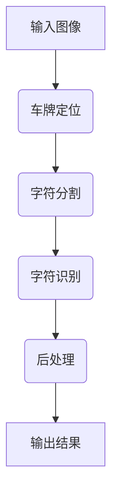

# 基于深度学习的车牌识别系统设计与实现

## 1. 背景介绍

### 1.1 车牌识别的重要性

车牌识别技术在交通管理、停车场管理、高速公路收费等领域发挥着重要作用。准确高效的车牌识别系统可以大幅提高管理效率,降低人工成本。随着智能交通系统的不断发展,车牌识别技术也受到了越来越多的关注。

### 1.2 车牌识别的挑战

尽管车牌识别技术已经得到了广泛应用,但是仍然面临着一些挑战:

- 不同国家和地区车牌的样式差异很大
- 车牌图像易受光照、角度、遮挡等因素影响
- 需要识别的字符种类较多,包括数字、字母和中文等

### 1.3 深度学习在车牌识别中的应用

传统的基于规则或特征的车牌识别方法已经难以满足现实需求。深度学习凭借其强大的模型表达能力和端到端的训练方式,在车牌定位和字符识别等任务中表现出色,成为车牌识别的主流技术方案。

## 2. 核心概念与联系

### 2.1 车牌识别系统框架

基于深度学习的车牌识别系统通常包括以下几个核心模块:



1. **车牌定位(Vehicle License Plate Detection)**: 在输入图像中定位并提取车牌区域
2. **字符分割(Character Segmentation)**: 将车牌区域分割为单个字符
3. **字符识别(Character Recognition)**: 识别每个字符的具体内容(数字、字母或汉字)
4. **后处理(Postprocessing)**: 根据车牌规则对识别结果进行校验和优化

### 2.2 关键技术

车牌识别系统的关键技术包括:

- **目标检测(Object Detection)**: 用于车牌定位,常用算法有YOLO、Faster R-CNN等
- **图像分割(Image Segmentation)**: 用于字符分割,如FCN、Mask R-CNN等
- **光学字符识别(Optical Character Recognition, OCR)**: 用于字符识别,如CRNN、ASTER等

## 3. 核心算法原理具体操作步骤

### 3.1 车牌定位

车牌定位的主要步骤包括:

1. **预处理**: 对输入图像进行预处理,如调整大小、归一化等,以满足模型输入要求

2. **特征提取**: 使用卷积神经网络(CNN)从图像中提取特征

3. **区域生成**: 根据特征生成一系列候选区域,通常使用Region Proposal Network (RPN)

4. **区域分类**: 对候选区域进行二分类(车牌/非车牌),同时细化区域边界

5. **后处理**: 根据置信度和非极大值抑制(Non-Maximum Suppression, NMS)获取最终检测结果

常用的车牌定位模型包括YOLO系列、Faster R-CNN、SSD等。

### 3.2 字符分割

字符分割的主要步骤包括:

1. **预处理**: 对车牌区域进行预处理,如透视变换、灰度化等

2. **特征提取**: 使用CNN从车牌图像中提取特征

3. **像素分类**: 对每个像素进行分类(字符/非字符),常用全卷积网络(FCN)

4. **字符区域生成**: 根据像素分类结果生成字符区域

5. **后处理**: 根据几何约束(如长宽比)过滤无效区域,获取最终字符区域

常用的字符分割模型包括FCN、Mask R-CNN等。

### 3.3 字符识别

字符识别的主要步骤包括:

1. **预处理**: 对字符区域进行预处理,如大小调整、灰度归一化等

2. **特征提取**: 使用CNN从字符图像中提取特征序列

3. **序列建模**: 使用递归神经网络(RNN)或注意力机制对特征序列进行建模

4. **字符输出**: 使用CTC损失函数或注意力解码器输出字符序列

5. **后处理**: 根据字符类型(数字、字母、汉字)和字典进行约束,获取最终识别结果

常用的字符识别模型包括CRNN、ASTER、NRTR等。

## 4. 数学模型和公式详细讲解举例说明

### 4.1 目标检测模型

目标检测模型通常基于anchor机制,使用回归和分类两个分支同时预测目标边界框和类别。以YOLO系列模型为例,其损失函数可表示为:

$$
\begin{aligned}
\mathcal{L} &= \mathcal{L}_{conf} + \mathcal{L}_{loc} \\
\mathcal{L}_{conf} &= \sum_{i=0}^{S^2}\sum_{j=0}^B \mathbb{1}_{ij}^{obj}\left[C_i\log\left(\hat{C}_i\right) + \left(1-C_i\right)\log\left(1-\hat{C}_i\right)\right] \\
&+ \lambda_{noobj}\sum_{i=0}^{S^2}\sum_{j=0}^B \mathbb{1}_{ij}^{noobj}\left[C_i\log\left(\hat{C}_i\right) + \left(1-C_i\right)\log\left(1-\hat{C}_i\right)\right] \\
\mathcal{L}_{loc} &= \sum_{i=0}^{S^2}\sum_{j=0}^B \mathbb{1}_{ij}^{obj}\sum_{m\in{x,y,w,h}} \left(1-\hat{l}_i^m\right)^2
\end{aligned}
$$

其中:

- $\mathcal{L}_{conf}$为置信度损失,用于判断边界框内是否存在目标及其类别
- $\mathcal{L}_{loc}$为位置损失,用于精细化边界框位置
- $\mathbb{1}_{ij}^{obj}$和$\mathbb{1}_{ij}^{noobj}$分别表示第$i$个网格是否存在目标和不存在目标
- $C_i$和$\hat{C}_i$分别表示真实置信度和预测置信度
- $l_i^m$和$\hat{l}_i^m$分别表示真实边界框和预测边界框的位置参数

### 4.2 语义分割模型

语义分割模型通常采用全卷积网络结构,对每个像素进行分类。以FCN为例,其核心思想是使用上采样操作恢复特征图的空间分辨率,并与浅层特征图进行融合,以提高分割精度。其损失函数可表示为:

$$
\mathcal{L} = -\frac{1}{N}\sum_{i=1}^N\sum_{k=1}^K y_{ik}\log\left(p_{ik}\right)
$$

其中:

- $N$为像素数量
- $K$为类别数量
- $y_{ik}$为第$i$个像素属于第$k$类的真实标签(0或1)
- $p_{ik}$为第$i$个像素属于第$k$类的预测概率

### 4.3 序列识别模型

序列识别模型通常采用CNN提取特征,然后使用RNN或注意力机制进行序列建模。以CRNN为例,其损失函数基于CTC(Connectionist Temporal Classification)算法,可表示为:

$$
\mathcal{L} = -\log\left(P\left(\pi|\mathbf{y}\right)\right) = -\log\left(\frac{\sum_{\beta\in\mathcal{B}^{-1}\left(\pi\right)}P\left(\beta|\mathbf{y}\right)}{P\left(\mathbf{y}\right)}\right)
$$

其中:

- $\pi$为目标序列(如车牌字符序列)
- $\mathbf{y}$为CNN输出的特征序列
- $\mathcal{B}^{-1}\left(\pi\right)$为所有与$\pi$对应的标签序列$\beta$的集合
- $P\left(\beta|\mathbf{y}\right)$为给定特征序列$\mathbf{y}$产生标签序列$\beta$的概率
- $P\left(\mathbf{y}\right)$为特征序列$\mathbf{y}$的总概率

CTC算法通过动态规划高效计算上述损失函数,并允许模型输出与目标序列长度不等的预测序列。

## 5. 项目实践: 代码实例和详细解释说明

以下是一个基于PyTorch实现的简单车牌识别系统示例,包括车牌定位、字符分割和字符识别三个模块。

### 5.1 车牌定位

```python
import torch
import torchvision

# 加载预训练模型
model = torchvision.models.detection.fasterrcnn_resnet50_fpn(pretrained=True)

# 设置检测类别
num_classes = 2  # 车牌和背景
model.roi_heads.box_predictor = torchvision.models.detection.faster_rcnn.FastRCNNPredictor(model.roi_heads.box_predictor.cls_score.in_features, num_classes)

# 推理
device = torch.device('cuda' if torch.cuda.is_available() else 'cpu')
model.to(device)
model.eval()

# 预处理输入图像
img = ... # 读取输入图像
img_tensor = torchvision.transforms.functional.to_tensor(img).to(device)

# 运行推理
with torch.no_grad():
    outputs = model([img_tensor])

# 后处理输出结果
boxes = outputs[0]['boxes'].cpu().numpy()
scores = outputs[0]['scores'].cpu().numpy()
labels = outputs[0]['labels'].cpu().numpy()

# 可视化结果
...
```

上述代码使用PyTorch中的Faster R-CNN模型进行车牌定位。首先加载预训练模型,然后修改最后一层分类器以适应我们的二分类任务(车牌和背景)。接下来,将输入图像转换为张量并送入模型进行推理。最后,从模型输出中提取检测框、置信度和类别标签,并进行后处理和可视化。

### 5.2 字符分割

```python
import torch
import torchvision

# 加载预训练模型
model = torchvision.models.segmentation.fcn_resnet101(pretrained=True)

# 修改输出通道数
num_classes = 2  # 字符和背景
model.classifier = torch.nn.Conv2d(512, num_classes, kernel_size=(1, 1), stride=(1, 1))

# 推理
device = torch.device('cuda' if torch.cuda.is_available() else 'cpu')
model.to(device)
model.eval()

# 预处理输入图像
img = ... # 读取输入图像
img_tensor = torchvision.transforms.functional.to_tensor(img).unsqueeze(0).to(device)

# 运行推理
with torch.no_grad():
    outputs = model(img_tensor)['out']

# 后处理输出结果
outputs = torch.argmax(outputs.squeeze(), dim=0).cpu().numpy()

# 可视化结果
...
```

上述代码使用PyTorch中的FCN模型进行字符分割。首先加载预训练模型,然后修改最后一层分类器以适应我们的二分类任务(字符和背景)。接下来,将输入图像(车牌区域)转换为张量并送入模型进行推理。最后,从模型输出中提取分割结果,并进行后处理和可视化。

### 5.3 字符识别

```python
import torch

# 定义CRNN模型
class CRNN(torch.nn.Module):
    def __init__(self, num_classes):
        super(CRNN, self).__init__()
        # CNN部分
        self.cnn = ...
        # RNN部分
        self.rnn = ...
        # 输出层
        self.fc = torch.nn.Linear(rnn_output_size, num_classes)

    def forward(self, x):
        x = self.cnn(x)
        x = self.rnn(x)
        x = self.fc(x)
        return x

# 加载模型和预处理输入
model = CRNN(num_classes=...)
model.load_state_dict(torch.load('crnn.pth'))
device = torch.device('cuda' if torch.cuda.is_available() else 'cpu')
model.to(device)
model.eval()

img = ... # 读取输入图像
img_tensor = preprocess(img).to(device)

# 运行推理
with torch.no_grad():
    outputs = model(img_tensor)

# 后处理输出结果
decoded, _ = ctc_decode(outputs.permute(1, 0, 2), ...)
plate_number = ''.join([char_map[c] for c in decoded[0]])

# 输出结果
print(plate_number)
```

上述代码定义了一个简单的CRNN模型,用于车牌字符识别。模型包括CNN部分用于特征提取,RNN部分用于序列建模,以及最后的全连接层用于输出字符预测。在推理时,首先加载预训练模