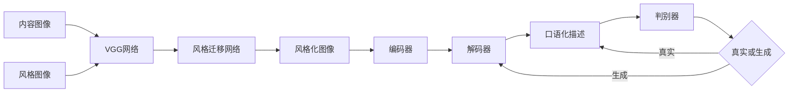

# 基于生成对抗网络的口语化图片表达风格迁移技术

## 1.背景介绍
### 1.1 图像风格迁移的兴起
近年来,随着深度学习技术的飞速发展,图像风格迁移已成为计算机视觉和人工智能领域的研究热点之一。图像风格迁移旨在将一幅图像的风格迁移到另一幅图像的内容上,生成一幅具有原始图像内容但呈现出另一幅图像风格的新图像。这一技术不仅在艺术创作、图像编辑等领域有广泛应用前景,也为人工智能模仿人类艺术创作提供了新的思路。

### 1.2 口语化表达的重要性
随着人工智能技术的不断进步,机器不仅能够完成图像生成、识别等视觉任务,还需要具备对图像内容进行口语化表达的能力。图像的口语化表达是指用通俗易懂的自然语言来描述图像所呈现的视觉信息,这对于提升人机交互的自然性和友好性具有重要意义。传统的图像描述方法大多采用刻板的语言模板,缺乏灵活性和多样性。因此,如何实现具有丰富语言风格的口语化图像表达,是一个亟需解决的问题。

### 1.3 生成对抗网络的优势
生成对抗网络(Generative Adversarial Networks, GANs)是一种强大的生成式模型,由生成器和判别器两个神经网络组成。生成器负责生成逼真的样本,判别器则负责判断样本的真伪。通过生成器和判别器的对抗学习,GAN能够生成与真实样本极其相似的合成数据。近年来,GAN在图像生成、图像翻译、风格迁移等任务上取得了瞩目成就。利用GAN进行图像风格迁移和口语化表达,有望突破传统方法的局限,实现更加灵活、多样化的效果。

## 2.核心概念与联系
### 2.1 图像风格迁移
图像风格迁移是指将一幅图像的风格特征迁移到另一幅图像的内容上,生成一幅融合了两幅图像特征的新图像。其核心是学习并提取图像的内容特征和风格特征,然后将风格特征应用于内容特征,最终合成目标图像。常见的风格迁移方法包括基于优化的方法和基于前馈网络的方法。

### 2.2 口语化图像表达 
口语化图像表达是指用通俗易懂的自然语言来描述图像的内容。与传统的图像描述不同,口语化表达更加注重语言的灵活性、多样性和口语化特点。一个好的口语化表达应该具备以下特点:
1. 语言通俗易懂,接近日常口语
2. 表达丰富多样,避免千篇一律
3. 描述准确到位,抓住图像的核心内容
4. 语言流畅自然,符合人类表达习惯

### 2.3 生成对抗网络
生成对抗网络由生成器(Generator)和判别器(Discriminator)两部分组成。生成器负责生成逼真的样本,判别器负责判断样本的真伪。两者在训练过程中进行博弈对抗,最终达到纳什均衡,生成器能够生成以假乱真的样本。GAN的核心思想可以用下面的公式表示:

$$\min_G \max_D V(D,G) = \mathbb{E}_{x \sim p_{data}(x)}[\log D(x)] + \mathbb{E}_{z \sim p_z(z)}[\log (1-D(G(z)))]$$

其中,$G$为生成器,$D$为判别器,$x$为真实样本,$z$为随机噪声。生成器$G$尽可能生成逼真的样本去欺骗判别器$D$,而判别器$D$则尽可能区分真实样本和生成样本。

### 2.4 风格迁移与口语化表达的结合
将图像风格迁移与口语化表达相结合,可以实现更加灵活、艺术化的图像描述生成。具体而言,可以先利用风格迁移模型对原始图像进行风格转换,然后再对风格化后的图像进行口语化表达。这样生成的图像描述不仅能够准确反映图像内容,还能体现出特定的语言风格,使得描述更加生动有趣。同时,引入GAN进行风格迁移和描述生成,可以进一步提升生成结果的质量和多样性。

## 3.核心算法原理具体操作步骤
本节将详细介绍基于生成对抗网络的口语化图片表达风格迁移技术的核心算法原理和具体操作步骤。

### 3.1 算法总体流程
算法主要分为两个阶段:风格迁移阶段和口语化表达阶段。

在风格迁移阶段,利用预训练的VGG网络提取内容图像和风格图像的特征,然后通过优化生成图像的内容损失和风格损失,使其在保留内容图像内容的同时,呈现出风格图像的视觉风格。

在口语化表达阶段,利用基于注意力机制的编码器-解码器框架,对风格化后的图像进行口语化描述。编码器负责提取图像特征,解码器负责根据图像特征生成对应的口语化描述。同时引入条件GAN对生成的描述进行优化,提升描述的流畅性和多样性。

算法流程图如下:



### 3.2 风格迁移阶段详解
风格迁移阶段的目标是在保留内容图像内容的同时,将风格图像的风格迁移到内容图像上。具体步骤如下:

1. 利用预训练的VGG-19网络提取内容图像和风格图像在不同卷积层的特征图。
2. 定义内容损失函数,度量生成图像与内容图像在内容特征上的相似性:

$$L_{content}(p,x) = \frac{1}{2}\sum_{i,j}(F_{ij}^l - P_{ij}^l)^2$$

其中,$F^l$为内容图像在第$l$层的特征图,$P^l$为生成图像在第$l$层的特征图。

3. 定义风格损失函数,度量生成图像与风格图像在不同卷积层的格拉姆矩阵(Gram Matrix)上的相似性:

$$L_{style}(a,x) = \sum_{l=0}^L w_l \frac{1}{4N_l^2M_l^2}\sum_{i,j}(G_{ij}^l - A_{ij}^l)^2$$

其中,$G^l$和$A^l$分别为风格图像和生成图像在第$l$层的格拉姆矩阵,$N_l$和$M_l$为该层特征图的高和宽。

4. 定义总变差正则化项(Total Variation Regularization),鼓励生成图像的空间平滑性:

$$L_{tv}(x) = \sum_{i,j}((x_{i,j+1} - x_{i,j})^2 + (x_{i+1,j} - x_{i,j})^2)$$

5. 将内容损失、风格损失和总变差正则化项加权求和,得到最终的损失函数:

$$L_{total}(p,a,x) = \alpha L_{content}(p,x) + \beta L_{style}(a,x) + \gamma L_{tv}(x)$$

其中,$\alpha$、$\beta$和$\gamma$为平衡因子。

6. 利用梯度下降法最小化总损失函数,不断更新生成图像,直到达到预设的迭代次数或损失阈值。

### 3.3 口语化表达阶段详解
口语化表达阶段采用基于注意力机制的编码器-解码器框架,并引入条件GAN进行优化。具体步骤如下:

1. 将风格化后的图像输入预训练的CNN编码器,提取图像特征。
2. 将图像特征输入注意力解码器,解码器在每个时间步根据注意力权重动态地关注图像的不同区域,并生成对应的单词。解码过程可以表示为:

$$h_t = f_{att}(h_{t-1},c_t,\mathbf{v})$$
$$p(y_t|y_{1:t-1}) = softmax(W_o h_t + b_o)$$

其中,$h_t$为$t$时刻的解码器隐状态,$c_t$为$t$时刻的注意力向量,$\mathbf{v}$为图像特征,$f_{att}$为注意力函数。$y_t$为$t$时刻生成的单词,$y_{1:t-1}$为之前生成的单词序列。

3. 引入条件GAN对生成的描述进行优化。生成器为上述的编码器-解码器框架,判别器为一个基于文本卷积的二分类器。生成器和判别器的目标函数分别为:

$$L_G = -\mathbb{E}_{y \sim p_{data}}[\log D(y|\mathbf{v})] - \lambda \mathbb{E}_{y \sim G}[\log p(y|\mathbf{v})]$$
$$L_D = -\mathbb{E}_{y \sim p_{data}}[\log D(y|\mathbf{v})] - \mathbb{E}_{y \sim G}[\log (1-D(y|\mathbf{v}))]$$

其中,$y$为真实描述或生成描述,$\mathbf{v}$为图像特征,$\lambda$为平衡因子。

4. 交替训练生成器和判别器,生成器尽可能生成逼真的描述欺骗判别器,判别器尽可能区分真实描述和生成描述。最终达到纳什均衡,生成器可以生成富有创意且口语化的图像描述。

## 4.数学模型和公式详细讲解举例说明
本节将详细讲解算法中涉及的关键数学模型和公式,并给出具体的例子帮助理解。

### 4.1 VGG网络特征提取
VGG网络是一种经典的卷积神经网络,在图像分类任务上取得了优异的性能。VGG网络由多个卷积层和池化层交替堆叠而成,可以提取图像的层次化特征。

以VGG-19为例,其结构如下:

```
Conv64 -> Conv64 -> Pool -> Conv128 -> Conv128 -> Pool -> Conv256 -> Conv256 -> Conv256 -> Conv256 -> Pool -> Conv512 -> Conv512 -> Conv512 -> Conv512 -> Pool -> Conv512 -> Conv512 -> Conv512 -> Conv512 -> Pool -> FC4096 -> FC4096 -> FC1000
```

其中,ConvN表示N个卷积核的卷积层,Pool表示池化层,FC表示全连接层。

在风格迁移中,我们利用VGG-19的卷积层提取图像特征。具体而言,内容特征选取conv4_2层的输出,风格特征选取conv1_1、conv2_1、conv3_1、conv4_1和conv5_1五个层的输出。

假设输入图像为$\mathbf{x}$,VGG网络的第$l$层输出为$F^l(\mathbf{x})$,则内容特征$\mathbf{p}$和风格特征$\mathbf{a}^l$可以表示为:

$$\mathbf{p} = F^{conv4\_2}(\mathbf{x}_c)$$
$$\mathbf{a}^l = F^l(\mathbf{x}_s), l \in \{conv1\_1,conv2\_1,conv3\_1,conv4\_1,conv5\_1\}$$

其中,$\mathbf{x}_c$和$\mathbf{x}_s$分别为内容图像和风格图像。

### 4.2 格拉姆矩阵
格拉姆矩阵(Gram Matrix)是风格迁移中用于度量风格相似性的关键工具。它通过计算特征图各通道之间的内积,刻画了特征的统计信息。

假设特征图$\mathbf{F} \in \mathbb{R}^{C \times HW}$,其中$C$为通道数,$H$和$W$分别为特征图的高和宽。格拉姆矩阵$\mathbf{G} \in \mathbb{R}^{C \times C}$的计算公式为:

$$\mathbf{G} = \mathbf{F}\mathbf{F}^T$$

展开式为:

$$G_{ij} = \sum_{k}F_{ik}F_{jk}$$

其中,$G_{ij}$