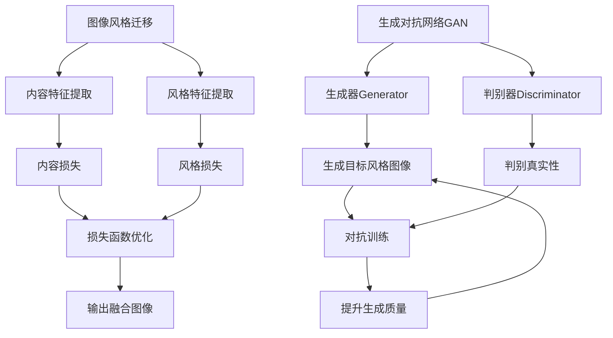

# 基于生成对抗网络的图像风格迁移在数字艺术创作中的应用

## 1. 背景介绍

### 1.1 数字艺术的兴起

随着计算机技术和数字媒体的快速发展，数字艺术作为一种全新的艺术形式逐渐兴起。数字艺术是指利用数字技术创作的艺术作品,包括数字绘画、数字雕塑、数字动画等多种形式。与传统艺术相比,数字艺术具有更大的创作自由度、更丰富的表现形式和更广阔的发展空间。

数字艺术的出现,为艺术家提供了全新的创作工具和表达方式,使艺术创作不再局限于物理材料和工具。同时,数字艺术作品也可以通过网络等数字媒体进行广泛传播和展示,打破了传统艺术展示和交流的地域限制。

### 1.2 图像风格迁移技术概述

图像风格迁移(Neural Style Transfer)是一种基于深度学习的技术,可以将一种图像风格迁移到另一种图像上,实现风格和内容的融合。该技术最早由Gatys等人于2015年提出,通过利用卷积神经网络(CNN)提取图像的内容特征和风格特征,并对两个特征进行融合,生成具有目标风格的新图像。

图像风格迁移技术为数字艺术创作带来了全新的可能性。艺术家可以将经典艺术作品的风格应用到自己的创作中,或者创造出全新的艺术风格,极大地丰富了数字艺术的表现形式。同时,该技术也可以应用于图像处理、视频制作等多个领域。

### 1.3 生成对抗网络(GAN)

生成对抗网络(Generative Adversarial Networks, GAN)是一种由Ian Goodfellow等人于2014年提出的全新深度学习架构。GAN由两个神经网络组成:生成器(Generator)和判别器(Discriminator)。生成器的目标是生成逼真的数据样本,而判别器的目标是区分生成的样本和真实的样本。两个网络相互对抗,最终达到生成器生成的样本无法被判别器识别的状态。

GAN在图像生成、图像超分辨率重建、图像风格迁移等多个领域展现出了优秀的性能。基于GAN的图像风格迁移方法可以生成更加自然、细腻的风格融合效果,成为数字艺术创作中的重要工具。

## 2. 核心概念与联系

### 2.1 图像风格迁移的核心思想

图像风格迁移的核心思想是将一幅图像的内容特征与另一幅图像的风格特征相结合,生成一幅新的图像。具体来说,就是将目标内容图像输入到预训练的卷积神经网络中,提取其内容特征;同时将风格参考图像输入到同一个网络中,提取其风格特征。然后,通过优化过程将两种特征融合,生成新的图像,使其既保留了目标内容图像的内容信息,又具有风格参考图像的风格特征。

该过程可以通过构建合适的损失函数来实现,损失函数包括内容损失(Content Loss)和风格损失(Style Loss)两个部分。内容损失用于保留目标内容图像的内容信息,风格损失用于迁移风格参考图像的风格特征。通过优化该损失函数,可以得到既保留内容又融合了目标风格的输出图像。

### 2.2 生成对抗网络在图像风格迁移中的作用

传统的图像风格迁移方法虽然可以实现风格迁移,但往往会产生不自然的视觉效果,例如出现像素块状或失真等问题。生成对抗网络(GAN)的引入,为图像风格迁移提供了一种全新的解决方案。

在基于GAN的图像风格迁移方法中,生成器网络的目标是生成具有目标风格的图像,而判别器网络的目标是判断生成的图像是否真实自然。通过生成器和判别器的对抗训练,生成器可以学习到生成更加自然、细腻的风格融合效果。

此外,GAN还可以实现任意风格迁移,而不仅限于特定的风格参考图像。通过对生成器进行训练,使其学习到不同风格的特征,就可以在测试阶段根据需求生成具有任意风格的图像。这为数字艺术创作提供了更大的自由度和可能性。

### 2.3 核心概念关系图解



如上图所示,图像风格迁移的核心步骤包括内容特征提取、风格特征提取,以及通过内容损失和风格损失构建损失函数进行优化,最终生成融合了目标风格的输出图像。生成对抗网络GAN则通过生成器和判别器的对抗训练,不断提升生成图像的质量和真实性。

## 3. 核心算法原理具体操作步骤

### 3.1 基于VGG网络的图像风格迁移

Leon Gatys等人于2015年提出了基于VGG网络的图像风格迁移算法,该算法成为了后续研究的基础。算法的具体步骤如下:

1. **预训练模型**: 使用预训练的VGG-19卷积神经网络作为特征提取器。
2. **内容特征提取**: 将目标内容图像输入到VGG网络中,从某一层(通常是较浅层)提取内容特征。
3. **风格特征提取**: 将风格参考图像输入到VGG网络中,从多个层(通常是较深层)提取风格特征,并计算格拉姆矩阵(Gram Matrix)作为风格表示。
4. **损失函数构建**: 构建内容损失函数和风格损失函数,内容损失函数用于保留目标内容图像的内容信息,风格损失函数用于迁移风格参考图像的风格特征。
5. **优化过程**: 初始化一个噪声图像或随机图像作为输入,通过优化算法(如L-BFGS)最小化内容损失和风格损失的加权和,得到最终的输出图像。

该算法虽然可以实现风格迁移,但存在一些缺陷,如输出图像质量不高、优化过程缓慢等。后续研究提出了多种改进方法,如利用GAN提升输出质量、加快优化速度等。

### 3.2 基于GAN的图像风格迁移

为了克服传统方法的缺陷,研究人员引入了生成对抗网络(GAN)来实现图像风格迁移。基于GAN的图像风格迁移算法通常包括以下步骤:

1. **网络架构设计**: 设计生成器网络和判别器网络的架构,生成器网络用于生成目标风格图像,判别器网络用于判断生成图像的真实性。
2. **损失函数构建**: 构建生成器损失函数和判别器损失函数。生成器损失函数通常包括对抗损失(Adversarial Loss)、内容损失和风格损失等部分。判别器损失函数则用于区分真实图像和生成图像。
3. **对抗训练**: 对生成器网络和判别器网络进行对抗训练。生成器网络的目标是生成足以欺骗判别器的图像,而判别器网络的目标是正确区分真实图像和生成图像。
4. **测试阶段**: 在测试阶段,将目标内容图像输入到训练好的生成器网络中,生成具有目标风格的输出图像。

基于GAN的方法可以生成更加自然、细腻的风格融合效果,并且训练过程更加高效。不同的网络架构和损失函数设计也可以实现不同的风格迁移效果,满足多样化的需求。

## 4. 数学模型和公式详细讲解举例说明

### 4.1 内容损失

内容损失(Content Loss)用于保留目标内容图像的内容信息,通常定义为生成图像和目标内容图像在某一层的特征图之间的均方误差:

$$L_{content}(p, x, y) = \frac{1}{2} \sum_{i,j} (F_{ij}^l(x) - F_{ij}^l(y))^2$$

其中,$ F_{ij}^l $表示在第l层的特征图上的第(i,j)个位置的激活值,x表示目标内容图像,y表示生成图像。通常选择VGG网络的较浅层作为内容特征提取层。

### 4.2 风格损失

风格损失(Style Loss)用于迁移风格参考图像的风格特征,定义为生成图像和风格参考图像在多个层的格拉姆矩阵(Gram Matrix)之间的均方误差之和:

$$L_{style}(a, x) = \sum_{l=0}^{L} w_l E_l$$

$$E_l = \frac{1}{4N_l^2M_l^2} \sum_{i,j} (G_{ij}^l(x) - A_{ij}^l(a))^2$$

其中,$ G_{ij}^l(x) $表示生成图像x在第l层的格拉姆矩阵,$ A_{ij}^l(a) $表示风格参考图像a在第l层的格拉姆矩阵。$ N_l $和$ M_l $分别表示第l层特征图的高度和宽度。$ w_l $是第l层的权重系数。

格拉姆矩阵用于捕捉特征图之间的相关性,定义为:

$$G_{ij}^l = \sum_k F_{ik}^l F_{jk}^l$$

其中,$ F_{ik}^l $表示第l层特征图上第k个位置的第i个通道的激活值。

通过最小化内容损失和风格损失的加权和,可以生成既保留了目标内容信息,又融合了目标风格特征的输出图像。

### 4.3 对抗损失

在基于GAN的图像风格迁移方法中,生成器损失函数还包括对抗损失(Adversarial Loss),用于提升生成图像的真实性。对抗损失定义为:

$$L_{adv} = \mathbb{E}_{x \sim p_{data}(x)}[\log D(x)] + \mathbb{E}_{z \sim p_z(z)}[\log(1 - D(G(z)))]$$

其中,D表示判别器网络,G表示生成器网络。$ p_{data}(x) $表示真实数据分布,$ p_z(z) $表示噪声分布。

对抗损失的目标是最大化判别器正确分类真实数据和生成数据的概率。通过生成器和判别器的对抗训练,生成器可以学习到生成更加真实自然的图像。

### 4.4 总体损失函数

综合内容损失、风格损失和对抗损失,基于GAN的图像风格迁移方法的总体损失函数可以表示为:

$$L_{total} = \alpha L_{content} + \beta L_{style} + \gamma L_{adv}$$

其中,$ \alpha $、$ \beta $和$ \gamma $分别是内容损失、风格损失和对抗损失的权重系数,用于平衡三个损失项的贡献。

在训练过程中,生成器网络的目标是最小化总体损失函数,而判别器网络的目标是最大化对抗损失项。通过对抗训练,生成器可以学习到生成既保留了内容信息、又融合了目标风格特征的高质量图像。

## 5. 项目实践:代码实例和详细解释说明

在本节中,我们将提供一个基于PyTorch实现的图像风格迁移项目实例,并对关键代码部分进行详细解释。

### 5.1 项目结构

```
style-transfer/
├── data/
│   ├── content/
│   └── style/
├── models/
│   ├── vgg.py
│   └── transformer_net.py
├── utils.py
├── style_transfer.py
└── main.py
```

- `data/`: 用于存放内容图像和风格参考图像的文件夹。
- `models/`: 包含VGG网络和Transformer网络的PyT