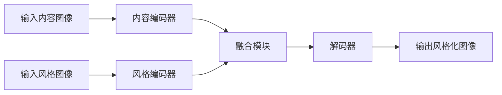

# 基于生成对抗网络的影视特效风格迁移自动化系统

## 1.背景介绍

### 1.1 影视特效的重要性

在当今的娱乐行业中,影视特效扮演着越来越重要的角色。无论是大制作的科幻电影,还是小成本的独立电影,特效都是不可或缺的一部分。高质量的特效不仅能够增强观众的沉浸感,还能够帮助导演实现他们最疯狂的创意。

### 1.2 传统特效制作流程的挑战

然而,传统的特效制作流程往往耗时耗力,需要大量的人力和计算资源。每一个特效镜头都需要由专业的特效艺术家手工制作,这个过程不仅费时费力,而且成本高昂。此外,不同的特效风格需要不同的技术和工作流程,这使得风格迁移变得更加困难。

### 1.3 生成对抗网络的机遇

近年来,生成对抗网络(Generative Adversarial Networks, GANs)在计算机视觉领域取得了巨大的进展。GANs能够自动学习数据的分布,并生成逼真的图像和视频。这为影视特效的自动化带来了全新的机遇。

## 2.核心概念与联系

### 2.1 生成对抗网络(GANs)

生成对抗网络是一种由两个神经网络组成的框架,包括一个生成器(Generator)和一个判别器(Discriminator)。生成器的目标是生成逼真的数据样本,而判别器的目标是区分生成的样本和真实的样本。通过这种对抗性的训练过程,生成器和判别器相互竞争,最终达到一种动态平衡,使生成器能够生成逼真的数据。

### 2.2 风格迁移

风格迁移是指将一种艺术风格应用到另一种内容上的过程。在影视特效领域,风格迁移可以用于将特定的视觉效果应用到视频或图像上,例如将油画风格应用到实景镜头上,或者将卡通风格应用到真人演员上。

### 2.3 端到端自动化系统

传统的特效制作流程通常是分步骤的,需要人工干预和调整。而基于GANs的影视特效风格迁移自动化系统旨在实现端到端的自动化,从输入原始视频到输出风格化视频,整个过程都由神经网络自动完成,无需人工干预。

## 3.核心算法原理具体操作步骤

基于生成对抗网络的影视特效风格迁移自动化系统的核心算法原理可以概括为以下几个步骤:

### 3.1 数据准备

首先需要准备两个数据集:内容数据集和风格数据集。内容数据集包含需要进行风格迁移的原始视频或图像,而风格数据集包含具有目标风格的图像或视频。

### 3.2 网络架构

该系统通常采用编码器-解码器的网络架构。编码器将输入的内容和风格图像编码为特征向量,解码器则根据这些特征向量生成风格化的输出图像或视频帧。



### 3.3 损失函数设计

为了使生成的图像或视频帧能够保留原始内容的结构信息,同时融合目标风格的视觉特征,损失函数通常包含以下几个部分:

1. 内容损失:衡量生成图像与原始内容图像的特征差异,以保留内容结构。
2. 风格损失:衡量生成图像与风格参考图像的风格差异,以迁移目标风格。
3. 总变分损失:regularization项,用于产生更加平滑和逼真的图像。

总损失函数是上述三个部分的加权和,通过优化该损失函数,网络可以学习到合适的参数,生成理想的风格化输出。

### 3.4 对抗性训练

为了进一步提高生成图像的质量和逼真度,该系统通常采用对抗性训练策略。引入一个判别器网络,与生成器网络进行对抗训练。判别器的目标是区分生成的风格化图像和真实的风格参考图像,而生成器的目标是欺骗判别器,生成更加逼真的风格化图像。

通过这种对抗性的训练过程,生成器和判别器相互竞争,相互促进,最终使生成器能够生成高质量、难以区分的风格化图像或视频帧。

### 3.5 端到端训练

该系统的一个关键优势是能够实现端到端的训练。输入原始视频或图像序列,输出风格化的视频或图像序列,整个过程都由神经网络自动完成,无需人工干预。这不仅大大提高了效率,而且保证了风格迁移的一致性和连贯性。

## 4.数学模型和公式详细讲解举例说明

### 4.1 内容损失

内容损失的目标是使生成图像保留原始内容图像的结构和语义信息。通常采用预训练的神经网络(如VGG)来提取图像的特征表示,然后计算生成图像特征与原始内容图像特征之间的均方差,作为内容损失:

$$L_{content}(G) = \frac{1}{N}\sum_{i=1}^N\left\|f^l(G(x_c)) - f^l(x_c)\right\|_2^2$$

其中,$G$是生成网络,$x_c$是内容图像,$f^l$是预训练网络的第$l$层特征提取函数,用于提取图像的特征表示。$N$是特征向量的维度。

通过最小化内容损失,生成网络可以学习到如何保留原始内容图像的结构和语义信息。

### 4.2 风格损失

风格损失的目标是使生成图像具有目标风格图像的视觉特征。这里采用了格拉姆矩阵(Gram Matrix)来表示风格特征,格拉姆矩阵能够捕捉特征之间的相关性,从而描述图像的风格。

风格损失定义为生成图像的格拉姆矩阵与风格参考图像的格拉姆矩阵之间的均方差:

$$L_{style}(G) = \sum_{l=1}^L\frac{1}{N_l^2}\left\|G(x_s)^l - F(x_s)^l\right\|_F^2$$

其中,$G(x_s)^l$和$F(x_s)^l$分别表示生成图像和风格参考图像在第$l$层的格拉姆矩阵,$N_l$是第$l$层特征向量的维度,$L$是考虑的层数。

通过最小化风格损失,生成网络可以学习到如何融合目标风格图像的视觉特征。

### 4.3 总变分损失

为了产生更加平滑和逼真的图像,通常会引入总变分正则项(Total Variation Regularization)作为损失函数的一部分。总变分损失鼓励相邻像素之间的梯度平滑,从而减少噪声和伪影。

总变分损失定义为:

$$L_{tv}(G) = \sum_{i,j}\left(\left(G(x)_{i,j} - G(x)_{i+1,j}\right)^2 + \left(G(x)_{i,j} - G(x)_{i,j+1}\right)^2\right)^{\frac{1}{2}}$$

其中,$G(x)$是生成图像,$i$和$j$分别表示像素的行和列索引。

通过最小化总变分损失,生成网络可以学习到产生更加平滑和自然的图像。

### 4.4 对抗性损失

对抗性损失是基于生成对抗网络的核心思想,它鼓励生成器生成难以被判别器区分的逼真图像。

对抗性损失可以采用各种形式,例如最小二乘损失(Least Squares Loss)或者Wasserstein损失等。以最小二乘损失为例,对抗性损失定义为:

$$L_{adv}(G, D) = \mathbb{E}_{x\sim p_{data}(x)}\left[(D(x) - 1)^2\right] + \mathbb{E}_{z\sim p_z(z)}\left[D(G(z))^2\right]$$

其中,$D$是判别器网络,$G$是生成器网络,$x$是真实数据样本,$z$是噪声向量。

通过最小化对抗性损失,生成器可以学习到生成难以被判别器区分的逼真图像,从而提高生成图像的质量和真实感。

### 4.5 总损失函数

综合上述各个部分,该系统的总损失函数可以表示为:

$$L_{total}(G, D) = \lambda_1L_{content}(G) + \lambda_2L_{style}(G) + \lambda_3L_{tv}(G) + \lambda_4L_{adv}(G, D)$$

其中,$\lambda_1$,$\lambda_2$,$\lambda_3$,$\lambda_4$是各个损失项的权重系数,用于平衡不同目标之间的重要性。

通过交替优化生成器$G$和判别器$D$,最小化总损失函数,该系统可以学习到生成高质量、保留原始内容结构、融合目标风格特征的风格化图像或视频帧。

## 5.项目实践:代码实例和详细解释说明

为了更好地理解基于生成对抗网络的影视特效风格迁移自动化系统,我们将提供一个简单的代码实例,并对其进行详细解释说明。

### 5.1 环境配置

首先,我们需要配置Python环境,并安装必要的库:

```python
import torch
import torch.nn as nn
import torchvision
import torchvision.transforms as transforms
from PIL import Image
import matplotlib.pyplot as plt
```

### 5.2 数据准备

接下来,我们准备内容图像和风格参考图像。为了简单起见,我们将使用一张风景图像作为内容图像,一张梵高的著名画作"星夜"作为风格参考图像。

```python
# 加载内容图像
content_img = Image.open("content.jpg").convert("RGB")

# 加载风格参考图像
style_img = Image.open("style.jpg").convert("RGB")
```

### 5.3 预处理

我们需要对图像进行预处理,包括调整大小、标准化等操作:

```python
# 定义预处理变换
transform = transforms.Compose([
    transforms.Resize((256, 256)),
    transforms.ToTensor(),
    transforms.Normalize(mean=[0.485, 0.456, 0.406], std=[0.229, 0.224, 0.225])
])

# 预处理内容图像和风格参考图像
content_tensor = transform(content_img).unsqueeze(0)
style_tensor = transform(style_img).unsqueeze(0)
```

### 5.4 网络架构

我们将使用一个简化版本的编码器-解码器网络架构。编码器部分使用预训练的VGG-19网络提取特征,解码器部分使用转置卷积层进行上采样和重构。

```python
class StyleTransferNet(nn.Module):
    def __init__(self):
        super(StyleTransferNet, self).__init__()
        
        # 编码器部分
        self.encoder = nn.Sequential(
            nn.Conv2d(3, 64, kernel_size=3, stride=1, padding=1),
            nn.ReLU(inplace=True),
            nn.MaxPool2d(kernel_size=2, stride=2),
            
            nn.Conv2d(64, 128, kernel_size=3, stride=1, padding=1),
            nn.ReLU(inplace=True),
            nn.MaxPool2d(kernel_size=2, stride=2),
            
            nn.Conv2d(128, 256, kernel_size=3, stride=1, padding=1),
            nn.ReLU(inplace=True),
            nn.MaxPool2d(kernel_size=2, stride=2)
        )
        
        # 解码器部分
        self.decoder = nn.Sequential(
            nn.ConvTranspose2d(256, 128, kernel_size=3, stride=2, padding=1, output_padding=1),
            nn.ReLU(inplace=True),
            
            nn.ConvTranspose2d(128, 64, kernel_size=3, stride=2, padding=1, output_padding=1),
            nn.ReLU(inplace=True),
            
            nn.ConvTranspose2d(64, 3, kernel_size=3, stride=2, padding=1, output_padding=1),
            nn.Tanh()
        )
        
    def forward(self, x):
        encoded = self.encoder(x)
        decoded = self.decoder(encoded)
        return decoded
```

### 5.5 损失函数

我们将实现内容损失、风格损失和总变分