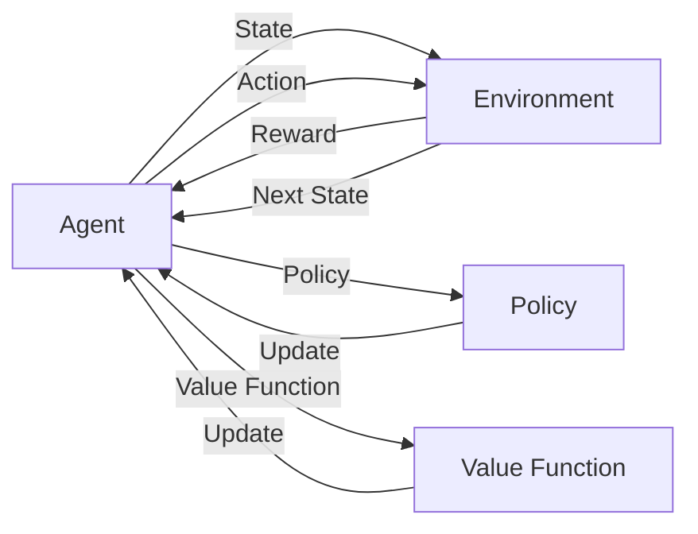

# 增强学习 原理与代码实例讲解

## 1. 背景介绍

### 1.1 什么是增强学习？

增强学习（Reinforcement Learning，RL）是机器学习的一个重要分支，它主要关注如何基于环境而行动，以取得最大化的预期利益。不同于监督式学习（Supervised Learning）需要明确指定输入和输出，增强学习是一种让机器通过不断尝试和错误，从而学习做出正确行为决策的学习方法。

### 1.2 增强学习的发展历程

增强学习的概念最早由心理学家 Edward Thorndike 在 1911 年提出。之后在 20 世纪 50 年代，Richard Bellman 提出了动态规划的概念，为增强学习的发展奠定了重要基础。20 世纪 80 年代，增强学习开始引入神经网络，出现了著名的 TD-Gammon 等成果。近年来随着深度学习的发展，深度增强学习（Deep Reinforcement Learning，DRL）取得了长足进展，在 Atari 游戏、围棋等领域展现了超越人类的表现。

### 1.3 增强学习的应用场景

增强学习在很多领域都有广泛应用，例如：

- 游戏：增强学习可以让 AI 通过自我对弈来学习游戏策略，如 AlphaGo。
- 机器人控制：增强学习可以让机器人学习如何在环境中执行任务，如步行、抓取等。
- 推荐系统：增强学习可以学习用户的偏好，提供个性化推荐。
- 自动驾驶：增强学习可以让无人车学习在复杂环境中的驾驶策略。
- 智能电网：增强学习可以优化电力调度，提高能源利用效率。

## 2. 核心概念与联系

### 2.1 智能体（Agent）与环境（Environment）

在增强学习中，学习的主体被称为智能体（Agent），它通过与环境（Environment）的交互来学习最优策略。具体来说，智能体在每个时间步（time step）都会观察环境的状态（State），根据当前策略（Policy）采取一个动作（Action），环境接收到动作后会返回一个奖励（Reward）和下一个状态，然后智能体根据这个结果来更新自己的策略，不断探索和改进，最终学习到最优策略。

### 2.2 状态（State）、动作（Action）和奖励（Reward）

- 状态（State）：表示智能体在某个时间点观察到的环境信息，是智能体进行决策的依据。
- 动作（Action）：智能体根据策略对环境做出的反馈，会影响环境的状态。
- 奖励（Reward）：环境对智能体动作的即时反馈，通常是一个标量值。智能体的目标就是最大化累积奖励。

### 2.3 策略（Policy）、价值函数（Value Function）

- 策略（Policy）：智能体的行为准则，根据当前状态选择动作的概率映射。分为确定性策略和随机性策略。
- 价值函数（Value Function）：表示状态或者状态-动作对的长期价值，通常用累积奖励的期望来定义。包括状态价值函数 V(s) 和动作价值函数 Q(s,a)。

它们之间的关系可以用下面的 Mermaid 流程图来表示：



## 3. 核心算法原理具体操作步骤

增强学习有很多经典算法，这里我们重点介绍 Q-learning 和 Policy Gradient 两大类算法。

### 3.1 Q-learning

Q-learning 是一种值迭代（Value Iteration）算法，通过更新动作价值函数 Q(s,a) 来寻找最优策略。

#### 3.1.1 Q 表格

Q-learning 使用一个 Q 表格来存储每个状态-动作对的价值估计。Q 表格的每一项 Q(s,a) 表示在状态 s 下采取动作 a 的长期价值。

#### 3.1.2 Q 值更新

Q-learning 的核心是通过不断更新 Q 表格来逼近最优 Q 函数。具体的更新公式为：

$$Q(s_t,a_t) \leftarrow Q(s_t,a_t) + \alpha [r_t + \gamma \max_a Q(s_{t+1},a) - Q(s_t,a_t)]$$

其中，$s_t$ 和 $a_t$ 分别表示 t 时刻的状态和动作，$r_t$ 是即时奖励，$\alpha$ 是学习率，$\gamma$ 是折扣因子。

#### 3.1.3 探索与利用

在选择动作时，Q-learning 面临探索（Exploration）与利用（Exploitation）的权衡。一般采用 $\epsilon$-greedy 策略，以 $\epsilon$ 的概率随机选择动作，以 $1-\epsilon$ 的概率选择 Q 值最大的动作。

### 3.2 Policy Gradient

Policy Gradient 是一类直接优化策略函数 $\pi_\theta(a|s)$ 的算法，通过梯度上升来最大化目标函数 $J(\theta)$。

#### 3.2.1 策略参数化

Policy Gradient 将策略函数参数化，常用的是用神经网络来表示策略，即 $\pi_\theta(a|s) = P(a|s;\theta)$。

#### 3.2.2 目标函数

Policy Gradient 的目标函数定义为智能体在策略 $\pi_\theta$ 下的期望累积奖励：

$$J(\theta) = \mathbb{E}_{\tau \sim \pi_\theta} [R(\tau)]$$

其中，$\tau$ 表示一条轨迹 $\{s_0,a_0,r_0,s_1,a_1,r_1,...\}$，$R(\tau)$ 表示轨迹的累积奖励。

#### 3.2.3 策略梯度定理

根据策略梯度定理（Policy Gradient Theorem），目标函数 $J(\theta)$ 的梯度为：

$$\nabla_\theta J(\theta) = \mathbb{E}_{\tau \sim \pi_\theta} [\sum_{t=0}^T \nabla_\theta \log \pi_\theta(a_t|s_t) R_t]$$

其中，$R_t = \sum_{t'=t}^T \gamma^{t'-t} r_{t'}$ 表示从 t 时刻开始的折扣累积奖励。

#### 3.2.4 算法流程

Policy Gradient 的一般流程如下：

1. 随机初始化策略网络参数 $\theta$
2. 重复：
   - 用当前策略与环境交互，收集一批轨迹数据
   - 计算每个时间步的累积奖励 $R_t$
   - 计算梯度 $\nabla_\theta J(\theta)$，更新策略网络参数：$\theta \leftarrow \theta + \alpha \nabla_\theta J(\theta)$

## 4. 数学模型和公式详细讲解举例说明

这里我们详细解释一下 Q-learning 中的 Q 值更新公式：

$$Q(s_t,a_t) \leftarrow Q(s_t,a_t) + \alpha [r_t + \gamma \max_a Q(s_{t+1},a) - Q(s_t,a_t)]$$

这个公式可以分解为两部分理解：

- $r_t + \gamma \max_a Q(s_{t+1},a)$：表示在状态 $s_t$ 采取动作 $a_t$ 后，环境返回的即时奖励 $r_t$ 加上下一状态 $s_{t+1}$ 的最大 Q 值（代表未来的最大累积奖励）的折扣值 $\gamma \max_a Q(s_{t+1},a)$。这一项代表了 $Q(s_t,a_t)$ 的真实值的估计。

- $Q(s_t,a_t)$：表示当前对 $Q(s_t,a_t)$ 的估计值。

整个公式的意义是，将当前的估计值 $Q(s_t,a_t)$ 向真实值估计 $r_t + \gamma \max_a Q(s_{t+1},a)$ 进行更新，更新的步长由学习率 $\alpha$ 控制。这个过程不断迭代，最终 $Q(s_t,a_t)$ 会收敛到真实值。

举个简单例子，假设一个智能体在迷宫中寻找宝藏，迷宫有 3 个状态 A、B、C，2 个动作 LEFT、RIGHT，奖励函数为：
- 在状态 A 选择 RIGHT 得到奖励 10，其他为 0
- 在状态 B 选择 LEFT 得到奖励 5，其他为 0
- 在状态 C 无论选什么动作都回到状态 A

假设折扣因子 $\gamma=0.9$，学习率 $\alpha=0.1$，Q 表格初始化为 0。

当智能体第一次访问状态 A，选择动作 RIGHT 时，Q 值更新过程如下：

$$Q(A,RIGHT) \leftarrow Q(A,RIGHT) + 0.1 [10 + 0.9 \max_a Q(B,a) - Q(A,RIGHT)]$$

$$Q(A,RIGHT) \leftarrow 0 + 0.1 [10 + 0 - 0] = 1$$

此时 Q 表格变为：
```
    LEFT RIGHT
A |  0    1  
B |  0    0
C |  0    0
```

随着智能体不断探索和更新，最终 Q 表格会收敛到最优值：
```
    LEFT RIGHT
A |  0    10  
B |  5     0
C |  0     0
```

此时，智能体学会了最优策略：在状态 A 选择 RIGHT，在状态 B 选择 LEFT。

## 5. 项目实践：代码实例和详细解释说明

下面我们用 Python 实现一个简单的 Q-learning 算法，以悬崖寻路（Cliff Walking）问题为例。

### 5.1 问题描述

在一个 4x12 的网格世界中，智能体的目标是从起点 S 走到终点 G，同时尽量避开中间的悬崖（Cliff）区域。每走一步奖励为 -1，掉入悬崖奖励为 -100，到达终点奖励为 0。

```
S C C C C C C C C C C C
C C C C C C C C C C C C
C C C C C C C C C C C C
C C C C C C C C C C C G
```

### 5.2 代码实现

```python
import numpy as np

# 定义环境
class CliffWalkingEnv:
    def __init__(self, ncol, nrow):
        self.nrow = nrow
        self.ncol = ncol
        self.x = 0  # 记录当前智能体位置的横坐标
        self.y = self.nrow - 1  # 记录当前智能体位置的纵坐标

    def step(self, action):  # 外部调用这个函数来让智能体行动
        change = [[0, -1], [0, 1], [-1, 0], [1, 0]]  # 4 种动作, 0:上, 1:下, 2:左, 3:右。原点(0,0)定义在左上角
        self.x = min(self.ncol - 1, max(0, self.x + change[action][0]))
        self.y = min(self.nrow - 1, max(0, self.y + change[action][1]))
        next_state = self.y * self.ncol + self.x
        reward = -1
        done = False
        if self.y == self.nrow - 1 and self.x > 0:  # 下一个位置在悬崖或者目标
            done = True
            if self.x != self.ncol - 1:
                reward = -100
        return next_state, reward, done

    def reset(self):  # 回归初始状态,坐标(0,nrow-1)
        self.x = 0
        self.y = self.nrow - 1
        return self.y * self.ncol + self.x
      
# Q-learning 算法实现
class QLearning:
    def __init__(self, ncol, nrow, epsilon, alpha, gamma, n_action=4):
        self.Q_table = np.zeros([nrow * ncol, n_action])  # 初始化 Q 表格
        self.n_action = n_action
        self.alpha = alpha
        self.gamma = gamma
        self.epsilon = epsilon

    def take_action(self, state):  # 选取下一步动作
        if np.random.random() < self.epsilon:
            action = np.random.randint(self.n_action)
        else:
            action = np.argmax(self.Q_table[state])
        return action

    def best_action(self, state):  # 用于打印策略
        Q_max = np.max(self.Q_table[state])
        a = [0 for _ in range(self.n_action)]
        for i in range(self.n_action):
            if self.Q_table[