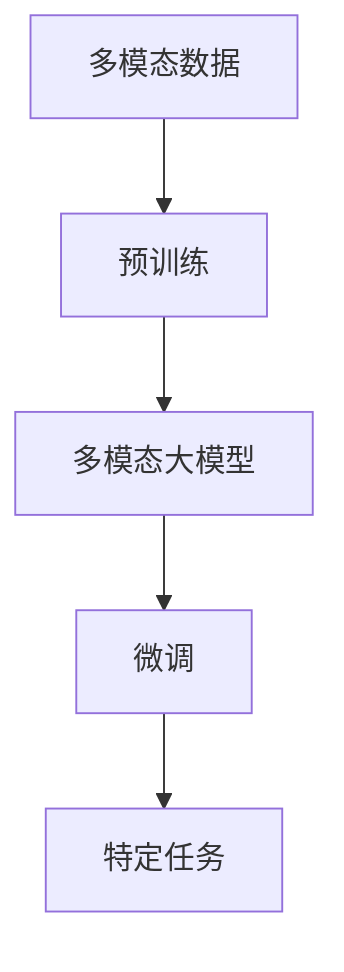

# 多模态大模型：技术原理与实战 BERT模型诞生之后行业持续摸索

## 1.背景介绍

### 1.1 人工智能发展简史

人工智能的发展经历了几个重要阶段。早期的人工智能系统主要基于规则和逻辑推理,但存在局限性。20世纪90年代,机器学习算法开始兴起,尤其是神经网络在语音识别、图像识别等领域取得了突破性进展。

### 1.2 深度学习时代

2012年,深度学习在ImageNet大赛上取得巨大成功,掀起了人工智能的新浪潮。随后,深度学习在自然语言处理、语音识别、计算机视觉等多个领域不断取得新的突破。

### 1.3 BERT模型的重大突破

2018年,谷歌发布了BERT(Bidirectional Encoder Representations from Transformers)模型,这是自然语言处理领域的一个重大突破。BERT是第一个广泛使用的基于Transformer的预训练语言模型,能够有效地捕捉文本中的上下文信息,大幅提升了自然语言处理任务的性能。

### 1.4 多模态大模型的兴起

尽管BERT等单模态模型取得了巨大成功,但它们仍然局限于单一模态(如文本)。现实世界中,信息通常以多种形式(文本、图像、视频等)存在。因此,多模态大模型应运而生,旨在融合不同模态的信息,实现更强大的认知能力。

## 2.核心概念与联系

### 2.1 模态(Modality)

模态指信息的表现形式,如文本、图像、视频、音频等。不同模态之间存在着内在联系,如图像中的文字信息、视频中的音频信息等。

### 2.2 单模态模型

单模态模型专注于处理单一类型的信息,如BERT处理文本、ResNet处理图像等。这些模型在各自领域取得了卓越的成绩,但无法捕捉跨模态的信息。

### 2.3 多模态模型

多模态模型旨在融合不同模态的信息,实现更全面的理解和推理能力。它们通过学习不同模态之间的关联,捕捉跨模态的语义信息。

### 2.4 预训练与微调

预训练是多模态模型的关键步骤。模型首先在大规模多模态数据上进行预训练,学习不同模态之间的关联。然后,可以在特定任务上进行微调,获得更好的性能。



## 3.核心算法原理具体操作步骤

### 3.1 Transformer架构

Transformer是多模态大模型的核心架构,它基于自注意力机制,能够有效地捕捉长距离依赖关系。Transformer架构包括编码器(Encoder)和解码器(Decoder)两个部分。


### 3.2 模态融合策略

多模态大模型需要有效地融合不同模态的信息。常见的融合策略包括:

1. **早期融合**: 在输入层将不同模态的特征拼接,然后输入到模型中进行端到端的训练。
2. **晚期融合**: 对每个模态单独编码,然后在高层将不同模态的表示进行融合。
3. **交互融合**: 在编码过程中,不同模态之间的特征进行交互和融合。

### 3.3 自注意力机制

自注意力机制是Transformer的核心,它能够捕捉输入序列中任意两个位置之间的关系。对于多模态输入,自注意力机制可以学习不同模态之间的相互关系。

$$\mathrm{Attention}(Q, K, V) = \mathrm{softmax}(\frac{QK^T}{\sqrt{d_k}})V$$

其中,$$Q$$、$$K$$、$$V$$分别表示查询(Query)、键(Key)和值(Value)。

### 3.4 预训练任务

多模态大模型通常采用自监督的方式进行预训练,常见的预训练任务包括:

1. **遮蔽语言模型(Masked Language Modeling)**: 随机遮蔽部分文本tokens,模型需要预测被遮蔽的tokens。
2. **图像文本对应(Image-Text Matching)**: 判断给定的图像和文本描述是否匹配。
3. **视觉问答(Visual Question Answering)**: 根据图像和问题,预测正确的答案。

### 3.5 微调和迁移学习

在特定任务上,可以通过微调的方式,将预训练的多模态大模型迁移到目标任务。微调过程中,模型参数会根据目标任务的数据进行调整和优化。

## 4.数学模型和公式详细讲解举例说明

### 4.1 自注意力机制

自注意力机制是Transformer的核心,它能够捕捉输入序列中任意两个位置之间的关系。对于多模态输入,自注意力机制可以学习不同模态之间的相互关系。

自注意力机制的计算过程如下:

1. 将输入序列$$X$$分别映射到查询(Query)、键(Key)和值(Value)空间:

$$Q = XW^Q, K = XW^K, V = XW^V$$

其中,$$W^Q$$、$$W^K$$、$$W^V$$是可学习的权重矩阵。

2. 计算查询和键之间的点积,并进行缩放和软化处理,得到注意力权重:

$$\mathrm{Attention}(Q, K, V) = \mathrm{softmax}(\frac{QK^T}{\sqrt{d_k}})V$$

其中,$$d_k$$是键的维度,用于防止内积过大导致梯度饱和。

3. 将注意力权重与值(Value)相乘,得到加权和作为输出:

$$\mathrm{Output} = \mathrm{Attention}(Q, K, V)$$

自注意力机制可以捕捉不同位置之间的依赖关系,并且计算复杂度为$$O(n^2d)$$,其中$$n$$是序列长度,$$d$$是特征维度。

### 4.2 视觉问答任务

视觉问答(Visual Question Answering, VQA)是一个典型的多模态任务,需要根据图像和问题预测正确的答案。

假设我们有一个图像$$I$$和一个问题$$Q$$,我们希望预测正确的答案$$A$$。我们可以使用一个多模态模型$$f$$来建模这个任务:

$$\hat{A} = f(I, Q)$$

其中,$$f$$是一个端到端的神经网络模型,它需要学习图像和问题之间的关系,并预测正确的答案。

一种常见的模型架构是先分别编码图像和问题,得到它们的特征表示$$v_I$$和$$v_Q$$,然后将两个特征进行融合,最后通过一个分类器预测答案:

$$v = g(v_I, v_Q)$$
$$\hat{A} = \mathrm{softmax}(Wv + b)$$

其中,$$g$$是一个融合函数,可以是简单的拼接或更复杂的交互操作。$$W$$和$$b$$是分类器的权重和偏置。

在训练过程中,我们可以最小化模型预测答案与真实答案之间的交叉熵损失:

$$\mathcal{L} = -\sum_i y_i \log \hat{y}_i$$

其中,$$y_i$$是真实答案的one-hot编码,$$\hat{y}_i$$是模型预测的答案概率。

通过端到端的训练,模型可以学习图像和问题之间的关系,从而提高视觉问答任务的性能。

## 5.项目实践:代码实例和详细解释说明

以下是一个基于PyTorch实现的简单视觉问答模型示例:

```python
import torch
import torch.nn as nn

# 图像编码器
class ImageEncoder(nn.Module):
    def __init__(self, input_dim, output_dim):
        super(ImageEncoder, self).__init__()
        self.model = nn.Sequential(
            nn.Linear(input_dim, 512),
            nn.ReLU(),
            nn.Linear(512, output_dim)
        )

    def forward(self, x):
        return self.model(x)

# 问题编码器
class QuestionEncoder(nn.Module):
    def __init__(self, vocab_size, embed_dim, hidden_dim, output_dim):
        super(QuestionEncoder, self).__init__()
        self.embedding = nn.Embedding(vocab_size, embed_dim)
        self.rnn = nn.LSTM(embed_dim, hidden_dim, batch_first=True)
        self.fc = nn.Linear(hidden_dim, output_dim)

    def forward(self, x):
        x = self.embedding(x)
        _, (h, _) = self.rnn(x)
        return self.fc(h.squeeze(0))

# 多模态融合
class MultimodalFusion(nn.Module):
    def __init__(self, image_dim, question_dim, output_dim):
        super(MultimodalFusion, self).__init__()
        self.image_encoder = ImageEncoder(image_dim, output_dim)
        self.question_encoder = QuestionEncoder(vocab_size, embed_dim, hidden_dim, output_dim)
        self.fusion = nn.Linear(output_dim * 2, output_dim)

    def forward(self, image, question):
        image_feat = self.image_encoder(image)
        question_feat = self.question_encoder(question)
        fused_feat = torch.cat((image_feat, question_feat), dim=1)
        fused_feat = self.fusion(fused_feat)
        return fused_feat

# 答案分类器
class AnswerClassifier(nn.Module):
    def __init__(self, input_dim, num_answers):
        super(AnswerClassifier, self).__init__()
        self.fc = nn.Linear(input_dim, num_answers)

    def forward(self, x):
        return self.fc(x)

# 组合模型
class VQAModel(nn.Module):
    def __init__(self, image_dim, question_dim, num_answers):
        super(VQAModel, self).__init__()
        self.fusion = MultimodalFusion(image_dim, question_dim, 512)
        self.classifier = AnswerClassifier(512, num_answers)

    def forward(self, image, question):
        fused_feat = self.fusion(image, question)
        output = self.classifier(fused_feat)
        return output
```

在这个示例中,我们定义了以下几个模块:

1. `ImageEncoder`: 用于编码图像特征。
2. `QuestionEncoder`: 用于编码问题特征,使用了嵌入层和LSTM。
3. `MultimodalFusion`: 将图像特征和问题特征进行融合。
4. `AnswerClassifier`: 将融合后的特征映射到答案空间。
5. `VQAModel`: 将上述模块组合在一起,构成完整的视觉问答模型。

在训练过程中,我们可以将图像和问题输入到模型中,计算预测答案与真实答案之间的损失,并使用反向传播算法优化模型参数。

这只是一个简单的示例,实际应用中的多模态模型通常会更加复杂和强大。但是,它展示了多模态模型的基本结构和工作原理。

## 6.实际应用场景

多模态大模型在各个领域都有广泛的应用前景,包括但不限于:

### 6.1 视觉问答(Visual Question Answering)

视觉问答是多模态大模型的典型应用场景之一。它需要根据给定的图像和问题,预测正确的答案。这在智能助手、教育、医疗等领域都有重要应用。

### 6.2 图像描述(Image Captioning)

图像描述是另一个重要的应用场景,需要根据给定的图像生成相应的文本描述。这在视觉辅助、内容创作等领域有广泛应用。

### 6.3 多模态检索(Multimodal Retrieval)

多模态检索旨在根据一种模态的输入(如文本或图像)检索另一种模态的相关内容。这在信息检索、推荐系统等领域有重要应用。

### 6.4 多模态对话系统(Multimodal Dialogue Systems)

多模态对话系统能够融合不同模态的信息,实现更自然、更智能的人机交互。这在智能助手、客服等领域有广阔的应用前景。

### 6.5 多媒体内容理解(Multimedia Content Understanding)

多媒体内容通常包含文本、图像、视频等多种模态的信息。多模态大模型可以更好地理解和处理这些复杂的多媒体内容,在内容分析、内容生成等领域有重要应用。

### 6.6 医疗影像辅助诊断(Medical Image Assisted Diagnosis)

在医疗领域,多模态大模型可以融合医疗影像、病历、检查报告等信息,为医生提供