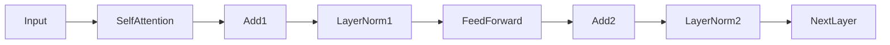
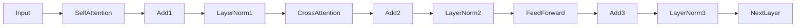
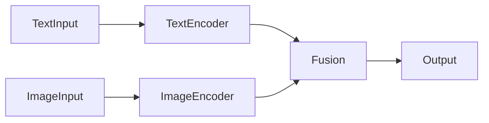
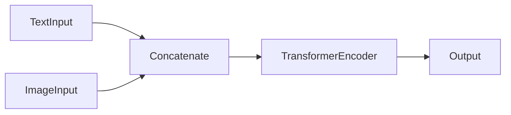
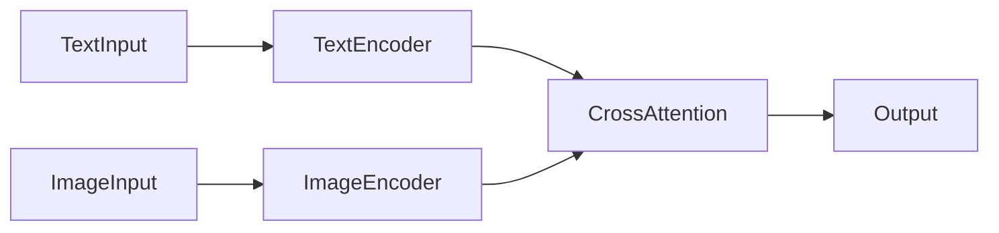

# 多模态大模型：技术原理与实战 OpenAI成功的因素

## 1. 背景介绍

### 1.1 人工智能的发展历程

人工智能(Artificial Intelligence, AI)是当代科技领域最具革命性和颠覆性的技术之一。自20世纪50年代诞生以来,AI不断发展演进,经历了多个阶段和浪潮。

#### 1.1.1 早期阶段

早期的AI系统主要采用符号主义(Symbolism)方法,通过构建知识库和规则库,模拟人类的推理过程。这种方法在特定领域取得了一些成功,但也暴露出了许多局限性。

#### 1.1.2 统计学习时代

20世纪90年代,机器学习(Machine Learning)技术的兴起,使AI进入了一个新的发展阶段。通过从大量数据中自动学习模式和规律,机器学习算法在语音识别、图像处理等领域取得了突破性进展。

#### 1.1.3 深度学习革命

2012年,深度学习(Deep Learning)技术在ImageNet大赛中取得了巨大成功,开启了AI的新纪元。深度神经网络能够自主学习数据的层次特征表示,在计算机视觉、自然语言处理等领域展现出超人类的能力。

### 1.2 大模型的兴起

随着算力和数据的不断增长,训练大规模深度神经网络成为可能。这种拥有数十亿甚至上万亿参数的巨型模型,被称为"大模型"(Large Model)。大模型能够捕捉更丰富的数据模式,在各种任务上表现出惊人的性能。

#### 1.2.1 自然语言处理领域

2018年,谷歌发布了Transformer模型,在机器翻译等任务上取得了突破性进展。2020年,OpenAI推出GPT-3大模型,展现出强大的自然语言生成能力,引发了全球关注。

#### 1.2.2 计算机视觉领域

2021年,OpenAI发布DALL-E模型,能够根据自然语言描述生成逼真的图像,开创了文本到图像生成的新领域。同年,谷歌推出了Imagen大模型,进一步提升了图像生成质量。

#### 1.2.3 多模态大模型

最新的发展趋势是将不同模态(如文本、图像、视频等)融合到统一的大模型中,形成"多模态大模型"(Multimodal Large Model)。这种模型能够在不同模态之间自由转换,实现跨模态的理解和生成,被视为通用人工智能(Artificial General Intelligence, AGI)的关键一步。

### 1.3 OpenAI的成功之路

OpenAI是人工智能领域最具影响力的机构之一,在推动大模型发展方面做出了卓越贡献。本文将重点探讨OpenAI在多模态大模型领域的技术原理和实战经验,剖析其取得成功的关键因素。

## 2. 核心概念与联系

### 2.1 大模型的核心思想

大模型的核心思想是通过规模化训练,让模型自主学习数据中蕴含的丰富知识和模式,而不是依赖人工设计的规则和特征。这种"从数据中学习"的范式,使模型能够捕捉更加复杂和抽象的表示,从而在各种任务上展现出强大的泛化能力。

#### 2.1.1 参数规模

大模型拥有数十亿甚至上万亿个参数,这为模型提供了足够的容量来学习丰富的知识表示。参数规模的增长是大模型取得突破性进展的关键驱动力。

#### 2.1.2 训练数据规模

除了参数规模,大模型还需要海量的训练数据作为知识来源。通过在互联网上收集的大规模文本、图像、视频等多模态数据进行训练,模型能够学习到更加丰富和通用的知识表示。

#### 2.1.3 自监督学习

大模型通常采用自监督学习(Self-Supervised Learning)的方式进行训练。这种方法不需要人工标注的数据,而是让模型从原始数据中自主挖掘有用的监督信号,极大降低了数据标注的成本和工作量。

### 2.2 多模态大模型的核心挑战

虽然大模型在单一模态任务上取得了卓越成绩,但要实现真正的多模态学习和理解,仍面临着诸多挑战。

#### 2.2.1 模态融合

如何有效地将不同模态的信息融合到统一的表示空间中,是多模态大模型需要解决的核心问题。不同模态之间存在着巨大的异质性,如何建立模态之间的关联和映射关系,是一个极具挑战性的课题。

#### 2.2.2 注意力机制局限性

目前主流的注意力机制(Attention Mechanism)虽然在单一模态任务中表现出色,但在处理多模态信息时仍存在局限性。注意力机制难以很好地捕捉不同模态之间的长程依赖关系,导致模型的表现受到一定限制。

#### 2.2.3 数据不平衡

不同模态的数据往往存在着严重的不平衡问题。例如,互联网上的文本数据远多于图像和视频数据。这种数据不平衡会导致模型在某些模态上的表现优于其他模态,影响模型的整体性能。

#### 2.2.4 计算资源需求

训练大规模的多模态模型需要巨大的计算资源,包括大量的GPU和TPU等专用硬件。如何高效地利用这些资源,优化训练过程,是多模态大模型面临的另一大挑战。

### 2.3 OpenAI的多模态大模型

为解决上述挑战,OpenAI提出了一系列创新的多模态大模型架构和训练方法,取得了令人瞩目的成就。

#### 2.3.1 DALL-E

DALL-E是OpenAI在2021年推出的文本到图像生成模型,能够根据自然语言描述生成逼真的图像。它采用了一种新颖的"解码-编码-解码"架构,将文本和图像编码到同一个潜在空间中,从而实现了跨模态的理解和生成。

#### 2.3.2 GPT-3

GPT-3是OpenAI在2020年发布的大规模自然语言模型,拥有1750亿个参数。它展现出了惊人的文本生成能力,能够根据提示生成高质量的文本内容。GPT-3的成功为后续的多模态大模型奠定了坚实的基础。

#### 2.3.3 Galactica

Galactica是OpenAI最新推出的多模态大模型,旨在实现文本、图像、视频等多种模态之间的无缝转换和理解。它采用了一种新颖的"模态不可知"(Modality-Agnostic)架构,能够在不同模态之间自由转换,实现跨模态的推理和生成。

## 3. 核心算法原理具体操作步骤

### 3.1 Transformer架构

Transformer是大模型的核心架构,它基于自注意力(Self-Attention)机制,能够有效捕捉序列数据中的长程依赖关系。

#### 3.1.1 自注意力机制

自注意力机制通过计算输入序列中每个元素与其他元素的相关性,生成一个注意力分数矩阵。然后,将输入序列的元素根据注意力分数进行加权求和,得到该元素的表示向量。

$$
\begin{aligned}
\text{Attention}(Q, K, V) &= \text{softmax}\left(\frac{QK^T}{\sqrt{d_k}}\right)V \\
\text{MultiHead}(Q, K, V) &= \text{Concat}(\text{head}_1, \ldots, \text{head}_h)W^O\\
\text{where}\  \text{head}_i &= \text{Attention}(QW_i^Q, KW_i^K, VW_i^V)
\end{aligned}
$$

其中,$$Q$$、$$K$$、$$V$$分别表示查询(Query)、键(Key)和值(Value)矩阵,$$d_k$$是缩放因子,用于防止点积过大导致梯度饱和。MultiHead表示多头注意力机制,通过并行计算多个注意力头,捕捉不同的关系模式。

#### 3.1.2 Transformer编码器

Transformer编码器由多个相同的编码器层堆叠而成,每个编码器层包含一个多头自注意力子层和一个前馈网络子层。编码器的输入是源序列,经过多层编码器处理后,得到源序列的上下文表示。

#### 3.1.3 Transformer解码器

Transformer解码器的结构与编码器类似,但增加了一个额外的多头交叉注意力子层,用于将解码器的输出与编码器的输出进行关联。此外,解码器还采用了掩码机制,确保在生成序列时,只关注当前位置之前的输出。

### 3.2 多模态融合

多模态大模型的核心挑战是如何有效地将不同模态的信息融合到统一的表示空间中。OpenAI采用了多种创新的融合策略。

#### 3.2.1 双流融合

双流融合(Dual-Stream Fusion)是一种常见的多模态融合方法。它将不同模态的输入分别编码为独立的表示,然后在特定层次将这些表示进行融合。

#### 3.2.2 模态不可知融合

OpenAI提出的"模态不可知"(Modality-Agnostic)融合策略,则采取了一种更加统一的方式。它将不同模态的输入序列拼接在一起,送入单一的Transformer模型进行编码,从而在底层实现了模态融合。

这种方法的优势在于,模型可以自主学习不同模态之间的关联,而不需要人工设计复杂的融合机制。同时,它也具有很好的可扩展性,能够轻松地支持新的模态输入。

#### 3.2.3 交叉注意力融合

另一种常见的融合策略是交叉注意力(Cross-Attention)机制。它在Transformer解码器中引入了一个额外的注意力子层,将解码器的输出与另一模态的编码器输出进行关联。

这种方法能够捕捉不同模态之间的依赖关系,但也存在一定的局限性,因为它仍然将不同模态的编码过程分离开来,无法在底层实现完全的融合。

### 3.3 大规模预训练

大模型的关键是通过大规模预训练,让模型从海量数据中自主学习知识表示。OpenAI采用了多种创新的预训练策略,提高了模型的泛化能力。

#### 3.3.1 自监督预训练

OpenAI的大模型通常采用自监督学习(Self-Supervised Learning)的方式进行预训练。这种方法不需要人工标注的数据,而是让模型从原始数据中自主挖掘有用的监督信号。

常见的自监督预训练任务包括:

- 掩码语言模型(Masked Language Modeling):随机掩码部分输入词,让模型预测被掩码的词。
- 下一句预测(Next Sentence Prediction):判断两个句子是否相邻。
- 图像去噪(Image Denoising):从噪声图像中重建原始图像。

通过这些任务,模型可以学习到数据中蕴含的语义和结构信息,为下游任务奠定良好的基础。

#### 3.3.2 对比学习

对比学习(Contrastive Learning)是另一种常用的自监督预训练策略。它通过最大化相似样本