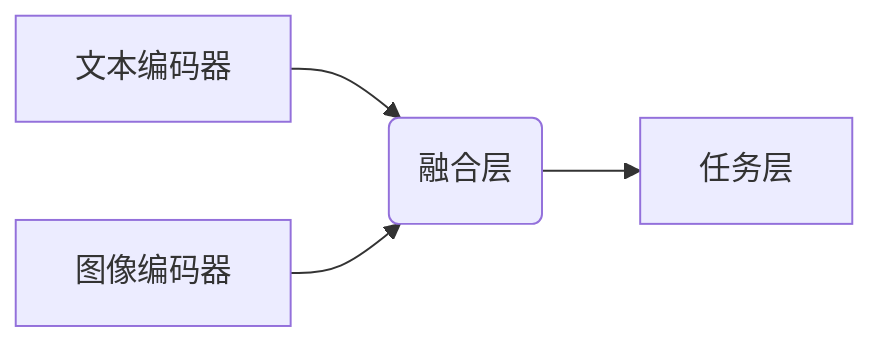
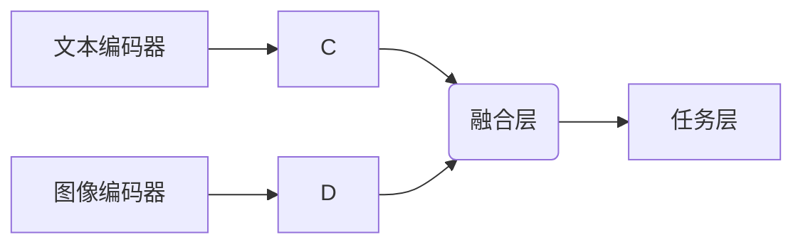
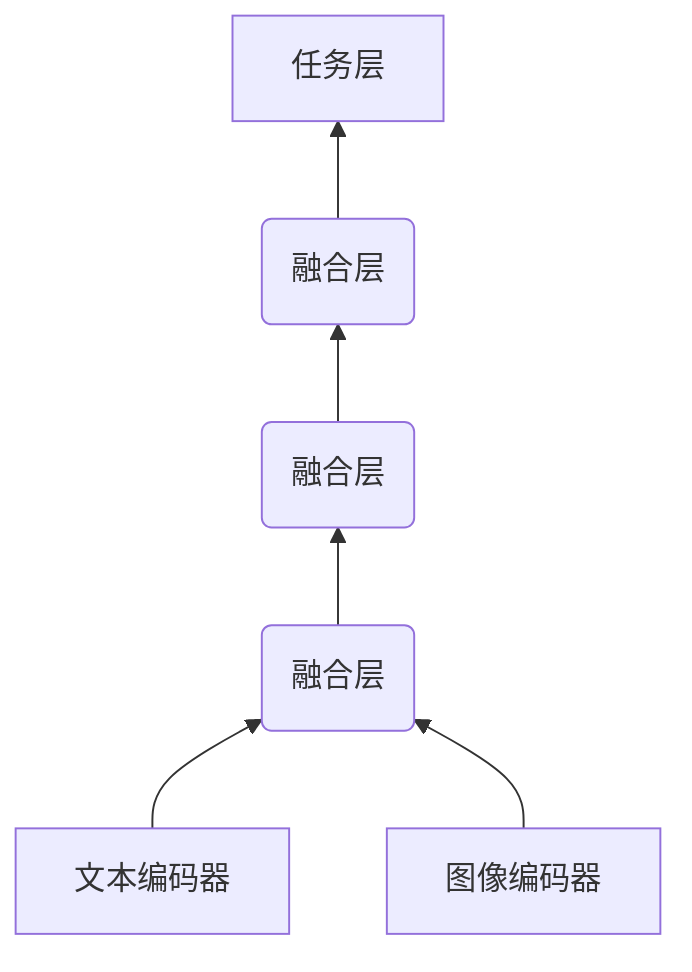

# 多模态大模型：技术原理与实战

## 1.背景介绍

### 1.1 人工智能的发展历程

人工智能(Artificial Intelligence, AI)是当代科技发展的重要领域,旨在使机器能够模仿人类的认知功能,如学习、推理、感知和行为能力。自20世纪50年代诞生以来,AI经历了几个重要发展阶段。

#### 1.1.1 早期阶段

早期的AI系统主要基于符号主义和逻辑推理,如专家系统和规则引擎。这些系统需要人工编写大量规则和知识库,存在知识获取瓶颈和缺乏普遍智能等问题。

#### 1.1.2 统计学习时代

20世纪90年代,机器学习和统计方法在AI领域得到广泛应用,如支持向量机、决策树等算法。这些方法能从大量数据中自动学习模式,但仍然局限于处理结构化数据。

#### 1.1.3 深度学习浪潮

2010年后,深度学习(Deep Learning)技术在计算机视觉、自然语言处理等领域取得突破性进展,推动了AI的飞速发展。深度神经网络能够自动从大量非结构化数据(如图像、文本等)中学习特征表示,显著提高了AI系统的性能。

### 1.2 大模型兴起

#### 1.2.1 大模型的概念

随着算力和数据量的不断增长,训练大规模深度神经网络成为可能。拥有数十亿甚至上万亿参数的大型模型(Large Model)凭借其强大的表示能力,在自然语言处理、计算机视觉等领域取得了卓越成绩。

#### 1.2.2 大模型的优势

大模型具有以下优势:

- 更强的泛化能力,能够更好地捕捉数据中的模式和规律
- 支持多任务学习,在多个任务上表现出色
- 具备一定的自监督能力,能从大量无标注数据中学习知识

#### 1.2.3 大模型面临的挑战

尽管大模型取得了令人瞩目的成就,但仍面临一些挑战:

- 训练成本高昂,需要大量算力和数据资源
- 存在安全隐患,如隐私泄露、有害输出等
- 缺乏解释性,模型内部机理"黑箱"操作
- 可能存在偏差和不公平,需要注意模型公平性

### 1.3 多模态大模型的兴起

#### 1.3.1 多模态数据的重要性

现实世界中的数据通常呈现多种形式,如文本、图像、语音等。传统的单一模态模型(如自然语言处理模型、计算机视觉模型)难以充分利用多模态数据之间的相关性和互补性。

#### 1.3.2 多模态大模型的定义

多模态大模型(Multimodal Large Model)是指能够同时处理多种模态数据(如文本、图像、视频等)的大规模神经网络模型。它们通过统一的表示空间融合不同模态的信息,实现跨模态的学习和推理。

#### 1.3.3 多模态大模型的优势

相比单一模态模型,多模态大模型具有以下优势:

- 能够更好地理解和表示现实世界的多模态数据
- 不同模态之间的信息可以相互补充,提高模型的泛化能力
- 支持多种模态之间的转换和生成任务,如图像描述、文本到图像生成等
- 具备更强的多任务学习能力,在不同领域的任务上表现出色

### 1.4 多模态大模型的应用前景

多模态大模型有望在诸多领域发挥重要作用,如:

- 智能助手:融合语音、图像、文本等多模态信息,提供更自然、智能的人机交互体验
- 内容理解与生成:深入理解和生成多模态内容,如新闻、社交媒体等
- 机器人技术:融合视觉、语音、动作等信息,实现更智能的机器人控制
- 医疗健康:整合医学影像、病历、检验报告等多模态数据,辅助诊断和治疗
- 教育领域:提供个性化的多模态教学资源,优化教学效果

总的来说,多模态大模型有望推动人工智能技术向通用人工智能(Artificial General Intelligence, AGI)的目标迈进。

## 2.核心概念与联系

### 2.1 多模态表示学习

#### 2.1.1 表示学习的概念

表示学习(Representation Learning)是机器学习的核心问题之一,旨在从原始数据中自动学习出有意义的特征表示,以支持后续的任务学习。

#### 2.1.2 多模态表示学习

多模态表示学习是指从多种模态数据(如文本、图像、视频等)中学习出统一的表示空间,使得不同模态的数据可以映射到同一个连续向量空间中,从而捕捉不同模态之间的相关性和互补性。

#### 2.1.3 多模态融合策略

多模态表示学习的关键在于如何有效地融合不同模态的信息。常见的融合策略包括:

- 特征级融合:将不同模态的特征向量拼接或做加权求和
- 中间层融合:在神经网络的中间层将不同模态的特征融合
- 注意力融合:使用注意力机制动态地融合不同模态的信息

### 2.2 多任务学习

#### 2.2.1 多任务学习的概念

多任务学习(Multi-Task Learning)是指在同一个模型中同时学习多个相关任务,不同任务之间的知识可以相互借鉴和迁移,从而提高模型的泛化能力。

#### 2.2.2 多任务学习在多模态大模型中的应用

多模态大模型通常需要同时处理多个不同的任务,如文本生成、图像分类、视频描述等。多任务学习可以使模型在不同任务之间共享知识,提高数据利用效率和泛化能力。

#### 2.2.3 多任务学习的挑战

多任务学习面临以下主要挑战:

- 任务关联性:如何度量和利用不同任务之间的关联性
- 任务权衡:如何平衡不同任务的重要性,避免某些任务被忽视
- 负迁移:防止不相关任务之间的负面知识迁移

### 2.3 自监督学习

#### 2.3.1 自监督学习的概念

自监督学习(Self-Supervised Learning)是一种无需人工标注的学习范式。模型通过预测输入数据的某些属性(如像素值、文字顺序等),自动构建监督信号进行学习。

#### 2.3.2 自监督学习在多模态大模型中的应用

由于获取大量高质量的多模态标注数据成本高昂,自监督学习为多模态大模型提供了一种有效的预训练方式。模型可以从大量无标注的多模态数据中学习通用的表示,为后续的任务学习提供有益的初始化。

#### 2.3.3 自监督预训练策略

常见的自监督预训练策略包括:

- 遮挡自编码:遮挡部分输入,预测被遮挡的部分
- 表示对比:最大化不同视图下相同样本的表示相似性
- 语义预测:预测输入数据的某些语义属性

### 2.4 模态间映射

#### 2.4.1 模态间映射的概念

模态间映射(Cross-Modal Mapping)是指在不同模态之间进行转换或生成的任务,如将文本转换为图像、从图像生成文本描述等。

#### 2.4.2 模态间映射在多模态大模型中的应用

多模态大模型通过统一的表示空间,能够实现不同模态之间的无缝映射和转换,支持诸如图像描述、文本到图像生成等跨模态任务。

#### 2.4.3 模态间映射的挑战

模态间映射面临以下主要挑战:

- 模态差异:不同模态数据的表示形式和语义差异较大
- 一对多映射:同一模态输入可能对应多个另一模态的输出
- 评估困难:跨模态任务的评估标准通常缺乏一致性

## 3.核心算法原理具体操作步骤

### 3.1 多模态融合网络架构

多模态大模型的核心是如何有效地融合不同模态的信息。常见的多模态融合网络架构包括:

#### 3.1.1 早期融合

早期融合架构将不同模态的原始输入(如文本、图像)先分别编码为特征向量,然后在较低层将这些特征向量进行拼接或加权求和,最后输入到任务层进行处理。

#### 3.1.2 晚期融合

晚期融合架构先分别对不同模态进行单独编码,然后在较高层将编码后的特征向量进行融合,最后输入到任务层。这种架构能够更好地捕捉不同模态的独特特征。

#### 3.1.3 层级融合

层级融合架构在不同层次上进行多次融合,能够在底层捕捉低级特征的相关性,在高层融合高级语义信息。这种架构融合了早期和晚期融合的优点。

### 3.2 注意力机制在多模态融合中的应用

#### 3.2.1 注意力机制概述

注意力机制(Attention Mechanism)是深度学习中的一种重要技术,它通过自适应地分配不同位置的权重,使模型能够专注于输入数据的关键部分,从而提高模型的性能和解释性。

#### 3.2.2 多模态注意力融合

在多模态融合中,注意力机制可以用于动态地融合不同模态的信息。具体操作如下:

1. 对每个模态的特征向量进行线性变换,得到查询(Query)、键(Key)和值(Value)向量
2. 计算查询向量与所有键向量的相似性得分(如点积),通过Softmax函数得到注意力权重
3. 将注意力权重与值向量相乘并求和,得到注意力加权的特征表示
4. 将不同模态的注意力加权特征表示进行融合(如拼接、加权求和等)

通过注意力机制,模型可以自适应地分配不同模态的重要性权重,从而实现更精准的多模态融合。

### 3.3 自监督预训练策略

#### 3.3.1 遮挡自编码

遮挡自编码(Masked Autoencoders)是一种常见的自监督预训练策略。具体操作如下:

1. 随机遮挡输入数据的部分区域(如文本中的部分词、图像中的部分像素块)
2. 将遮挡后的数据输入编码器,得到潜在表示
3. 将潜在表示输入解码器,预测被遮挡的部分
4. 最小化预测值与原始值之间的差异作为训练目标

通过遮挡自编码,模型可以学习到输入数据的内在结构和模式,为后续的监督任务学习提供有益的初始化。

#### 3.3.2 表示对比

表示对比(Contrastive Representation Learning)是另一种常用的自监督预训练策略。具体操作如下:

1. 对同一个样本生成不同的视图(如数据增强、不同模态等)
2. 通过编码器得到不同视图的表示向量
3. 最大化同一个样本不同视图的表示向量之间的相似性(正例对)
4. 最小化不同样本视图的表示向量之间的相似性(负例对)

通过表示对比,模型可以学习到不变的数据表示,增强模型的泛化能力。

#### 3.3.3 语义预测

语义预测是一种利用输入数据的语义信息进行自监督学习的策略。具体操作如下:

1. 从输入数据中提取某些语义属性作为监督信号(如文本的主题