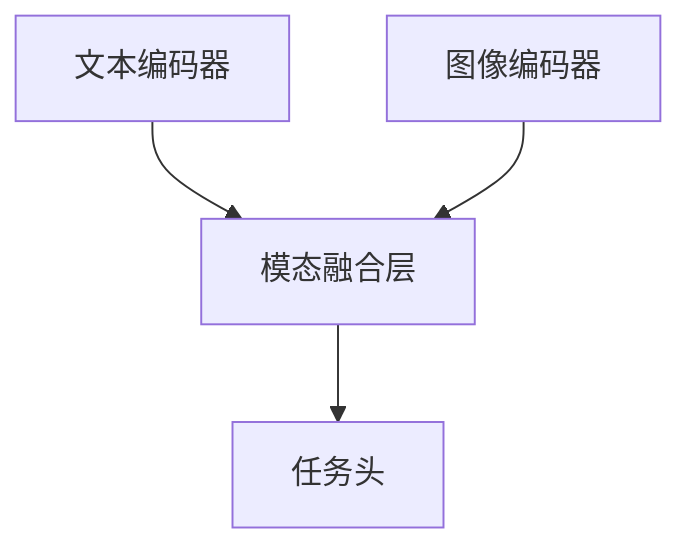

# 多模态大模型：技术原理与实战 多模态大模型高效的训练方法

## 1. 背景介绍

### 1.1 多模态大模型的兴起

近年来,人工智能领域取得了长足的进步,尤其是在自然语言处理和计算机视觉等领域。传统的人工智能模型通常专注于单一模态,如文本或图像。然而,现实世界中的信息通常以多种形式存在,如文本、图像、视频和音频等。为了更好地理解和处理这种多模态信息,研究人员开始探索多模态人工智能模型。

多模态大模型(Multimodal Large Models)是一种新兴的人工智能模型,它能够同时处理和融合来自不同模态(如文本、图像、视频等)的信息。这种模型具有强大的表示能力,可以捕捉不同模态之间的相关性和交互,从而更好地理解和生成多模态数据。

### 1.2 多模态大模型的应用前景

多模态大模型在各个领域都有广阔的应用前景,例如:

- 多媒体内容理解和生成
- 人机交互系统(如智能助手)
- 医疗影像辅助诊断
- 自动驾驶和机器人视觉
- 教育和培训系统
- 内容创作和营销

随着数据量的不断增长和计算能力的提高,多模态大模型有望在未来发挥更加重要的作用。

## 2. 核心概念与联系

### 2.1 模态表示

模态表示是多模态大模型的基础。不同的模态,如文本、图像、视频等,需要采用不同的表示方式。常见的表示方式包括:

- 文本: 词嵌入(Word Embeddings)、预训练语言模型(Pre-trained Language Models)
- 图像: 卷积神经网络(Convolutional Neural Networks)特征、视觉变换器(Vision Transformers)
- 视频: 三维卷积神经网络(3D ConvNets)、视频变换器(Video Transformers)
- 音频: 频谱特征(Spectrogram Features)、波形特征(Waveform Features)

这些表示方式旨在捕捉各个模态的关键信息,为后续的多模态融合奠定基础。

### 2.2 多模态融合

多模态融合是多模态大模型的核心,它将不同模态的表示进行融合,捕捉模态之间的相关性和交互。常见的多模态融合方法包括:

- 早期融合(Early Fusion): 在较低层次将不同模态的特征进行拼接或融合。
- 晚期融合(Late Fusion): 在较高层次将不同模态的特征或预测结果进行融合。
- 层次融合(Hierarchical Fusion): 在不同层次进行多模态融合,捕捉不同粒度的模态交互。
- 注意力融合(Attention Fusion): 使用注意力机制动态地融合不同模态的表示。

不同的融合方法各有优缺点,选择合适的融合策略对于模型性能至关重要。

### 2.3 多任务学习

多任务学习(Multi-task Learning)是多模态大模型的另一个重要概念。由于多模态大模型需要处理多种模态和任务,通过多任务学习可以提高模型的泛化能力和效率。常见的多任务学习方法包括:

- 硬参数共享(Hard Parameter Sharing): 不同任务共享部分或全部模型参数。
- 软参数共享(Soft Parameter Sharing): 通过正则化项或其他约束,鼓励不同任务的参数相似。
- 多分支架构(Multi-branch Architecture): 不同任务使用独立的分支,但共享部分底层表示。

合理的多任务学习策略可以提高模型的性能,并减少过拟合的风险。

## 3. 核心算法原理具体操作步骤

### 3.1 预训练-微调范式

预训练-微调(Pre-training and Fine-tuning)范式是训练多模态大模型的常见方法。该范式分为两个阶段:

1. **预训练阶段**: 在大规模无监督数据上预训练模型,学习通用的模态表示和融合能力。
2. **微调阶段**: 在特定任务的监督数据上微调预训练模型,使其适应目标任务。

这种范式可以充分利用大规模无监督数据,提高模型的泛化能力和效率。常见的预训练目标包括:

- 自监督学习(Self-supervised Learning): 如遮蔽语言模型(Masked Language Modeling)、图像重建(Image Reconstruction)等。
- 对比学习(Contrastive Learning): 通过最大化正例和负例之间的差异,学习更好的表示。
- 多模态对齐(Multimodal Alignment): 通过对齐不同模态的表示,捕捉模态之间的相关性。

### 3.2 注意力机制

注意力机制(Attention Mechanism)是多模态大模型中的关键技术之一。它允许模型动态地关注输入的不同部分,并根据上下文信息分配注意力权重。常见的注意力机制包括:

- 缩放点积注意力(Scaled Dot-Product Attention): 在 Transformer 模型中广泛使用,通过点积计算注意力权重。
- 多头注意力(Multi-Head Attention): 将注意力分成多个子空间,捕捉不同的依赖关系。
- 交叉注意力(Cross-Attention): 在不同模态之间计算注意力,实现模态融合。
- 自注意力(Self-Attention): 在同一模态内部计算注意力,捕捉长距离依赖关系。

注意力机制使模型能够灵活地处理不同长度和模态的输入,并有效地融合不同模态的信息。

### 3.3 高效模型设计

由于多模态大模型通常包含大量参数,因此高效的模型设计至关重要。常见的高效模型设计策略包括:

1. **参数高效**: 通过模型压缩、知识蒸馏等技术减少模型参数,降低计算和存储开销。
2. **计算高效**: 利用稀疏计算、量化等技术加速模型推理,提高计算效率。
3. **内存高效**: 通过优化内存访问模式、重用计算等技术减少内存占用。
4. **模型并行**: 在多个GPU或TPU上并行训练和推理,提高吞吐量。
5. **数据并行**: 在多个设备上并行处理数据,加速训练过程。

这些策略可以使多模态大模型在保持性能的同时,更加高效地进行训练和推理。

## 4. 数学模型和公式详细讲解举例说明

### 4.1 注意力机制数学模型

注意力机制是多模态大模型中的核心技术之一。它可以通过计算查询(Query)和键(Key)之间的相关性,动态地分配注意力权重,从而选择性地聚焦于输入的不同部分。

缩放点积注意力(Scaled Dot-Product Attention)是一种常见的注意力机制,其数学公式如下:

$$
\text{Attention}(Q, K, V) = \text{softmax}\left(\frac{QK^T}{\sqrt{d_k}}\right)V
$$

其中:

- $Q$ 表示查询(Query)矩阵,形状为 $(n_q, d_q)$
- $K$ 表示键(Key)矩阵,形状为 $(n_k, d_k)$
- $V$ 表示值(Value)矩阵,形状为 $(n_k, d_v)$
- $d_k$ 表示键的维度
- $\sqrt{d_k}$ 是一个缩放因子,用于防止点积过大导致梯度饱和

注意力权重 $\alpha$ 通过计算查询和键之间的缩放点积得到:

$$
\alpha = \text{softmax}\left(\frac{QK^T}{\sqrt{d_k}}\right)
$$

最终的注意力输出是加权值的加权和:

$$
\text{Attention}(Q, K, V) = \alpha V
$$

注意力机制允许模型动态地关注输入的不同部分,并根据上下文信息分配注意力权重。它在自然语言处理、计算机视觉等领域发挥着重要作用。

### 4.2 对比学习数学模型

对比学习(Contrastive Learning)是一种无监督表示学习方法,它通过最大化正例和负例之间的差异,学习更好的表示。对比学习广泛应用于多模态大模型的预训练阶段。

假设我们有一个正例对 $(x_i, x_j)$,其中 $x_i$ 和 $x_j$ 来自同一个上下文或语义相关。我们的目标是最大化正例对的相似性,同时最小化正例与其他负例之间的相似性。

常见的对比学习损失函数是 InfoNCE 损失:

$$
\mathcal{L}_i = -\log \frac{\exp(\text{sim}(z_i, z_j) / \tau)}{\sum_{k=1}^{N} \mathbb{1}_{[k \neq i]} \exp(\text{sim}(z_i, z_k) / \tau)}
$$

其中:

- $z_i$ 和 $z_j$ 分别是正例 $x_i$ 和 $x_j$ 的表示
- $\text{sim}(u, v)$ 是一个相似性度量函数,如余弦相似度
- $\tau$ 是一个温度超参数,用于控制相似性分布的平滑程度
- $N$ 是批次大小,分母部分是所有负例的相似性之和

通过最小化这个损失函数,模型可以学习到更好的表示,使正例对的表示更加相似,而与负例的表示差异更大。

对比学习在多模态大模型的预训练中发挥着重要作用,它可以帮助模型学习到更好的模态表示和融合能力。

## 5. 项目实践:代码实例和详细解释说明

在这一部分,我们将提供一个基于 PyTorch 的多模态大模型实现示例,并详细解释代码的各个部分。

### 5.1 模型架构

我们将使用一种层次融合(Hierarchical Fusion)的架构,在不同层次进行多模态融合。模型架构如下所示:



- 文本编码器(Text Encoder): 用于编码输入文本,可以使用预训练语言模型(如 BERT)。
- 图像编码器(Image Encoder): 用于编码输入图像,可以使用卷积神经网络或视觉变换器。
- 模态融合层(Multimodal Fusion Layer): 将文本和图像表示进行融合,可以使用注意力机制或其他融合方法。
- 任务头(Task Head): 根据具体任务(如分类、回归等)设计相应的输出层。

### 5.2 代码实现

下面是一个简化版本的代码实现,展示了模型的核心部分:

```python
import torch
import torch.nn as nn

class TextEncoder(nn.Module):
    def __init__(self, pretrained_model):
        super(TextEncoder, self).__init__()
        self.encoder = pretrained_model

    def forward(self, input_ids, attention_mask):
        outputs = self.encoder(input_ids, attention_mask=attention_mask)
        text_embeddings = outputs.last_hidden_state[:, 0, :]
        return text_embeddings

class ImageEncoder(nn.Module):
    def __init__(self, backbone):
        super(ImageEncoder, self).__init__()
        self.backbone = backbone

    def forward(self, images):
        image_embeddings = self.backbone(images)
        return image_embeddings

class MultimodalFusionLayer(nn.Module):
    def __init__(self, text_dim, image_dim, fusion_dim):
        super(MultimodalFusionLayer, self).__init__()
        self.text_proj = nn.Linear(text_dim, fusion_dim)
        self.image_proj = nn.Linear(image_dim, fusion_dim)
        self.attention = nn.MultiheadAttention(fusion_dim, num_heads=8)

    def forward(self, text_embeddings, image_embeddings):
        projected_text = self.text_proj(text_embeddings)
        projected_image = self.image_proj(image_embeddings)
        fused_embeddings, _ = self.attention(projected_text, projected_image, projected_image)
        return fused_embeddings

class MultimodalModel(nn.Module):
    def __init__(self, text_encoder, image_encoder, fusion_layer, task_head):
        super(MultimodalModel, self).__init__()
        self.text_encoder = text_encoder
        self.image_encoder = image_encoder
        self.fusion_layer = fusion_layer
        self.task_head = task_head

    def forward(self, input_ids, attention_mask, images):
        text_embeddings = self.text_encoder(input_ids, attention_mask)
        image_embeddings = self.image_encoder(images)
        fused_embeddings = self.fusion_layer(text_embeddings,