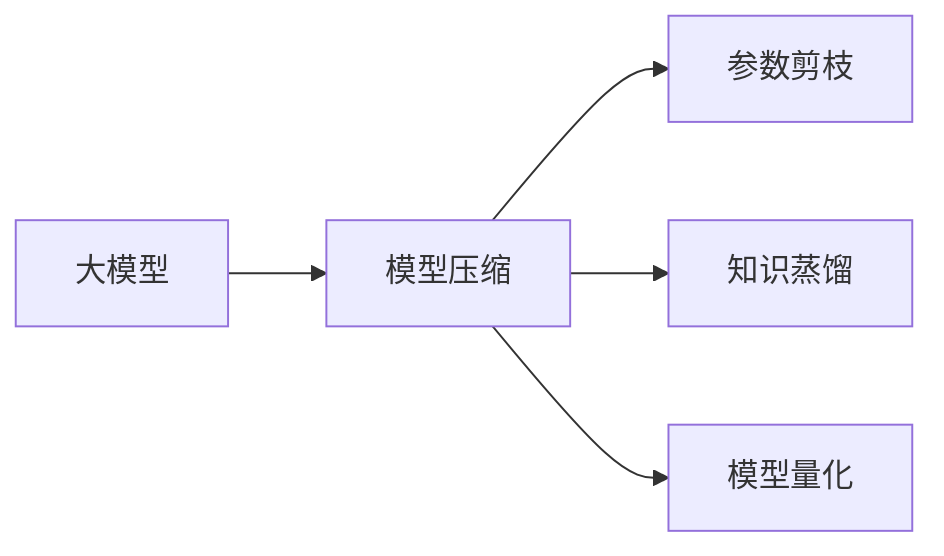

## 1.背景介绍

在当前的计算机科学领域，大模型和多模态模型已经成为了研究的热点。大模型，顾名思义，是指模型参数量大，模型复杂度高的模型。而多模态模型则是指可以处理多种类型输入的模型，如文本、图像、语音等。然而，随着模型的复杂度和参数量的增加，模型的存储和计算成本也在不断提高。为了解决这个问题，模型压缩技术应运而生。

## 2.核心概念与联系

模型压缩技术主要包括参数剪枝、知识蒸馏、模型量化等方法。参数剪枝是通过剪枝模型中的一部分参数来减小模型的大小。知识蒸馏则是通过将大模型的知识蒸馏到小模型中来减小模型的计算量。模型量化是通过降低模型参数的精度来减小模型的存储和计算成本。



## 3.核心算法原理具体操作步骤

首先，我们先来了解一下参数剪枝。参数剪枝的主要思想是去除模型中的一些不重要的参数。这些不重要的参数可以是权重较小的参数，也可以是对模型输出影响较小的参数。参数剪枝的具体步骤如下：

1. 训练模型：首先，我们需要训练一个大模型。
2. 评估参数重要性：然后，我们需要评估模型中每个参数的重要性。这可以通过计算参数对模型输出的影响来实现。
3. 剪枝参数：接下来，我们可以根据参数的重要性进行剪枝。我们可以设定一个阈值，将重要性低于阈值的参数剪枝掉。
4. 微调模型：最后，我们需要对剪枝后的模型进行微调，以恢复模型的性能。

知识蒸馏的主要思想是将大模型的知识蒸馏到小模型中。知识蒸馏的具体步骤如下：

1. 训练大模型：首先，我们需要训练一个大模型。
2. 蒸馏知识：然后，我们需要将大模型的知识蒸馏到小模型中。这可以通过让小模型模仿大模型的输出来实现。
3. 训练小模型：最后，我们需要训练小模型，使其尽可能地模仿大模型的输出。

模型量化的主要思想是通过降低模型参数的精度来减小模型的存储和计算成本。模型量化的具体步骤如下：

1. 训练模型：首先，我们需要训练一个模型。
2. 量化参数：然后，我们需要将模型参数量化。这可以通过将参数的精度降低来实现。
3. 微调模型：最后，我们需要对量化后的模型进行微调，以恢复模型的性能。

## 4.数学模型和公式详细讲解举例说明

在参数剪枝中，我们通常使用的是$L_0$范数来度量模型的大小。$L_0$范数定义为向量中非零元素的个数。对于模型的权重矩阵$W$，其$L_0$范数可以表示为：

$$
||W||_0 = \sum_{i,j} I(w_{i,j} \neq 0)
$$

其中，$I(\cdot)$是指示函数，如果括号内的条件成立，则$I(\cdot)=1$，否则$I(\cdot)=0$。

在知识蒸馏中，我们通常使用的是交叉熵损失来度量小模型的输出和大模型的输出之间的差异。对于小模型的输出$P$和大模型的输出$Q$，其交叉熵损失可以表示为：

$$
H(P,Q) = -\sum_{i} P(i) \log Q(i)
$$

在模型量化中，我们通常使用的是量化误差来度量量化前后模型参数的差异。对于模型参数$W$和其量化后的参数$\tilde{W}$，其量化误差可以表示为：

$$
E = ||W - \tilde{W}||_2^2
$$

## 5.项目实践：代码实例和详细解释说明

下面，我们将通过一个简单的代码示例来演示如何使用模型压缩技术。

```python
import torch
import torch.nn as nn
import torch.optim as optim

# 定义模型
model = nn.Sequential(
    nn.Linear(784, 100),
    nn.ReLU(),
    nn.Linear(100, 10)
)

# 定义损失函数和优化器
criterion = nn.CrossEntropyLoss()
optimizer = optim.SGD(model.parameters(), lr=0.01)

# 训练模型
for epoch in range(100):
    for data, target in train_loader:
        optimizer.zero_grad()
        output = model(data)
        loss = criterion(output, target)
        loss.backward()
        optimizer.step()

# 剪枝模型
for name, param in model.named_parameters():
    if 'weight' in name:
        threshold = torch.median(torch.abs(param))
        mask = torch.abs(param) > threshold
        param.data.mul_(mask)

# 微调模型
for epoch in range(10):
    for data, target in train_loader:
        optimizer.zero_grad()
        output = model(data)
        loss = criterion(output, target)
        loss.backward()
        optimizer.step()
```

在这个代码示例中，我们首先定义了一个简单的全连接网络，并使用交叉熵损失和随机梯度下降优化器来训练模型。然后，我们使用参数剪枝来压缩模型。我们设定阈值为权重的绝对值的中位数，然后将小于阈值的权重剪枝掉。最后，我们对剪枝后的模型进行微调，以恢复模型的性能。

## 6.实际应用场景

模型压缩技术在实际应用中有着广泛的应用。例如，在移动设备上运行的深度学习模型，由于硬件资源的限制，需要使用模型压缩技术来减小模型的大小和计算量。再如，在云端进行模型推理，由于需要处理大量的请求，所以需要使用模型压缩技术来减小模型的计算量，提高模型的推理速度。

## 7.工具和资源推荐

如果你对模型压缩技术感兴趣，下面是一些推荐的工具和资源：

- PyTorch：一个强大的深度学习框架，提供了丰富的模型压缩技术，如参数剪枝、模型量化等。
- TensorFlow Model Optimization：一个专门用于模型优化的库，提供了丰富的模型压缩技术，如知识蒸馏、模型量化等。
- Distiller：一个专门用于神经网络压缩研究的Python库。

## 8.总结：未来发展趋势与挑战

随着深度学习模型的复杂度和参数量的不断增加，模型压缩技术的研究将越来越重要。然而，模型压缩技术也面临着一些挑战，如如何在保证模型性能的同时进行压缩，如何处理不同类型的模型等。未来，我们期待有更多的研究能够突破这些挑战，推动模型压缩技术的发展。

## 9.附录：常见问题与解答

Q: 参数剪枝会影响模型的性能吗？

A: 参数剪枝会导致模型的性能下降，但通过微调，可以恢复模型的性能。

Q: 知识蒸馏适用于所有类型的模型吗？

A: 知识蒸馏主要适用于分类问题，对于其他类型的问题，可能需要使用其他的蒸馏方法。

Q: 模型量化会导致模型的精度下降吗？

A: 模型量化会导致模型的精度下降，但通过微调，可以恢复模型的精度。

作者：禅与计算机程序设计艺术 / Zen and the Art of Computer Programming