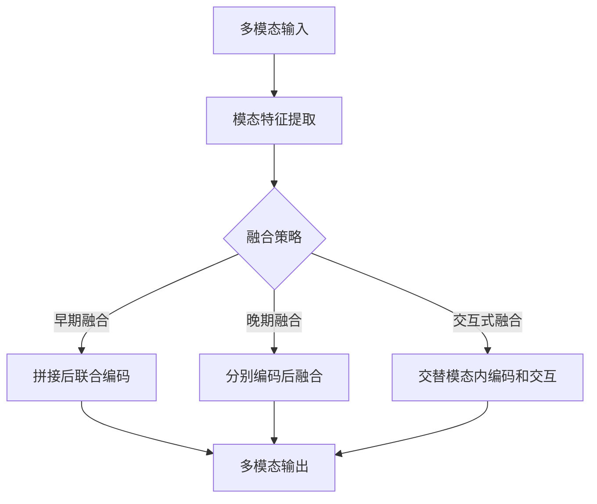
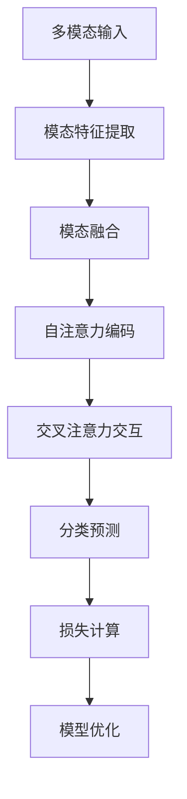

# 多模态大模型：技术原理与实战 语音质检

## 1.背景介绍

### 1.1 多模态大模型的兴起

随着人工智能技术的不断发展,大型神经网络模型已经在自然语言处理、计算机视觉等领域取得了令人瞩目的成就。然而,现实世界中的大多数任务都涉及多种模态(modalities),如文本、图像、语音等。为了更好地解决这些复杂的多模态问题,多模态大模型(Multimodal Large Models)应运而生。

多模态大模型旨在统一处理不同模态的信息,实现跨模态的理解和生成能力。它们通过在单一神经网络中融合多种模态的表示,学习模态之间的相关性和交互,从而实现更强大的多模态理解和生成能力。

### 1.2 语音质检的重要性

在众多的多模态应用场景中,语音质检是一个非常重要的任务。语音质检旨在评估语音数据的质量,识别和过滤掉噪音、重复、无声等低质量语音片段,确保语音数据的完整性和可用性。高质量的语音数据对于语音识别、语音合成等下游任务至关重要。

传统的语音质检方法主要依赖于手工设计的特征和规则,效果有限且难以扩展。随着深度学习技术的发展,基于神经网络的语音质检方法开始崭露头角,展现出更好的性能和泛化能力。然而,这些方法通常只关注单一模态(语音),忽视了其他有助于质检的模态信息,如视频画面、文本字幕等。

因此,将多模态大模型应用于语音质检任务,可以充分利用多种模态的信息,提高质检的准确性和鲁棒性。

## 2.核心概念与联系

### 2.1 多模态大模型的架构

多模态大模型通常采用Transformer或其变体作为基础架构,并在其上进行模态融合和交互建模。常见的多模态大模型架构包括:

1. **早期融合**:将不同模态的输入在底层进行拼接,然后送入Transformer进行联合编码。这种方式简单直接,但可能无法充分捕获模态间的交互关系。

2. **晚期融合**:首先分别对每种模态进行独立编码,然后在高层将不同模态的表示进行融合。这种方式保留了各模态的独立特征,但融合的时机较晚。

3. **交互式融合**:在Transformer的不同层次上,交替进行模态内编码和跨模态交互,实现动态的模态融合。这种方式较为复杂,但能更好地捕获模态间的相关性。



### 2.2 自注意力机制与交叉注意力

自注意力(Self-Attention)和交叉注意力(Cross-Attention)是多模态大模型中的两个关键机制。

**自注意力机制**用于捕获单一模态内部的长程依赖关系,通过计算查询(Query)与键(Key)的相似性来确定值(Value)的重要程度。这种机制使得模型能够有效地关注输入序列中的关键信息。

$$\mathrm{Attention}(Q, K, V) = \mathrm{softmax}(\frac{QK^T}{\sqrt{d_k}})V$$

其中,$ Q $、$ K $、$ V $分别表示查询、键和值的线性映射。

**交叉注意力机制**则用于捕获不同模态之间的相关性。通过将一个模态的表示作为查询,与另一模态的键和值进行注意力计算,实现跨模态的信息交互。

$$\mathrm{CrossAttention}(Q_i, K_j, V_j) = \mathrm{softmax}(\frac{Q_iK_j^T}{\sqrt{d_k}})V_j$$

其中,$ Q_i $来自模态$ i $,而$ K_j $和$ V_j $来自模态$ j $。

通过自注意力和交叉注意力的交替应用,多模态大模型能够在不同的模态之间建立丰富的交互,实现更好的多模态表示学习。

## 3.核心算法原理具体操作步骤

多模态大模型在语音质检任务中的核心算法原理可以概括为以下几个步骤:

1. **模态特征提取**:对输入的语音、视频和文本等不同模态进行特征提取,得到各模态的特征表示。

2. **模态融合**:采用早期融合、晚期融合或交互式融合等策略,将不同模态的特征表示进行融合,获得统一的多模态表示。

3. **自注意力编码**:对融合后的多模态表示进行自注意力编码,捕获单一模态内部的长程依赖关系。

4. **交叉注意力交互**:在自注意力编码的基础上,进行交叉注意力计算,实现不同模态之间的信息交互。

5. **分类预测**:将编码后的多模态表示输入到分类头,预测当前语音片段的质量等级(如高质量、中等质量、低质量等)。

6. **模型优化**:根据预测结果和真实标签,计算损失函数,并通过反向传播算法对模型参数进行优化。



在实际应用中,上述步骤通常会根据具体任务和数据集进行调整和优化,以提高模型的性能和效率。例如,可以引入辅助任务(如模态重构)来增强模型的多模态理解能力,或采用知识蒸馏等技术来压缩模型的大小。

## 4.数学模型和公式详细讲解举例说明

在多模态大模型中,自注意力和交叉注意力是两个核心的数学模型,它们的计算过程可以用矩阵运算来表示。

### 4.1 自注意力的数学模型

自注意力机制的核心是计算查询(Query)与键(Key)的相似性,并根据相似性分配值(Value)的权重。具体来说,给定一个序列$ X = (x_1, x_2, \dots, x_n) $,我们首先将其线性映射到查询$ Q $、键$ K $和值$ V $:

$$Q = XW_Q^T$$
$$K = XW_K^T$$
$$V = XW_V^T$$

其中,$ W_Q $、$ W_K $、$ W_V $是可学习的权重矩阵。

接下来,我们计算查询和键之间的点积,并除以缩放因子$ \sqrt{d_k} $($ d_k $是键的维度),以防止梯度过大或过小:

$$e_{ij} = \frac{q_i^Tk_j}{\sqrt{d_k}}$$

然后,我们对点积结果进行softmax操作,得到注意力权重:

$$a_{ij} = \mathrm{softmax}(e_{ij}) = \frac{\exp(e_{ij})}{\sum_k \exp(e_{ik})}$$

最后,我们将注意力权重与值进行加权求和,得到自注意力的输出:

$$\mathrm{Attention}(Q, K, V) = \sum_{j=1}^n a_{ij}v_j$$

通过自注意力机制,模型可以自适应地关注输入序列中的关键信息,捕获长程依赖关系。

### 4.2 交叉注意力的数学模型

交叉注意力机制用于捕获不同模态之间的相关性。假设我们有两个模态$ X $和$ Y $,分别对应查询$ Q_X $、键$ K_Y $和值$ V_Y $:

$$Q_X = XW_Q^T$$
$$K_Y = YW_K^T$$
$$V_Y = YW_V^T$$

我们计算查询$ Q_X $与键$ K_Y $之间的点积,并进行softmax操作,得到交叉注意力权重:

$$e_{ij} = \frac{q_{X_i}^Tk_{Y_j}}{\sqrt{d_k}}$$
$$a_{ij} = \mathrm{softmax}(e_{ij}) = \frac{\exp(e_{ij})}{\sum_k \exp(e_{ik})}$$

然后,我们将交叉注意力权重与值$ V_Y $进行加权求和,得到交叉注意力的输出:

$$\mathrm{CrossAttention}(Q_X, K_Y, V_Y) = \sum_{j=1}^n a_{ij}v_{Y_j}$$

通过交叉注意力机制,模型可以捕获不同模态之间的相关性,实现跨模态的信息交互和融合。

### 4.3 实例说明

假设我们有一个语音质检任务,输入包括语音、视频和文本三种模态。我们将分别对这三种模态进行特征提取,得到特征表示$ X $、$ Y $和$ Z $。

首先,我们对语音模态$ X $进行自注意力编码:

$$Q_X = XW_Q^T, K_X = XW_K^T, V_X = XW_V^T$$
$$e_{ij} = \frac{q_{X_i}^Tk_{X_j}}{\sqrt{d_k}}, a_{ij} = \mathrm{softmax}(e_{ij})$$
$$X' = \mathrm{Attention}(Q_X, K_X, V_X) = \sum_{j=1}^n a_{ij}v_{X_j}$$

接下来,我们将编码后的语音表示$ X' $与视频模态$ Y $进行交叉注意力交互:

$$Q_{X'} = X'W_Q^T, K_Y = YW_K^T, V_Y = YW_V^T$$
$$e_{ij} = \frac{q_{X'_i}^Tk_{Y_j}}{\sqrt{d_k}}, a_{ij} = \mathrm{softmax}(e_{ij})$$
$$Y' = \mathrm{CrossAttention}(Q_{X'}, K_Y, V_Y) = \sum_{j=1}^n a_{ij}v_{Y_j}$$

最后,我们将交互后的视频表示$ Y' $与文本模态$ Z $进行另一轮交叉注意力交互,得到最终的多模态表示$ Z' $:

$$Q_{Y'} = Y'W_Q^T, K_Z = ZW_K^T, V_Z = ZW_V^T$$
$$e_{ij} = \frac{q_{Y'_i}^Tk_{Z_j}}{\sqrt{d_k}}, a_{ij} = \mathrm{softmax}(e_{ij})$$
$$Z' = \mathrm{CrossAttention}(Q_{Y'}, K_Z, V_Z) = \sum_{j=1}^n a_{ij}v_{Z_j}$$

通过上述过程,我们得到了融合了语音、视频和文本三种模态信息的多模态表示$ Z' $,可以将其输入到分类头,预测当前语音片段的质量等级。

## 5.项目实践:代码实例和详细解释说明

为了更好地理解多模态大模型在语音质检任务中的应用,我们提供了一个基于PyTorch的代码实例。该实例实现了一个简单的多模态质检模型,融合了语音、视频和文本三种模态的信息。

### 5.1 数据预处理

首先,我们需要对输入的语音、视频和文本数据进行预处理,提取各模态的特征表示。在本例中,我们使用预训练的模型(如BERT、ResNet等)来提取文本和视频的特征,对于语音模态,我们使用基于MFCC的特征提取方法。

```python
import torch
import torchaudio
import torchvision

# 语音特征提取
def extract_audio_features(audio_data, sample_rate):
    mfcc = torchaudio.transforms.MFCC(sample_rate=sample_rate)
    audio_features = mfcc(audio_data)
    return audio_features

# 视频特征提取
def extract_video_features(video_data):
    resnet = torchvision.models.resnet18(pretrained=True)
    video_features = resnet(video_data)
    return video_features

# 文本特征提取
def extract_text_features(text_data):
    bert = BertModel.from_pretrained('bert-base-uncased')
    text_features = bert(text_data)[0]
    return text_features
```

### 5.2 多模态融合模型

接下来,我们定义一个多模态融合模型,该模型包含三个子模块: