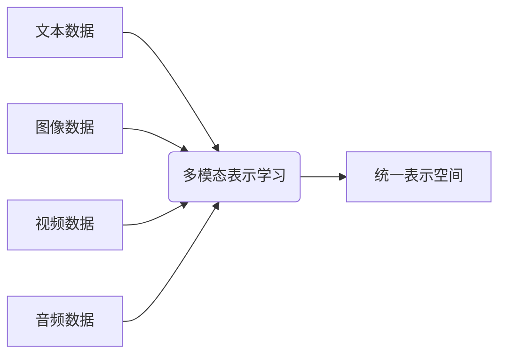
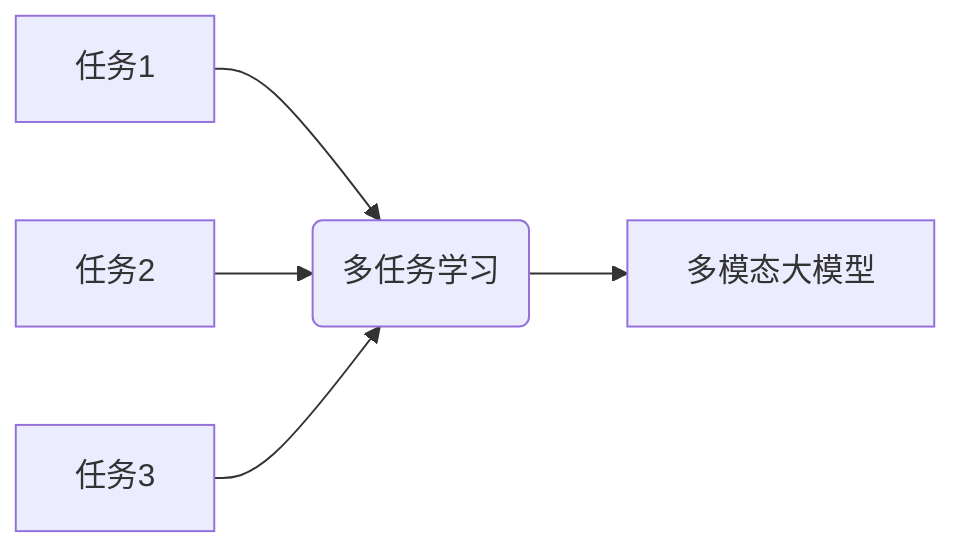
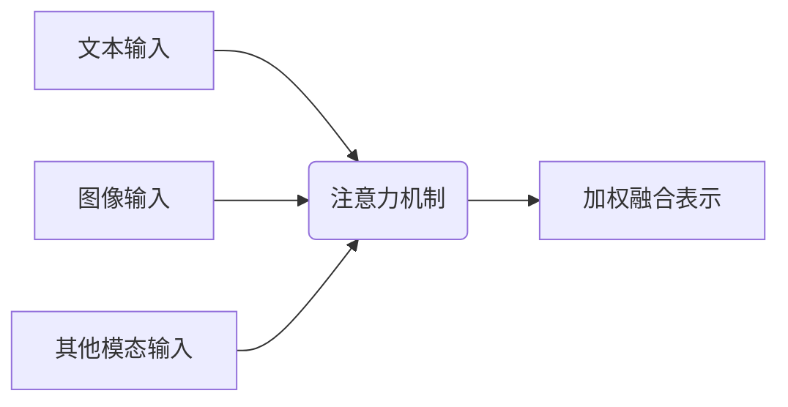
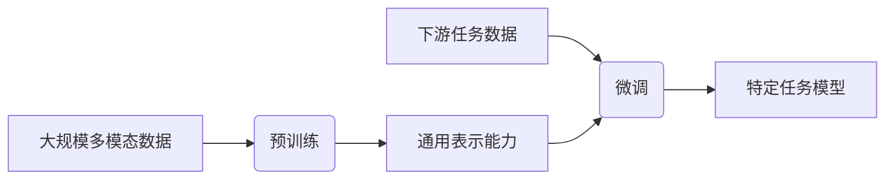
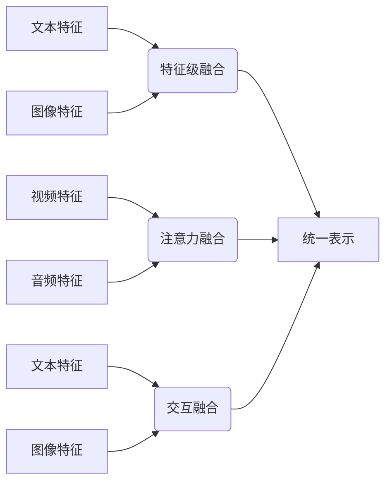
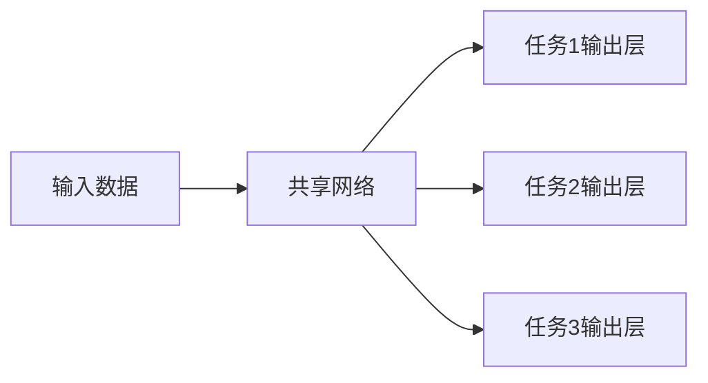
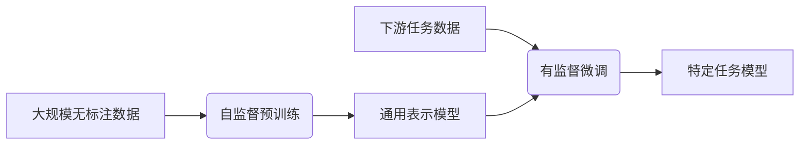

# 多模态大模型：技术原理与实战 集成学习

## 1.背景介绍

### 1.1 人工智能的新时代

人工智能(AI)已经成为当今科技领域最炙手可热的话题之一。随着计算能力的不断提升和大数据的广泛应用,AI技术在诸多领域取得了令人瞩目的进展,深刻影响着我们的生活和工作方式。在这一背景下,多模态大模型(Multimodal Large Models)应运而生,成为AI发展的新风向标。

### 1.2 多模态数据的挑战

在现实世界中,信息通常以多种形式存在,包括文本、图像、视频、音频等。传统的人工智能模型往往专注于单一模态数据,如自然语言处理(NLP)模型处理文本数据,计算机视觉(CV)模型处理图像数据。然而,这种单一模态的方式难以捕捉数据之间的内在关联,无法充分利用多源异构信息,限制了模型的泛化能力和应用范围。

### 1.3 多模态大模型的兴起

为了解决上述挑战,多模态大模型应运而生。它们旨在融合并处理多种模态数据,从而获得更全面、更丰富的信息表示。通过学习不同模态之间的相互关系,多模态大模型能够更好地理解和推理复杂的现实场景,为各种应用提供强大的支持。

## 2.核心概念与联系

### 2.1 多模态表示学习

多模态表示学习(Multimodal Representation Learning)是多模态大模型的核心概念。它旨在从异构数据源中学习统一的表示空间,使得不同模态的数据可以映射到同一语义空间中进行建模和推理。这种统一的表示空间能够捕捉模态之间的相关性,并为后续的任务提供有效的特征表示。



### 2.2 多任务学习

多任务学习(Multi-task Learning)是另一个与多模态大模型密切相关的概念。它指的是在同一模型中同时学习多个相关任务,利用不同任务之间的相关性来提高模型的泛化能力和性能。在多模态大模型中,多任务学习可以帮助模型更好地捕捉不同模态之间的关联,从而提高模型的鲁棒性和适应性。



### 2.3 注意力机制

注意力机制(Attention Mechanism)是多模态大模型中的一种关键技术。它允许模型动态地关注输入数据的不同部分,并根据当前任务的需求分配不同的权重。在多模态场景下,注意力机制可以帮助模型有效地融合不同模态的信息,捕捉模态之间的相互作用,从而提高模型的性能。



### 2.4 预训练与微调

预训练(Pre-training)和微调(Fine-tuning)是训练多模态大模型的常用范式。在预训练阶段,模型在大规模的多模态数据集上进行自监督学习,获得通用的表示能力。在微调阶段,预训练模型被转移到特定的下游任务上,通过少量标注数据进行进一步优化,从而获得针对性的性能提升。



## 3.核心算法原理具体操作步骤

### 3.1 多模态融合

多模态融合是多模态大模型的核心操作,它将不同模态的数据融合到统一的表示空间中。常见的融合方法包括:

1. **特征级融合**:将不同模态的特征向量拼接或加权求和,形成统一的特征表示。
2. **注意力融合**:使用注意力机制动态地融合不同模态的特征,捕捉模态间的相互作用。
3. **交互融合**:在不同模态之间建立交互连接,使模态特征能够相互影响和更新。



### 3.2 多任务学习策略

在多任务学习中,需要合理设计任务之间的权重分配和损失函数,以充分利用任务之间的相关性。常见的策略包括:

1. **硬参数共享**:不同任务共享底层网络的参数,只在顶层有任务特定的输出层。
2. **软参数共享**:通过正则化项或注意力机制,实现参数之间的软性共享。
3. **渐进式多任务学习**:按照一定策略逐步加入新任务,实现持续学习。



### 3.3 预训练与微调策略

预训练和微调是训练多模态大模型的关键步骤,需要合理设计预训练任务和微调策略,以获得良好的性能。常见的策略包括:

1. **自监督预训练**:利用大规模无标注数据进行自监督学习,获得通用的表示能力。
2. **有监督微调**:在特定下游任务上使用有标注数据进行微调,提高模型的任务适应性。
3. **多阶段训练**:分阶段进行预训练和微调,逐步提高模型的性能和泛化能力。



## 4.数学模型和公式详细讲解举例说明

### 4.1 多模态融合的数学表示

假设我们有 $M$ 种模态的输入数据 $\{x_1, x_2, \dots, x_M\}$,每种模态经过相应的编码器 $f_m$ 得到特征表示 $h_m = f_m(x_m)$。我们的目标是将这些特征表示融合到统一的空间中,得到多模态融合表示 $z$。

**特征级融合**:

$$z = \sum_{m=1}^M \alpha_m h_m$$

其中 $\alpha_m$ 是每种模态的权重系数,可以通过学习得到。

**注意力融合**:

$$z = \sum_{m=1}^M \alpha_m h_m, \quad \alpha_m = \text{softmax}(q^\top h_m)$$

其中 $q$ 是一个可学习的查询向量,用于计算每种模态的注意力权重 $\alpha_m$。

**交互融合**:

$$\begin{aligned}
h_m' &= f_m(x_m) + \sum_{n\neq m} g_{mn}(h_n) \\
z &= \sum_{m=1}^M \alpha_m h_m'
\end{aligned}$$

其中 $g_{mn}$ 是一个交互函数,用于捕捉不同模态之间的相互作用。

### 4.2 多任务学习的损失函数

在多任务学习中,我们需要设计合适的损失函数来平衡不同任务之间的重要性。假设我们有 $T$ 个任务,每个任务的损失函数为 $\mathcal{L}_t$,我们可以使用加权求和的方式构建总体损失函数:

$$\mathcal{L} = \sum_{t=1}^T \lambda_t \mathcal{L}_t(y_t, \hat{y}_t)$$

其中 $y_t$ 和 $\hat{y}_t$ 分别表示任务 $t$ 的真实标签和预测值, $\lambda_t$ 是任务 $t$ 的权重系数。

另一种常见的方法是使用不确定性权重,通过学习每个任务的不确定性来动态调整任务权重:

$$\mathcal{L} = \sum_{t=1}^T \exp(-\beta_t) \mathcal{L}_t(y_t, \hat{y}_t) + \sum_{t=1}^T \beta_t$$

其中 $\beta_t$ 是任务 $t$ 的不确定性参数,需要在训练过程中进行学习。

## 5.项目实践:代码实例和详细解释说明

在这一部分,我们将提供一个基于PyTorch的多模态融合示例,帮助读者更好地理解多模态大模型的实现细节。

### 5.1 数据准备

首先,我们需要准备多模态数据集。在这个示例中,我们使用一个包含文本和图像的数据集。我们将文本数据编码为词嵌入序列,图像数据编码为特征向量。

```python
import torch
from torchvision import transforms

# 准备文本数据
text_data = [...] # 文本数据列表
text_embeddings = [...] # 对应的词嵌入序列

# 准备图像数据
image_data = [...] # 图像数据列表
image_transform = transforms.Compose([
    transforms.Resize((224, 224)),
    transforms.ToTensor(),
    transforms.Normalize(mean=[0.485, 0.456, 0.406], std=[0.229, 0.224, 0.225])
])
image_features = [...] # 对应的图像特征向量
```

### 5.2 多模态融合模型

接下来,我们定义一个多模态融合模型。该模型包含两个编码器,分别用于处理文本和图像数据,以及一个融合模块,用于将两种模态的特征融合到统一的表示空间中。

```python
import torch.nn as nn

class MultimodalFusionModel(nn.Module):
    def __init__(self, text_dim, image_dim, fusion_dim):
        super(MultimodalFusionModel, self).__init__()
        
        # 文本编码器
        self.text_encoder = nn.LSTM(input_size=text_dim, hidden_size=fusion_dim, batch_first=True)
        
        # 图像编码器
        self.image_encoder = nn.Linear(image_dim, fusion_dim)
        
        # 融合模块
        self.fusion = nn.Linear(fusion_dim * 2, fusion_dim)
        
    def forward(self, text, images):
        # 编码文本
        _, (text_features, _) = self.text_encoder(text)
        text_features = text_features.squeeze(0)
        
        # 编码图像
        image_features = self.image_encoder(images)
        
        # 融合特征
        fused_features = torch.cat((text_features, image_features), dim=1)
        fused_features = self.fusion(fused_features)
        
        return fused_features
```

在这个示例中,我们使用了一个LSTM网络作为文本编码器,一个线性层作为图像编码器。融合模块将两种模态的特征拼接,然后通过一个线性层进行融合。

### 5.3 模型训练

最后,我们定义一个训练循环,用于在多模态数据集上训练融合模型。

```python
import torch.optim as optim

# 实例化模型
model = MultimodalFusionModel(text_dim=300, image_dim=2048, fusion_dim=512)

# 定义优化器和损失函数
optimizer = optim.Adam(model.parameters(), lr=0.001)
criterion = nn.CrossEntropyLoss()

# 训练循环
for epoch in range(num_epochs):
    for text_batch, image_batch, labels in data_loader:
        # 前向传播
        fused_features = model(text_batch, image_batch)
        outputs = classifier(fused_features)
        loss = criterion(outputs, labels)
        
        # 反向传播
        optimizer.zero_grad()
        loss.backward()
        optimizer.step()
        
    # 打印损失
    print(f'Epoch {epoch+1}/{num_epochs}, Loss: {loss.item():.4f}')
```

在这个示例中,我们使用交叉熵损失函数和Adam优化器来训练模型。在每个训练步骤中,我们将文本和图像数据输入到融合模型中,获得融合特征表示。然后,我们可以将这些特征输入到分类器中,