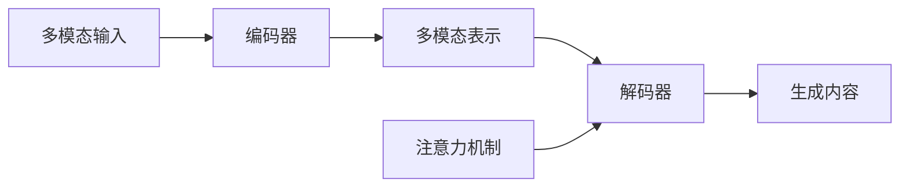

# 多模态生成(Multimodal Generation) - 原理与代码实例讲解

## 1.背景介绍
多模态生成(Multimodal Generation)是人工智能领域的一个热门研究方向,它旨在利用多种不同的信息源(如文本、图像、音频等)来生成丰富多样的内容。随着深度学习技术的飞速发展,多模态生成取得了令人瞩目的成果,在自然语言处理、计算机视觉等领域得到了广泛应用。本文将深入探讨多模态生成的原理,并通过代码实例来讲解其实现过程。

### 1.1 多模态生成的概念
多模态生成是指利用多种不同类型的数据(如文本、图像、音频等)作为输入,通过机器学习模型生成新的内容的过程。与传统的单模态生成(如文本生成、图像生成)不同,多模态生成能够捕捉不同模态之间的关联,生成更加丰富、准确和自然的内容。

### 1.2 多模态生成的应用场景
多模态生成在许多领域都有广泛的应用,例如:

- 图像描述生成:根据输入的图像生成自然语言描述
- 视频摘要生成:根据输入的视频生成文本摘要
- 音乐生成:根据歌词、音频等信息生成新的音乐片段
- 多模态对话生成:根据文本、图像等信息生成对话回复

### 1.3 多模态生成的挑战
尽管多模态生成取得了显著进展,但仍面临许多挑战:

- 模态间的信息融合:如何有效地融合不同模态的信息是一大难题
- 数据稀疏性:高质量的多模态数据集较为稀缺,限制了模型的性能
- 评估标准:缺乏统一的多模态生成评估标准,难以客观评价模型效果

## 2.核心概念与联系
要理解多模态生成的原理,需要掌握以下几个核心概念:

### 2.1 编码器-解码器框架
编码器-解码器(Encoder-Decoder)框架是多模态生成的基础。编码器负责将输入的多模态信息映射为一个统一的表示,解码器根据这个表示生成目标内容。常见的编码器-解码器结构包括:

- Seq2Seq:基于RNN的编码器-解码器模型
- Transformer:基于自注意力机制的编码器-解码器模型

### 2.2 注意力机制
注意力机制(Attention Mechanism)是多模态生成的重要组成部分。它能够帮助模型在生成过程中动态地关注输入信息的不同部分,提高生成内容的准确性和流畅性。常见的注意力机制有:

- Bahdanau Attention:基于RNN隐状态的注意力机制
- Self-Attention:Transformer中使用的自注意力机制

### 2.3 多模态表示学习
多模态表示学习旨在将不同模态的信息映射到一个共同的语义空间,以便于模态间的信息融合。常见的多模态表示学习方法包括:

- 多模态自编码器:通过重构损失学习多模态表示
- 多模态对比学习:通过最大化不同模态间的互信息学习多模态表示

下图展示了多模态生成中核心概念之间的联系:



## 3.核心算法原理具体操作步骤
下面以图像描述生成任务为例,详细介绍多模态生成的核心算法原理和操作步骤。

### 3.1 问题定义
给定一张图像,目标是生成一段自然语言描述。形式化地,我们希望学习一个条件概率分布 $p(y|x)$,其中 $x$ 表示输入图像, $y$ 表示生成的描述。

### 3.2 编码器:图像特征提取
首先,使用卷积神经网络(CNN)对输入图像进行特征提取,得到图像特征 $v$。常用的 CNN 结构包括 ResNet、Inception 等。

### 3.3 解码器:描述生成
解码器通常采用循环神经网络(RNN),如 LSTM 或 GRU。在每个时间步,解码器根据图像特征 $v$ 和已生成的词 $y_{1:t-1}$ 预测下一个词 $y_t$。生成过程可表示为:

$$
h_t = f(h_{t-1}, y_{t-1}, v) \\
p(y_t|y_{1:t-1}, v) = g(h_t)
$$

其中, $f$ 表示 RNN 的状态更新函数, $g$ 表示输出层,通常是一个 softmax 函数。

### 3.4 注意力机制
为了让解码器在生成描述时能够动态地关注图像的不同区域,引入注意力机制。在每个时间步,注意力机制根据当前解码器隐状态 $h_t$ 计算一个注意力分布 $\alpha_t$,用于对图像特征 $v$ 进行加权求和,得到注意力向量 $c_t$:

$$
e_{ti} = a(h_t, v_i) \\
\alpha_{ti} = \frac{\exp(e_{ti})}{\sum_j \exp(e_{tj})} \\
c_t = \sum_i \alpha_{ti} v_i
$$

其中, $a$ 表示注意力评分函数,常用的有加性注意力和点积注意力。

### 3.5 训练目标
模型的训练目标是最大化生成描述的对数似然概率:

$$
\max_\theta \sum_{(x,y)\in D} \log p(y|x;\theta)
$$

其中, $D$ 表示训练数据集, $\theta$ 表示模型参数。

## 4.数学模型和公式详细讲解举例说明
本节将详细讲解多模态生成中涉及的几个关键数学模型和公式,并给出具体的例子说明。

### 4.1 编码器:卷积神经网络
卷积神经网络(CNN)常用于图像特征提取。给定一张图像 $x$,CNN 通过卷积和池化操作将其转换为特征图 $v$:

$$
v = CNN(x)
$$

例如,对于一个 3x3 的卷积核 $w$,卷积操作可表示为:

$$
v_{ij} = \sum_{m=0}^2 \sum_{n=0}^2 w_{mn} x_{i+m,j+n}
$$

池化操作通常包括最大池化和平均池化,用于降低特征图的尺寸。以 2x2 最大池化为例:

$$
v_{ij} = \max_{0 \leq m,n \leq 1} x_{2i+m,2j+n}
$$

### 4.2 解码器:循环神经网络
循环神经网络(RNN)常用于序列生成任务。以 LSTM 为例,其状态更新公式为:

$$
f_t = \sigma(W_f \cdot [h_{t-1}, y_{t-1}, v] + b_f) \\
i_t = \sigma(W_i \cdot [h_{t-1}, y_{t-1}, v] + b_i) \\ 
o_t = \sigma(W_o \cdot [h_{t-1}, y_{t-1}, v] + b_o) \\
\tilde{C}_t = \tanh(W_C \cdot [h_{t-1}, y_{t-1}, v] + b_C) \\
C_t = f_t * C_{t-1} + i_t * \tilde{C}_t \\
h_t = o_t * \tanh(C_t)
$$

其中, $\sigma$ 表示 sigmoid 函数, $*$ 表示逐元素乘法, $W$ 和 $b$ 为可学习的参数。

### 4.3 注意力机制
以加性注意力为例,其评分函数为:

$$
a(h_t, v_i) = w^T \tanh(W_h h_t + W_v v_i + b)
$$

其中, $w$、$W_h$、$W_v$ 和 $b$ 为可学习的参数。注意力分布和注意力向量的计算公式如前所述。

### 4.4 损失函数
模型的损失函数为负对数似然:

$$
L(\theta) = -\sum_{(x,y)\in D} \log p(y|x;\theta)
$$

展开可得:

$$
L(\theta) = -\sum_{(x,y)\in D} \sum_{t=1}^T \log p(y_t|y_{1:t-1},x;\theta)
$$

其中, $T$ 表示描述的长度。

## 5.项目实践:代码实例和详细解释说明
下面给出一个基于 PyTorch 实现的图像描述生成模型的代码示例,并对关键部分进行详细解释。

```python
import torch
import torch.nn as nn
import torchvision.models as models

# 编码器:基于 ResNet-50 的 CNN
class Encoder(nn.Module):
    def __init__(self):
        super(Encoder, self).__init__()
        resnet = models.resnet50(pretrained=True)
        modules = list(resnet.children())[:-1]
        self.resnet = nn.Sequential(*modules)

    def forward(self, x):
        features = self.resnet(x)
        features = features.view(features.size(0), -1)
        return features

# 注意力机制
class Attention(nn.Module):
    def __init__(self, encoder_dim, decoder_dim, attention_dim):
        super(Attention, self).__init__()
        self.encoder_att = nn.Linear(encoder_dim, attention_dim)
        self.decoder_att = nn.Linear(decoder_dim, attention_dim)
        self.full_att = nn.Linear(attention_dim, 1)
        self.relu = nn.ReLU()
        self.softmax = nn.Softmax(dim=1)

    def forward(self, encoder_out, decoder_hidden):
        att1 = self.encoder_att(encoder_out)
        att2 = self.decoder_att(decoder_hidden)
        att = self.full_att(self.relu(att1 + att2.unsqueeze(1))).squeeze(2)
        alpha = self.softmax(att)
        attention_weighted_encoding = (encoder_out * alpha.unsqueeze(2)).sum(dim=1)
        return attention_weighted_encoding, alpha

# 解码器:基于 LSTM 的 RNN
class Decoder(nn.Module):
    def __init__(self, attention_dim, embed_dim, decoder_dim, vocab_size, encoder_dim=2048, dropout=0.5):
        super(Decoder, self).__init__()
        self.encoder_dim = encoder_dim
        self.attention_dim = attention_dim
        self.embed_dim = embed_dim
        self.decoder_dim = decoder_dim
        self.vocab_size = vocab_size
        self.dropout = dropout

        self.attention = Attention(encoder_dim, decoder_dim, attention_dim)
        self.embedding = nn.Embedding(vocab_size, embed_dim)
        self.dropout = nn.Dropout(p=self.dropout)
        self.decode_step = nn.LSTMCell(embed_dim + encoder_dim, decoder_dim, bias=True)
        self.init_h = nn.Linear(encoder_dim, decoder_dim)
        self.init_c = nn.Linear(encoder_dim, decoder_dim)
        self.f_beta = nn.Linear(decoder_dim, encoder_dim)
        self.sigmoid = nn.Sigmoid()
        self.fc = nn.Linear(decoder_dim, vocab_size)

    def forward(self, encoder_out, encoded_captions, caption_lengths):
        batch_size = encoder_out.size(0)
        encoder_dim = encoder_out.size(-1)
        vocab_size = self.vocab_size

        encoder_out = encoder_out.view(batch_size, -1, encoder_dim)
        num_pixels = encoder_out.size(1)

        caption_lengths, sort_ind = caption_lengths.squeeze(1).sort(dim=0, descending=True)
        encoder_out = encoder_out[sort_ind]
        encoded_captions = encoded_captions[sort_ind]

        embeddings = self.embedding(encoded_captions)

        h, c = self.init_hidden_state(encoder_out)

        decode_lengths = (caption_lengths - 1).tolist()

        predictions = torch.zeros(batch_size, max(decode_lengths), vocab_size).to(encoder_out.device)
        alphas = torch.zeros(batch_size, max(decode_lengths), num_pixels).to(encoder_out.device)

        for t in range(max(decode_lengths)):
            batch_size_t = sum([l > t for l in decode_lengths])
            attention_weighted_encoding, alpha = self.attention(encoder_out[:batch_size_t], h[:batch_size_t])
            gate = self.sigmoid(self.f_beta(h[:batch_size_t]))
            attention_weighted_encoding = gate * attention_weighted_encoding
            h, c = self.decode_step(
                torch.cat([embeddings[:batch_size_t, t, :], attention_weighted_encoding], dim=1),
                (h[:batch_size_t], c[:batch_size_t]))
            preds = self.fc(self.dropout(h))
            predictions[:batch_size_t, t, :] = preds
            alphas[:batch_size_t, t, :] = alpha

        return predictions, encoded_captions, decode_lengths, alphas, sort_ind

    def init_hidden_state(self, encoder_out):
        mean_encoder_out = encoder_out.