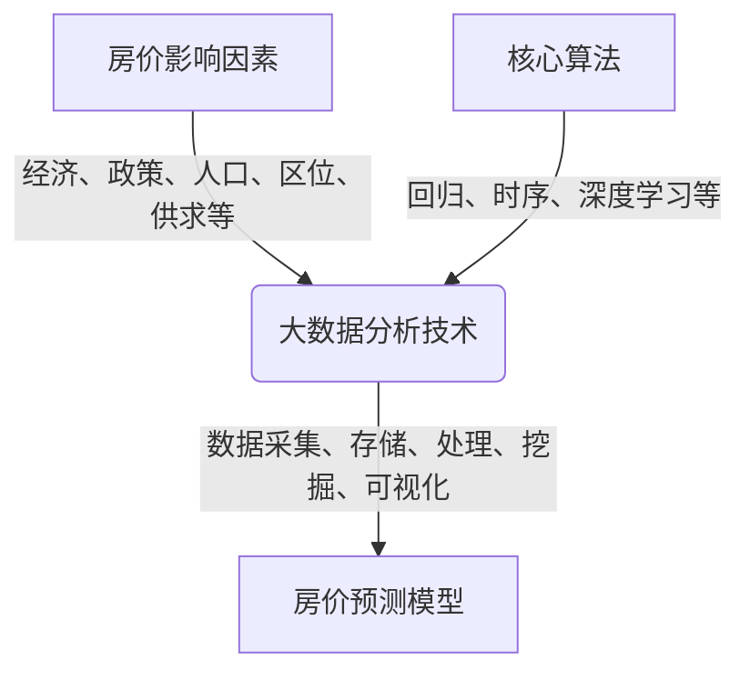

# 大数据分析某未来五年的房价走势

## 1.背景介绍

### 1.1 房地产行业的重要性

房地产行业是一个国家经济发展的重要支柱,与人民生活息息相关。它不仅影响着居民的居住水平,也关系到国民经济的健康运行。房地产业的发展状况是衡量一个国家或地区经济发展水平的重要标志之一。因此,准确预测未来房价走势对于政府制定相关政策、企业做出投资决策以及居民购房安家等都具有重要意义。

### 1.2 传统房价预测方法的局限性

传统的房价预测方法主要依赖于人工经验和简单的数理统计模型,存在以下几个缺陷:

- 数据来源单一,缺乏多维度的影响因素考虑
- 算法能力有限,无法发现数据中的深层次规律
- 预测周期较短,难以对长期趋势做出准确判断

### 1.3 大数据时代的机遇

随着大数据时代的到来,海量多源异构数据的积累为房价预测提供了新的契机。通过对政府公开数据、网络舆情数据、地理位置数据、经济数据等多源数据的融合分析,我们可以从更全面的角度去研究影响房价的诸多复杂因素,并基于大数据技术构建更精准的预测模型。

## 2.核心概念与联系

### 2.1 房价影响因素

影响房价的主要因素包括但不限于:

- 经济因素:GDP增长率、居民可支配收入、通货膨胀率等
- 政策因素:房地产调控政策、土地供应政策等
- 人口因素:人口数量、人口结构、人口流动等
- 区位因素:交通条件、教育资源、商业配套等
- 供求关系:房地产开发投资、房屋供应量等

这些因素相互影响、相互制约,形成了一个错综复杂的网络。单一因素难以准确预测房价走势,必须综合考虑多个维度的数据。

### 2.2 大数据分析技术

大数据分析技术主要包括以下几个方面:

- 数据采集:从各种渠道收集相关数据
- 数据存储:利用分布式存储系统高效存储海量数据 
- 数据处理:使用大数据计算框架(如Spark)进行数据清洗、转换等处理
- 数据挖掘:应用机器学习、深度学习等算法发现数据中的模式和规律
- 数据可视化:通过可视化技术直观展现分析结果

利用这些先进技术,我们能够高效处理大规模数据,并从中提取有价值的知识。

### 2.3 核心算法

常用于房价预测的核心算法有:

- 回归算法:线性回归、决策树回归等
- 时序预测算法:ARIMA、指数平滑等
- 深度学习算法:循环神经网络、长短期记忆网络等

不同算法有不同的适用场景,可以根据数据特点和预测需求选择合适的算法或者算法组合。



## 3.核心算法原理具体操作步骤  

### 3.1 线性回归算法

线性回归是一种常用的回归分析方法,旨在找到自变量和因变量之间的线性关系。对于房价预测问题,我们可以将影响房价的各种因素作为自变量,房价作为因变量,建立线性回归模型。

线性回归算法的具体步骤如下:

1. 收集数据,包括房价数据和影响因素数据
2. 对数据进行预处理,包括填充缺失值、标准化等
3. 将数据集拆分为训练集和测试集
4. 在训练集上训练线性回归模型,求解模型参数
5. 在测试集上评估模型性能,计算均方根误差等指标
6. 使用训练好的模型对未来房价进行预测

线性回归的数学模型可表示为:

$$y = \theta_0 + \theta_1x_1 + \theta_2x_2 + ... + \theta_nx_n$$

其中$y$为房价,$x_i$为第$i$个影响因素,$\theta_i$为对应的系数。算法目标是找到最优参数$\theta$,使预测值$\hat{y}$与真实值$y$的差异最小。

### 3.2 ARIMA时序预测算法

ARIMA(AutoRegressive Integrated Moving Average)是一种广泛应用的时序预测算法。它适用于具有一定周期性和趋势性的时序数据,比如房价数据。

ARIMA算法的步骤如下:

1. 检查时序数据的平稳性,如果不平稳则进行差分处理
2. 确定ARIMA模型的阶数(p,d,q),p为自回归阶数,d为差分阶数,q为移动平均阶数
3. 在训练集上估计ARIMA模型的参数
4. 使用估计的模型对测试集进行预测,评估模型性能
5. 应用训练好的模型对未来时间点的数据进行预测

ARIMA模型的数学表达式为:

$$y_t = c + \phi_1y_{t-1} + ... + \phi_py_{t-p} + \theta_1\epsilon_{t-1} + ... + \theta_q\epsilon_{t-q} + \epsilon_t$$

其中$y_t$为时间$t$的观测值,$\phi_i$和$\theta_i$分别为自回归和移动平均项的系数,$\epsilon_t$为白噪声项。

### 3.3 长短期记忆网络(LSTM)

长短期记忆网络是一种特殊的循环神经网络,擅长处理序列数据。由于房价数据具有明显的时间序列特征,LSTM非常适合用于房价预测。

LSTM算法的基本流程为:

1. 收集房价历史数据及其影响因素数据,构建时间序列
2. 对数据进行预处理,包括填充缺失值、标准化等
3. 构建LSTM网络模型,包括输入层、LSTM层、全连接层和输出层
4. 在训练集上训练LSTM模型,使用优化算法如Adam优化网络参数
5. 在测试集上评估模型性能,计算均方根误差等指标
6. 使用训练好的模型对未来房价序列进行预测

LSTM通过设计特殊的门控机制,能够有效捕获长期依赖关系,从而更好地学习时序数据中的模式。它的数学原理较为复杂,这里不再详述。

## 4.数学模型和公式详细讲解举例说明

### 4.1 线性回归模型

线性回归模型的目标是最小化预测值与真实值之间的均方误差:

$$J(\theta) = \frac{1}{2m}\sum_{i=1}^m(h_\theta(x^{(i)}) - y^{(i)})^2$$

其中$m$为样本数量,$x^{(i)}$为第$i$个样本的特征向量,$y^{(i)}$为对应的房价,$h_\theta(x)$为模型的预测值。

为了求解最优参数$\theta$,我们可以使用梯度下降法:

$$\theta_j := \theta_j - \alpha\frac{\partial}{\partial\theta_j}J(\theta)$$

其中$\alpha$为学习率,控制参数更新的步长。

对于单变量线性回归($h_\theta(x) = \theta_0 + \theta_1x$),梯度为:

$$\begin{align*}
\frac{\partial}{\partial\theta_0}J(\theta) &= \frac{1}{m}\sum_{i=1}^m(h_\theta(x^{(i)}) - y^{(i)})\\
\frac{\partial}{\partial\theta_1}J(\theta) &= \frac{1}{m}\sum_{i=1}^m(h_\theta(x^{(i)}) - y^{(i)})x^{(i)}
\end{align*}$$

通过不断迭代更新参数,直到收敛为止,我们就可以得到最优的线性回归模型。

例如,假设我们有以下数据:

| 城市人口数(万人) | 房价(万元/套) |
|-------------------|----------------|
| 200               | 150            |
| 300               | 200            |
| ... | ... |

我们可以将人口数作为自变量$x$,房价作为因变量$y$,建立线性回归模型$h_\theta(x) = \theta_0 + \theta_1x$。通过梯度下降法训练,可以得到模型参数$\theta_0$和$\theta_1$,从而预测不同人口数时的房价水平。

### 4.2 ARIMA时序模型

ARIMA模型由三个部分组成:AR(自回归)、I(差分)、MA(移动平均)。

对于非平稳时序数据,我们需要进行差分处理,使之平稳化:

$$y_t' = \nabla^dy_t = (1-B)^dy_t$$

其中$B$为滞后算子,$d$为差分阶数。

AR(p)模型的表达式为:

$$y_t = c + \phi_1y_{t-1} + \phi_2y_{t-2} + ... + \phi_py_{t-p} + \epsilon_t$$

MA(q)模型的表达式为:

$$y_t = c + \epsilon_t + \theta_1\epsilon_{t-1} + \theta_2\epsilon_{t-2} + ... + \theta_q\epsilon_{t-q}$$

综合起来,ARIMA(p,d,q)模型可表示为:

$$y_t' = c + \phi_1y_{t-1}' + ... + \phi_py_{t-p}' + \theta_1\epsilon_{t-1} + ... + \theta_q\epsilon_{t-q} + \epsilon_t$$

我们以房价数据为例,假设房价时序数据符合ARIMA(1,1,1)模型,即:

$$y_t' = c + \phi_1y_{t-1}' + \theta_1\epsilon_{t-1} + \epsilon_t$$

其中$y_t'$为房价序列的一阶差分序列。我们可以在训练集上估计参数$c$、$\phi_1$、$\theta_1$,然后使用该模型对未来房价进行预测。

### 4.3 LSTM神经网络模型

LSTM的核心思想是通过特殊设计的门控机制,有选择地遗忘和记忆信息,从而更好地捕获长期依赖关系。

LSTM单元的数学表达式为:

$$\begin{align*}
f_t &= \sigma(W_f\cdot[h_{t-1}, x_t] + b_f) & \text{(遗忘门)} \\
i_t &= \sigma(W_i\cdot[h_{t-1}, x_t] + b_i) & \text{(输入门)} \\
\tilde{C}_t &= \tanh(W_C\cdot[h_{t-1}, x_t] + b_C) & \text{(候选记忆)} \\
C_t &= f_t\odot C_{t-1} + i_t\odot\tilde{C}_t & \text{(记忆状态)} \\
o_t &= \sigma(W_o\cdot[h_{t-1}, x_t] + b_o) & \text{(输出门)} \\
h_t &= o_t\odot\tanh(C_t) & \text{(隐藏状态)}
\end{align*}$$

其中$\sigma$为sigmoid激活函数,$\odot$为元素乘积运算。$f_t$、$i_t$、$\tilde{C}_t$、$C_t$、$o_t$、$h_t$分别表示遗忘门、输入门、候选记忆、记忆状态、输出门和隐藏状态。$W$和$b$为模型参数。

在房价预测任务中,我们可以将历史房价数据和影响因素数据作为输入序列$x_t$,输入到LSTM网络中。LSTM会根据当前输入和之前的隐藏状态,计算当前的记忆状态$C_t$和隐藏状态$h_t$,并将$h_t$传递到下一时刻。最终,我们可以通过输出层得到对未来房价的预测值。

通过训练数据对LSTM网络进行端到端的训练,网络能够自动学习到影响房价走势的复杂规律,从而提高预测精度。

## 5.项目实践:代码实例和详细解释说明

在这一部分,我们将通过实际代码示例,演示如何使用Python中的相关库来实现房价预测任务。

### 5.1 线性回归实例

```python
import numpy as np
from sklearn.linear_model import Linear