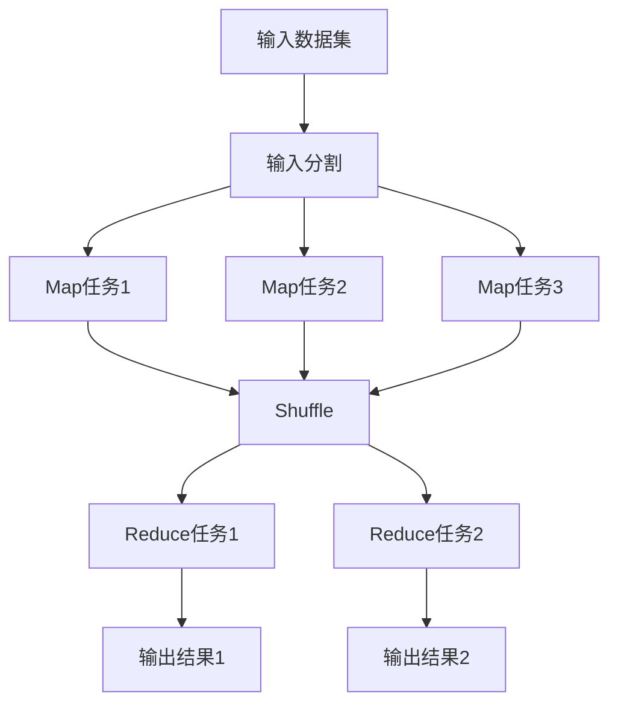
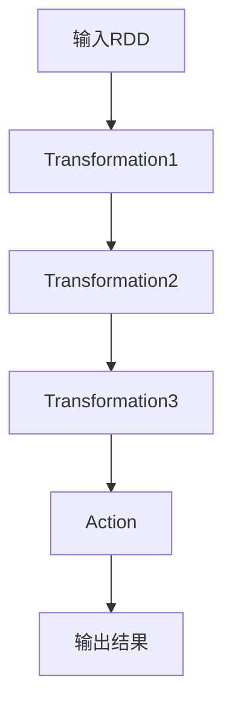
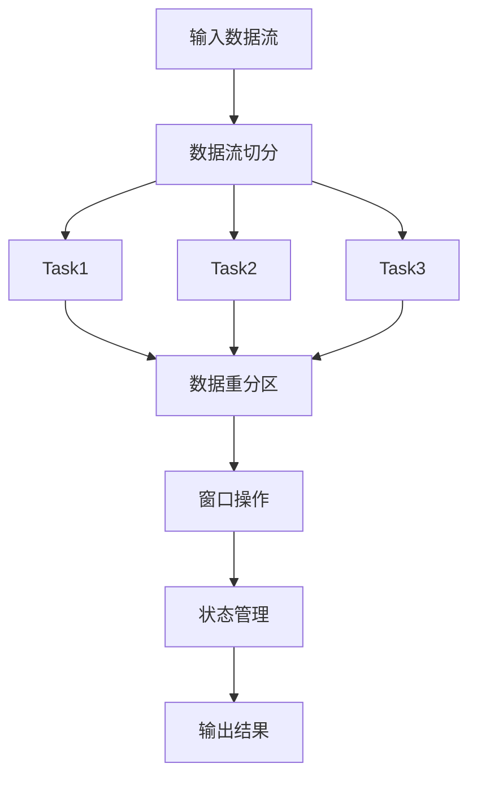

# 大数据处理框架原理与代码实战案例讲解

## 1.背景介绍

### 1.1 大数据时代的来临

随着互联网、移动互联网、物联网的迅猛发展,海量的结构化和非结构化数据如雪花般飞快地涌现。这些数据来源于各种渠道,包括社交媒体、网络日志、传感器数据等,其数据量已经远远超出了传统数据库管理系统的处理能力。为了有效地存储、管理和分析这些大规模数据,大数据技术应运而生。

### 1.2 大数据的特点

大数据具有以下几个主要特点:

- 海量(Volume):大数据的数据量非常庞大,通常达到TB、PB甚至EB级别。
- 多样(Variety):大数据不仅包括结构化数据,还包括半结构化和非结构化数据,如文本、图像、视频等。
- 高速(Velocity):大数据的产生、传输和处理速度非常快,需要实时流式处理。
- 价值密度低(Value Density):大数据中有价值的数据占比很小,需要从海量数据中挖掘出有价值的信息。

### 1.3 大数据处理的挑战

面对大数据,传统的数据处理方式已经无法满足需求,主要存在以下挑战:

- 数据存储:如何高效、可靠地存储海量数据?
- 数据处理:如何快速处理大规模数据集?
- 数据分析:如何从海量数据中发现有价值的信息和知识?

为了应对这些挑战,出现了一系列大数据处理框架和技术,如Hadoop、Spark、Flink等,它们能够高效地存储、处理和分析大数据。

## 2.核心概念与联系

### 2.1 大数据处理框架概述

大数据处理框架主要包括以下几个核心组件:

- 分布式文件系统(Distributed File System):用于存储海量数据,如HDFS。
- 资源管理和调度(Resource Management and Scheduling):用于管理和调度集群资源,如YARN。
- 数据处理引擎(Data Processing Engine):用于处理和分析数据,如MapReduce、Spark、Flink等。
- 数据存储(Data Storage):用于存储处理后的数据,如HBase、Cassandra等。

这些组件紧密协作,共同构建了一个完整的大数据处理生态系统。

### 2.2 MapReduce编程模型

MapReduce是一种编程模型,用于在分布式环境中并行处理大规模数据集。它将计算过程分为两个阶段:Map阶段和Reduce阶段。

1. **Map阶段**:输入数据被分割为多个数据块,每个数据块由一个Map任务处理,生成中间结果(键值对)。
2. **Reduce阶段**:根据Map阶段产生的键值对,对具有相同键的值进行合并和处理,生成最终结果。

MapReduce编程模型简化了分布式计算的复杂性,使开发人员可以专注于业务逻辑的实现。

### 2.3 Spark框架

Apache Spark是一种快速、通用的大数据处理框架,它可以在内存中进行计算,大大提高了处理效率。Spark提供了多种高级API,支持批处理、流处理、机器学习和图计算等多种应用场景。

Spark的核心概念包括:

- RDD(Resilient Distributed Dataset):分布式内存数据集,支持并行操作。
- DataFrame/Dataset:结构化数据集,提供更高效的数据操作。
- Spark Streaming:用于实时流式数据处理。
- MLlib:机器学习库,支持多种算法。
- GraphX:图计算库,用于处理图形结构数据。

Spark具有良好的容错性和可扩展性,已经成为大数据处理的主流框架之一。

### 2.4 Flink框架

Apache Flink是一个分布式流处理框架,专注于有状态计算和精确一次(Exactly-Once)语义。Flink支持流处理和批处理,可以统一处理有界和无界数据流。

Flink的核心概念包括:

- Stream和Transformation:数据流和转换操作。
- State和Checkpoint:状态管理和检查点机制,保证精确一次语义。
- Window:窗口操作,用于对流数据进行切分和聚合。
- Time:时间语义,支持事件时间和处理时间。

Flink具有低延迟、高吞吐量和精确一次语义等特点,适用于实时数据处理、数据分析和复杂事件处理等场景。

### 2.5 大数据生态系统

除了上述核心框架外,大数据生态系统还包括了许多其他重要组件,如:

- Hive:基于Hadoop的数据仓库,提供SQL查询功能。
- HBase:分布式列式数据库,适合存储非结构化和半结构化数据。
- Kafka:分布式流处理平台,用于实时数据传输和处理。
- Zookeeper:分布式协调服务,用于管理和协调分布式应用。
- Oozie:工作流调度器,用于管理Hadoop作业。

这些组件相互配合,构建了一个完整的大数据处理生态系统,为各种大数据应用提供了强有力的支持。

## 3.核心算法原理具体操作步骤

### 3.1 MapReduce算法原理

MapReduce算法的核心思想是将大规模数据集拆分为多个独立的子问题,并行处理这些子问题,最后将结果合并得到最终解。具体操作步骤如下:

1. **输入分割(Input Split)**:将输入数据集拆分为多个数据块(Split)。
2. **Map阶段**:每个Split由一个Map任务处理,Map任务将输入数据转换为中间结果(键值对)。
3. **Shuffle阶段**:将Map阶段产生的键值对进行重新分组,将具有相同键的值分发到同一个Reduce任务。
4. **Reduce阶段**:每个Reduce任务处理一组键值对,对具有相同键的值进行合并和处理,生成最终结果。
5. **输出(Output)**:将Reduce阶段的结果输出到文件系统或其他存储系统。

MapReduce算法的优点是简单、高容错、易于扩展。它通过数据并行和任务并行,实现了大规模数据集的高效处理。

### 3.2 Spark RDD算法原理

Spark的核心数据结构RDD(Resilient Distributed Dataset)是一种分布式内存数据集,支持并行操作。RDD的操作主要分为两种:Transformation和Action。

1. **Transformation**:对RDD进行转换操作,生成新的RDD,如map、filter、flatMap等。Transformation操作是懒加载的,只记录转换逻辑,不触发实际计算。
2. **Action**:触发RDD上的计算,如reduce、collect、count等。Action操作会根据记录的转换逻辑,构建计算图(DAG),并按照DAG执行计算。

Spark通过RDD的懒加载机制和有向无环图(DAG)执行引擎,实现了高效的内存计算和容错机制。

### 3.3 Flink流处理算法原理

Flink是一个分布式流处理框架,它将流数据切分为多个数据流,并行处理这些数据流。Flink的核心算法原理包括以下几个方面:

1. **数据流切分**:将输入数据流切分为多个逻辑数据流,每个数据流由一个Task处理。
2. **数据重分区**:根据分区键(Key)将数据重新分区,确保具有相同键的数据被发送到同一个Task。
3. **窗口操作**:对数据流进行切分和聚合,如滑动窗口、会话窗口等。
4. **状态管理**:维护Task的状态信息,支持有状态计算和精确一次语义。
5. **容错机制**:通过检查点(Checkpoint)和状态恢复,实现容错和故障恢复。

Flink的流处理算法具有低延迟、高吞吐量和精确一次语义等特点,适用于实时数据处理和复杂事件处理等场景。

## 4.数学模型和公式详细讲解举例说明

### 4.1 MapReduce数学模型

MapReduce算法可以用以下数学模型表示:

$$
f(x) = \text{reduce}(\text{map}(x))
$$

其中:

- $x$是输入数据集
- $\text{map}$是Map函数,将输入数据转换为中间结果(键值对)
- $\text{reduce}$是Reduce函数,对具有相同键的值进行合并和处理

Map函数可以表示为:

$$
\text{map}(x) = \{(k_1, v_1), (k_2, v_2), \ldots, (k_n, v_n)\}
$$

Reduce函数可以表示为:

$$
\text{reduce}((k, \{v_1, v_2, \ldots, v_m\})) = (k, \text{combine}(v_1, v_2, \ldots, v_m))
$$

其中$\text{combine}$是用户定义的合并函数。

例如,对一个文本文件进行单词计数,Map函数将每个单词映射为$(word, 1)$,Reduce函数对具有相同单词的值进行求和:

$$
\begin{aligned}
\text{map}(\text{"hello world hello"}) &= \{(\text{"hello"}, 1), (\text{"world"}, 1), (\text{"hello"}, 1)\} \\
\text{reduce}(\text{"hello"}, \{1, 1\}) &= (\text{"hello"}, 2) \\
\text{reduce}(\text{"world"}, \{1\}) &= (\text{"world"}, 1)
\end{aligned}
$$

### 4.2 Spark RDD转换操作

Spark RDD支持多种转换操作,如map、filter、flatMap等。这些操作可以用数学函数表示:

- **map**:$\text{map}(f, \text{RDD}) = \{f(x) | x \in \text{RDD}\}$
- **filter**:$\text{filter}(p, \text{RDD}) = \{x | x \in \text{RDD} \land p(x)\}$
- **flatMap**:$\text{flatMap}(f, \text{RDD}) = \bigcup_{x \in \text{RDD}} f(x)$

其中$f$是用户定义的转换函数,$p$是用户定义的过滤条件。

例如,对一个整数RDD进行平方操作和过滤操作:

$$
\begin{aligned}
\text{RDD} &= \{1, 2, 3, 4, 5\} \\
\text{squaredRDD} &= \text{map}(x \mapsto x^2, \text{RDD}) = \{1, 4, 9, 16, 25\} \\
\text{filteredRDD} &= \text{filter}(x \mapsto x > 10, \text{squaredRDD}) = \{16, 25\}
\end{aligned}
$$

### 4.3 Flink窗口操作

Flink支持多种窗口操作,用于对数据流进行切分和聚合。常见的窗口类型包括:

- **滚动窗口(Tumbling Window)**:固定大小的非重叠窗口。
- **滑动窗口(Sliding Window)**:固定大小的重叠窗口。
- **会话窗口(Session Window)**:根据数据活动间隔动态确定窗口大小。

窗口操作可以用以下数学模型表示:

$$
\text{window}(w, f, \text{stream}) = \{f(s) | s \in w(\text{stream})\}
$$

其中:

- $\text{stream}$是输入数据流
- $w$是窗口分配函数,将数据流切分为多个窗口
- $f$是用户定义的聚合函数,对每个窗口中的数据进行聚合

例如,对一个事件流进行每5秒的滚动计数:

$$
\begin{aligned}
\text{stream} &= \{(1