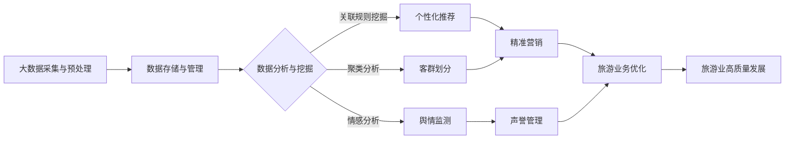

# 大数据背景下推动某旅游发展的分析与研究

## 1.背景介绍
### 1.1 大数据时代的到来
### 1.2 旅游业面临的机遇与挑战  
### 1.3 大数据在旅游业中的应用现状

## 2.核心概念与联系
### 2.1 大数据的定义与特征
#### 2.1.1 大数据的4V特征
#### 2.1.2 大数据与传统数据的区别
### 2.2 旅游大数据的来源与类型
#### 2.2.1 在线旅游平台数据
#### 2.2.2 社交媒体数据
#### 2.2.3 移动设备数据
#### 2.2.4 物联网数据
### 2.3 大数据与旅游业的关系
#### 2.3.1 大数据助力旅游业转型升级
#### 2.3.2 大数据驱动旅游业创新发展

## 3.核心算法原理具体操作步骤
### 3.1 数据采集与预处理
#### 3.1.1 数据采集渠道与方法
#### 3.1.2 数据清洗与集成
#### 3.1.3 数据转换与规范化
### 3.2 旅游数据分析算法
#### 3.2.1 关联规则挖掘
#### 3.2.2 聚类分析
#### 3.2.3 情感分析
### 3.3 旅游需求预测模型
#### 3.3.1 时间序列预测模型
#### 3.3.2 回归分析模型
#### 3.3.3 神经网络预测模型

## 4.数学模型和公式详细讲解举例说明
### 4.1 关联规则挖掘模型
#### 4.1.1 Apriori算法原理
#### 4.1.2 支持度与置信度计算公式
#### 4.1.3 关联规则生成过程
### 4.2 聚类分析模型  
#### 4.2.1 K-means聚类算法
#### 4.2.2 层次聚类算法
#### 4.2.3 基于密度的聚类算法DBSCAN
### 4.3 情感分析模型
#### 4.3.1 词典法情感分析
#### 4.3.2 机器学习情感分析
#### 4.3.3 深度学习情感分析

## 5.项目实践：代码实例和详细解释说明
### 5.1 旅游景点关联规则挖掘
#### 5.1.1 数据集准备与预处理
#### 5.1.2 Apriori算法实现
#### 5.1.3 关联规则生成与评估
### 5.2 游客行为聚类分析
#### 5.2.1 数据集准备与预处理
#### 5.2.2 K-means聚类算法实现  
#### 5.2.3 聚类结果分析与可视化
### 5.3 旅游评论情感分析
#### 5.3.1 数据集准备与预处理
#### 5.3.2 基于词典的情感分析实现
#### 5.3.3 机器学习情感分析实现

## 6.实际应用场景
### 6.1 个性化旅游推荐
#### 6.1.1 基于用户画像的个性化推荐
#### 6.1.2 基于关联规则的景点推荐
#### 6.1.3 基于协同过滤的旅游产品推荐  
### 6.2 智慧景区管理
#### 6.2.1 景区客流量预测与调度
#### 6.2.2 游客行为分析与引导
#### 6.2.3 景区舆情监测与危机预警
### 6.3 旅游市场营销决策
#### 6.3.1 目标客群划分与精准营销
#### 6.3.2 旅游产品定价优化
#### 6.3.3 营销效果评估与优化

## 7.工具和资源推荐
### 7.1 大数据处理平台
#### 7.1.1 Hadoop生态系统
#### 7.1.2 Spark大数据分析平台
#### 7.1.3 Flink实时计算平台
### 7.2 数据分析与挖掘工具
#### 7.2.1 Python数据分析库：Numpy、Pandas
#### 7.2.2 机器学习库：Scikit-learn
#### 7.2.3 深度学习框架：TensorFlow、PyTorch
### 7.3 数据可视化工具
#### 7.3.1 Matplotlib与Seaborn
#### 7.3.2 Tableau商业智能可视化平台
#### 7.3.3 ECharts可视化库

## 8.总结：未来发展趋势与挑战
### 8.1 旅游业与大数据融合的发展趋势 
#### 8.1.1 数据驱动的智慧旅游
#### 8.1.2 个性化与定制化旅游服务
#### 8.1.3 虚拟现实与增强现实技术应用
### 8.2 旅游大数据应用面临的挑战
#### 8.2.1 数据隐私与安全问题
#### 8.2.2 数据质量与准确性问题
#### 8.2.3 跨平台数据整合与共享
### 8.3 未来研究方向与展望
#### 8.3.1 旅游大数据的标准化与规范化
#### 8.3.2 旅游大数据分析的智能化与自动化
#### 8.3.3 旅游大数据在其他领域的应用拓展

## 9.附录：常见问题与解答
### 9.1 如何选择合适的大数据平台和工具？
### 9.2 如何保证旅游大数据分析的结果质量？
### 9.3 旅游企业如何构建自己的大数据应用系统？

大数据时代的到来为旅游业带来了前所未有的机遇与挑战。海量的旅游数据蕴藏着丰富的价值，如何有效地采集、存储、分析和利用这些数据,已成为旅游企业谋求转型升级和创新发展的关键。

本文首先介绍了大数据的基本概念和特征,重点阐述了大数据与旅游业的密切关系。随后,文章详细讲解了旅游大数据分析的核心算法原理,包括关联规则挖掘、聚类分析和情感分析等,并给出了相应的数学模型和计算公式。在项目实践部分,本文通过代码实例演示了如何应用这些算法进行旅游景点关联分析、游客行为聚类和评论情感分析。

此外,本文还探讨了旅游大数据在个性化推荐、智慧景区管理和营销决策等方面的实际应用场景,为旅游企业提供了宝贵的经验借鉴。文章推荐了一些主流的大数据处理平台、数据分析挖掘工具和可视化工具,帮助读者快速上手旅游大数据分析。

最后,本文展望了旅游业与大数据融合的发展趋势,提出了旅游大数据应用面临的挑战,并对未来的研究方向进行了探讨。文章还针对读者可能关心的一些常见问题进行了解答。

总之,大数据为旅游业插上了腾飞的翅膀。旅游企业应积极拥抱大数据,利用先进的分析算法和工具,深度挖掘数据价值,不断优化业务流程,为游客提供更加智能、个性化的服务,推动旅游业实现高质量发展。

作者：禅与计算机程序设计艺术 / Zen and the Art of Computer Programming