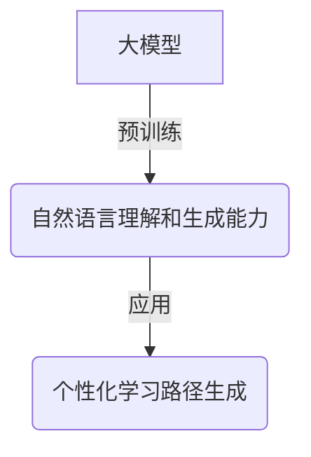
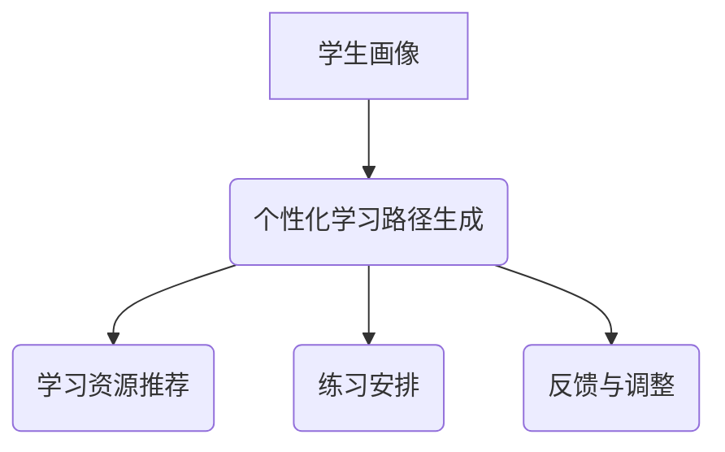
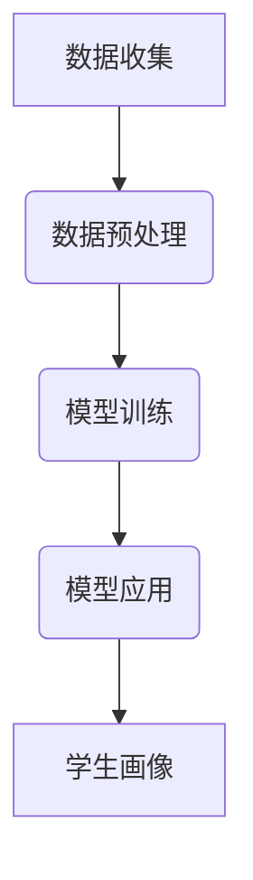
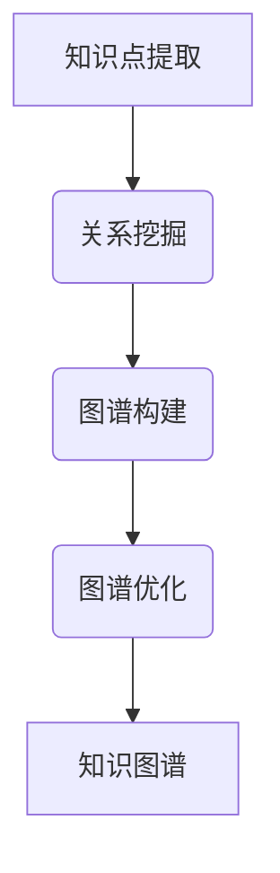
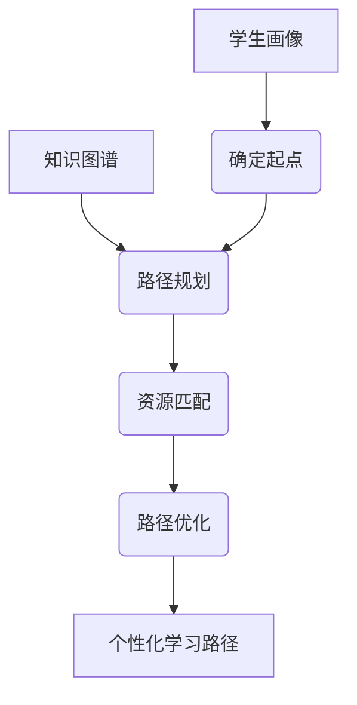

# 大模型在教育中的应用：个性化学习路径

## 1. 背景介绍

### 1.1 教育领域的挑战

在当前的教育环境中,教师面临着诸多挑战。其中最显著的是如何有效地满足每个学生的独特需求和学习风格。传统的"一刀切"教学方式很难完全适应不同学生的知识水平、学习能力和兴趣爱好。此外,教师需要投入大量时间和精力来评估每个学生的进度,并相应地调整教学策略。

### 1.2 人工智能的崛起

近年来,人工智能(AI)技术的飞速发展为解决上述挑战提供了新的契机。特别是大型语言模型(Large Language Models,LLMs)的出现,使得自然语言处理(NLP)领域取得了突破性进展。这些模型通过消化海量文本数据,能够生成高质量、上下文相关的自然语言输出,为个性化学习提供了强大的支持。

### 1.3 大模型在教育中的应用前景

将大模型应用于教育领域,可以实现个性化学习路径的自动生成和优化。通过分析学生的学习数据(如作业、测试成绩、学习行为等),大模型可以洞察学生的知识结构、学习偏好和薄弱环节。进而,它可以为每个学生量身定制个性化的学习资源、练习和反馈,提高学习效率和效果。

## 2. 核心概念与联系

### 2.1 大模型

大模型是指具有数十亿甚至上万亿参数的深度神经网络模型。它们通过消化大量文本数据进行预训练,获得了强大的自然语言理解和生成能力。常见的大模型包括GPT(Generative Pre-trained Transformer)、BERT(Bidirectional Encoder Representations from Transformers)等。



### 2.2 知识图谱

知识图谱是一种结构化的知识表示方式,它将知识概念及其关系以图的形式组织起来。在教育领域,知识图谱可以用于表示课程知识点之间的先后依赖关系,为个性化学习路径的生成提供知识基础。


### 2.3 个性化学习路径

个性化学习路径是指针对每个学生的具体情况,为其量身定制的学习进程。它考虑了学生的已有知识水平、学习偏好、薄弱环节等因素,为学生提供最佳的学习资源和练习,引导其高效地掌握知识技能。



## 3. 核心算法原理具体操作步骤

### 3.1 学生画像构建

构建学生画像是实现个性化学习路径的基础。该过程包括以下步骤:

1. 数据收集:从学生的作业、测试、学习行为等方面收集相关数据。
2. 数据预处理:对收集的数据进行清洗、标准化和特征提取等预处理。
3. 模型训练:使用机器学习算法(如决策树、聚类等)对预处理后的数据进行训练,得到学生画像模型。
4. 模型应用:将新的学生数据输入模型,生成该生的学习画像,包括知识掌握情况、学习偏好等。



### 3.2 知识图谱构建

构建课程知识图谱是生成个性化学习路径的另一个关键步骤,包括:

1. 知识点提取:从课程大纲、教材等资源中提取知识点。
2. 关系挖掘:分析知识点之间的先后依赖、同义等关系。
3. 图谱构建:将知识点作为节点,关系作为边,构建知识图谱。
4. 图谱优化:根据专家反馈和实际应用情况,不断优化知识图谱。



### 3.3 个性化学习路径生成

在获得学生画像和知识图谱后,可以通过以下步骤生成个性化学习路径:

1. 确定起点:根据学生画像,确定该生的当前知识掌握水平。
2. 路径规划:在知识图谱中,从起点出发,根据学习偏好等因素,规划出最优学习路径。
3. 资源匹配:为路径中的每个知识点匹配合适的学习资源(视频、练习等)。
4. 路径优化:根据学生的学习反馈,动态调整和优化学习路径。



## 4. 数学模型和公式详细讲解举例说明

在个性化学习路径生成过程中,涉及多种数学模型和算法,下面将详细介绍其中的一些核心模型。

### 4.1 知识点掌握度建模

我们可以使用logistic回归模型来估计学生对每个知识点的掌握程度。设$K$为知识点集合,对于第$i$个知识点$k_i \in K$,学生$u$的掌握度$p_{u,k_i}$可以表示为:

$$p_{u,k_i} = \sigma(\vec{w}_{k_i}^T \vec{x}_u + b_{k_i})$$

其中:
- $\vec{x}_u$是学生$u$的特征向量,包括作业成绩、学习时间等
- $\vec{w}_{k_i}$和$b_{k_i}$是针对知识点$k_i$的模型参数
- $\sigma(x)=\frac{1}{1+e^{-x}}$是logistic sigmoid函数

通过最大似然估计,我们可以学习模型参数,从而得到每个学生对每个知识点的掌握度估计。

### 4.2 个性化学习路径规划

个性化学习路径规划可以看作是一个最短路径问题。我们将知识图谱表示为一个加权有向图$G=(V,E)$,其中$V$是知识点集合,$E$是知识点之间的依赖关系。对于边$(u,v) \in E$,其权重$w(u,v)$可以设置为:

$$w(u,v) = 1 - p_u$$

其中$p_u$是学生$u$对知识点$u$的掌握度。我们的目标是找到一条从起点知识点$s$到终点知识点$t$的最短路径,使得沿路径的总权重最小,即:

$$\min \sum_{(u,v) \in \pi} w(u,v)$$

其中$\pi$是从$s$到$t$的一条路径。这个问题可以使用经典的Dijkstra算法或A*算法等来高效求解。

### 4.3 知识点关系挖掘

知识点关系挖掘是构建知识图谱的关键步骤。我们可以使用主题模型(如LDA)来从课程资源(教材、习题等)中自动挖掘知识点及其关系。具体来说,我们将每个知识点看作一个主题,课程资源作为文档集合,通过LDA模型可以得到:

- 每个知识点(主题)的词分布:$\phi_k = (p(w_1|z_k), p(w_2|z_k), \ldots)$
- 每个课程资源(文档)的知识点分布:$\theta_d = (p(z_1|d), p(z_2|d), \ldots)$

基于这些分布,我们可以计算知识点之间的相关性,作为它们之间存在关系的置信度。例如,对于知识点$z_i$和$z_j$,它们的相关性可以定义为:

$$\text{rel}(z_i, z_j) = \sum_{w \in V} p(w|z_i)p(w|z_j)$$

其中$V$是词汇表。通过设置阈值,我们可以确定哪些知识点对之间存在依赖或同义关系。

## 5. 项目实践:代码实例和详细解释说明

为了更好地理解个性化学习路径生成的实现过程,我们提供了一个基于Python的代码示例。该示例包括以下几个模块:

1. `data_utils.py`: 数据预处理和特征提取相关函数
2. `student_modeling.py`: 学生画像构建模块
3. `knowledge_graph.py`: 知识图谱构建模块
4. `path_planning.py`: 个性化学习路径规划模块
5. `main.py`: 主程序入口

### 5.1 数据预处理

```python
# data_utils.py
import pandas as pd
from sklearn.feature_extraction.text import TfidfVectorizer

def load_data(file_path):
    """加载数据"""
    data = pd.read_csv(file_path)
    return data

def extract_features(data):
    """提取特征"""
    # 从作业、测试等数据中提取特征
    ...

def preprocess_text(text):
    """文本预处理"""
    # 去除标点、转小写等
    ...

def tfidf_vectorize(corpus):
    """TF-IDF向量化"""
    vectorizer = TfidfVectorizer()
    X = vectorizer.fit_transform(corpus)
    return X, vectorizer.get_feature_names_out()
```

### 5.2 学生画像构建

```python
# student_modeling.py
from sklearn.tree import DecisionTreeClassifier
from data_utils import extract_features

def train_student_model(data):
    """训练学生画像模型"""
    X = extract_features(data)
    y = data['mastery']  # 标签为知识点掌握情况
    
    model = DecisionTreeClassifier()
    model.fit(X, y)
    return model

def predict_student_mastery(model, student_data):
    """预测学生的知识点掌握情况"""
    X = extract_features(student_data)
    mastery = model.predict(X)
    return mastery
```

### 5.3 知识图谱构建

```python
# knowledge_graph.py
import networkx as nx
from gensim import corpora, models
from data_utils import preprocess_text, tfidf_vectorize

def build_knowledge_graph(corpus):
    """构建知识图谱"""
    texts = [preprocess_text(doc) for doc in corpus]
    tfidf, vocab = tfidf_vectorize(texts)
    
    # 使用LDA主题模型挖掘知识点
    dictionary = corpora.Dictionary.from_corpus(texts, ids=None)
    corpus_bow = [dictionary.doc2bow(text) for text in texts]
    lda = models.LdaMulticore(corpus_bow, num_topics=20)
    
    # 构建知识图谱
    kg = nx.DiGraph()
    for topic_id in range(lda.num_topics):
        kg.add_node(topic_id, name=format_topic(lda, topic_id))
    
    # 添加知识点之间的关系
    for doc_id, doc in enumerate(corpus_bow):
        doc_topics = lda.get_document_topics(doc)
        for t1, p1 in doc_topics:
            for t2, p2 in doc_topics:
                if t1 != t2:
                    kg.add_edge(t1, t2, weight=p1 * p2)
    
    return kg

def format_topic(lda, topic_id):
    """格式化主题名称"""
    topic_words = lda.show_topic(topic_id, topn=5)
    return ' '.join([w for w, p in topic_words])
```

### 5.4 个性化学习路径规划

```python
# path_planning.py
import networkx as nx
from student_modeling import predict_student_mastery

def plan_learning_path(kg, student_model, student_data, start, end):
    """规划个性化学习路径"""
    mastery = predict_student_mastery(student_model, student_data)
    
    # 设置边权重为1-掌握度
    for u, v, data in kg.edges(data=True):
        data['weight'] = 1 - mastery[u]
    
    # 使用Dijkstra算法计算最短路径
    path = nx.shortest_path(kg, source=start, target=end, weight='weight')
    
    return path

def recommend_resources(path, kg):
    """为学习路径匹配学习资源"""
    resources =