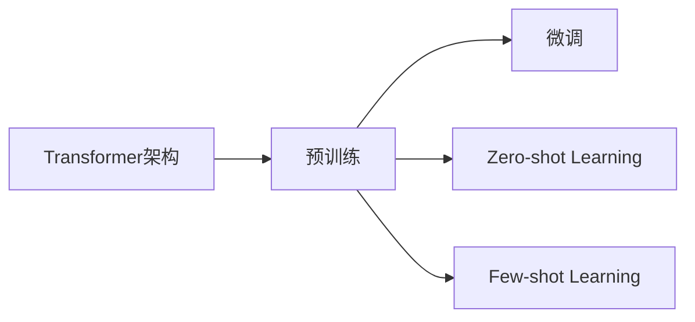

# 大规模语言模型从理论到实践 代码结构

## 1.背景介绍
近年来,大规模语言模型(Large Language Models,LLMs)在自然语言处理(Natural Language Processing,NLP)领域取得了巨大的突破和进展。从2018年的BERT(Bidirectional Encoder Representations from Transformers)到2020年的GPT-3(Generative Pre-trained Transformer 3),再到2021年的PaLM(Pathways Language Model),语言模型的规模和性能不断刷新着业界的认知。

大规模语言模型能够理解和生成接近人类水平的自然语言,在机器翻译、对话系统、文本摘要、问答系统等众多NLP任务上展现出了卓越的性能。它们不仅推动了人工智能技术的发展,也为产业应用带来了新的机遇和挑战。

本文将从理论到实践的角度,深入探讨大规模语言模型的核心概念、算法原理、数学模型、代码结构以及实际应用,力求为读者提供一个全面而深入的认识。

## 2.核心概念与联系
要理解大规模语言模型,首先需要了解其背后的一些核心概念:

### 2.1 Transformer架构
Transformer是一种基于自注意力机制(Self-Attention)的神经网络架构,最早由Google于2017年提出。与传统的RNN(Recurrent Neural Network)和CNN(Convolutional Neural Network)不同,Transformer可以并行计算,大大提高了训练和推理效率。它由编码器(Encoder)和解码器(Decoder)两部分组成,广泛应用于机器翻译、文本生成等任务中。

### 2.2 预训练(Pre-training)
预训练是指在大规模无标注语料上,通过自监督学习(Self-supervised Learning)的方式训练语言模型。常见的预训练任务包括:

- 语言模型:给定上文预测下一个词
- 去噪自编码:随机遮挡部分输入,预测被遮挡的内容
- 对比学习:最大化正样本对的相似度,最小化负样本对的相似度

通过预训练,模型可以学习到语言的通用表示,捕捉词汇、语法、语义等多个层面的特征。预训练好的模型可以进一步用于下游任务的微调(Fine-tuning)。

### 2.3 微调(Fine-tuning) 
微调是指在预训练模型的基础上,使用少量标注数据对模型进行二次训练,使其适应特定的任务。相比从头训练,微调可以显著减少所需的数据量和计算资源,同时取得更好的效果。常见的微调任务有文本分类、命名实体识别、问答等。

### 2.4 Zero-shot/Few-shot Learning
Zero-shot Learning是指模型在没有训练数据的情况下,直接根据任务描述(Task Description)进行推理。Few-shot Learning则是在极少量样本(如10个)的情况下进行学习。大规模语言模型强大的语言理解和生成能力,使其在Zero-shot和Few-shot场景下表现出色,大大拓展了应用范围。

以上几个概念之间环环相扣,共同构成了大规模语言模型的理论基础。Transformer作为底层架构,支撑语言模型的建模学习;预训练使模型掌握语言知识,微调使模型适应具体任务;Zero-shot/Few-shot进一步释放语言模型的潜力,实现更灵活高效的应用。

下图展示了这些概念之间的关系:

## 3.核心算法原理具体操作步骤
大规模语言模型的核心算法主要包括Transformer和各种预训练方法。下面以BERT为例,详细介绍其原理和步骤。

### 3.1 Transformer编码器
BERT采用了Transformer的编码器结构,主要由以下几个部分组成:

1. 输入嵌入(Input Embedding):将输入token映射为dense vector,包括token embedding, position embedding和segment embedding。

2. 多头自注意力层(Multi-Head Self-Attention):通过scaled dot-product attention计算token之间的关系和权重:

$$
Attention(Q,K,V) = softmax(\frac{QK^T}{\sqrt{d_k}})V
$$

其中Q(Query)、K(Key)、V(Value)分别是三个矩阵,由上一层输出线性变换得到。多头机制将输入进行多次线性变换,并行计算多个attention,再concat结果。

3. 前馈神经网络层(Feed-Forward Network):包含两个线性变换和一个ReLU激活:

$$
FFN(x) = max(0, xW_1 + b_1)W_2 + b_2
$$

其中$W_1,W_2,b_1,b_2$为可学习参数。

4. Layer Normalization和残差连接(Residual Connection):每个子层之后进行Layer Norm和残差连接,有助于稳定训练、加快收敛:

$$
LayerNorm(x + Sublayer(x))
$$

BERT的编码器由多个这样的Transformer Block堆叠而成,重复以上计算过程,使模型能够学习到高层次的特征表示。

### 3.2 预训练任务
BERT采用了两个预训练任务:Masked Language Modeling(MLM)和Next Sentence Prediction(NSP)。

#### MLM
随机mask输入序列的部分token(如15%),然后让模型根据上下文预测被mask的token。具体步骤如下:

1. 以一定概率(如15%)随机选择token进行mask
2. 对于每个被mask的token,有80%的概率替换为[MASK],10%的概率替换为随机token,10%的概率保持不变
3. 将mask后的序列输入BERT,用最后一层对应位置的输出向量与词表进行打分
4. 计算被mask token的交叉熵损失,更新模型参数

MLM使模型学会根据双向上下文预测词汇,是一种强有力的自监督语言信号。

#### NSP
NSP任务是判断两个句子在原文中是否相邻。具体步骤如下:

1. 从语料中抽取连续的句子对(A,B)作为正样本
2. 从语料中随机抽取不相邻的句子对(A,C)作为负样本,与正样本数量相同
3. 将句子对拼接并输入BERT,用[CLS]位置的输出向量进行二分类
4. 计算交叉熵损失,更新模型参数

NSP使模型学会判断句子之间的逻辑关系,捕捉更长距离的语言特征。

### 3.3 微调
在特定任务上微调BERT时,主要分为以下步骤:

1. 根据任务对模型结构进行适当修改,如在顶层添加线性分类器
2. 将输入数据格式化为BERT要求的形式,如[CLS] seq1 [SEP] seq2 [SEP]
3. 使用任务数据进行二次训练,更新所有或部分参数
4. 评估模型在任务上的性能,进行超参数调优

微调过程通常只需要较小的数据量和训练轮数即可取得不错的效果。

## 4.数学模型和公式详细讲解举例说明
本节将详细介绍Transformer和BERT中用到的几个关键数学模型和公式,并给出具体的例子帮助理解。

### 4.1 Self-Attention
Self-Attention是Transformer的核心组件,用于计算序列中元素之间的依赖关系。其数学表达式为:

$$Attention(Q,K,V) = softmax(\frac{QK^T}{\sqrt{d_k}})V$$

其中$Q \in \mathbb{R}^{n \times d_k}, K \in \mathbb{R}^{n \times d_k}, V \in \mathbb{R}^{n \times d_v}$分别表示Query、Key、Value矩阵,$n$为序列长度,$d_k$为Key/Query的维度,$d_v$为Value的维度。

举个例子,假设有一个长度为4的序列[I, love, machine, learning],经过embedding后得到矩阵$X \in \mathbb{R}^{4 \times d}$。我们可以通过三个线性变换得到Q、K、V:

$$
\begin{aligned}
Q &= XW^Q \\
K &= XW^K \\
V &= XW^V
\end{aligned}
$$

其中$W^Q \in \mathbb{R}^{d \times d_k}, W^K \in \mathbb{R}^{d \times d_k}, W^V \in \mathbb{R}^{d \times d_v}$为可学习参数。

假设$d_k=d_v=3$,则$Q,K,V$均为$\mathbb{R}^{4 \times 3}$的矩阵。我们可以计算$QK^T$得到一个$4 \times 4$的矩阵,表示每个词对其他词的注意力分数(未归一化):

$$
QK^T = 
\begin{bmatrix} 
1.6 & 0.7 & 0.4 & 1.2 \\ 
0.8 & 2.1 & 1.5 & 0.3 \\
1.1 & 0.6 & 1.9 & 0.5 \\
0.2 & 1.3 & 0.9 & 2.3
\end{bmatrix}
$$

除以$\sqrt{d_k}=\sqrt{3}$后,再经过softmax归一化,得到注意力权重矩阵:

$$
A = softmax(\frac{QK^T}{\sqrt{3}}) = 
\begin{bmatrix}
0.42 & 0.12 & 0.09 & 0.37 \\
0.16 & 0.58 & 0.21 & 0.05 \\
0.28 & 0.10 & 0.52 & 0.10 \\
0.04 & 0.20 & 0.11 & 0.65
\end{bmatrix}
$$

最后将权重矩阵与V相乘,得到输出:

$$
Attention(Q,K,V) = AV = 
\begin{bmatrix}
0.91 & 1.32 & 0.87 \\
1.24 & 1.89 & 1.36 \\
1.08 & 1.71 & 1.15 \\
1.52 & 2.02 & 1.61
\end{bmatrix}
$$

输出矩阵的每一行就是对应位置词的新表示,融合了其他词的信息。Self-Attention的优点是可以一步捕捉任意距离的依赖,且是个可微的、端到端的结构。

### 4.2 Layer Normalization
Layer Normalization是Transformer中常用的归一化方法,有助于稳定训练。设输入为$x \in \mathbb{R}^{n \times d}$,Layer Norm的计算过程为:

$$
\begin{aligned}
\mu &= \frac{1}{d}\sum_{i=1}^d x_i \\
\sigma^2 &= \frac{1}{d}\sum_{i=1}^d (x_i - \mu)^2 \\
\hat{x} &= \frac{x-\mu}{\sqrt{\sigma^2 + \epsilon}} \\
y &= \gamma\hat{x} + \beta
\end{aligned}
$$

其中$\mu,\sigma^2$分别为均值和方差,$\epsilon$为一个小常数(如1e-5)以避免除0,$\gamma,\beta$为可学习的缩放和偏移参数。

举个例子,假设有一个batch的输入$x \in \mathbb{R}^{2 \times 3}$:

$$
x = 
\begin{bmatrix}
1 & 2 & 3 \\
4 & 5 & 6
\end{bmatrix}
$$

沿着最后一维(d=3)计算均值和方差:

$$
\begin{aligned}
\mu &= [\frac{1+2+3}{3}, \frac{4+5+6}{3}] = [2, 5] \\
\sigma^2 &= [\frac{(1-2)^2+(2-2)^2+(3-2)^2}{3}, \frac{(4-5)^2+(5-5)^2+(6-5)^2}{3}] = [1, 1]
\end{aligned}
$$

归一化:

$$
\hat{x} = 
\begin{bmatrix}
\frac{1-2}{\sqrt{1+\epsilon}} & \frac{2-2}{\sqrt{1+\epsilon}} & \frac{3-2}{\sqrt{1+\epsilon}} \\
\frac{4-5}{\sqrt{1+\epsilon}} & \frac{5-5}{\sqrt{1+\epsilon}} & \frac{6-5}{\sqrt{1+\epsilon}}
\end{bmatrix}
=
\begin{bmatrix}
-0.71 & 0 & 0.71 \\
-0.71 & 0 & 0.71
\end{bmatrix}
$$

假设$\gamma = 0.5, \beta = 1.0$,最终输出为:

$$
y = 
\begin{bmatrix}
0.5*(-0.71)+1 & 0.5*0+1 & 