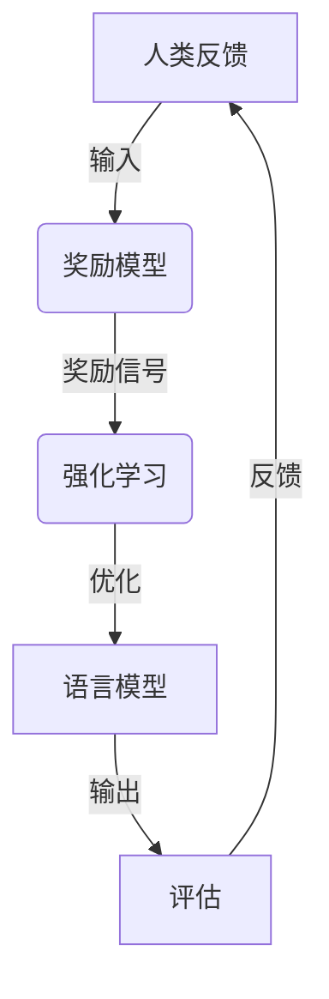

# 大规模语言模型从理论到实践: 基于人类反馈的强化学习流程

## 1. 背景介绍

### 1.1 人工智能的崛起

人工智能(AI)已经成为当代科技发展的核心驱动力,在各个领域都有广泛的应用。近年来,大规模语言模型(Large Language Models, LLMs)凭借其强大的自然语言处理能力,成为人工智能领域最炙手可热的技术之一。

### 1.2 大规模语言模型的重要性

大规模语言模型能够理解和生成人类语言,在机器翻译、问答系统、文本摘要、内容创作等任务中表现出色。它们通过从海量文本数据中学习,掌握了丰富的语言知识和上下文信息,可以产生看似"有思维"的自然语言输出。

### 1.3 人类反馈在语言模型中的作用

尽管大规模语言模型已经取得了长足的进步,但它们仍然存在一些局限性,如偏差、不一致性和不可控性等。为了提高语言模型的性能和可靠性,研究人员开始探索利用人类反馈来优化和调整这些模型。

## 2. 核心概念与联系

### 2.1 强化学习

强化学习(Reinforcement Learning)是机器学习的一个重要分支,它通过与环境交互并获得反馈(奖励或惩罚)来学习最优策略。在语言模型的背景下,强化学习可以利用人类的反馈来调整模型的输出,使其更加符合预期。

### 2.2 人类反馈

人类反馈是指人类对语言模型输出的评价和指导。这可以是明确的奖励或惩罚信号,也可以是更细致的语言反馈,如纠正错误、提供建议或补充信息等。

### 2.3 奖励模型

奖励模型(Reward Model)是一种机器学习模型,它可以根据人类反馈来预测输出的质量或适当性。奖励模型的作用是将人类的主观评价转化为数值化的奖励信号,以指导强化学习过程。

### 2.4 策略优化

策略优化(Policy Optimization)是强化学习中的一种核心技术,它旨在找到一个最优策略,使得在给定环境下获得的累积奖励最大化。在语言模型中,策略优化的目标是调整模型的参数,使其输出更加符合人类的期望。

### 2.5 Mermaid 流程图



该流程图展示了基于人类反馈的强化学习在语言模型中的工作流程。人类反馈被输入到奖励模型中,奖励模型将其转化为数值化的奖励信号,并将这些信号提供给强化学习算法。强化学习算法通过策略优化来调整语言模型的参数,以提高其输出质量。优化后的语言模型将产生新的输出,这些输出将被人类评估并提供反馈,从而形成一个闭环的优化过程。

## 3. 核心算法原理具体操作步骤

### 3.1 数据收集和预处理

在开始强化学习之前,需要收集大量的人类反馈数据。这些数据可以来自众包平台、在线评论或专家注释等渠道。收集的数据需要进行预处理,如去除噪声、标准化格式等,以便后续的模型训练。

### 3.2 训练奖励模型

奖励模型的训练是整个流程的关键步骤之一。常见的方法包括:

1. **监督学习**: 将人类反馈数据作为标签,训练一个回归或分类模型来预测奖励分数。
2. **对比学习(Contrastive Learning)**: 通过对比不同输出的差异,学习一个能够区分好坏输出的奖励模型。
3. **元学习(Meta-Learning)**: 利用元学习算法,从少量的人类反馈中快速学习一个有效的奖励模型。

### 3.3 强化学习优化

获得了奖励模型后,就可以将其应用于强化学习算法中。常见的算法包括:

1. **策略梯度(Policy Gradient)**: 通过计算奖励的梯度,直接优化语言模型的参数。
2. **Q-Learning**: 学习一个状态-行为值函数,指导语言模型做出最优决策。
3. **Actor-Critic**: 结合策略梯度和值函数估计,实现更加稳定和高效的优化。

在优化过程中,还需要注意探索与利用的平衡、奖励塑形(Reward Shaping)等技术,以提高收敛速度和性能。

### 3.4 人机交互和在线学习

为了使语言模型持续学习和改进,可以将其部署到实际应用中,并通过人机交互收集新的反馈数据。这种在线学习方式可以使模型不断适应新的场景和需求,提高其泛化能力。

## 4. 数学模型和公式详细讲解举例说明

### 4.1 策略梯度算法

策略梯度算法是强化学习中最常用的优化方法之一。它的目标是直接优化语言模型的参数 $\theta$,使得在给定的环境中获得的累积奖励 $J(\theta)$ 最大化。

$$J(\theta) = \mathbb{E}_{\tau \sim p_\theta(\tau)} \left[ \sum_{t=0}^T r(s_t, a_t) \right]$$

其中 $\tau = (s_0, a_0, s_1, a_1, \dots, s_T, a_T)$ 表示一个由状态和行为组成的轨迹序列,而 $p_\theta(\tau)$ 是该轨迹在当前策略下的概率密度函数。$r(s_t, a_t)$ 是在状态 $s_t$ 执行行为 $a_t$ 时获得的奖励。

为了最大化 $J(\theta)$,我们可以计算其关于 $\theta$ 的梯度:

$$\nabla_\theta J(\theta) = \mathbb{E}_{\tau \sim p_\theta(\tau)} \left[ \sum_{t=0}^T \nabla_\theta \log p_\theta(a_t | s_t) Q^{\pi_\theta}(s_t, a_t) \right]$$

其中 $Q^{\pi_\theta}(s_t, a_t)$ 是在状态 $s_t$ 执行行为 $a_t$ 后,按照策略 $\pi_\theta$ 行动所能获得的期望累积奖励。通过对梯度进行采样估计和更新,我们可以不断优化语言模型的参数。

### 4.2 对比学习算法

对比学习是训练奖励模型的一种有效方法。它的基本思想是通过对比不同输出的差异,学习一个能够区分好坏输出的奖励函数。

假设我们有一个输出 $x$ 和一个对比输出 $x^-$,我们希望奖励模型 $f_\phi$ 能够给出较高的奖励分数 $f_\phi(x)$,而对于 $x^-$ 给出较低的分数 $f_\phi(x^-)$。我们可以定义如下对比损失函数:

$$\mathcal{L}_\phi = \mathbb{E}_{x, x^-} \left[ \max(0, m - f_\phi(x) + f_\phi(x^-)) \right]$$

其中 $m$ 是一个超参数,控制着对比的边界。通过最小化这个损失函数,我们可以训练出一个能够很好区分好坏输出的奖励模型。

在实践中,我们可以通过各种方式构造对比输出 $x^-$,如随机噪声、低质量输出或人工修改等。同时,也可以引入其他正则项或约束,以提高奖励模型的泛化能力和稳健性。

## 5. 项目实践: 代码实例和详细解释说明

为了更好地理解基于人类反馈的强化学习流程,我们将通过一个简单的示例项目进行实践。在这个项目中,我们将训练一个基于 GPT-2 的语言模型,使其能够根据人类反馈生成更加符合预期的文本输出。

### 5.1 环境设置

首先,我们需要安装所需的Python库,包括PyTorch、Transformers、Datasets等。

```python
!pip install torch transformers datasets
```

然后,我们导入必要的模块和函数。

```python
import torch
from transformers import GPT2LMHeadModel, GPT2Tokenizer
from datasets import load_dataset
```

### 5.2 数据准备

我们将使用一个简单的文本数据集进行训练和测试。在这个示例中,我们使用 Hugging Face Datasets 库中的 `sst2` 数据集,它包含了一些电影评论及其情感标签(正面或负面)。

```python
dataset = load_dataset("sst2")
```

我们将数据集划分为训练集和测试集,并对文本进行标记化,以便输入到语言模型中。

```python
tokenizer = GPT2Tokenizer.from_pretrained("gpt2")

def tokenize(examples):
    return tokenizer(examples["sentence"], truncation=True, padding="max_length", max_length=128)

tokenized_datasets = dataset.map(tokenize, batched=True, remove_columns=["sentence"])
```

### 5.3 奖励模型训练

在这个示例中,我们将使用一个简单的监督学习方法来训练奖励模型。我们将利用数据集中的情感标签作为奖励信号,训练一个分类模型来预测输出文本的质量分数。

```python
from transformers import AutoModelForSequenceClassification

reward_model = AutoModelForSequenceClassification.from_pretrained("distilbert-base-uncased", num_labels=2)

reward_model.train_model(tokenized_datasets["train"])
```

### 5.4 强化学习优化

接下来,我们将初始化一个 GPT-2 语言模型,并使用策略梯度算法对其进行优化。我们将定义一个强化学习环境,在该环境中,语言模型将根据给定的文本前缀生成完整的句子。生成的句子将被奖励模型评分,并将这个分数作为奖励信号,指导语言模型的优化过程。

```python
import gym
from transformers import GPT2LMHeadModel

class TextGenerationEnv(gym.Env):
    def __init__(self, prefix, reward_model, tokenizer):
        self.prefix = prefix
        self.reward_model = reward_model
        self.tokenizer = tokenizer
        self.model = GPT2LMHeadModel.from_pretrained("gpt2")
        
    def step(self, action):
        # 根据动作生成文本
        output = self.model.generate(...)
        
        # 使用奖励模型评估输出
        reward = self.reward_model(output)
        
        # 返回奖励和状态
        return reward, output
    
    def reset(self):
        # 重置环境
        ...

env = TextGenerationEnv(prefix="This movie is", reward_model=reward_model, tokenizer=tokenizer)

# 使用策略梯度算法优化语言模型
optimizer = torch.optim.Adam(env.model.parameters(), lr=1e-5)

for epoch in range(num_epochs):
    state = env.reset()
    episode_rewards = []
    
    for step in range(max_steps):
        action = env.model.sample_action(state)
        reward, next_state = env.step(action)
        episode_rewards.append(reward)
        
        # 计算策略梯度并更新模型参数
        loss = -reward * env.model.log_prob(action)
        loss.backward()
        optimizer.step()
        optimizer.zero_grad()
        
        state = next_state
    
    # 打印episode reward
    print(f"Episode reward: {sum(episode_rewards)}")
```

在这个示例中,我们定义了一个 `TextGenerationEnv` 类作为强化学习环境。在每个时间步,语言模型将根据当前状态(文本前缀)生成下一个单词,并将生成的文本输入到奖励模型中进行评估。根据奖励模型的评分,我们计算策略梯度并更新语言模型的参数。

通过多次迭代这个过程,语言模型将逐步学习生成更加符合预期的文本输出。

### 5.5 在线学习和人机交互

在实际应用中,我们可以将优化后的语言模型部署到生产环境中,并通过人机交互收集新的反馈数据。这些数据可以用于进一步优化奖励模型和语言模型,使它们能够持续学习和改进。

例如,我们可以构建一个聊天机器人系统,让用户与语言模型进行对话。每当用户对模型的回复给出反馈时,