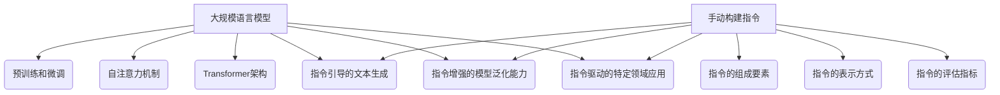

# 大规模语言模型从理论到实践 手动构建指令

## 1. 背景介绍
### 1.1 大规模语言模型的发展历程
#### 1.1.1 早期的语言模型
#### 1.1.2 深度学习时代的语言模型
#### 1.1.3 Transformer 架构的出现

### 1.2 大规模语言模型的应用领域
#### 1.2.1 自然语言处理
#### 1.2.2 对话系统
#### 1.2.3 文本生成

### 1.3 手动构建指令的重要性
#### 1.3.1 提高模型的可控性
#### 1.3.2 增强模型的泛化能力
#### 1.3.3 实现特定领域的应用

大规模语言模型（Large Language Models，LLMs）是近年来自然语言处理领域的重要突破。这些模型通过在海量文本数据上进行预训练，学习到了丰富的语言知识和语义表示，可以应用于各种自然语言处理任务，如机器翻译、文本摘要、问答系统等。

早期的语言模型主要基于统计方法，如 N-gram 模型和隐马尔可夫模型。随着深度学习的兴起，基于神经网络的语言模型逐渐成为主流，如 RNN、LSTM 等。2017年，Google 提出了 Transformer 架构，引入了自注意力机制，大大提高了语言模型的性能。此后，基于 Transformer 的大规模语言模型不断涌现，如 BERT、GPT 系列等。

手动构建指令是大规模语言模型实践中的重要环节。通过精心设计的指令，可以引导模型生成符合特定要求的文本，提高模型的可控性。同时，通过在不同领域和任务上构建指令，可以增强模型的泛化能力，使其适应更广泛的应用场景。此外，针对特定领域构建指令，还可以实现更精准、更专业的文本生成。

## 2. 核心概念与联系
### 2.1 大规模语言模型的核心概念
#### 2.1.1 预训练和微调
#### 2.1.2 自注意力机制
#### 2.1.3 Transformer 架构

### 2.2 手动构建指令的核心概念
#### 2.2.1 指令的组成要素
#### 2.2.2 指令的表示方式
#### 2.2.3 指令的评估指标

### 2.3 大规模语言模型与手动构建指令的联系
#### 2.3.1 指令引导的文本生成
#### 2.3.2 指令增强的模型泛化能力
#### 2.3.3 指令驱动的特定领域应用

大规模语言模型的核心概念包括预训练和微调、自注意力机制以及 Transformer 架构。预训练是在大规模无标注数据上学习通用的语言表示，微调是在特定任务上调整模型参数。自注意力机制允许模型在处理每个词时都能关注到整个输入序列，捕捉长距离依赖关系。Transformer 架构则引入了多头自注意力和位置编码，进一步增强了模型的表示能力。

手动构建指令的核心概念包括指令的组成要素、表示方式和评估指标。一个完整的指令通常由任务描述、输入示例、输出要求等部分组成。指令可以用自然语言或者特定的格式（如 JSON）来表示。评估指令质量的指标包括可读性、完整性、准确性等。

大规模语言模型和手动构建指令密切相关。通过指令引导，可以控制模型生成符合特定要求的文本。精心构建的指令集合可以增强模型的泛化能力，使其适应不同领域和任务。针对特定领域构建的指令，可以使模型生成更专业、更准确的文本。



## 3. 核心算法原理具体操作步骤
### 3.1 大规模语言模型的训练过程
#### 3.1.1 数据准备
#### 3.1.2 模型构建
#### 3.1.3 预训练和微调

### 3.2 手动构建指令的具体步骤
#### 3.2.1 明确任务目标
#### 3.2.2 设计指令格式
#### 3.2.3 撰写指令内容
#### 3.2.4 评估和优化指令

### 3.3 基于指令的文本生成流程
#### 3.3.1 指令解析
#### 3.3.2 模型推理
#### 3.3.3 结果后处理

大规模语言模型的训练过程通常包括数据准备、模型构建、预训练和微调几个步骤。首先需要收集和清洗大量的文本数据，并进行标记和编码。然后根据 Transformer 架构构建模型，设置超参数。在大规模无标注数据上进行预训练，学习通用的语言表示。最后在特定任务的标注数据上进行微调，使模型适应具体的应用场景。

手动构建指令的具体步骤包括明确任务目标、设计指令格式、撰写指令内容以及评估和优化指令。首先要明确指令的目的是什么，要生成怎样的文本。然后设计统一的指令格式，包括必要的组成部分。接着撰写指令的具体内容，可以参考已有的指令示例。最后对指令进行评估，根据反馈不断优化和完善。

基于指令的文本生成流程一般包括指令解析、模型推理和结果后处理三个步骤。首先将指令解析为模型可以理解的格式，提取关键信息。然后将指令输入到预训练好的语言模型中，生成符合要求的文本。最后对生成的文本进行必要的后处理，如过滤、排序、格式化等，得到最终的结果。

## 4. 数学模型和公式详细讲解举例说明
### 4.1 Transformer 的数学原理
#### 4.1.1 自注意力机制的数学表示
#### 4.1.2 多头自注意力的计算过程
#### 4.1.3 位置编码的数学原理

### 4.2 语言模型的评估指标
#### 4.2.1 困惑度（Perplexity）
#### 4.2.2 BLEU 得分
#### 4.2.3 ROUGE 得分

Transformer 的核心是自注意力机制，其数学表示如下：

$$
\text{Attention}(Q, K, V) = \text{softmax}(\frac{QK^T}{\sqrt{d_k}})V
$$

其中 $Q$, $K$, $V$ 分别表示查询向量、键向量和值向量，$d_k$ 是键向量的维度。自注意力机制通过计算查询向量和所有键向量的相似度，得到一个注意力分布，然后根据这个分布对值向量进行加权求和。

多头自注意力则是将自注意力计算多次，每次使用不同的参数，然后将结果拼接起来。设有 $h$ 个头，每个头的维度为 $d_h$，则多头自注意力的计算过程为：

$$
\text{MultiHead}(Q, K, V) = \text{Concat}(\text{head}_1, ..., \text{head}_h)W^O \\
\text{head}_i = \text{Attention}(QW_i^Q, KW_i^K, VW_i^V)
$$

其中 $W_i^Q$, $W_i^K$, $W_i^V$ 和 $W^O$ 是可学习的参数矩阵。

为了引入位置信息，Transformer 还使用了位置编码（Positional Encoding）。位置编码是一个与位置相关的向量，与词嵌入向量相加，得到最终的输入表示。位置编码的第 $i$ 个元素的计算公式为：

$$
\text{PE}(pos, 2i) = \sin(pos / 10000^{2i/d_{model}}) \\
\text{PE}(pos, 2i+1) = \cos(pos / 10000^{2i/d_{model}})
$$

其中 $pos$ 是位置，$i$ 是维度的索引，$d_{model}$ 是词嵌入的维度。

语言模型常用的评估指标包括困惑度、BLEU 得分和 ROUGE 得分。困惑度衡量模型在测试集上的预测能力，计算公式为：

$$
\text{PPL} = \exp(-\frac{1}{N}\sum_{i=1}^N \log p(x_i|x_1, ..., x_{i-1}))
$$

其中 $N$ 是测试集的长度，$p(x_i|x_1, ..., x_{i-1})$ 是模型在给定前 $i-1$ 个词的情况下，对第 $i$ 个词的预测概率。

BLEU 和 ROUGE 则是衡量生成文本与参考文本之间相似度的指标。BLEU 计算生成文本中的 n-gram 与参考文本中的 n-gram 的重合度，ROUGE 计算生成文本与参考文本之间的最长公共子序列、最长公共子串等。

## 5. 项目实践：代码实例和详细解释说明
### 5.1 使用 PyTorch 构建 Transformer 模型
#### 5.1.1 定义 Transformer 的编码器和解码器
#### 5.1.2 实现自注意力机制和前馈神经网络
#### 5.1.3 实现位置编码

### 5.2 在指定数据集上进行预训练和微调
#### 5.2.1 加载和预处理数据
#### 5.2.2 设置训练参数和优化器
#### 5.2.3 进行预训练和微调

### 5.3 使用指令生成文本
#### 5.3.1 构建指令集合
#### 5.3.2 解析指令并生成文本
#### 5.3.3 评估生成文本的质量

下面是使用 PyTorch 构建 Transformer 模型的示例代码：

```python
import torch
import torch.nn as nn

class MultiHeadAttention(nn.Module):
    def __init__(self, d_model, num_heads):
        super().__init__()
        self.d_model = d_model
        self.num_heads = num_heads
        self.head_dim = d_model // num_heads
        
        self.q_linear = nn.Linear(d_model, d_model)
        self.k_linear = nn.Linear(d_model, d_model)
        self.v_linear = nn.Linear(d_model, d_model)
        self.out_linear = nn.Linear(d_model, d_model)
    
    def forward(self, q, k, v, mask=None):
        batch_size = q.size(0)
        
        q = self.q_linear(q).view(batch_size, -1, self.num_heads, self.head_dim).transpose(1, 2)
        k = self.k_linear(k).view(batch_size, -1, self.num_heads, self.head_dim).transpose(1, 2)
        v = self.v_linear(v).view(batch_size, -1, self.num_heads, self.head_dim).transpose(1, 2)
        
        scores = torch.matmul(q, k.transpose(-2, -1)) / torch.sqrt(torch.tensor(self.head_dim, dtype=torch.float32))
        if mask is not None:
            scores = scores.masked_fill(mask == 0, -1e9)
        attn_weights = torch.softmax(scores, dim=-1)
        attn_output = torch.matmul(attn_weights, v)
        
        attn_output = attn_output.transpose(1, 2).contiguous().view(batch_size, -1, self.d_model)
        attn_output = self.out_linear(attn_output)
        
        return attn_output

class PositionalEncoding(nn.Module):
    def __init__(self, d_model, max_len=5000):
        super().__init__()
        pe = torch.zeros(max_len, d_model)
        position = torch.arange(0, max_len, dtype=torch.float).unsqueeze(1)
        div_term = torch.exp(torch.arange(0, d_model, 2).float() * (-torch.log(torch.tensor(10000.0)) / d_model))
        pe[:, 0::2] = torch.sin(position * div_term)
        pe[:, 1::2] = torch.cos(position * div_term)
        pe = pe.unsqueeze(0).transpose(0, 1)
        self.register_buffer('pe', pe)

    def forward(self, x):
        x = x + self.pe[:x.size(0), :]
        return x
```

这里定义了多头自注意力机制的实现，以及位置编码的实现。在实际使用时，还需要定义 Transformer 