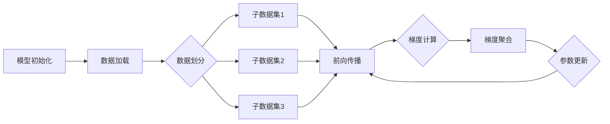

# 大规模语言模型从理论到实践 数据并行

## 1.背景介绍
近年来,随着深度学习的快速发展,大规模语言模型(Large Language Models,LLMs)在自然语言处理(Natural Language Processing,NLP)领域取得了突破性进展。LLMs通过在海量文本数据上进行预训练,可以学习到丰富的语言知识和通用语义表示,在机器翻译、问答系统、文本摘要等任务上表现出色。

然而,训练LLMs面临着巨大的计算资源和存储开销。动辄上百亿参数的模型对单个GPU的内存和算力提出了极高要求。为了突破硬件瓶颈,实现LLMs的高效训练,数据并行(Data Parallelism)成为了一种重要的分布式训练范式。本文将深入探讨数据并行在LLMs训练中的理论基础和实践经验,帮助读者系统掌握这一关键技术。

### 1.1 大规模语言模型的发展历程
#### 1.1.1 Transformer的诞生
#### 1.1.2 从BERT到GPT-3:预训练模型的进化
#### 1.1.3 LLMs的应用场景与挑战

### 1.2 分布式训练的必要性
#### 1.2.1 模型参数量的爆炸式增长  
#### 1.2.2 单机训练的资源瓶颈
#### 1.2.3 分布式训练的优势

### 1.3 数据并行的基本原理
#### 1.3.1 数据划分与任务分配
#### 1.3.2 参数同步与更新策略 
#### 1.3.3 通信开销与性能优化

## 2.核心概念与联系
### 2.1 数据并行与模型并行
#### 2.1.1 两种并行范式的区别
#### 2.1.2 数据并行的适用场景
#### 2.1.3 模型并行的局限性

### 2.2 参数服务器与All-Reduce
#### 2.2.1 参数服务器架构
#### 2.2.2 All-Reduce通信原语
#### 2.2.3 Ring-AllReduce算法

### 2.3 梯度累积与梯度压缩
#### 2.3.1 梯度累积的概念与作用  
#### 2.3.2 梯度稀疏化压缩
#### 2.3.3 Top-K和Random-K压缩

### 2.4 ZeRO优化与混合并行
#### 2.4.1 ZeRO内存优化原理
#### 2.4.2 ZeRO-Offload与ZeRO-Infinity
#### 2.4.3 数据并行与模型并行的结合

## 3.核心算法原理与具体步骤
### 3.1 数据并行训练流程
#### 3.1.1 模型初始化与数据加载
#### 3.1.2 前向传播与损失计算
#### 3.1.3 反向传播与梯度聚合

### 3.2 Ring-AllReduce算法详解
#### 3.2.1 环形拓扑结构
#### 3.2.2 分块传递与归约
#### 3.2.3 时间复杂度分析

### 3.3 Top-K梯度压缩算法
#### 3.3.1 稀疏梯度的筛选
#### 3.3.2 mask位图的生成与同步
#### 3.3.3 误差补偿与动量修正

### 3.4 ZeRO Stage 1-3优化策略
#### 3.4.1 Stage 1:优化器状态分片
#### 3.4.2 Stage 2:梯度分片
#### 3.4.3 Stage 3:参数分片

## 4.数学模型与公式推导
### 4.1 数据并行中的损失函数
$$L(\theta) = \frac{1}{N} \sum_{i=1}^N l_i(\theta)$$
其中$\theta$为模型参数,$N$为数据样本数,$l_i$为第$i$个样本的损失。

### 4.2 分布式SGD的收敛性分析
假设损失函数$L(\theta)$为强凸函数,令学习率为$\eta$,经过$T$轮迭代后,分布式SGD的收敛误差边界为:
$$\mathbb{E} \left\| \theta_T - \theta^* \right\|^2 \leq \frac{2\eta L}{\mu} \left(1 - \frac{\mu}{2\eta}\right)^T \left\| \theta_0 - \theta^* \right\|^2 + \frac{\eta \sigma^2}{\mu N}$$
其中$\mu$为凸函数的强凸常数,$\sigma^2$为梯度估计量的方差,可见增大$N$有助于提高收敛速度。

### 4.3 Top-K压缩的误差分析
令$\widetilde{g}$为Top-K压缩后的梯度,$g$为原始梯度,则有如下压缩误差边界:
$$\mathbb{E} \left\| \widetilde{g} - g \right\|^2 \leq \frac{d-k}{d} \left\| g \right\|^2$$
其中$d$为梯度向量维度,$k$为Top-K算法保留的梯度分量数。增大$k$可以减小压缩误差。

## 5.项目实践:基于PyTorch的数据并行
### 5.1 实验环境与数据准备
```python
import torch
import torch.nn as nn
import torch.optim as optim
import torch.distributed as dist
from torch.nn.parallel import DistributedDataParallel as DDP

# 初始化进程组
dist.init_process_group(backend='nccl')

# 数据加载
train_dataset = ...
train_sampler = torch.utils.data.distributed.DistributedSampler(train_dataset)
train_dataloader = torch.utils.data.DataLoader(train_dataset, batch_size=..., sampler=train_sampler)
```

### 5.2 模型定义与初始化
```python
class MyModel(nn.Module):
    def __init__(self):
        super(MyModel, self).__init__()
        self.fc1 = nn.Linear(784, 512) 
        self.fc2 = nn.Linear(512, 10)
        
    def forward(self, x):
        x = torch.flatten(x, 1)
        x = self.fc1(x)
        x = nn.functional.relu(x)
        output = self.fc2(x)
        return output

model = MyModel().to(device)
model = DDP(model, device_ids=[dist.get_rank()])        
```

### 5.3 优化器与训练循环
```python
optimizer = optim.SGD(model.parameters(), lr=0.01)

for epoch in range(10):
    for data, target in train_dataloader:
        optimizer.zero_grad()
        output = model(data)
        loss = nn.functional.cross_entropy(output, target)
        loss.backward()
        optimizer.step()
```

### 5.4 梯度压缩与ZeRO优化
```python
from deepspeed.ops.adam import DeepSpeedCPUAdam
from deepspeed.ops.op_builder import UtilsBuilder

compression_parameters = {
    "method": "topk",
    "k": 0.5, 
    "fp16": True,
}

model, optimizer, _, _ = deepspeed.initialize(
    model=model,
    optimizer=optimizer,
    args=args,
    dist_init_required=True,
    config=compression_parameters
)
```

## 6.实际应用场景
### 6.1 机器翻译
#### 6.1.1 Transformer在并行环境下的训练
#### 6.1.2 数据并行在低资源语言翻译中的应用

### 6.2 智能问答
#### 6.2.1 基于GPT的开放域问答系统
#### 6.2.2 知识蒸馏与模型压缩

### 6.3 文本生成
#### 6.3.1 基于Top-K采样的文本生成
#### 6.3.2 零样本学习与小样本微调

## 7.工具与资源推荐
### 7.1 分布式训练框架
- Horovod: 支持TensorFlow、PyTorch、MXNet等
- BytePS: 字节跳动开源的分布式训练框架
- DeepSpeed: 微软开源的深度学习优化库

### 7.2 模型并行工具
- Megatron-LM: NVIDIA开源的transformer语言模型并行训练工具
- FairScale: Facebook开源的PyTorch扩展库,支持管道并行、张量并行等

### 7.3 预训练模型与数据集
- HuggingFace Transformers: 包含BERT、GPT、T5等预训练模型
- The Pile: 包含22种不同语料的800GB英文文本数据集
- CLUE: 中文语言理解测评基准

## 8.总结:未来发展趋势与挑战
### 8.1 模型规模的持续增长
### 8.2 新型并行范式的探索
### 8.3 计算与通信优化
### 8.4 绿色AI与能效提升

## 9.附录:常见问题解答
### 9.1 数据并行相比单卡训练有何加速效果?
### 9.2 如何权衡数据并行的Batch Size与训练时长?
### 9.3 梯度压缩会带来精度损失吗?
### 9.4 ZeRO内存优化对训练速度有影响吗?



以上是一个基于数据并行的分布式训练流程示意图。首先对模型进行初始化,并加载训练数据集。然后根据并行度将数据划分为多个子集,分别在不同设备上进行前向传播和梯度计算。接着通过All-Reduce等通信原语对梯度进行聚合,再利用优化器更新模型参数,进入下一轮迭代直至训练结束。

大规模语言模型的数据并行训练是NLP领域的重要话题。面对模型参数量和数据规模的急剧膨胀,传统的单机训练方式已难以为继。采用数据并行策略,借助多个设备的并行计算能力,可以显著提升LLMs的训练效率。同时,梯度压缩、ZeRO内存优化等技术有助于突破设备算力和带宽的限制,进一步扩展模型规模。

展望未来,大模型的训练必将向万亿、万万亿参数量级迈进。新的并行范式如流水线并行、序列并行等值得关注与探索。而从通信、计算、存储等多个层面对并行训练进行优化,也是推动大模型产业化落地的必由之路。人工智能正从感知智能走向认知智能、决策智能的新阶段,大规模语言模型必将在其中扮演重要角色。

作者：禅与计算机程序设计艺术 / Zen and the Art of Computer Programming