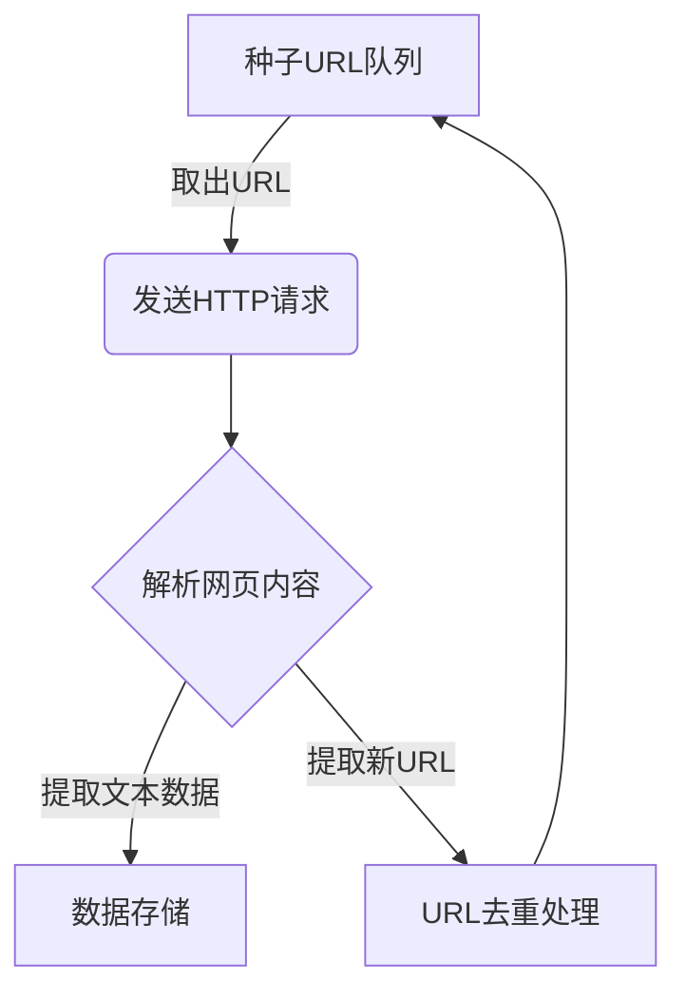
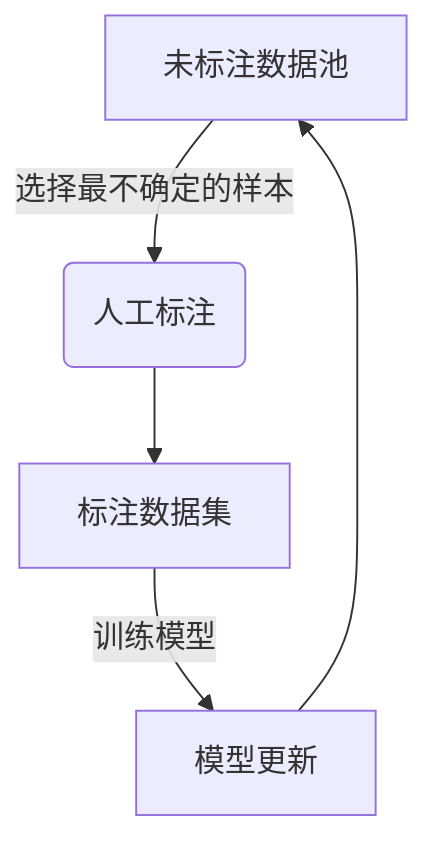

# 大规模语言模型从理论到实践：数据预处理

## 1. 背景介绍

### 1.1 大规模语言模型的兴起

近年来,大规模语言模型(Large Language Models, LLMs)在自然语言处理(NLP)领域掀起了一场革命。这些模型通过在海量文本数据上进行预训练,学习了丰富的语言知识和上下文信息,展现出令人惊叹的语言生成、理解和推理能力。

GPT(Generative Pre-trained Transformer)、BERT(Bidirectional Encoder Representations from Transformers)、XLNet、RoBERTa等模型在各种NLP任务上取得了卓越的性能,推动了该领域的快速发展。随着模型规模和训练数据量的不断增长,LLMs正在向着通用人工智能(Artificial General Intelligence, AGI)的目标迈进。

### 1.2 数据预处理的重要性

尽管LLMs展现出了强大的语言能力,但它们的性能高度依赖于训练数据的质量和规模。高质量的训练数据不仅能够提高模型的准确性和泛化能力,还能够减少模型在生成过程中出现不当或有害内容的风险。

因此,数据预处理在LLMs的训练过程中扮演着至关重要的角色。它涉及多个环节,包括数据采集、清洗、标注、增强等,旨在从原始数据中提取有价值的信息,并将其转换为模型可以高效学习的格式。

本文将深入探讨LLMs数据预处理的各个方面,包括核心概念、算法原理、实践技巧、应用场景等,为读者提供全面的理解和实用的指导。

## 2. 核心概念与联系

### 2.1 数据采集

数据采集是数据预处理的第一步,也是确保模型训练质量的关键环节。LLMs需要大量的高质量文本数据作为训练资源,因此采集过程需要考虑数据的多样性、覆盖面、权威性等因素。常见的数据来源包括网页、书籍、论文、新闻报道、社交媒体等。

### 2.2 数据清洗

原始数据通常包含各种噪声和无效信息,如HTML标签、垃圾数据、重复内容等,这些信息会影响模型的学习效果。数据清洗旨在去除这些无用信息,提高数据质量。常见的清洗技术包括正则表达式匹配、语言检测、重复数据删除等。

### 2.3 数据标注

对于一些需要监督学习的NLP任务,如文本分类、命名实体识别等,需要对数据进行人工标注。标注过程通常耗时耗力,因此需要采用高效的标注策略和工具。常见的标注方法包括众包标注、主动学习等。

### 2.4 数据增强

由于真实数据的局限性,有时需要通过数据增强技术来扩充训练数据,提高模型的泛化能力。常见的数据增强方法包括回译(Back-translation)、同义词替换、随机插入/删除/交换等。

### 2.5 数据格式化

不同的LLMs对输入数据格式有不同的要求。例如,BERT模型需要将输入文本转换为词元(Token)序列,而GPT模型则需要将文本拆分为字节对(Byte-Pair Encoding, BPE)。因此,数据格式化是将预处理后的数据转换为模型可接受的格式的过程。

## 3. 核心算法原理具体操作步骤

### 3.1 数据采集算法

#### 3.1.1 网页爬虫

网页爬虫是一种自动化程序,用于从互联网上采集网页数据。它通常包括以下步骤:

1. 种子URL队列初始化
2. 从队列中取出一个URL,发送HTTP请求获取网页内容
3. 解析网页内容,提取有用的文本数据
4. 从网页中提取新的URL,加入种子队列
5. 重复步骤2-4,直到满足停止条件(如达到预设数据量或遍历深度)



#### 3.1.2 API数据采集

许多网站和服务提供了API接口,允许开发者直接访问和下载其数据。API数据采集的步骤如下:

1. 查阅API文档,了解数据结构和访问方式
2. 构造API请求URL和参数
3. 发送HTTP请求,获取API响应数据
4. 解析响应数据,提取有用信息
5. 根据需要,分页或递归地获取更多数据

### 3.2 数据清洗算法

#### 3.2.1 正则表达式匹配

正则表达式是一种强大的文本模式匹配工具,可用于清除HTML标签、特殊字符、链接等无用信息。例如,以下正则表达式可用于去除HTML标签:

```python
import re

text = "<p>Hello, <b>world</b>!</p>"
cleaned_text = re.sub(r'<[^>]+>', '', text)
print(cleaned_text)  # 输出: "Hello, world!"
```

#### 3.2.2 语言检测

对于多语言数据集,可以使用语言检测算法识别每段文本的语言,并保留目标语言的数据。常见的语言检测库包括`langdetect`和`langid`。

```python
from langdetect import detect

text1 = "This is an English sentence."
text2 = "这是一个中文句子。"

print(detect(text1))  # 输出: "en"
print(detect(text2))  # 输出: "zh-cn"
```

#### 3.2.3 重复数据删除

重复数据会影响模型的学习效率和性能。可以使用哈希函数(如MD5或SHA-256)计算每段文本的唯一标识,并基于此删除重复数据。

```python
import hashlib

texts = ["Hello, world!", "Hello, world!", "This is unique."]
unique_texts = set()
for text in texts:
    hash_value = hashlib.sha256(text.encode()).hexdigest()
    unique_texts.add((hash_value, text))

print([text for _, text in unique_texts])
# 输出: ["Hello, world!", "This is unique."]
```

### 3.3 数据标注算法

#### 3.3.1 主动学习

主动学习是一种有效的标注策略,它通过智能地选择最有价值的数据进行人工标注,从而最大化标注效率。常见的主动学习算法包括不确定性采样、查询策略等。



#### 3.3.2 众包标注

众包标注是将标注任务外包给大量的在线工人的过程。它可以快速获得大量的标注数据,但质量控制是一个挑战。常见的众包平台包括Amazon Mechanical Turk、Figure Eight等。

### 3.4 数据增强算法

#### 3.4.1 回译

回译(Back-translation)是一种常用的数据增强技术。它先将源语言文本翻译成目标语言,然后再将目标语言文本翻译回源语言,生成的新文本可用于扩充训练数据。


#### 3.4.2 同义词替换

同义词替换是一种简单但有效的数据增强方法。它通过在原始文本中随机替换某些单词的同义词,生成新的语义等价的文本。

```python
from nltk.corpus import wordnet

def synonym_replacement(text, n=1):
    words = text.split()
    new_words = words.copy()
    random_word_indices = random.sample(range(len(words)), n)

    for word_idx in random_word_indices:
        synonyms = wordnet.synsets(words[word_idx])
        if synonyms:
            synonym = random.choice(synonyms).lemmas()[0].name()
            new_words[word_idx] = synonym

    return ' '.join(new_words)
```

#### 3.4.3 随机插入/删除/交换

这是一种简单的数据增强方法,通过在原始文本中随机插入、删除或交换单词,生成新的文本样本。

```python
import random

def random_operation(text):
    words = text.split()
    operation = random.choice(["insert", "delete", "swap"])

    if operation == "insert":
        random_idx = random.randint(0, len(words))
        new_word = random_string()
        words = words[:random_idx] + [new_word] + words[random_idx:]
    elif operation == "delete":
        if words:
            random_idx = random.randint(0, len(words) - 1)
            words.pop(random_idx)
    else:
        if len(words) > 1:
            random_idx1, random_idx2 = random.sample(range(len(words)), 2)
            words[random_idx1], words[random_idx2] = words[random_idx2], words[random_idx1]

    return ' '.join(words)
```

### 3.5 数据格式化算法

#### 3.5.1 BERT词元化

BERT模型要求输入文本被转换为词元(Token)序列。这个过程包括词元化(Tokenization)和填充(Padding)两个步骤。

```python
from transformers import BertTokenizer

tokenizer = BertTokenizer.from_pretrained('bert-base-uncased')

text = "This is an example sentence."
tokens = tokenizer.tokenize(text)
# 输出: ['This', 'is', 'an', 'example', 'sentence', '.']

ids = tokenizer.convert_tokens_to_ids(tokens)
# 输出: [1188, 1109, 1122, 7615, 4305, 119]

padded_ids = tokenizer.build_inputs_with_special_tokens(ids)
# 输出: [101, 1188, 1109, 1122, 7615, 4305, 119, 102]
```

#### 3.5.2 GPT BPE编码

GPT模型采用字节对编码(Byte-Pair Encoding, BPE)将文本转换为token序列。BPE算法通过迭代地合并最频繁的连续字节对,将单词分解为子词单元。

```python
from transformers import GPT2TokenizerFast

tokenizer = GPT2TokenizerFast.from_pretrained("gpt2")

text = "This is an example sentence."
tokens = tokenizer.tokenize(text)
# 输出: ['This', 'Ġis', 'Ġan', 'Ġexample', 'Ġsentence', '.']

ids = tokenizer.convert_tokens_to_ids(tokens)
# 输出: [18435, 265, 284, 13278, 27339, 13]
```

## 4. 数学模型和公式详细讲解举例说明

在数据预处理过程中,有一些常用的数学模型和公式,可以帮助我们量化和优化相关算法。

### 4.1 文本相似度

文本相似度度量是数据清洗和去重的重要工具。常用的相似度计算方法包括余弦相似度、编辑距离等。

#### 4.1.1 余弦相似度

余弦相似度通过计算两个向量的夹角余弦值来衡量它们的相似程度。在NLP中,我们可以将文本表示为词袋(Bag-of-Words)或词向量(Word Embeddings)的向量形式,然后计算它们的余弦相似度。

$$\text{cos\_sim}(A, B) = \frac{A \cdot B}{\|A\| \|B\|}$$

其中$A$和$B$分别表示两个文本的向量表示,$\cdot$表示向量点积,$ \| \cdot \| $表示向量的$L_2$范数。

例如,给定两个句子"This is a good book."和"The book is good.",我们可以计算它们的词袋向量表示:

$$
A = [1, 1, 1, 1, 0, 0, 0, 0]\\
B = [1, 0, 0, 1, 1, 1, 0, 0]
$$

则它们的余弦相似度为:

$$
\text{cos\_sim}(A, B) = \frac{1 \times 1 + 1 \times 0 + 1 \times 0 + 1 \times 1}{\sqrt{1^2 + 1^2 + 1^2 + 1^2} \times \sqrt{1^2 + 0^2 + 0^2 + 1^2 + 1^2 + 1^2}} = \frac{2}{\sqrt{4} \times \sqrt{4}} = 0.5
$$

#### 4.1.2 编辑距离

编辑距离(Edit Distance)是计算两个字符串之间的差异程度的一种方法。它表示将一个字符串转换