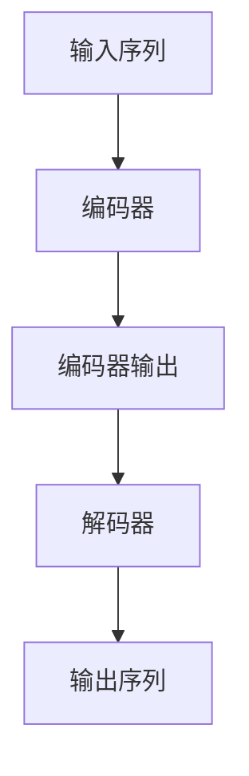
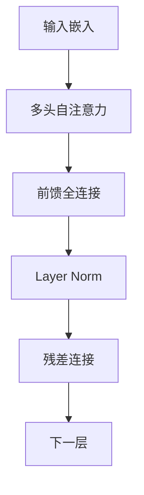

# 大规模语言模型从理论到实践 智能代理

## 1.背景介绍

### 1.1 语言模型的兴起

语言模型是自然语言处理领域的核心技术之一,近年来随着深度学习的飞速发展,大规模语言模型取得了令人瞩目的成就。语言模型的目标是学习语言的概率分布,即给定一段文本,模型能够预测下一个词或字符的概率。传统的语言模型基于统计方法,如n-gram模型,但受限于数据稀疏问题和上下文利用能力。

### 1.2 深度学习语言模型

深度学习语言模型通过神经网络来建模语言的复杂结构,能够有效捕捉长距离依赖关系。早期的循环神经网络(RNN)和长短期记忆网络(LSTM)为序列建模奠定了基础。2017年,Transformer模型的提出极大地推动了语言模型的发展,通过注意力机制来更好地捕捉长程依赖关系。自注意力机制使模型能够并行计算,大大提高了训练效率。

### 1.3 大规模语言模型的兴起

随着算力和数据的不断增长,训练大规模语言模型成为可能。GPT(Generative Pre-trained Transformer)是第一个真正大规模的语言模型,它在大量无监督文本数据上进行预训练,获得了通用的语言表示能力。GPT-3更是达到了惊人的1750亿参数规模,展现出强大的文本生成和理解能力。

除了GPT系列,还有BERT、XLNet、RoBERTa等优秀的语言模型,它们在自然语言理解任务上取得了state-of-the-art的成绩。大规模语言模型已经成为自然语言处理的核心基础设施,为下游任务提供了强大的语义表示能力。

## 2.核心概念与联系

### 2.1 自注意力机制(Self-Attention)

自注意力机制是Transformer模型的核心,它允许模型在计算目标词的表示时,直接关注整个输入序列中的所有词,而不是仅依赖于局部窗口。这种全局依赖建模能力是自注意力机制的关键优势。

自注意力机制的计算过程如下:

$$\begin{aligned}
Q &= XW_Q \\
K &= XW_K \\
V &= XW_V \\
\text{Attention}(Q, K, V) &= \text{softmax}(\frac{QK^T}{\sqrt{d_k}})V
\end{aligned}$$

其中$Q$、$K$、$V$分别表示Query、Key和Value,它们是通过线性变换从输入$X$计算得到的。注意力分数由$Q$和$K$的点积计算,然后通过softmax函数归一化。最终的注意力表示是注意力分数与$V$的加权和。

自注意力机制允许模型自适应地为每个目标词分配不同的注意力分布,从而更好地建模长程依赖关系。

### 2.2 Transformer 编码器-解码器架构

Transformer采用了编码器-解码器的架构,用于序列到序列(Seq2Seq)的建模任务,如机器翻译、文本摘要等。编码器将输入序列编码为上下文表示,解码器则根据上下文表示生成目标序列。

编码器是由多个相同的层堆叠而成,每一层包含两个子层:多头自注意力层和前馈全连接层。解码器也由类似的子层组成,但在自注意力层之前,还引入了一个编码器-解码器注意力层,用于关注编码器的输出表示。

编码器-解码器架构使Transformer能够灵活地处理不同长度的输入和输出序列,并通过注意力机制直接建模它们之间的依赖关系。

### 2.3 预训练与微调(Pre-training & Fine-tuning)

大规模语言模型通常采用两阶段训练策略:预训练和微调。

预训练阶段是在大量无监督文本数据上训练模型,目的是获得通用的语言表示能力。常见的预训练目标包括:

- 掩码语言模型(Masked Language Modeling, MLM):预测被掩码的词
- 下一句预测(Next Sentence Prediction, NSP):判断两个句子是否相邻
- 自回归语言模型(Autoregressive Language Modeling):预测下一个词

预训练后的模型参数将被用作初始化,再通过有监督的微调(Fine-tuning)阶段,使模型专门针对某个下游任务(如文本分类、机器阅读理解等)进行优化。微调阶段的数据量通常较小,但能够快速收敛并取得很好的性能。

预训练-微调范式使得大规模语言模型能够在多个任务上重复使用,极大地提高了训练效率。同时,预训练模型也可以作为强大的语义表示提取器,为其他自然语言处理任务提供服务。

## 3.核心算法原理具体操作步骤

### 3.1 Transformer 模型架构

Transformer 模型由编码器和解码器两个主要部分组成,每个部分又由多个相同的层堆叠而成。我们先来看编码器的结构:

1. 首先,将输入序列通过嵌入层映射为向量表示。
2. 然后,输入向量序列经过多头自注意力子层,捕捉输入序列中词与词之间的依赖关系。
3. 自注意力的输出再通过前馈全连接子层,对每个词的表示进行非线性变换。
4. 每个子层的输出都会进行层归一化(Layer Normalization),并与子层的输入进行残差连接,以缓解梯度消失问题。
5. 上述过程在编码器的每一层中重复进行,最终输出是编码器的最终表示。

解码器的结构与编码器类似,但在自注意力子层之前,还引入了一个编码器-解码器注意力子层,用于关注编码器的输出表示。此外,解码器的自注意力子层采用了掩码机制,确保在生成每个词时,只关注已生成的词序列。

### 3.2 自注意力机制计算过程

自注意力机制是 Transformer 模型的核心,它允许模型直接捕捉输入序列中任意两个词之间的依赖关系。我们来看看自注意力的具体计算过程:

1. 首先,将输入序列 $X$ 通过三个不同的线性变换,分别得到 Query($Q$)、Key($K$)和 Value($V$)矩阵:

$$\begin{aligned}
Q &= XW_Q \\
K &= XW_K \\
V &= XW_V
\end{aligned}$$

2. 计算 Query 与所有 Key 的点积,得到注意力分数矩阵:

$$\text{Attention Scores} = QK^T$$

3. 对注意力分数矩阵进行缩放处理,以避免较大的值导致softmax函数饱和:

$$\text{Attention Weights} = \text{softmax}(\frac{\text{Attention Scores}}{\sqrt{d_k}})$$

其中 $d_k$ 是 Key 向量的维度。

4. 将注意力权重与 Value 矩阵相乘,得到每个位置的加权和表示:

$$\text{Attention Output} = \text{Attention Weights} \cdot V$$

5. 对于多头自注意力,我们将上述过程重复执行 $h$ 次(即 $h$ 个不同的线性变换),并将所有头的输出进行拼接:

$$\text{MultiHead}(Q, K, V) = \text{Concat}(\text{head}_1, \ldots, \text{head}_h) W^O$$

其中 $\text{head}_i = \text{Attention}(QW_i^Q, KW_i^K, VW_i^V)$。

通过自注意力机制,Transformer 模型能够直接关注输入序列中的所有位置,从而有效地捕捉长程依赖关系。与 RNN 相比,自注意力机制避免了递归计算,可以高效并行化,极大地提高了计算效率。

## 4.数学模型和公式详细讲解举例说明

### 4.1 Transformer 模型损失函数

Transformer 模型通常采用自回归语言模型(Autoregressive Language Modeling)的训练目标,即最大化生成序列的条件概率:

$$\begin{aligned}
\mathcal{L}(\theta) &= -\sum_{t=1}^T \log P(y_t | y_{<t}, X; \theta) \\
&= -\sum_{t=1}^T \log \frac{\exp(h_t^\top v_{y_t})}{\sum_{y'} \exp(h_t^\top v_{y'})}
\end{aligned}$$

其中:

- $\theta$ 表示模型参数
- $X$ 为输入序列
- $y_t$ 为目标序列第 $t$ 个词
- $y_{<t}$ 为目标序列前 $t-1$ 个词
- $h_t$ 为解码器在时间步 $t$ 的隐状态
- $v_y$ 为词表中词 $y$ 对应的词向量

损失函数采用交叉熵形式,即目标词的对数概率之负值。在训练时,我们需要最小化该损失函数,使模型能够更好地预测目标序列。

### 4.2 注意力分数计算

注意力机制是 Transformer 模型的核心,它通过计算 Query 与 Key 的相关性得分,从而确定对 Value 的加权。具体来说,对于序列中的第 $i$ 个位置,其注意力分数计算如下:

$$\begin{aligned}
e_{i,j} &= \frac{q_i^\top k_j}{\sqrt{d_k}} \\
\alpha_{i,j} &= \text{softmax}(e_{i,j}) = \frac{\exp(e_{i,j})}{\sum_{l=1}^n \exp(e_{i,l})}
\end{aligned}$$

其中:

- $q_i$、$k_j$ 分别为第 $i$ 个 Query 向量和第 $j$ 个 Key 向量
- $d_k$ 为 Key 向量的维度
- $\alpha_{i,j}$ 为第 $i$ 个位置对第 $j$ 个位置的注意力权重

注意力权重 $\alpha_{i,j}$ 通过 softmax 函数进行归一化,确保所有权重之和为 1。最终,第 $i$ 个位置的注意力表示为所有 Value 向量的加权和:

$$\text{Attention}(i) = \sum_{j=1}^n \alpha_{i,j} v_j$$

其中 $v_j$ 为第 $j$ 个 Value 向量。

通过注意力机制,Transformer 模型能够自适应地为每个位置分配不同的注意力权重,从而有效捕捉输入序列中的长程依赖关系。

### 4.3 Transformer 解码器的掩码自注意力

在 Transformer 解码器中,自注意力子层采用了掩码机制,确保在生成每个词时,只关注已生成的词序列。具体来说,对于序列中的第 $i$ 个位置,我们将其与序列前 $i-1$ 个位置的 Key 和 Value 进行注意力计算:

$$\begin{aligned}
e_{i,j} &= \begin{cases}
\frac{q_i^\top k_j}{\sqrt{d_k}} & \text{if } j < i \\
-\infty & \text{if } j \geq i
\end{cases} \\
\alpha_{i,j} &= \text{softmax}(e_{i,j}) \\
\text{Attention}(i) &= \sum_{j=1}^{i-1} \alpha_{i,j} v_j
\end{aligned}$$

通过将未来位置的注意力分数设置为负无穷,softmax 函数将其对应的注意力权重置为 0,从而实现了掩码效果。

掩码自注意力机制确保了解码器在生成每个词时,只依赖于已生成的词序列,避免了未来信息的泄露。这种自回归(Autoregressive)的生成方式,保证了解码器的输出是符合语言的逻辑和语法的。

## 5.项目实践:代码实例和详细解释说明

为了更好地理解 Transformer 模型的实现细节,我们将使用 PyTorch 框架,构建一个简化版本的 Transformer 模型。完整代码可在 GitHub 上获取:https://github.com/zhangzhao156/transformer