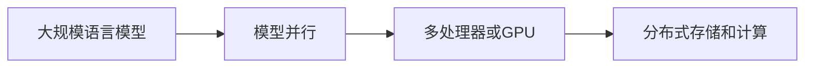

## 1.背景介绍

在过去的几年中，人工智能和机器学习领域发生了翻天覆地的变化。其中，深度学习模型，尤其是大规模语言模型，已经成为了这个领域的研究热点。然而，随着模型规模的增大，传统的训练方法已经无法满足需求，我们需要更加高效的训练策略。模型并行就是解决这个问题的一个重要方法。

## 2.核心概念与联系

模型并行是一种并行化训练深度学习模型的技术。它通过在多个处理器或者GPU上分布式地存储和计算模型的不同部分，从而使得大规模模型的训练成为可能。



## 3.核心算法原理具体操作步骤

模型并行的基本步骤包括以下几个部分：

1. **模型切分**：将大规模模型切分成多个小模型，每个小模型都可以在单个处理器或者GPU上运行。

2. **数据分配**：将输入数据分配给各个小模型，每个小模型只处理分配给它的数据。

3. **并行计算**：各个小模型并行地进行前向和反向传播。

4. **梯度聚合**：将各个小模型的梯度聚合起来，得到最终的模型梯度。

5. **参数更新**：根据聚合的梯度更新模型参数。

## 4.数学模型和公式详细讲解举例说明

假设我们有一个大规模模型，模型的参数是$\theta$，损失函数是$L$，输入数据是$x$，目标输出是$y$。

在模型并行中，我们首先将大规模模型切分成$n$个小模型，每个小模型的参数是$\theta_i$，$i=1,2,...,n$。

对于每个小模型，我们有：

$$
\begin{aligned}
& \text{前向传播：} z_i = f_i(x, \theta_i) \\
& \text{损失计算：} L_i = l(z_i, y) \\
& \text{反向传播：} g_i = \frac{\partial L_i}{\partial \theta_i}
\end{aligned}
$$

其中，$f_i$是小模型的前向传播函数，$l$是损失函数，$g_i$是小模型的梯度。

然后，我们将所有小模型的梯度聚合起来，得到最终的模型梯度：

$$
g = \sum_{i=1}^{n} g_i
$$

最后，我们根据聚合的梯度更新模型参数：

$$
\theta = \theta - \eta g
$$

其中，$\eta$是学习率。

## 5.项目实践：代码实例和详细解释说明

这是一个使用PyTorch实现模型并行的简单例子：

```python
import torch
import torch.nn as nn

# 定义模型
class Model(nn.Module):
    def __init__(self):
        super(Model, self).__init__()
        self.layer1 = nn.Linear(10, 10).to('cuda:0')
        self.layer2 = nn.Linear(10, 10).to('cuda:1')

    def forward(self, x):
        x = self.layer1(x.to('cuda:0'))
        return self.layer2(x.to('cuda:1'))

# 实例化模型
model = Model()

# 定义损失函数和优化器
criterion = nn.MSELoss()
optimizer = torch.optim.SGD(model.parameters(), lr=0.01)

# 训练模型
for inputs, targets in dataloader:
    optimizer.zero_grad()
    outputs = model(inputs)
    loss = criterion(outputs, targets)
    loss.backward()
    optimizer.step()
```

在这个例子中，我们首先定义了一个模型，模型有两个线性层，分别在两个不同的GPU上。然后，我们定义了损失函数和优化器，用于训练模型。在训练过程中，我们首先将输入数据送到第一个GPU上，然后将经过第一层处理后的数据送到第二个GPU上，最后计算损失并进行反向传播和参数更新。

## 6.实际应用场景

模型并行在许多领域都有应用，例如自然语言处理、计算机视觉、推荐系统等。其中，自然语言处理是模型并行最为广泛的应用领域，特别是在训练Transformer-based的大规模语言模型，如GPT-3、BERT等。

## 7.工具和资源推荐

在实际应用中，我们可以使用一些开源库来简化模型并行的实现，例如PyTorch的`torch.nn.DataParallel`和`torch.nn.parallel.DistributedDataParallel`，以及TensorFlow的`tf.distribute`。

## 8.总结：未来发展趋势与挑战

随着模型规模的不断增大，模型并行的重要性也在不断提高。然而，模型并行也面临着许多挑战，例如通信开销、负载均衡、容错性等。未来，我们需要继续研究和开发更加高效的模型并行技术，以满足大规模模型训练的需求。

## 9.附录：常见问题与解答

**Q: 模型并行和数据并行有什么区别？**

A: 模型并行是将模型分布在多个处理器或者GPU上，每个处理器或者GPU负责模型的一部分。数据并行是将数据分布在多个处理器或者GPU上，每个处理器或者GPU负责数据的一部分。在模型并行中，每个处理器或者GPU都需要处理整个数据集，而在数据并行中，每个处理器或者GPU只需要处理数据集的一部分。

**Q: 如何选择模型并行和数据并行？**

A: 这取决于你的具体需求。如果你的模型非常大，无法在单个处理器或者GPU上运行，那么你可能需要使用模型并行。如果你的数据集非常大，无法在单个处理器或者GPU上存储，那么你可能需要使用数据并行。在某些情况下，你也可以同时使用模型并行和数据并行。

作者：禅与计算机程序设计艺术 / Zen and the Art of Computer Programming