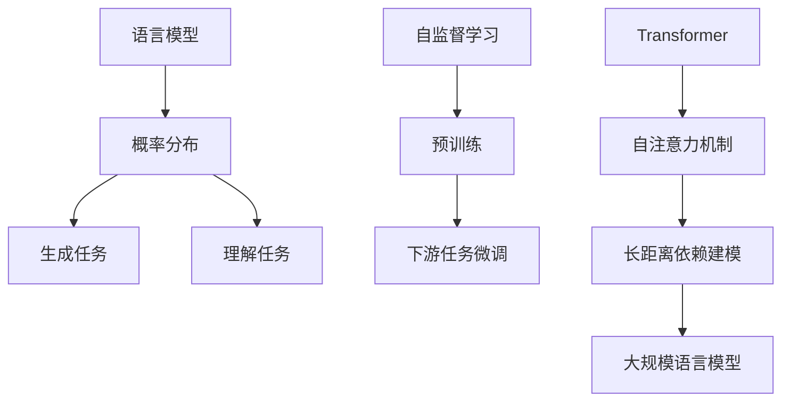

# 大规模语言模型从理论到实践：模型训练

## 1. 背景介绍

### 1.1 语言模型的重要性

语言模型是自然语言处理领域的基础技术之一。它们旨在捕捉语言的统计规律,并为下游任务提供强大的语言理解和生成能力。随着深度学习技术的快速发展,大规模语言模型已成为当前研究的热点。这些模型通过在大量文本数据上进行预训练,学习到丰富的语言知识,可以在广泛的自然语言处理任务中发挥出色的性能。

### 1.2 大规模语言模型的兴起

近年来,计算能力的飞速提升和海量文本数据的积累,为训练大规模语言模型奠定了坚实的基础。2018年,Transformer模型在机器翻译任务中取得了突破性的成果,随后被应用于语言模型的预训练,催生了一系列里程碑式的大规模语言模型,如GPT、BERT、XLNet等。这些模型在下游任务中展现出了强大的迁移能力,推动了自然语言处理领域的快速发展。

### 1.3 大规模语言模型的挑战

尽管取得了令人瞩目的成就,但训练大规模语言模型仍面临着诸多挑战。首先,海量的训练数据和参数规模导致了巨大的计算和存储开销。其次,如何高效地利用分布式训练系统,以及如何设计高性能的模型架构,都是亟待解决的问题。此外,大规模语言模型也存在一些潜在风险,如隐私泄露、偏见传播等,需要格外重视。

## 2. 核心概念与联系



### 2.1 语言模型与概率分布

语言模型本质上是一个概率分布模型,旨在估计一个语句或文本序列的概率。给定一个长度为 $n$ 的词序列 $\mathbf{x} = (x_1, x_2, \dots, x_n)$,语言模型需要计算该序列的概率 $P(\mathbf{x})$。根据链式法则,该概率可以分解为:

$$P(\mathbf{x}) = \prod_{t=1}^n P(x_t | x_1, \dots, x_{t-1})$$

语言模型的目标是估计上述条件概率,以最大化训练数据的似然。

### 2.2 生成任务与理解任务

语言模型可以广泛应用于自然语言处理的生成任务和理解任务。在生成任务中,如机器翻译、文本摘要、对话系统等,语言模型用于生成高质量的文本输出。而在理解任务中,如文本分类、阅读理解、信息抽取等,语言模型可以为输入文本编码出丰富的语义表示,为后续的任务决策提供有力支持。

### 2.3 自监督学习与预训练

大规模语言模型通常采用自监督学习的范式进行预训练。在预训练阶段,模型会在大量未标注的文本数据上学习通用的语言知识,捕捉语言的统计规律。预训练的目标是最大化语料库的似然,即最小化语言模型的损失函数。经过预训练后,模型可以获得强大的语言理解能力,为下游任务的微调奠定基础。

### 2.4 Transformer与自注意力机制

Transformer 是一种全新的序列建模架构,其核心是自注意力机制。与传统的循环神经网络不同,自注意力机制允许模型直接捕捉输入序列中任意两个位置之间的依赖关系,从而更好地建模长距离依赖。由于其并行化计算的优势,Transformer 架构非常适合于大规模语言模型的训练。

## 3. 核心算法原理与具体操作步骤

### 3.1 语言模型的基本原理

语言模型的目标是估计一个词序列的概率分布。传统的 n-gram 语言模型基于马尔可夫假设,即一个词的出现只与前面的 n-1 个词相关。但这种假设过于简单,无法很好地捕捉长距离依赖。

深度学习语言模型则通过神经网络来建模条件概率分布。给定一个长度为 $n$ 的词序列 $\mathbf{x} = (x_1, x_2, \dots, x_n)$,神经网络语言模型的目标是最大化该序列的对数似然:

$$\max_\theta \sum_{t=1}^n \log P(x_t | x_1, \dots, x_{t-1}; \theta)$$

其中 $\theta$ 表示模型参数。通过梯度下降等优化算法,可以学习到最优的参数 $\theta$,使得模型在训练数据上的似然最大。

### 3.2 Transformer 语言模型

Transformer 是一种全新的序列建模架构,其核心是自注意力机制。自注意力机制允许模型直接捕捉输入序列中任意两个位置之间的依赖关系,从而更好地建模长距离依赖。

Transformer 语言模型的基本结构包括编码器和解码器两个部分。编码器将输入序列编码为隐藏表示,解码器则基于编码器的输出和前一时刻的输出词,预测下一个词的概率分布。

在预训练阶段,Transformer 语言模型通常采用自监督学习的方式,如掩码语言模型(Masked Language Model)和下一句预测(Next Sentence Prediction)等任务,在大量未标注文本数据上学习通用的语言知识。

### 3.3 模型训练的具体步骤

训练大规模语言模型通常包括以下几个主要步骤:

1. **数据预处理**: 收集并清洗大量的文本数据,构建训练语料库。常见的预处理操作包括去重、分词、词典构建等。

2. **模型初始化**: 根据选定的模型架构(如 Transformer)初始化模型参数,通常采用随机初始化或预训练权重初始化。

3. **数据批处理**: 将训练数据划分为多个小批量(batch),以便并行计算和内存优化。

4. **前向传播**: 对于每个小批量的输入数据,计算模型的输出概率分布。

5. **损失计算**: 根据模型输出和ground-truth标签,计算当前小批量的损失函数值,如交叉熵损失。

6. **反向传播**: 基于损失函数值,通过反向传播算法计算模型参数的梯度。

7. **参数更新**: 使用优化算法(如 Adam)根据梯度更新模型参数。

8. **模型评估**: 在验证集上周期性地评估模型性能,如困惑度(Perplexity)等指标。

9. **模型保存**: 保存具有最佳性能的模型参数,用于下游任务的微调或部署。

上述步骤在训练过程中不断迭代,直至达到预期的性能或资源限制。

## 4. 数学模型和公式详细讲解举例说明

### 4.1 语言模型的数学表示

语言模型旨在估计一个词序列 $\mathbf{x} = (x_1, x_2, \dots, x_n)$ 的概率分布 $P(\mathbf{x})$。根据链式法则,该概率可以分解为:

$$P(\mathbf{x}) = \prod_{t=1}^n P(x_t | x_1, \dots, x_{t-1})$$

其中 $P(x_t | x_1, \dots, x_{t-1})$ 表示在给定前 $t-1$ 个词的情况下,第 $t$ 个词 $x_t$ 出现的条件概率。

语言模型的目标是估计上述条件概率,以最大化训练数据的对数似然:

$$\max_\theta \sum_{\mathbf{x} \in \mathcal{D}} \log P(\mathbf{x}; \theta)$$

其中 $\mathcal{D}$ 表示训练数据集, $\theta$ 表示模型参数。通过梯度下降等优化算法,可以学习到最优的参数 $\theta$,使得模型在训练数据上的似然最大。

### 4.2 交叉熵损失函数

在实际训练中,我们通常采用交叉熵损失函数来优化语言模型。对于一个长度为 $n$ 的词序列 $\mathbf{x} = (x_1, x_2, \dots, x_n)$,交叉熵损失函数可以表示为:

$$\mathcal{L}(\theta) = -\sum_{t=1}^n \log P(x_t | x_1, \dots, x_{t-1}; \theta)$$

其中 $P(x_t | x_1, \dots, x_{t-1}; \theta)$ 表示模型在给定前 $t-1$ 个词的情况下,预测第 $t$ 个词 $x_t$ 的概率。

训练目标是最小化该损失函数,即:

$$\min_\theta \mathcal{L}(\theta)$$

通过梯度下降等优化算法,可以不断更新模型参数 $\theta$,使得损失函数值不断减小,从而提高模型在训练数据上的似然。

### 4.3 困惑度评估指标

困惑度(Perplexity)是一种常用的评估语言模型性能的指标。它反映了模型对测试数据的预测能力,值越小表示模型的预测越准确。

对于一个长度为 $n$ 的测试序列 $\mathbf{x} = (x_1, x_2, \dots, x_n)$,其困惑度定义为:

$$\text{PPL}(\mathbf{x}) = \sqrt[n]{\prod_{t=1}^n \frac{1}{P(x_t | x_1, \dots, x_{t-1})}}$$

其中 $P(x_t | x_1, \dots, x_{t-1})$ 表示模型预测第 $t$ 个词 $x_t$ 的概率。

对于整个测试集 $\mathcal{D}_\text{test}$,我们可以计算其平均困惑度:

$$\text{PPL}(\mathcal{D}_\text{test}) = \exp\left(-\frac{1}{N} \sum_{\mathbf{x} \in \mathcal{D}_\text{test}} \log P(\mathbf{x})\right)$$

其中 $N$ 表示测试集中的总词数。

一般来说,困惑度值越小,说明语言模型的预测能力越强。

## 5. 项目实践: 代码实例和详细解释说明

在本节中,我们将提供一个使用 PyTorch 实现的 Transformer 语言模型示例,并详细解释其中的关键代码。为了简洁起见,我们只展示核心部分的代码,完整的代码可以在附录中找到。

### 5.1 数据预处理

```python
from torchtext.data import Field, TabularDataset

# 定义文本字段
TEXT = Field(tokenize='spacy',
             tokenizer_language='en_core_web_sm',
             init_token='<sos>',
             eos_token='<eos>',
             lower=True)

# 加载数据集
train_data, valid_data, test_data = TabularDataset.splits(
    path='data/', train='train.tsv',
    validation='valid.tsv', test='test.tsv', format='tsv',
    fields={'text': ('text', TEXT)})

# 构建词典
TEXT.build_vocab(train_data, max_size=50000)
```

在这段代码中,我们首先定义了一个文本字段 `TEXT`,用于处理原始文本数据。我们使用 spaCy 进行分词,并添加了开始和结束标记。然后,我们加载了训练集、验证集和测试集,并基于训练集构建了词典。

### 5.2 Transformer 模型定义

```python
import torch.nn as nn

class TransformerModel(nn.Module):
    def __init__(self, ntoken, ninp, nhead, nhid, nlayers, dropout=0.5):
        super(TransformerModel, self).__init__()
        from torch.nn import TransformerEncoder, TransformerEncoderLayer
        self.model_type = 'Transformer'
        self.src_mask = None
        encoder_layers = TransformerEncoderLayer(ninp, nhead, nhid, dropout)
        self.transformer_encoder = TransformerEncoder(encoder_layers, nlayers)
        self.encoder = nn.Embedding(ntoken, ninp)
        self.ninp = ninp
        self.decoder = nn.Linear(ninp, ntoken)

        self.init_weights()

    def init_weights(self):
        initrange = 0.1
        self.encoder