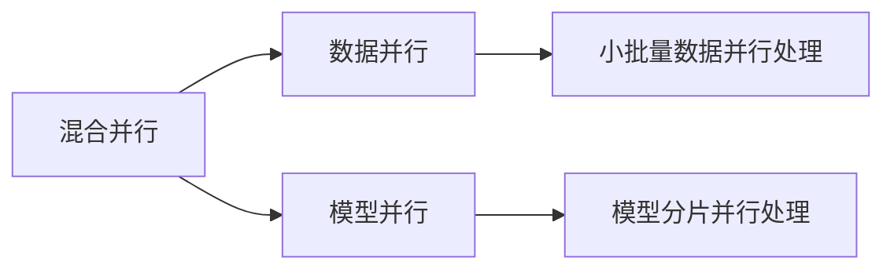

## 1.背景介绍

在过去的几年中，深度学习和人工智能领域的研究人员已经取得了令人瞩目的成就。其中，语言模型的发展尤为突出，从简单的词袋模型，到复杂的神经网络模型，再到现在的大规模语言模型，我们可以看到语言模型的复杂性和处理能力越来越强。然而，随着模型的规模和复杂性的增加，如何有效地进行模型训练成为了一个重要的问题。本文将深入探讨大规模语言模型的训练方法——混合并行。

## 2.核心概念与联系

混合并行是一种结合了数据并行和模型并行的训练方法。在数据并行中，我们将数据集分成多个小批量，并在多个设备上并行处理这些小批量。在模型并行中，我们将模型的不同部分分配到不同的设备上，每个设备处理模型的一部分。混合并行结合了这两种方法的优点，可以在处理大规模模型时提高效率和减少计算资源的需求。



## 3.核心算法原理具体操作步骤

混合并行的实现主要包括以下几个步骤：

1. **模型切片**：首先，我们需要将模型分成多个部分，每个部分可以在单独的设备上运行。这通常通过将模型的不同层分配到不同的设备上来实现。

2. **数据切片**：然后，我们需要将训练数据分成多个小批量，每个小批量可以在单独的设备上并行处理。

3. **并行计算**：接下来，我们在每个设备上同时进行前向传播和反向传播，每个设备只处理分配给它的模型部分和数据部分。

4. **梯度聚合**：在所有设备完成计算后，我们需要将所有设备上的梯度聚合到一起，以更新模型参数。

5. **参数更新**：最后，我们使用聚合的梯度来更新模型的参数。

## 4.数学模型和公式详细讲解举例说明

在混合并行中，我们使用梯度下降法来更新模型的参数。假设我们的模型参数为$\theta$，损失函数为$L(\theta)$，我们可以通过以下公式来更新模型参数：

$$
\theta = \theta - \alpha \nabla L(\theta)
$$

其中，$\alpha$是学习率，$\nabla L(\theta)$是损失函数关于模型参数的梯度。在并行计算中，每个设备只计算分配给它的模型部分和数据部分的梯度。在梯度聚合阶段，我们将所有设备上的梯度加在一起，得到完整的梯度，然后用这个完整的梯度来更新模型参数。

## 5.项目实践：代码实例和详细解释说明

考虑到篇幅限制，这里我们只展示一个简化的混合并行训练的示例代码：

```python
# 假设我们有两个设备，device1和device2
# 模型的前半部分在device1上，后半部分在device2上
model1 = model[:half].to(device1)
model2 = model[half:].to(device2)

# 数据也被分成两部分，data1和data2
data1 = data[:half].to(device1)
data2 = data[half:].to(device2)

# 在device1上进行前向传播和反向传播
output1 = model1(data1)
loss1 = criterion(output1, target[:half])
loss1.backward()

# 在device2上进行前向传播和反向传播
output2 = model2(data2)
loss2 = criterion(output2, target[half:])
loss2.backward()

# 聚合梯度
grad = gather_gradients([model1, model2])

# 更新模型参数
optimizer.step(grad)
```

这只是一个简化的示例，实际的混合并行训练可能会涉及更复杂的模型和数据分配策略，以及更复杂的并行计算和梯度聚合方法。

## 6.实际应用场景

混合并行在许多大规模模型训练任务中都有应用，例如在训练大规模语言模型如GPT-3、BERT等时，由于模型的规模超过了单个设备的内存容量，我们需要使用混合并行来进行模型训练。

## 7.工具和资源推荐

在实际应用中，我们通常使用深度学习框架如PyTorch或TensorFlow来实现混合并行。这些框架提供了丰富的API和工具来帮助我们实现并行计算，梯度聚合等操作。此外，还有一些专门的库如Horovod、FairScale等，提供了更高级的并行计算和优化功能。

## 8.总结：未来发展趋势与挑战

混合并行为大规模模型的训练提供了一种有效的解决方案，但同时也带来了一些挑战，例如如何有效地分配模型和数据、如何在保证计算效率的同时减少通信开销等。随着模型规模的不断增大，我们需要设计更高效的并行计算和优化算法，以满足大规模模型训练的需求。

## 9.附录：常见问题与解答

1. **问：混合并行和数据并行、模型并行有什么区别？**

答：混合并行是数据并行和模型并行的结合。在数据并行中，我们将数据集分成多个小批量，并在多个设备上并行处理这些小批量。在模型并行中，我们将模型的不同部分分配到不同的设备上，每个设备处理模型的一部分。混合并行结合了这两种方法的优点，可以在处理大规模模型时提高效率和减少计算资源的需求。

2. **问：混合并行训练大规模模型有什么挑战？**

答：混合并行训练大规模模型的挑战主要包括如何有效地分配模型和数据、如何在保证计算效率的同时减少通信开销等。随着模型规模的不断增大，这些挑战会变得更加严峻。

作者：禅与计算机程序设计艺术 / Zen and the Art of Computer Programming