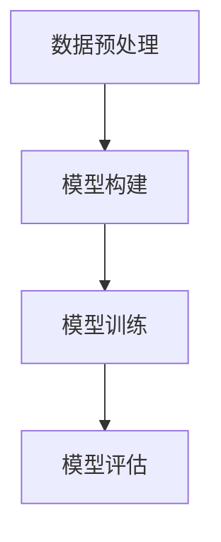

## 1.背景介绍

随着人工智能的飞速发展，大规模语言模型（Large Scale Language Models，简称LSLM）已经成为了研究的热点。这类模型以其强大的学习能力和广泛的应用前景，吸引了无数科研工作者和工程师的关注。大规模语言模型通过学习大量的文本数据，能够理解和生成人类语言，进而进行各种复杂的任务，如机器翻译、文本摘要、情感分析等。

## 2.核心概念与联系

在深入探讨大规模语言模型的具体实现和应用之前，我们需要先了解一些核心概念。语言模型是一种统计模型，它的目标是预测下一个单词或者一段文本的概率分布。而大规模语言模型，顾名思义，是在大规模文本数据上训练的语言模型，通常包含数亿甚至数千亿的参数。

大规模语言模型的训练通常采用深度学习的方法，特别是Transformer架构。Transformer模型由谷歌在"Attention is All You Need"一文中首次提出，它使用自注意力机制（Self-Attention）来捕捉输入序列中的全局依赖关系，从而极大地提高了模型的表达能力。

## 3.核心算法原理具体操作步骤

大规模语言模型的训练过程可以简单地分为以下几个步骤：

1. 数据预处理：首先，我们需要将文本数据转化为模型可以处理的形式。这通常包括分词、词嵌入等步骤。

2. 模型构建：然后，我们需要构建模型架构。这通常包括定义模型的层数、隐藏层大小、注意力头数等参数。

3. 模型训练：接下来，我们需要使用大量的文本数据来训练模型。这通常包括前向传播、反向传播和参数更新等步骤。

4. 模型评估：最后，我们需要评估模型的性能。这通常包括计算模型在验证集和测试集上的损失和准确率等指标。

以下是一个简单的Mermaid流程图，用于描述大规模语言模型的训练过程：



## 4.数学模型和公式详细讲解举例说明

在大规模语言模型中，最核心的数学模型就是自注意力机制。自注意力机制的计算可以用以下的公式表示：

$$
\text{Attention}(Q, K, V) = \text{softmax}\left(\frac{QK^T}{\sqrt{d_k}}\right)V
$$

其中，$Q$、$K$、$V$分别表示查询（Query）、键（Key）和值（Value），$d_k$表示键的维度。这个公式的含义是，给定查询、键和值，我们首先计算查询和所有键的点积，然后通过softmax函数将这些点积转化为概率分布，最后用这个概率分布对值进行加权求和，得到最终的输出。

## 5.项目实践：代码实例和详细解释说明

让我们通过一个简单的例子来看一下如何在PyTorch中实现自注意力机制。首先，我们需要定义一个Attention类，如下所示：

```python
class Attention(nn.Module):
    def __init__(self, d_k):
        super(Attention, self).__init__()
        self.d_k = d_k

    def forward(self, Q, K, V):
        scores = torch.matmul(Q, K.transpose(-2, -1)) / math.sqrt(self.d_k)
        probs = F.softmax(scores, dim=-1)
        output = torch.matmul(probs, V)
        return output
```

在这个类中，我们首先定义了一个构造函数，用于初始化模型的参数。然后，我们定义了一个前向传播函数，用于计算模型的输出。这个函数的实现就是按照自注意力机制的公式进行计算。

## 6.实际应用场景

大规模语言模型的应用场景非常广泛，包括但不限于以下几个方面：

1. 机器翻译：大规模语言模型可以学习不同语言之间的映射关系，从而实现高质量的机器翻译。

2. 文本生成：大规模语言模型可以生成连贯和有意义的文本，用于新闻生成、故事创作等任务。

3. 情感分析：大规模语言模型可以理解文本的情感倾向，用于品牌监控、社交媒体分析等任务。

4. 问答系统：大规模语言模型可以理解和回答用户的问题，用于构建智能的问答系统。

## 7.工具和资源推荐

对于大规模语言模型的训练和应用，我推荐以下几个工具和资源：

1. PyTorch：这是一个非常流行的深度学习框架，提供了丰富的模型构建和训练功能。

2. Hugging Face Transformers：这是一个专门用于Transformer模型的库，提供了大量预训练的大规模语言模型。

3. TensorBoard：这是一个可视化工具，可以用于监控模型的训练过程。

## 8.总结：未来发展趋势与挑战

随着技术的发展，大规模语言模型的能力和应用前景将更加广阔。我认为，未来的发展趋势主要有以下几个方向：

1. 模型规模的进一步扩大：随着计算资源的增加，我们可以训练更大规模的语言模型，从而提高模型的性能。

2. 模型的多模态学习：未来的语言模型不仅可以处理文本数据，还可以处理图像、音频等多种类型的数据。

3. 模型的解释性和可控性：随着模型规模的增加，如何理解和控制模型的行为将成为一个重要的问题。

同时，我们也面临着一些挑战，如计算资源的限制、数据隐私的保护、模型偏差的控制等。这些都需要我们在未来的研究和实践中去解决。

## 9.附录：常见问题与解答

Q: 为什么大规模语言模型需要这么多的参数？

A: 大规模语言模型需要学习大量的文本数据，这些数据中包含了丰富的语言规则和知识。因此，模型需要足够多的参数来捕捉这些复杂的信息。

Q: 大规模语言模型的训练需要多少计算资源？

A: 大规模语言模型的训练需要大量的计算资源。例如，OpenAI的GPT-3模型包含1750亿个参数，其训练需要数百个GPU和数周的时间。

Q: 大规模语言模型的应用有哪些限制？

A: 尽管大规模语言模型有很强的学习能力，但它们也有一些限制。例如，它们不能理解世界的真实情况，只能根据训练数据生成输出。此外，它们也可能产生有偏差或者不合适的输出。

作者：禅与计算机程序设计艺术 / Zen and the Art of Computer Programming