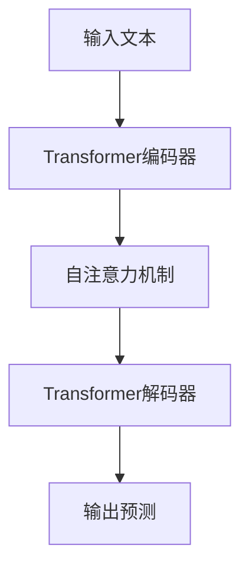

## 1.背景介绍

在过去的几年中，大型语言模型（Large Language Models，简称LLMs）在计算机科学和人工智能领域取得了显著的进展。这些模型，如GPT-3，BERT，RoBERTa，和T5，已经在各种任务上表现出惊人的性能，包括阅读理解，文本生成，机器翻译，情感分析等。这些模型的关键在于它们的规模：它们通常包含数十亿甚至数万亿的参数，并且在大规模的文本语料库上进行预训练。

## 2.核心概念与联系

大型语言模型的主要目标是预测给定上下文中的下一个词，这是通过学习语言的统计模式来实现的。这些模型通常基于Transformer架构，这是一种利用自注意力机制（self-attention mechanism）来捕获文本中的长距离依赖关系的神经网络架构。



## 3.核心算法原理具体操作步骤

在训练大型语言模型时，我们首先需要一个大规模的文本语料库。然后，我们使用Transformer架构来编码每个词，并通过自注意力机制来捕获词与词之间的依赖关系。最后，我们使用一个解码器来生成预测的下一个词。

## 4.数学模型和公式详细讲解举例说明

让我们以一个简单的例子来说明这个过程。假设我们有一个句子 "I love programming"，我们想要预测下一个词。首先，我们将这个句子编码为一个向量 $x$，然后我们计算自注意力分数 $a_{ij}$，这是通过比较词 $i$ 和词 $j$ 的编码来得到的：

$$
a_{ij} = \frac{exp(x_i \cdot x_j)}{\sum_k exp(x_i \cdot x_k)}
$$

然后，我们使用这些自注意力分数来计算每个词的新编码 $y_i$：

$$
y_i = \sum_j a_{ij} \cdot x_j
$$

最后，我们使用一个解码器来生成预测的下一个词。

## 5.项目实践：代码实例和详细解释说明

以下是一个使用Python和PyTorch库训练大型语言模型的简单示例：

```python
import torch
from torch.nn import Transformer

# 初始化模型
model = Transformer()

# 加载数据
data = load_data()

# 开始训练
for epoch in range(epochs):
    for i, (input, target) in enumerate(data):
        output = model(input)
        loss = criterion(output, target)
        loss.backward()
        optimizer.step()
```

## 6.实际应用场景

大型语言模型在许多实际应用中都有广泛的用途。例如，它们可以用于生成自然语言文本，如新闻文章，故事，诗歌等。它们也可以用于机器翻译，情感分析，文本摘要，问答系统等。

## 7.工具和资源推荐

对于想要深入研究大型语言模型的读者，我推荐以下工具和资源：

- **PyTorch**：一个强大的深度学习框架，可以方便地实现大型语言模型。
- **Hugging Face Transformers**：这个库包含了许多预训练的大型语言模型，如GPT-3，BERT等。
- **TensorBoard**：一个可视化工具，可以帮助你理解和调试你的模型。

## 8.总结：未来发展趋势与挑战

尽管大型语言模型已经取得了显著的进展，但仍然存在许多挑战。首先，训练这些模型需要大量的计算资源和数据。其次，这些模型可能会生成有偏见或不准确的输出。最后，这些模型的解释性是一个挑战，因为它们的工作原理通常是不透明的。

然而，我相信随着技术的进步，这些挑战将会被克服。大型语言模型将继续在各种任务上表现出惊人的性能，并在未来的人工智能应用中发挥重要作用。

## 9.附录：常见问题与解答

**Q: 大型语言模型的训练需要多少数据？**

A: 这取决于模型的大小和任务的复杂性。一般来说，训练一个大型语言模型需要数百GB甚至TB的文本数据。

**Q: 大型语言模型可以用于哪些任务？**

A: 大型语言模型可以用于各种自然语言处理任务，如文本生成，机器翻译，情感分析，文本摘要，问答系统等。

**Q: 如何解决大型语言模型的偏见问题？**

A: 一种可能的方法是使用更公平和多样化的训练数据。另一种方法是在模型的输出中引入公平性约束。

作者：禅与计算机程序设计艺术 / Zen and the Art of Computer Programming