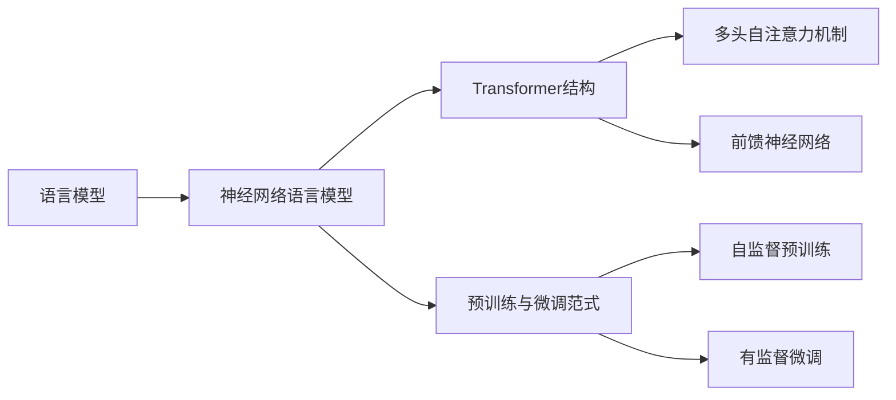

# 大语言模型原理与代码实例讲解

## 1.背景介绍

### 1.1 大语言模型的兴起

大语言模型(Large Language Model, LLM)是近年来自然语言处理(NLP)领域最为瞩目的研究方向之一。随着深度学习技术的发展和训练数据规模的增长,语言模型的性能得到了显著提升。从2018年GPT-1的发布,到2019年GPT-2、BERT等模型的问世,再到2020年GPT-3的横空出世,大语言模型一次次刷新着NLP领域的性能记录,展现出了惊人的语言理解和生成能力。

### 1.2 大语言模型的应用前景

大语言模型强大的语言能力使其在许多实际应用中得到广泛使用,如:

- 智能对话:利用大语言模型构建更加智能、自然的对话系统
- 文本生成:自动撰写文章、新闻、小说等
- 语言翻译:实现高质量的机器翻译
- 文本摘要:自动生成文本摘要,提取关键信息
- 问答系统:基于大语言模型构建知识问答系统
- 情感分析:自动判断文本情感倾向

大语言模型为NLP领域带来了新的突破,有望在更多场景发挥重要作用。

### 1.3 本文的主要内容

本文将围绕大语言模型的原理和实现展开讨论,主要内容包括:

- 大语言模型的核心概念与联系
- Transformer结构与自注意力机制
- 预训练和微调两阶段学习范式  
- 大语言模型的训练技巧和优化策略
- 基于PyTorch的GPT模型代码实现
- 大语言模型的应用场景与案例分析
- 主流大语言模型及开发工具推荐
- 大语言模型的未来发展趋势与挑战
- 常见问题解答

通过本文的学习,读者将全面掌握大语言模型的原理,并能动手实现基于PyTorch的GPT模型,为进一步探索大语言模型的应用打下坚实基础。

## 2.核心概念与联系

### 2.1 语言模型

语言模型是一种对语言进行建模的方法,旨在学习语言的统计规律和模式。给定一个单词序列 $w_1, w_2, ..., w_n$,语言模型的目标是估计该序列出现的概率:

$$P(w_1, w_2, ..., w_n) = \prod_{i=1}^n P(w_i|w_1, ..., w_{i-1})$$

传统的语言模型如N-gram模型,虽然简单高效,但难以刻画语言的长距离依赖。神经网络语言模型(NNLM)利用神经网络强大的表示学习能力,能够更好地建模语言的复杂模式。

### 2.2 Transformer结构

Transformer是一种基于自注意力机制(Self-Attention)的神经网络结构,最初应用于机器翻译任务。与传统的RNN、CNN等结构相比,Transformer能够更高效地对长序列进行建模,成为大语言模型的核心架构。

Transformer的编码器由多个编码层组成,每个编码层包含两个子层:

- 多头自注意力(Multi-Head Attention)层
- 前馈神经网络(Feed-Forward Network)层

多头自注意力允许模型在不同的表示子空间内计算注意力,增强了模型的表达能力。前馈神经网络进一步提取特征,增加模型的非线性。

### 2.3 预训练与微调

大语言模型采用预训练(Pre-training)和微调(Fine-tuning)两阶段学习范式:

- 预训练阶段:在大规模无标注语料上进行自监督学习,掌握语言的通用知识和规律
- 微调阶段:在下游任务的标注数据上进行监督学习,将预训练模型适配到具体任务

预训练使得模型学习到语言的一般性知识,微调使模型适应特定任务,两阶段结合可大幅提升模型性能。

### 2.4 概念间的关系

下图展示了大语言模型相关概念间的关系:

语言模型是建模语言的一般方法,神经网络语言模型利用神经网络实现语言建模。Transformer结构是神经网络语言模型的重要架构,基于多头自注意力和前馈神经网络。预训练与微调是训练大语言模型的关键范式,包括无监督预训练和有监督微调两个阶段。理解这些概念间的联系,有助于全面掌握大语言模型的原理。

## 3.核心算法原理具体操作步骤

### 3.1 Transformer编码器结构

Transformer编码器由N个编码层堆叠而成,每个编码层包含两个子层:多头自注意力层和前馈神经网络层。

#### 3.1.1 多头自注意力层

- 将输入序列 $X \in \mathbb{R}^{n \times d}$ 通过线性变换得到查询矩阵 $Q$、键矩阵 $K$、值矩阵 $V$:

$$Q = XW^Q, K = XW^K, V = XW^V$$

其中 $W^Q, W^K, W^V \in \mathbb{R}^{d \times d_k}$ 为可学习参数矩阵。

- 计算自注意力权重:

$$A = \text{softmax}(\frac{QK^T}{\sqrt{d_k}})$$

其中 $A \in \mathbb{R}^{n \times n}$ 为注意力权重矩阵。

- 计算自注意力输出:

$$\text{Attention}(Q, K, V) = AV$$

- 将自注意力结果拼接并线性变换,得到多头自注意力输出:

$$\text{MultiHead}(X) = \text{Concat}(\text{head}_1, ..., \text{head}_h)W^O$$

其中 $\text{head}_i = \text{Attention}(XW_i^Q, XW_i^K, XW_i^V)$, $W^O \in \mathbb{R}^{hd_k \times d}$ 为线性变换矩阵。

#### 3.1.2 前馈神经网络层

$$\text{FFN}(X) = \text{ReLU}(XW_1 + b_1)W_2 + b_2$$

其中 $W_1 \in \mathbb{R}^{d \times d_{ff}}, b_1 \in \mathbb{R}^{d_{ff}}, W_2 \in \mathbb{R}^{d_{ff} \times d}, b_2 \in \mathbb{R}^d$ 为前馈网络参数。

#### 3.1.3 残差连接与层归一化

在每个子层之后,加入残差连接(Residual Connection)和层归一化(Layer Normalization):

$$X' = \text{LayerNorm}(X + \text{Sublayer}(X))$$

残差连接有助于缓解梯度消失问题,层归一化可加速模型收敛。

### 3.2 预训练阶段

大语言模型在预训练阶段通常采用自回归语言建模(Auto-Regressive Language Modeling)任务,即根据前面的单词预测下一个单词。以GPT模型为例,其预训练损失函数为:

$$L(\theta) = -\sum_{i=1}^n \log P(w_i|w_{<i};\theta)$$

其中 $\theta$ 为模型参数, $w_{<i}$ 表示第 $i$ 个单词之前的所有单词。模型通过最小化该损失函数来学习语言的统计规律。

预训练的优化通常采用Adam优化器,并使用一些训练技巧如:

- 学习率预热(Learning Rate Warmup):在训练初期使用较小的学习率,之后逐渐增大学习率
- 梯度裁剪(Gradient Clipping):将梯度范数限制在一定阈值内,防止梯度爆炸

### 3.3 微调阶段

在下游任务上微调预训练模型时,根据任务类型设计输入输出,并在预训练模型最后添加任务特定的输出层。以文本分类任务为例:

- 将输入文本 $x$ 传入预训练模型,得到最后一层的输出表示 $h$
- 将 $h$ 通过线性变换和 softmax 函数,得到各类别的概率分布:

$$p(y|x) = \text{softmax}(hW + b)$$

- 计算交叉熵损失,并使用反向传播算法更新模型参数:

$$L = -\sum_{i=1}^N \log p(y_i|x_i)$$

微调通常使用较小的学习率和batch size,以防止预训练权重被破坏。也可以使用一些微调技巧如对不同层使用不同学习率、渐进式解冻等。

## 4.数学模型和公式详细讲解举例说明

### 4.1 Transformer中的自注意力机制

Transformer的核心是自注意力机制,它允许模型在计算某个位置的表示时,参考序列中的所有位置。以下详细解释自注意力的数学原理。

给定输入序列的表示矩阵 $X \in \mathbb{R}^{n \times d}$,自注意力首先计算查询矩阵 $Q$、键矩阵 $K$ 和值矩阵 $V$:

$$Q = XW^Q, K = XW^K, V = XW^V$$

其中 $W^Q, W^K, W^V \in \mathbb{R}^{d \times d_k}$ 为可学习的参数矩阵。

然后,计算查询和键的相似度得到注意力权重:

$$A = \text{softmax}(\frac{QK^T}{\sqrt{d_k}})$$

其中 $A_{ij}$ 表示位置 $i$ 到位置 $j$ 的注意力权重。$\sqrt{d_k}$ 用于缩放点积结果,避免softmax函数的梯度过小。

最后,使用注意力权重对值矩阵加权求和,得到自注意力输出:

$$\text{Attention}(Q, K, V) = \text{softmax}(\frac{QK^T}{\sqrt{d_k}})V$$

直观地理解,自注意力机制通过查询和键的相似度来确定不同位置间的依赖关系,然后根据这种关系对值进行聚合。

举例说明,假设有一个句子:"The cat sat on the mat"。在计算单词"cat"的表示时:

1. 将单词映射为查询向量 $q_{\text{cat}}$、键向量 $k_{\text{cat}}$ 和值向量 $v_{\text{cat}}$
2. 计算 $q_{\text{cat}}$ 与其他单词的键向量 $k_i$ 的相似度 $a_i = \frac{q_{\text{cat}} \cdot k_i}{\sqrt{d_k}}$,得到注意力权重
3. 将注意力权重应用于值向量,得到"cat"的上下文表示: $\sum_i a_i v_i$

通过自注意力,"cat"的表示综合了句子中其他单词的信息,能够更好地刻画单词的语义。

### 4.2 预训练中的语言建模

大语言模型的预训练通常采用自回归语言建模任务,即根据前面的单词预测下一个单词。给定单词序列 $w_1, w_2, ..., w_n$,语言模型的目标是最大化该序列的概率:

$$P(w_1, w_2, ..., w_n) = \prod_{i=1}^n P(w_i|w_1, ..., w_{i-1})$$

在Transformer中,可以通过Masked Self-Attention的方式实现语言建模。具体地,在计算位置 $i$ 的表示时,只允许其参考位置 $j < i$ 的信息。这可以通过在计算注意力权重时,将位置 $i$ 之后的权重设为负无穷来实现:

$$A_{ij} = \begin{cases}
\exp(\frac{q_i \cdot k_j}{\sqrt{d_k}}) & j < i \\
-\infty & j \geq i
\end{cases}$$

这样,位置 $i$ 的表示只依赖于前面的单词,符合语言模型的要求。

预训练的损失函数为负对数似然:

$$L(\theta) = -\sum_{i=1}^n \log P(w_i|w_{<i};\theta)$$

其中 $\theta$ 为模型参数。最小化该损失函数等价于最大化序列概率。

举例说明,假设要训练一个基于Transformer的语言