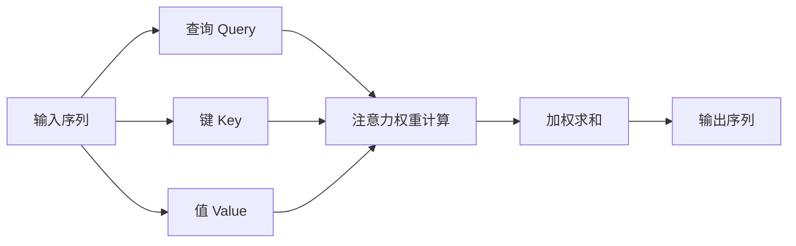
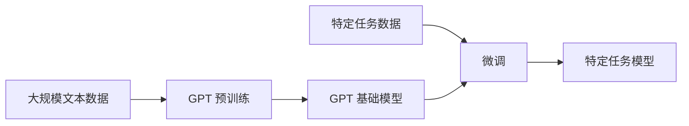

# 大语言模型原理与工程实践：GPT 系列模型的发展

## 1. 背景介绍

### 1.1 人工智能的新时代

人工智能(AI)技术在过去几年中取得了令人难以置信的进步,尤其是在自然语言处理(NLP)领域。大型语言模型的出现,标志着人工智能进入了一个新的时代。这些模型能够理解和生成人类语言,为各种应用程序提供强大的语言能力,从而极大地推动了人工智能的发展。

### 1.2 GPT 系列模型的崛起

在这一背景下,OpenAI 推出的 GPT(Generative Pre-trained Transformer)系列模型成为了大型语言模型的代表。GPT 模型通过在大量文本数据上进行预训练,学习了丰富的语言知识,并具备出色的生成能力。它们可以根据给定的提示生成连贯、流畅的文本,在各种自然语言处理任务中表现出色。

### 1.3 GPT 系列模型的重要意义

GPT 系列模型的出现,不仅推动了自然语言处理技术的发展,也为人工智能的未来发展指明了方向。这些模型展示了大型神经网络在处理复杂任务时的强大能力,为人工智能系统的通用性和可扩展性提供了新的思路。因此,深入研究 GPT 系列模型的原理和工程实践,对于推动人工智能技术的进步至关重要。

## 2. 核心概念与联系

### 2.1 自注意力机制

$$J=\sum_{i=1}^{n}a_i\log\frac{a_i}{e_i}$$

自注意力机制是 GPT 系列模型的核心组成部分之一。它允许模型在处理序列数据时,捕捉不同位置之间的依赖关系,从而更好地理解上下文信息。自注意力机制通过计算查询(Query)、键(Key)和值(Value)之间的相似性得分,动态地为每个位置分配注意力权重,实现了对输入序列的有效建模。

### 2.2 transformer 架构

Transformer 架构是 GPT 模型的基础,它完全基于注意力机制,摒弃了传统的循环神经网络和卷积神经网络结构。Transformer 由编码器(Encoder)和解码器(Decoder)组成,能够有效地处理长距离依赖关系,并具有更好的并行计算能力。

### 2.3 预训练与微调

GPT 模型采用了预训练(Pre-training)和微调(Fine-tuning)的范式。在预训练阶段,模型在大量无标注文本数据上进行自监督学习,获取通用的语言知识。在微调阶段,模型在特定任务的标注数据上进行进一步训练,使其能够更好地适应该任务。这种范式大大提高了模型的泛化能力和性能。

### 2.4 生成式预训练

GPT 模型采用了生成式预训练(Generative Pre-training)的策略,旨在学习生成自然语言的能力。在预训练过程中,模型需要根据输入序列的前缀预测下一个单词,从而学习到语言的统计规律和上下文依赖关系。这种策略使得 GPT 模型在生成任务上表现出色,同时也为其他自然语言处理任务奠定了基础。

## 3. 核心算法原理具体操作步骤

### 3.1 自注意力机制计算过程

自注意力机制是 GPT 模型的核心组成部分之一,它的计算过程可以分为以下几个步骤:

1. **查询、键、值计算**: 将输入序列 $X$ 分别映射到查询 $Q$、键 $K$ 和值 $V$ 的向量空间中,得到 $Q$、$K$ 和 $V$ 矩阵。

   $$Q = XW^Q, K = XW^K, V = XW^V$$

2. **注意力权重计算**: 计算查询 $Q$ 和键 $K$ 的点积,得到注意力分数矩阵 $A$,然后对 $A$ 进行缩放和 softmax 操作,得到注意力权重矩阵 $\alpha$。

   $$A = QK^T, \alpha = \text{softmax}(\frac{A}{\sqrt{d_k}})$$

3. **加权求和**: 将注意力权重矩阵 $\alpha$ 与值矩阵 $V$ 相乘,得到加权和的结果矩阵 $Z$。

   $$Z = \alpha V$$

4. **残差连接和层归一化**: 将结果矩阵 $Z$ 与输入序列 $X$ 进行残差连接,然后进行层归一化操作,得到自注意力机制的最终输出。

   $$\text{Output} = \text{LayerNorm}(X + Z)$$

通过上述步骤,自注意力机制能够捕捉输入序列中不同位置之间的依赖关系,从而更好地理解上下文信息。

### 3.2 Transformer 编码器和解码器

Transformer 架构由编码器(Encoder)和解码器(Decoder)组成,它们的工作原理如下:

1. **Transformer 编码器**:
   - 输入序列经过嵌入层映射到向量空间。
   - 添加位置编码,以捕捉序列中单词的位置信息。
   - 通过多个编码器层,每层包含多头自注意力机制和前馈神经网络。
   - 输出编码器的最终隐藏状态,作为解码器的输入。

2. **Transformer 解码器**:
   - 输入解码器的初始隐藏状态,以及目标序列的嵌入和位置编码。
   - 通过多个解码器层,每层包含两个子层:
     - 第一个子层是多头自注意力机制,用于捕捉目标序列内部的依赖关系。
     - 第二个子层是多头交叉注意力机制,用于关注编码器输出的上下文信息。
   - 最后一层解码器输出经过线性层和 softmax 层,生成预测的下一个单词概率分布。

通过编码器捕捉输入序列的上下文信息,解码器则利用这些信息生成目标序列,实现序列到序列(Seq2Seq)的转换任务。

### 3.3 预训练和微调过程

GPT 模型采用了预训练和微调的范式,具体过程如下:

1. **预训练阶段**:
   - 准备大量无标注的文本数据集。
   - 定义预训练目标,如掩码语言模型(Masked Language Modeling)或下一句预测(Next Sentence Prediction)。
   - 在预训练数据集上训练 GPT 模型,优化预训练目标的损失函数。
   - 得到预训练好的 GPT 基础模型。

2. **微调阶段**:
   - 准备特定任务的标注数据集。
   - 在预训练模型的基础上,添加任务特定的输出层。
   - 在任务数据集上微调模型参数,优化任务损失函数。
   - 得到针对特定任务优化的 GPT 模型。

通过预训练和微调的范式,GPT 模型可以在大规模无标注数据上学习通用的语言知识,然后在特定任务上进行进一步优化,从而获得更好的性能和泛化能力。

### 3.4 生成式预训练策略

GPT 模型采用了生成式预训练(Generative Pre-training)的策略,旨在学习生成自然语言的能力。具体操作步骤如下:

1. 从预训练语料库中采样一个长度为 $n$ 的序列 $S = (s_1, s_2, \dots, s_n)$。
2. 对于序列中的每个位置 $i$,将前缀 $(s_1, s_2, \dots, s_{i-1})$ 作为输入,目标是预测下一个单词 $s_i$。
3. 计算模型在位置 $i$ 预测正确单词 $s_i$ 的损失函数,如交叉熵损失。
4. 对所有位置的损失函数求和,作为总的预训练损失函数。
5. 使用优化算法(如 Adam)更新模型参数,最小化预训练损失函数。

通过这种策略,GPT 模型学习到了生成自然语言的统计规律和上下文依赖关系,为后续的生成任务和其他自然语言处理任务奠定了基础。

## 4. 数学模型和公式详细讲解举例说明

在 GPT 系列模型中,有几个核心的数学模型和公式值得详细讲解和举例说明。

### 4.1 注意力机制

注意力机制是 GPT 模型的核心组成部分之一,它允许模型在处理序列数据时,动态地关注输入序列中不同位置的信息。注意力机制的数学表达式如下:

$$\text{Attention}(Q, K, V) = \text{softmax}(\frac{QK^T}{\sqrt{d_k}})V$$

其中:

- $Q$ 表示查询(Query)矩阵,用于计算注意力分数。
- $K$ 表示键(Key)矩阵,与查询矩阵进行点积运算。
- $V$ 表示值(Value)矩阵,包含要关注的信息。
- $d_k$ 是缩放因子,用于防止注意力分数过大或过小。

举例说明:

假设我们有一个输入序列 $X = (x_1, x_2, x_3, x_4)$,其中每个 $x_i$ 是一个向量。我们希望计算第三个位置 $x_3$ 对其他位置的注意力权重。

1. 首先,我们将输入序列映射到查询、键和值的向量空间中:

   $$Q = (q_1, q_2, q_3, q_4), K = (k_1, k_2, k_3, k_4), V = (v_1, v_2, v_3, v_4)$$

2. 计算查询 $q_3$ 与所有键 $k_i$ 的点积,得到注意力分数向量:

   $$a = (q_3 \cdot k_1, q_3 \cdot k_2, q_3 \cdot k_3, q_3 \cdot k_4)$$

3. 对注意力分数向量进行缩放和 softmax 操作,得到注意力权重向量:

   $$\alpha = \text{softmax}(\frac{a}{\sqrt{d_k}})$$

4. 将注意力权重向量与值向量相乘,得到加权和的结果向量:

   $$z_3 = \alpha_1 v_1 + \alpha_2 v_2 + \alpha_3 v_3 + \alpha_4 v_4$$

通过上述步骤,我们可以获得位置 $x_3$ 对其他位置的注意力权重,从而捕捉输入序列中的依赖关系。

### 4.2 交叉熵损失函数

在 GPT 模型的预训练和微调过程中,常用的损失函数是交叉熵损失函数。对于一个长度为 $n$ 的序列 $S = (s_1, s_2, \dots, s_n)$,交叉熵损失函数的数学表达式如下:

$$\mathcal{L} = -\frac{1}{n}\sum_{i=1}^{n}\log P(s_i|s_1, s_2, \dots, s_{i-1})$$

其中:

- $P(s_i|s_1, s_2, \dots, s_{i-1})$ 表示模型根据前缀 $(s_1, s_2, \dots, s_{i-1})$ 预测下一个单词 $s_i$ 的概率。
- 对所有位置的负对数似然求和,并取平均值作为总的损失函数。

举例说明:

假设我们有一个长度为 3 的序列 $S = (s_1, s_2, s_3)$,其中 $s_1 = \text{"the"}$, $s_2 = \text{"cat"}$