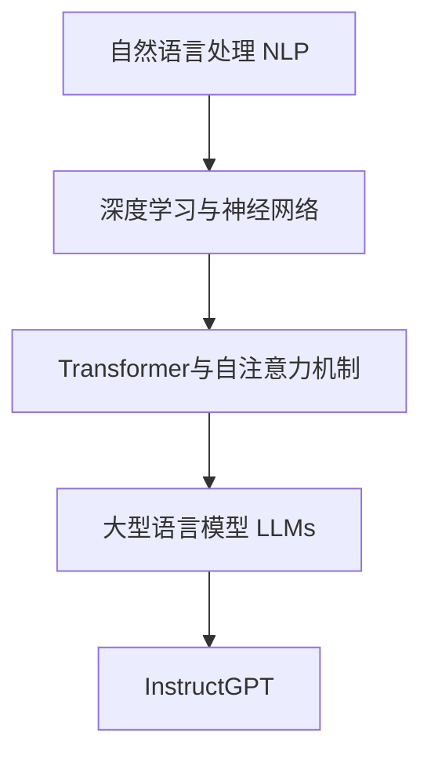
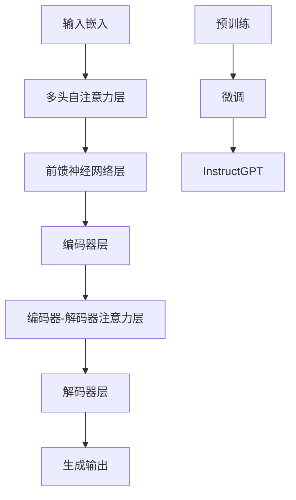
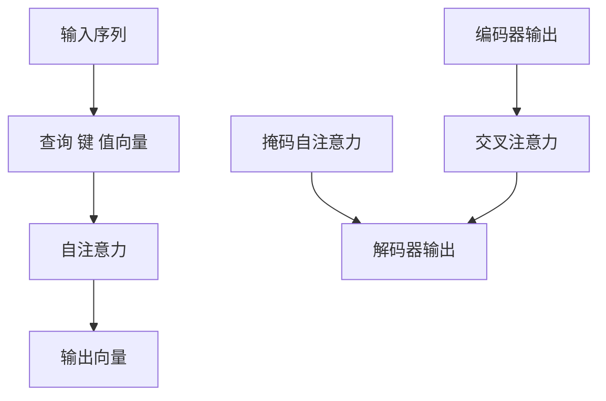

# 大语言模型原理与工程实践：InstructGPT

## 1. 背景介绍

### 1.1 人工智能的崛起

人工智能(AI)已经成为当今科技领域最令人兴奋和充满活力的研究方向之一。从语音识别到计算机视觉,从自然语言处理到机器学习,AI技术正在彻底改变我们与计算机系统交互的方式。在这一进程中,大型语言模型(Large Language Models,LLMs)脱颖而出,成为推动AI革命的核心驱动力之一。

### 1.2 大型语言模型的兴起

大型语言模型是一种基于深度学习的自然语言处理(NLP)模型,能够从海量文本数据中学习语言模式和语义关系。这些模型通过消化大量文本资料,逐步构建出对自然语言的深刻理解。凭借其强大的语言生成能力,LLMs可以用于各种NLP任务,如机器翻译、文本摘要、问答系统等。

### 1.3 InstructGPT:突破性的大型语言模型

在LLMs的发展历程中,InstructGPT被视为一个里程碑式的突破。作为OpenAI公司开发的一种新型大型语言模型,InstructGPT展现出了令人惊叹的语言理解和生成能力。它不仅能够回答各种查询,还能根据用户的指令完成复杂的任务,如编写代码、撰写文章、解决数学问题等。InstructGPT的出现标志着人工智能正在向着更高级别的"通用人工智能"(Artificial General Intelligence,AGI)迈进。

## 2. 核心概念与联系

### 2.1 自然语言处理(NLP)

自然语言处理是人工智能的一个重要分支,旨在使计算机能够理解和生成人类语言。NLP技术包括语音识别、机器翻译、文本挖掘、问答系统等。传统的NLP系统通常采用基于规则的方法,需要大量的人工注释和特征工程。而现代NLP则主要依赖于深度学习技术,使用神经网络从大量数据中自动学习语言模式。

### 2.2 深度学习与神经网络

深度学习是机器学习的一个新兴领域,它利用具有多层非线性变换单元的人工神经网络来学习数据中的特征表示。与传统的机器学习算法相比,深度学习模型能够自动从原始数据中提取更加抽象和复杂的特征,从而获得更好的性能。深度学习已经在计算机视觉、语音识别、自然语言处理等多个领域取得了巨大成功。

### 2.3 transformer与自注意力机制

Transformer是一种革命性的深度学习模型,它完全依赖于注意力机制来捕捉输入序列中的长程依赖关系。与传统的循环神经网络(RNN)不同,Transformer不受序列长度的限制,能够高效地并行处理输入数据。自注意力机制允许模型在编码输入序列时,对每个位置的表示都充分考虑了其他位置的信息。这使得Transformer在许多序列到序列的任务中表现出色,如机器翻译、文本生成等。

### 2.4 大型语言模型(LLMs)

大型语言模型是一种基于Transformer架构的巨大神经网络,通过在海量文本数据上进行预训练而获得对自然语言的深刻理解。LLMs的关键优势在于它们能够从通用的语料库中学习到广泛的知识,并将这些知识迁移到下游的NLP任务中。这种迁移学习的范式大大提高了模型的性能和泛化能力。目前,GPT、BERT、XLNet等都是著名的LLMs。

### 2.5 InstructGPT

InstructGPT是OpenAI最新推出的一种大型语言模型,它在原有LLM的基础上进行了特殊的指令优化训练。这使得InstructGPT不仅能够回答问题,还能够根据用户的自然语言指令完成复杂的任务,如编写代码、撰写文章、解决数学问题等。InstructGPT展现出了令人惊叹的语言理解和生成能力,被视为通往人工通用智能(AGI)的重要一步。

### 2.6 Mermaid流程图



## 3. 核心算法原理具体操作步骤

### 3.1 Transformer架构

Transformer是LLMs的核心架构,它主要由编码器(Encoder)和解码器(Decoder)两部分组成。编码器负责处理输入序列,而解码器则生成输出序列。两者都采用了多头自注意力机制来捕捉序列中的长程依赖关系。

#### 3.1.1 输入嵌入

首先,输入序列(如文本)被转换为一系列嵌入向量,这些向量包含了输入词元的语义信息。此外,还会添加位置嵌入,以捕捉词元在序列中的位置信息。

#### 3.1.2 多头自注意力层

嵌入向量然后被送入多头自注意力层。每个注意力头都会计算一个注意力分数,表示当前词元对其他词元的关注程度。通过将所有注意力头的输出进行拼接和线性变换,模型可以捕捉到输入序列中的长程依赖关系。

#### 3.1.3 前馈神经网络层

自注意力层的输出会被送入前馈神经网络层,该层由两个全连接层组成,用于进一步加工序列表示。

#### 3.1.4 编码器和解码器

编码器是由多个相同的编码器层堆叠而成,每个层都包含自注意力层和前馈网络层。解码器的结构与编码器类似,但还额外引入了编码器-解码器注意力层,用于关注输入序列的相关部分。

#### 3.1.5 生成输出

最终,解码器会根据编码器的输出和自身的状态,逐个生成输出序列的词元。

### 3.2 预训练与微调

LLMs通常采用两阶段训练策略:预训练和微调。

#### 3.2.1 预训练

在预训练阶段,LLM会在大规模的文本语料库上进行无监督训练,目标是最大化模型对语料库中的下一个词元的预测概率。这一过程允许模型从海量数据中学习到广泛的语言知识。

#### 3.2.2 微调

在微调阶段,预训练好的LLM会在特定的下游任务数据集上进行有监督的继续训练,以使模型专门针对该任务进行优化。微调通常只需要少量的标注数据,但可以显著提高模型在特定任务上的性能。

### 3.3 InstructGPT的训练

InstructGPT的训练过程在预训练和微调两个阶段都有所创新。

#### 3.3.1 监督式协同学习

在预训练阶段,InstructGPT采用了一种称为监督式协同学习(Supervised Contrastive Learning)的新颖训练方式。该方法会为模型提供一个指令和一个参考输出,要求模型生成与参考输出相似的响应。通过这种方式,InstructGPT能够学习到如何根据指令完成特定的任务。

#### 3.3.2 指令微调

在微调阶段,InstructGPT会在各种指令数据集上进行训练,使其能够更好地理解和执行各种指令。这种指令微调策略进一步增强了模型的指令理解和任务完成能力。

### 3.4 Mermaid流程图



## 4. 数学模型和公式详细讲解举例说明

### 4.1 自注意力机制

自注意力机制是Transformer的核心,它允许模型在编码输入序列时,对每个位置的表示都充分考虑了其他位置的信息。具体来说,给定一个输入序列 $X = (x_1, x_2, \dots, x_n)$,自注意力机制会计算一个注意力分数矩阵 $A \in \mathbb{R}^{n \times n}$,其中 $A_{ij}$ 表示第 $i$ 个位置对第 $j$ 个位置的注意力分数。

注意力分数矩阵 $A$ 由查询(Query)、键(Key)和值(Value)向量计算得到:

$$A_{ij} = \text{softmax}_j\left(\frac{Q_iK_j^T}{\sqrt{d_k}}\right)$$

其中 $Q_i$、$K_j$ 和 $V_j$ 分别是第 $i$ 个位置的查询向量、第 $j$ 个位置的键向量和值向量。$d_k$ 是缩放因子,用于防止点积的值过大导致梯度消失。

然后,每个位置的输出向量 $y_i$ 就是其值向量 $V_i$ 与注意力分数的加权和:

$$y_i = \sum_{j=1}^n A_{ij}V_j$$

多头自注意力机制是将多个注意力头的输出拼接在一起,从而允许模型关注输入序列的不同表示子空间。

### 4.2 掩码自注意力

在自回归语言模型(如GPT)中,解码器需要防止注意力机制关注到未来的位置,否则会导致信息泄露。这可以通过掩码自注意力(Masked Self-Attention)来实现。

具体来说,在计算注意力分数矩阵时,我们会将未来位置的键向量和值向量设置为一个特殊的掩码向量(通常是全零向量)。这样一来,当前位置就无法关注到未来位置的信息,从而保证了自回归性质。

掩码自注意力的计算公式如下:

$$\tilde{A}_{ij} = \begin{cases}
\text{softmax}_j\left(\frac{Q_iK_j^T}{\sqrt{d_k}}\right) & \text{if}\ i \geq j\\
0 & \text{otherwise}
\end{cases}$$

$$y_i = \sum_{j=1}^n \tilde{A}_{ij}V_j$$

### 4.3 交叉注意力

在序列到序列的任务中(如机器翻译),解码器还需要关注编码器的输出,以获取输入序列的相关信息。这可以通过交叉注意力(Cross-Attention)机制来实现。

交叉注意力的计算方式与自注意力类似,不过查询向量来自解码器,而键向量和值向量来自编码器的输出。具体公式如下:

$$C_{ij} = \text{softmax}_j\left(\frac{Q_i^dK_j^e}{\sqrt{d_k}}\right)$$

$$y_i^d = \sum_{j=1}^n C_{ij}V_j^e$$

其中 $Q_i^d$、$K_j^e$ 和 $V_j^e$ 分别是解码器的查询向量、编码器的键向量和值向量。交叉注意力机制允许解码器选择性地关注输入序列的相关部分,从而生成更准确的输出序列。

### 4.4 Mermaid流程图



## 5. 项目实践:代码实例和详细解释说明

为了帮助读者更好地理解Transformer和InstructGPT的原理,我们将通过一个简化的Python实现来演示其核心组件。

### 5.1 导入所需库

```python
import math
import torch
import torch.nn as nn
from typing import Tuple
```

### 5.2 多头自注意力层

```python
class MultiHeadAttention(nn.Module):
    def __init__(self, embed_dim, num_heads, dropout=0.0):
        super().__init__()
        self.embed_dim = embed_dim
        self.num_heads = num_heads
        self.head_dim = embed_dim // num_heads

        self.qkv_proj = nn.Linear(embed_dim, 3 * embed_dim)