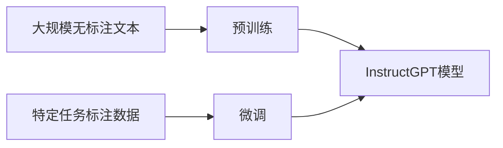

## 1.背景介绍

在过去的几年里，我们见证了深度学习和自然语言处理(NLP)领域的飞速发展。其中，大规模预训练语言模型，例如BERT、GPT等，已经在各种NLP任务中取得了显著的效果。这些模型能够在大规模语料库上学习到丰富的语言知识，从而在许多下游任务中取得优异的性能。最近，OpenAI发布了一种新的语言模型InstructGPT，这是一种以指令为导向的大规模预训练语言模型，旨在理解并执行用户的指令。

## 2.核心概念与联系

InstructGPT是一种基于Transformer架构的大规模预训练语言模型。它的预训练过程包括两个步骤：预训练和微调。在预训练阶段，模型在大规模无标注文本数据上进行训练，学习到语言的基本知识。在微调阶段，模型在特定任务的标注数据上进行训练，学习如何理解和执行用户的指令。


## 3.核心算法原理具体操作步骤

预训练阶段的目标是让模型学习到语言的基本知识。在这个阶段，模型使用自回归训练方式，在大规模无标注文本数据上进行训练。具体来说，模型需要预测每个位置的单词，给定其前面的单词。通过这种方式，模型可以学习到词汇、语法、语义和一些常识知识。

微调阶段的目标是让模型学习如何理解和执行用户的指令。在这个阶段，模型在特定任务的标注数据上进行训练。具体来说，模型需要根据给定的指令和上下文，生成合适的回答。通过这种方式，模型可以学习到如何处理各种指令，以及如何生成合适的回答。



## 4.数学模型和公式详细讲解举例说明

InstructGPT模型的基础是Transformer模型，其核心是自注意力机制。自注意力机制能够计算输入序列中每个单词对其他单词的注意力权重，从而捕捉序列中的依赖关系。

自注意力机制的计算可以表示为：

$$
\text{Attention}(Q, K, V) = \text{softmax}\left(\frac{QK^T}{\sqrt{d_k}}\right)V
$$

其中，$Q$、$K$和$V$分别表示查询、键和值，$d_k$是键的维度。注意力权重通过查询和键的点积计算得到，然后通过softmax函数归一化。最后，归一化的注意力权重和值的点积得到最终的输出。

## 5.项目实践：代码实例和详细解释说明

目前，OpenAI还没有公开InstructGPT的代码和模型。但是，我们可以使用Hugging Face的Transformers库来实现类似的模型。以下是一个简单的例子：

```python
from transformers import GPT2LMHeadModel, GPT2Tokenizer

tokenizer = GPT2Tokenizer.from_pretrained('gpt2')
model = GPT2LMHeadModel.from_pretrained('gpt2')

inputs = tokenizer.encode("Translate the following English text to French: '{}'", return_tensors='pt')
outputs = model.generate(inputs, max_length=60, num_return_sequences=5)

for i, output in enumerate(outputs):
    print(f'{i}: {tokenizer.decode(output)}')
```

这段代码首先加载了GPT-2模型和对应的分词器。然后，它将一个英文句子编码为模型接受的输入格式。接着，它使用模型生成了5个不同的输出。最后，它将生成的输出解码为文本。

## 6.实际应用场景

InstructGPT可以应用在各种需要理解和执行指令的场景中。例如，它可以用于构建聊天机器人，用户可以通过输入指令来与机器人进行交互。它也可以用于自动编程，用户可以通过输入编程指令来生成代码。此外，它还可以用于教育领域，例如自动解答学生的问题，或者提供个性化的学习建议。

## 7.工具和资源推荐

如果你想进一步了解InstructGPT和相关技术，我推荐以下资源：

- OpenAI的博客：OpenAI在其博客上发布了许多关于其研究和产品的文章，包括InstructGPT。
- Hugging Face的Transformers库：这是一个非常强大的库，包含了许多预训练模型，包括GPT-2、BERT等。
- "Attention is All You Need"：这是Transformer模型的原始论文，详细介绍了模型的结构和训练方法。

## 8.总结：未来发展趋势与挑战

大规模预训练语言模型，如InstructGPT，已经在许多NLP任务中取得了显著的效果。然而，这些模型也面临着一些挑战。首先，训练这些模型需要大量的计算资源和数据，这在一定程度上限制了其应用。其次，这些模型可能会生成有偏见或者不真实的输出，这可能会带来一些道德和法律问题。最后，如何让这些模型理解和执行更复杂的指令，仍然是一个开放的问题。

## 9.附录：常见问题与解答

Q: InstructGPT和GPT-3有什么区别？

A: InstructGPT和GPT-3都是大规模预训练语言模型，但是它们的目标不同。GPT-3的目标是生成连贯和有意义的文本，而InstructGPT的目标是理解和执行用户的指令。

Q: 我可以在哪里找到InstructGPT的代码和模型？

A: 目前，OpenAI还没有公开InstructGPT的代码和模型。但是，你可以使用Hugging Face的Transformers库来实现类似的模型。

Q: InstructGPT可以用于哪些应用？

A: InstructGPT可以应用在各种需要理解和执行指令的场景中，例如聊天机器人、自动编程和教育等。

作者：禅与计算机程序设计艺术 / Zen and the Art of Computer Programming