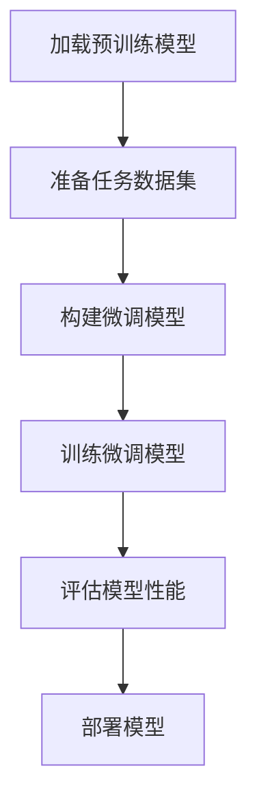

# 大语言模型原理与工程实践：什么是有监督微调

## 1. 背景介绍

### 1.1 大语言模型的兴起

近年来,自然语言处理(NLP)领域取得了长足的进步,很大程度上归功于大型语言模型(Large Language Models, LLMs)的兴起。这些模型通过在海量文本数据上进行预训练,学习了丰富的语言知识和上下文信息,展现出令人惊叹的语言理解和生成能力。

典型的大语言模型包括 GPT (Generative Pre-trained Transformer)、BERT (Bidirectional Encoder Representations from Transformers)、XLNet、RoBERTa 等,它们在自然语言处理的各种下游任务中表现出色,如文本分类、机器翻译、问答系统等。

### 1.2 大语言模型的挑战

尽管大语言模型取得了巨大的成功,但它们也面临着一些挑战:

1. **数据偏差**: 预训练语料库可能存在偏差,导致模型对某些主题或领域的表现不佳。
2. **计算资源消耗**: 训练大语言模型需要大量的计算资源,包括 GPU 和存储空间。
3. **知识更新滞后**: 预训练的语料库无法及时更新,模型可能缺乏对最新知识的理解。
4. **安全性和可解释性**: 大语言模型的内部工作机制往往是一个黑箱,存在潜在的安全和可解释性问题。

为了解决这些挑战,研究人员提出了各种技术,其中有监督微调(Supervised Fine-tuning)是一种常用且行之有效的方法。

## 2. 核心概念与联系

### 2.1 什么是有监督微调?

有监督微调是一种将预训练的大语言模型应用于特定任务的技术。它的基本思想是:首先在大量无标注文本数据上预训练一个通用的语言模型,然后在有标注的任务数据上进行"微调"(Fine-tuning),使模型适应特定的下游任务。

微调过程通常只需要对模型的最后几层进行训练,而保留大部分预训练的参数不变。这种方式可以充分利用预训练模型学习到的语言知识,同时使模型在特定任务上获得更好的性能。

### 2.2 有监督微调的优势

有监督微调具有以下优势:

1. **数据高效**: 相比从头训练一个全新的模型,微调只需要较少的任务数据,就可以获得良好的性能。
2. **计算高效**: 由于只需要微调最后几层,计算成本远低于完全重新训练模型。
3. **泛化能力强**: 预训练模型学习到的语言知识可以很好地迁移到新任务上,提高了模型的泛化能力。
4. **灵活性高**: 可以针对不同的任务和数据集进行微调,使模型适应各种场景。

### 2.3 有监督微调的流程

有监督微调的基本流程如下所示:



1. 加载预训练的大语言模型,如 BERT、GPT 等。
2. 准备特定任务的标注数据集,如文本分类、机器翻译等。
3. 根据任务构建微调模型,包括添加任务特定的输出层等。
4. 在任务数据集上训练微调模型,优化模型参数。
5. 评估微调后模型在验证集或测试集上的性能。
6. 将微调后的模型部署到实际应用中。

## 3. 核心算法原理具体操作步骤

有监督微调的核心算法原理可以概括为以下几个步骤:

### 3.1 加载预训练模型

首先,我们需要加载一个预训练的大语言模型,如 BERT、GPT 等。这些模型通常是在大规模无标注语料库上进行自监督预训练的,学习到了丰富的语言知识和上下文信息。

加载预训练模型的代码示例(以 PyTorch 为例):

```python
from transformers import BertModel, BertTokenizer

# 加载预训练模型和分词器
model = BertModel.from_pretrained('bert-base-uncased')
tokenizer = BertTokenizer.from_pretrained('bert-base-uncased')
```

### 3.2 准备任务数据集

接下来,我们需要准备特定任务的标注数据集。数据集通常包含输入文本和对应的标签或目标值。对于不同的任务,数据集的格式可能有所不同。

以文本分类任务为例,数据集可能是这样的:

```
输入文本1, 标签1
输入文本2, 标签2
...
```

我们需要对数据集进行预处理,如分词、填充、构建张量等,以便输入到模型中。

### 3.3 构建微调模型

根据任务的性质,我们需要在预训练模型的基础上构建微调模型。这通常包括以下步骤:

1. 冻结预训练模型的大部分参数,只保留最后几层可训练。
2. 添加任务特定的输出层,如分类器、回归器等。
3. 定义损失函数和优化器。

以文本分类任务为例,微调模型的构建代码如下:

```python
from transformers import BertForSequenceClassification

# 加载预训练模型
model = BertForSequenceClassification.from_pretrained('bert-base-uncased', num_labels=num_labels)

# 冻结预训练模型的大部分参数
for param in model.bert.parameters():
    param.requires_grad = False

# 定义损失函数和优化器
loss_fn = nn.CrossEntropyLoss()
optimizer = optim.AdamW(model.parameters(), lr=2e-5)
```

### 3.4 训练微调模型

在构建好微调模型后,我们就可以在任务数据集上进行训练了。训练过程通常包括以下步骤:

1. 对每个批次的输入数据进行预处理,如分词、填充等。
2. 将输入数据传递给模型,获取预测结果。
3. 计算损失函数,反向传播梯度。
4. 使用优化器更新模型参数。
5. 在验证集上评估模型性能,决定是否提前停止训练。

以文本分类任务为例,训练代码如下:

```python
for epoch in range(num_epochs):
    for batch in data_loader:
        # 预处理输入数据
        input_ids, attention_mask, labels = batch
        
        # 前向传播
        outputs = model(input_ids, attention_mask=attention_mask, labels=labels)
        loss = outputs.loss
        
        # 反向传播
        loss.backward()
        optimizer.step()
        optimizer.zero_grad()
        
    # 在验证集上评估模型
    eval_loss, eval_acc = evaluate(model, val_loader)
    print(f'Epoch {epoch+1}: val_loss={eval_loss}, val_acc={eval_acc}')
```

### 3.5 评估和部署模型

训练完成后,我们需要在测试集或验证集上评估微调后模型的性能,包括准确率、F1 分数等指标。如果性能满意,就可以将模型部署到实际的应用系统中。

在部署之前,我们还需要对模型进行优化,如量化、剪枝等,以减小模型的大小和提高推理速度。

## 4. 数学模型和公式详细讲解举例说明

在有监督微调的过程中,我们通常需要优化一个损失函数,以使模型在任务数据集上的性能最佳化。损失函数的选择取决于具体的任务类型。

### 4.1 分类任务

对于分类任务,我们通常使用交叉熵损失函数(Cross Entropy Loss)。设有 $C$ 个类别,对于第 $i$ 个样本,其真实标签为 $y_i \in \{1, 2, \dots, C\}$,模型输出的预测概率为 $\hat{y}_i = (p_1, p_2, \dots, p_C)$,其中 $\sum_{c=1}^C p_c = 1$。交叉熵损失函数定义为:

$$
\mathcal{L}_i = -\sum_{c=1}^C \mathbb{1}_{[y_i=c]} \log p_c
$$

其中 $\mathbb{1}_{[\cdot]}$ 是指示函数,当条件成立时取值为 1,否则为 0。

对于整个训练集,我们需要最小化所有样本的平均损失:

$$
\mathcal{L} = \frac{1}{N} \sum_{i=1}^N \mathcal{L}_i
$$

其中 $N$ 是训练集的样本数量。

### 4.2 回归任务

对于回归任务,我们通常使用均方误差损失函数(Mean Squared Error Loss)。设第 $i$ 个样本的真实目标值为 $y_i$,模型输出的预测值为 $\hat{y}_i$,均方误差损失函数定义为:

$$
\mathcal{L}_i = (\hat{y}_i - y_i)^2
$$

对于整个训练集,我们需要最小化所有样本的平均损失:

$$
\mathcal{L} = \frac{1}{N} \sum_{i=1}^N \mathcal{L}_i
$$

### 4.3 序列生成任务

对于序列生成任务,如机器翻译、文本摘要等,我们通常使用最大似然估计(Maximum Likelihood Estimation, MLE)来优化模型参数。设输入序列为 $\mathbf{x} = (x_1, x_2, \dots, x_M)$,目标输出序列为 $\mathbf{y} = (y_1, y_2, \dots, y_N)$,模型输出的条件概率为 $P(\mathbf{y} | \mathbf{x}; \theta)$,其中 $\theta$ 是模型参数。我们需要最大化似然函数:

$$
\mathcal{L} = \log P(\mathbf{y} | \mathbf{x}; \theta) = \sum_{t=1}^N \log P(y_t | \mathbf{x}, y_{<t}; \theta)
$$

其中 $y_{<t}$ 表示序列 $\mathbf{y}$ 的前 $t-1$ 个元素。

在实际训练中,我们通常最小化负对数似然损失函数:

$$
\mathcal{L} = -\log P(\mathbf{y} | \mathbf{x}; \theta) = -\sum_{t=1}^N \log P(y_t | \mathbf{x}, y_{<t}; \theta)
$$

## 5. 项目实践: 代码实例和详细解释说明

为了更好地理解有监督微调的过程,我们以文本分类任务为例,使用 PyTorch 和 Hugging Face Transformers 库进行实践。

### 5.1 准备数据集

我们使用 GLUE 基准测试中的 SST-2 (Stanford Sentiment Treebank) 数据集,它是一个二分类情感分析任务,需要判断一个句子的情感极性是正面还是负面。

```python
from datasets import load_dataset

# 加载数据集
dataset = load_dataset('glue', 'sst2')
```

### 5.2 数据预处理

我们需要对数据进行预处理,包括分词、填充、构建张量等。

```python
from transformers import BertTokenizer

# 加载分词器
tokenizer = BertTokenizer.from_pretrained('bert-base-uncased')

# 定义预处理函数
def preprocess(examples):
    return tokenizer(examples['sentence'], truncation=True, padding='max_length', max_length=128)

# 对数据集进行预处理
dataset = dataset.map(preprocess, batched=True)
```

### 5.3 构建微调模型

我们使用 BertForSequenceClassification 模型,它是在 BERT 模型的基础上添加了一个分类头,用于序列分类任务。

```python
from transformers import BertForSequenceClassification

# 加载预训练模型
model = BertForSequenceClassification.from_pretrained('bert-base-uncased', num_labels=2)

# 冻结预训练模型的大部分参数
for param in model.bert.parameters():
    param.requires_grad = False

# 定义损失函数和优化器
loss_fn = nn.CrossEntropyLoss()
optimizer = optim.AdamW(model.parameters(), lr=2e-5)
```

### 5.4 训练微调模型

我们在训练集上训练微调模型,并在验证集上评估性能。

```python
from tqdm import tqdm

# 训练函数
def train(model, train_loader, val_loader, epochs):
    for epoch in range(epochs):
        model.train()
        total_loss = 0
        for batch in tqdm(train_loader):
            input_ids, attention_mask, labels = batch['input_ids'], batch['attention_mask'], batch['label']
            