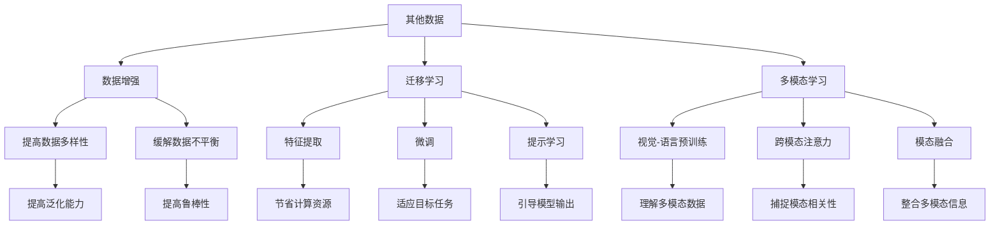

# 大语言模型原理与工程实践：其他数据

## 1. 背景介绍

### 1.1. 大语言模型的兴起

近年来,大型语言模型(Large Language Models, LLMs)在自然语言处理(NLP)领域掀起了一股热潮。这些模型通过在海量文本数据上进行预训练,学习到了丰富的语言知识和上下文信息,从而在下游任务中表现出卓越的性能。

### 1.2. 数据的重要性

数据是训练大语言模型的关键要素之一。高质量、多样化的数据集可以帮助模型更好地捕捉语言的复杂性和丰富性,从而提高模型的泛化能力和鲁棒性。然而,传统的语料库往往存在一些局限性,例如数据量有限、领域覆盖不全面等。因此,探索其他数据源对于提升大语言模型的性能至关重要。

## 2. 核心概念与联系

### 2.1. 数据增强

数据增强(Data Augmentation)是一种通过对现有数据进行变换或扩充,生成新的训练样本的技术。在大语言模型中,常见的数据增强方法包括:

- 随机插入/删除/交换/替换词语或短语
- 同义词替换
- 语法变换(如主动到被动语态转换)
- 上采样/下采样特定类别样本

数据增强可以增加训练数据的多样性,提高模型的泛化能力,并缓解数据不平衡问题。

### 2.2. 迁移学习

迁移学习(Transfer Learning)是一种利用在源域学习到的知识,来帮助目标域任务的学习方法。在大语言模型中,常见的迁移学习方式包括:

- 特征提取: 使用预训练模型提取文本的特征向量,然后在目标任务上进行微调。
- 微调: 在预训练模型的基础上,对部分层进行微调,使其更适合目标任务。
- 提示学习: 通过设计特定的提示,引导预训练模型生成所需的输出。

迁移学习可以有效利用现有的大语言模型,节省计算资源,并提高目标任务的性能。

### 2.3. 多模态学习

大多数现有的大语言模型都是基于文本数据进行训练的。然而,真实世界中的数据往往是多模态的,包括图像、视频、音频等。多模态学习(Multimodal Learning)旨在将不同模态的数据融合起来,建立更加全面的语义表示。

在大语言模型中,常见的多模态学习方法包括:

- 视觉-语言预训练: 在图像-文本对数据上进行预训练,学习视觉和语言的联合表示。
- 跨模态注意力: 在编码器-解码器架构中,引入跨模态的注意力机制,捕捉不同模态之间的相关性。
- 模态融合: 通过特征级或决策级融合,将不同模态的信息整合在一起。

多模态学习可以帮助大语言模型更好地理解多模态数据,提高在复杂场景下的应用能力。



## 3. 核心算法原理具体操作步骤

### 3.1. 数据增强算法

以下是一种常见的数据增强算法,用于生成新的训练样本:

1. 随机选择一个增强操作,如插入、删除、交换或替换词语。
2. 对原始样本执行选定的增强操作,生成新的样本。
3. 根据需要,可以对新样本进行过滤或清理,以确保其语义和语法的合理性。
4. 将新样本添加到训练集中。
5. 重复步骤1-4,直到达到预期的数据扩充量。

以下是一个使用Python实现的示例代码:

```python
import random
from nltk.corpus import wordnet

def synonym_replacement(words, n):
    new_words = words.copy()
    random_word_list = list(set([word for word in words if word not in ['a', 'the', 'an', 'and', 'or', 'but', 'nor', 'so']]))
    random.shuffle(random_word_list)
    num_replaced = 0
    for random_word in random_word_list:
        synonyms = get_synonyms(random_word)
        if len(synonyms) >= 1:
            new_words[words.index(random_word)] = random.choice(synonyms)
            num_replaced += 1
        if num_replaced >= n:
            break

    sentence = ' '.join(new_words)
    return sentence

def get_synonyms(word):
    synonyms = []
    for syn in wordnet.synsets(word):
        for lemma in syn.lemmas():
            synonym = lemma.name().replace('_', ' ')
            if synonym != word:
                synonyms.append(synonym)
    return list(set(synonyms))
```

上述代码实现了同义词替换的数据增强方法。它随机选择句子中的单词,并用同义词替换,从而生成新的训练样本。可以根据需要调整替换单词的数量和替换策略。

### 3.2. 迁移学习算法

以下是一种常见的迁移学习算法,用于在目标任务上微调预训练模型:

1. 加载预训练的大语言模型及其参数。
2. 根据目标任务的需求,设计合适的输入和输出表示。
3. 在预训练模型的基础上,添加任务特定的输入/输出层。
4. 冻结预训练模型的部分层,只对剩余层进行微调。
5. 准备目标任务的训练数据集。
6. 定义损失函数和优化器,开始在目标任务上进行微调。
7. 在验证集上监控模型性能,并在达到预期效果时停止训练。

以下是一个使用PyTorch实现的示例代码:

```python
import torch
from transformers import BertModel, BertTokenizer

# 加载预训练模型和分词器
model = BertModel.from_pretrained('bert-base-uncased')
tokenizer = BertTokenizer.from_pretrained('bert-base-uncased')

# 冻结预训练模型的部分层
for param in model.embeddings.parameters():
    param.requires_grad = False
for param in model.encoder.layer[:8].parameters():
    param.requires_grad = False

# 添加任务特定的输出层
classifier = torch.nn.Linear(model.config.hidden_size, num_labels)

# 定义损失函数和优化器
loss_fn = torch.nn.CrossEntropyLoss()
optimizer = torch.optim.Adam(model.parameters(), lr=2e-5)

# 准备数据集和数据加载器
# ...

# 微调模型
for epoch in range(num_epochs):
    for batch in data_loader:
        # 准备输入
        input_ids = batch['input_ids'].to(device)
        attention_mask = batch['attention_mask'].to(device)
        labels = batch['labels'].to(device)

        # 前向传播
        outputs = model(input_ids, attention_mask=attention_mask)
        logits = classifier(outputs.last_hidden_state[:, 0, :])

        # 计算损失并反向传播
        loss = loss_fn(logits, labels)
        loss.backward()
        optimizer.step()
        optimizer.zero_grad()

    # 在验证集上评估模型
    # ...
```

上述代码展示了如何在BERT预训练模型的基础上,添加任务特定的输出层,并在目标任务上进行微调。可以根据具体任务调整输入表示、损失函数和优化器等参数。

### 3.3. 多模态学习算法

以下是一种常见的多模态学习算法,用于融合视觉和语言信息:

1. 准备视觉-语言对数据集,包括图像和对应的文本描述。
2. 使用预训练的视觉模型(如ResNet)和语言模型(如BERT)分别编码图像和文本。
3. 将视觉和语言表示通过跨模态注意力机制进行融合,捕捉不同模态之间的相关性。
4. 将融合后的表示输入到任务特定的输出层,生成所需的预测结果。
5. 定义损失函数和优化器,在训练数据集上进行端到端的联合训练。
6. 在验证集上监控模型性能,并在达到预期效果时停止训练。

以下是一个使用PyTorch实现的示例代码:

```python
import torch
from transformers import BertModel, BertTokenizer
from torchvision.models import resnet50

# 加载预训练模型和分词器
text_model = BertModel.from_pretrained('bert-base-uncased')
tokenizer = BertTokenizer.from_pretrained('bert-base-uncased')
image_model = resnet50(pretrained=True)

# 定义跨模态注意力模块
class CrossModalAttention(torch.nn.Module):
    def __init__(self, hidden_size):
        super().__init__()
        self.query = torch.nn.Linear(hidden_size, hidden_size)
        self.key = torch.nn.Linear(hidden_size, hidden_size)
        self.value = torch.nn.Linear(hidden_size, hidden_size)
        self.softmax = torch.nn.Softmax(dim=-1)

    def forward(self, text_repr, image_repr):
        query = self.query(text_repr)
        key = self.key(image_repr)
        value = self.value(image_repr)
        attention_scores = torch.matmul(query, key.transpose(-2, -1))
        attention_weights = self.softmax(attention_scores)
        fused_repr = torch.matmul(attention_weights, value)
        return fused_repr

# 定义多模态模型
class MultimodalModel(torch.nn.Module):
    def __init__(self, num_labels):
        super().__init__()
        self.text_model = text_model
        self.image_model = image_model
        self.attention = CrossModalAttention(text_model.config.hidden_size)
        self.classifier = torch.nn.Linear(text_model.config.hidden_size, num_labels)

    def forward(self, input_ids, attention_mask, images):
        text_repr = self.text_model(input_ids, attention_mask=attention_mask)[0]
        image_repr = self.image_model(images)
        fused_repr = self.attention(text_repr, image_repr)
        logits = self.classifier(fused_repr)
        return logits

# 定义损失函数和优化器
# ...

# 准备数据集和数据加载器
# ...

# 训练模型
for epoch in range(num_epochs):
    for batch in data_loader:
        # 准备输入
        input_ids = batch['input_ids'].to(device)
        attention_mask = batch['attention_mask'].to(device)
        images = batch['images'].to(device)
        labels = batch['labels'].to(device)

        # 前向传播
        logits = model(input_ids, attention_mask, images)

        # 计算损失并反向传播
        loss = loss_fn(logits, labels)
        loss.backward()
        optimizer.step()
        optimizer.zero_grad()

    # 在验证集上评估模型
    # ...
```

上述代码展示了如何构建一个多模态模型,融合视觉和语言信息。可以根据具体任务调整模型架构、损失函数和优化器等参数。

## 4. 数学模型和公式详细讲解举例说明

在大语言模型中,常见的数学模型和公式包括:

### 4.1. 自注意力机制 (Self-Attention)

自注意力机制是 Transformer 模型的核心组件,它允许模型捕捉输入序列中任意两个位置之间的依赖关系。给定一个输入序列 $X = (x_1, x_2, \ldots, x_n)$,自注意力机制计算每个位置的表示 $y_i$ 如下:

$$y_i = \sum_{j=1}^{n} \alpha_{ij}(x_jW^V)$$

其中,权重 $\alpha_{ij}$ 表示位置 $i$ 对位置 $j$ 的注意力分数,通过以下公式计算:

$$\alpha_{ij} = \frac{e^{s_{ij}}}{\sum_{k=1}^{n}e^{s_{ik}}}$$

$$s_{ij} = (x_iW^Q)(x_jW^K)^T$$

$W^Q$、$W^K$ 和 $W^V$ 分别是查询(Query)、键(Key)和值(Value)的线性变换矩阵。

自注意力机制允许模型动态地捕捉输入序列中的长程依赖