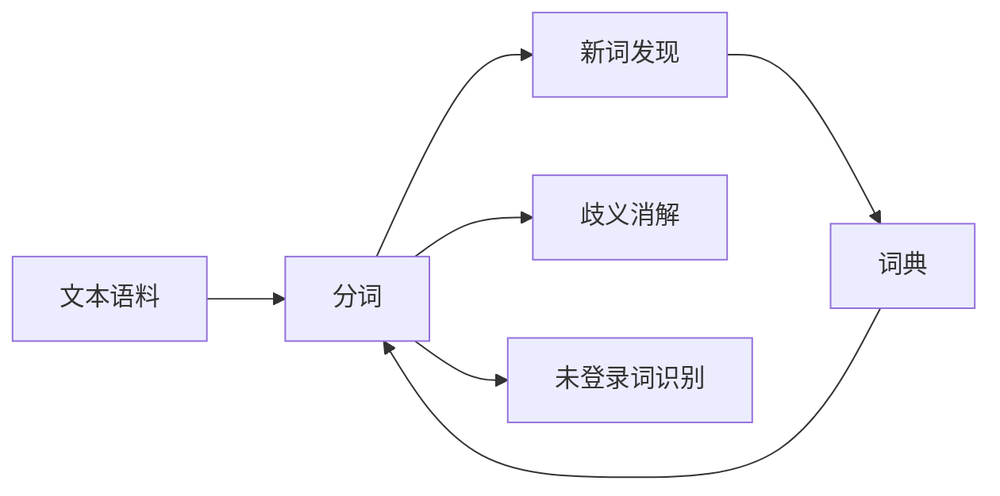

# 大语言模型原理与工程实践：分词技术

## 1.背景介绍
### 1.1 分词技术的重要性
在自然语言处理领域,分词是一项基础而关键的技术。准确高效的分词能力,是文本理解、机器翻译、信息检索等众多NLP任务的基石。尤其是在中文等语言中,由于词与词之间没有明显的分隔符号,分词就显得尤为重要和具有挑战性。

### 1.2 分词技术的发展历程
分词技术经历了由基于规则、基于统计到基于深度学习的发展过程。早期主要采用基于词典匹配和语法规则的方法,之后统计机器学习方法如隐马尔可夫模型(HMM)、条件随机场(CRF)等成为主流,近年来随着深度学习的兴起,一些神经网络模型如BiLSTM-CRF、Transformer等在分词任务上取得了很好的效果。

### 1.3 分词在大语言模型中的应用
大语言模型如BERT、GPT等,在预训练阶段通常以字或subword为单位构建词表进行建模,以更好地处理未登录词。但在实际应用中,我们往往需要将字级或subword级的输出还原为词,这就需要用到分词技术。此外,使用高质量的分词作为输入,也有助于提升大语言模型在下游任务上的表现。

## 2.核心概念与联系
### 2.1 分词的定义与分类
分词(Word Segmentation)是指将一个句子切分成一系列词的过程。按粒度可分为粗粒度和细粒度分词,按策略可分为基于字典匹配、基于统计模型、基于深度学习等。不同语言的分词任务难度不同,中文、日文等语言的分词通常更具挑战性。

### 2.2 新词发现
新词发现是指从文本语料中挖掘出词典中没有收录的新词。常见方法有基于统计的互信息、自由度等指标,以及基于深度学习的方法。新词发现可以帮助我们及时更新词典,提高分词系统的召回率。

### 2.3 歧义消解 
歧义消解是指对交叉歧义串进行正确切分。比如"花生奶酪"一词,可以切分为"花生/奶酪"或"花/生奶/酪",需要根据上下文进行判断。主要方法有基于规则的最大匹配法、基于统计的N-gram语言模型等。

### 2.4 未登录词识别
未登录词识别是指识别出文本中的未在词典中出现的词,如命名实体、新词等。主要方法有基于词典匹配、基于序列标注的统计机器学习和深度学习方法。

### 2.5 概念关系图
下图展示了分词技术中几个核心概念之间的关系:



## 3.核心算法原理具体操作步骤
### 3.1 基于字典匹配的分词算法
#### 3.1.1 正向最大匹配法(FMM)
1. 从待分词文本的首字符开始,取指定最大长度(如7)的子串; 
2. 查找词典,若子串在词典中,则将其切分出来,否则长度减1重复第2步;
3. 重复上述过程直到文本结束。

#### 3.1.2 逆向最大匹配法(RMM)  
与FMM类似,只是从文本末尾开始匹配切分。

#### 3.1.3 双向最大匹配法
同时使用FMM和RMM进行分词,然后按照最大匹配词数、总词数等规则决定最终的分词结果。

### 3.2 基于统计模型的分词算法
#### 3.2.1 HMM分词
1. 将分词问题转化为序列标注问题,标签集合为{B,M,E,S},分别表示一个词的开始、中间、结尾以及单字成词;
2. 使用训练语料训练HMM模型,主要参数为初始概率、转移概率和发射概率;
3. 使用维特比算法对待分词文本进行解码,得到最优的标签序列,进而得到分词结果。

#### 3.2.2 CRF分词
与HMM类似,只是将HMM换成了CRF模型。CRF是一种对数线性模型,可以引入更丰富的特征,因而分词效果通常优于HMM。

### 3.3 基于深度学习的分词算法
#### 3.3.1 BiLSTM-CRF分词
1. 将每个字用向量表示,输入到双向LSTM中编码为上下文相关的特征;
2. 将BiLSTM的输出作为CRF的发射分数,使用CRF进行序列标注;
3. 使用维特比算法解码得到最优标签序列,进而得到分词结果。

#### 3.3.2 基于Transformer的分词
1. 将文本输入到Transformer的Encoder中,得到每个字的上下文表示;
2. 在Encoder的输出上接一个分类器,预测每个字属于{B,M,E,S}中的哪一个标签;
3. 根据预测的标签序列得到最终的分词结果。

## 4.数学模型和公式详细讲解举例说明
### 4.1 HMM分词模型
HMM分词模型主要由初始概率$\pi$、转移概率$A$和发射概率$B$三部分组成。其中:

- 初始概率$\pi_i$表示标签$i$出现在句首的概率。
- 转移概率$a_{ij}$表示从标签$i$转移到标签$j$的概率。 
- 发射概率$b_i(o_t)$表示标签$i$生成观测字$o_t$的概率。

假设标签序列为$I=(i_1,i_2,...,i_T)$,观测字序列为$O=(o_1,o_2,...,o_T)$,则HMM分词模型可表示为:

$$P(I,O)=\pi_{i_1}\prod_{t=1}^T a_{i_t i_{t+1}}b_{i_t}(o_t)$$

分词任务的目标是找到概率最大的标签序列$I^*$:

$$I^*=\arg\max_I P(I|O)=\arg\max_I \frac{P(I,O)}{P(O)}=\arg\max_I P(I,O)$$

通常使用维特比算法进行解码,其计算复杂度为$O(TN^2)$,其中$T$为句子长度,$N$为标签数。

### 4.2 CRF分词模型
CRF分词模型是在HMM的基础上引入了更多的特征函数,可以表示为:

$$P(I|O)=\frac{1}{Z(O)}\exp\left(\sum_{t=1}^T\sum_{k=1}^K \lambda_k f_k(I,O,t)\right)$$

其中$Z(O)$为归一化因子,$f_k$为第$k$个特征函数,$\lambda_k$为对应的权重。常用的特征包括:

- 单字特征:$f(i_t,o_t)$
- 转移特征:$f(i_{t-1},i_t,o_t)$
- 观测-转移特征:$f(i_{t-1},i_t,o_{t-1},o_t)$

CRF模型的训练通常使用最大似然估计,目标函数为:

$$\mathcal{L}(\lambda)=\sum_{j=1}^N \log P(I^{(j)}|O^{(j)})-\frac{\lambda^2}{2\sigma^2}$$

其中$N$为训练样本数,$\lambda$为特征权重向量,$\frac{\lambda^2}{2\sigma^2}$为L2正则化项。

在推断阶段,同样使用维特比算法进行解码,复杂度与HMM相同。但由于特征更丰富,CRF的分词效果通常优于HMM。

## 5.项目实践：代码实例和详细解释说明
下面以BiLSTM-CRF模型为例,给出一个分词的PyTorch实现:

```python
import torch
import torch.nn as nn

class BiLSTM_CRF(nn.Module):
    def __init__(self, vocab_size, embedding_dim, hidden_dim, num_tags):
        super(BiLSTM_CRF, self).__init__()
        self.embedding = nn.Embedding(vocab_size, embedding_dim)
        self.bilstm = nn.LSTM(embedding_dim, hidden_dim // 2, num_layers=1, bidirectional=True, batch_first=True)
        self.hidden2tag = nn.Linear(hidden_dim, num_tags)
        self.crf = CRF(num_tags)

    def forward(self, x, mask):
        # x: (batch_size, seq_len)
        # mask: (batch_size, seq_len)
        emb = self.embedding(x)  # (batch_size, seq_len, embedding_dim)
        lstm_out, _ = self.bilstm(emb)  # (batch_size, seq_len, hidden_dim)
        emissions = self.hidden2tag(lstm_out)  # (batch_size, seq_len, num_tags)
        return self.crf.decode(emissions, mask)

    def loss(self, x, tags, mask):
        # x: (batch_size, seq_len)
        # tags: (batch_size, seq_len)
        # mask: (batch_size, seq_len)
        emb = self.embedding(x)
        lstm_out, _ = self.bilstm(emb)
        emissions = self.hidden2tag(lstm_out)
        return self.crf.loss(emissions, tags, mask)
```

其中`CRF`类的实现如下:

```python
class CRF(nn.Module):
    def __init__(self, num_tags):
        super(CRF, self).__init__()
        self.num_tags = num_tags
        self.transitions = nn.Parameter(torch.empty(num_tags, num_tags))
        self.start_transitions = nn.Parameter(torch.empty(num_tags))
        self.end_transitions = nn.Parameter(torch.empty(num_tags))
        self.reset_parameters()

    def reset_parameters(self):
        nn.init.uniform_(self.transitions, -0.1, 0.1)
        nn.init.uniform_(self.start_transitions, -0.1, 0.1)
        nn.init.uniform_(self.end_transitions, -0.1, 0.1)

    def forward(self, emissions, tags, mask):
        # emissions: (batch_size, seq_len, num_tags)
        # tags: (batch_size, seq_len)
        # mask: (batch_size, seq_len)
        return self.loss(emissions, tags, mask)

    def loss(self, emissions, tags, mask):
        batch_size, seq_len = tags.shape
        mask = mask.float()
        score = self._compute_score(emissions, tags, mask)
        partition = self._compute_log_partition(emissions, mask)
        return (partition - score).mean()

    def decode(self, emissions, mask):
        return self._viterbi_decode(emissions, mask)

    def _compute_score(self, emissions, tags, mask):
        batch_size, seq_len = tags.shape
        score = self.start_transitions[tags[:, 0]]
        for i in range(seq_len - 1):
            score += self.transitions[tags[:, i], tags[:, i+1]] * mask[:, i+1]
            score += emissions[torch.arange(batch_size), i, tags[:, i]] * mask[:, i]
        last_tags = tags[torch.arange(batch_size), mask.sum(dim=1).long() - 1]
        score += self.end_transitions[last_tags]
        score += emissions[torch.arange(batch_size), mask.sum(dim=1).long() - 1, last_tags]
        return score

    def _compute_log_partition(self, emissions, mask):
        batch_size, seq_len, num_tags = emissions.shape
        dp = emissions[:, 0] + self.start_transitions
        for i in range(1, seq_len):
            broadcast_emissions = emissions[:, i].unsqueeze(1)  # (batch_size, 1, num_tags)
            broadcast_transitions = self.transitions.unsqueeze(0)  # (1, num_tags, num_tags)
            broadcast_dp = dp.unsqueeze(2)  # (batch_size, num_tags, 1)
            score = broadcast_dp + broadcast_emissions + broadcast_transitions  # (batch_size, num_tags, num_tags)
            dp = torch.logsumexp(score, dim=1) * mask[:, i].unsqueeze(1) + dp * (1 - mask[:, i]).unsqueeze(1)
        dp = dp + self.end_transitions
        return torch.logsumexp(dp, dim=1)

    def _viterbi_decode(self, emissions, mask):
        batch_size, seq_len, num_tags = emissions.shape
        dp = emissions[:, 0] + self.start_transitions
        backpointers = []
        for i in range(1, seq_len):
            broadcast_emissions = emissions[:, i].unsqueeze(1)
            broadcast_transitions = self.transitions.unsqueeze(0)
            broadcast_dp = dp.unsqueeze(2)
            score = broadcast_dp + broadcast_emissions + broadcast_transitions
            dp, indices = torch.max(score, dim=1)
            backpointers.append(indices)
        dp = dp + self.end_transitions
        _, last_tags = torch.max(dp, dim=1