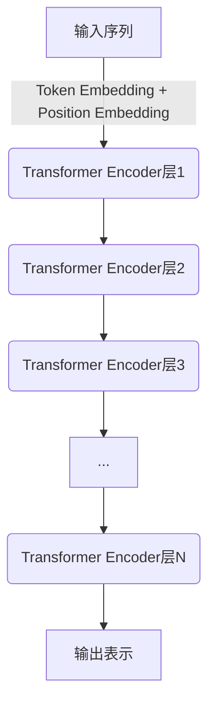
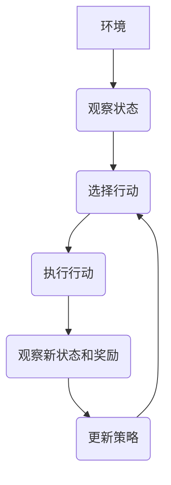

# 大语言模型原理与工程实践：大语言模型强化对齐

## 1. 背景介绍

### 1.1 大语言模型的兴起

近年来,大型语言模型(Large Language Models, LLMs)在自然语言处理(NLP)领域掀起了一场革命。这些模型通过在海量文本数据上进行预训练,学习了丰富的语言知识和上下文表示,展现出令人惊叹的生成能力。著名的GPT(Generative Pre-trained Transformer)系列模型、PaLM、Chinchilla等,都是典型的大语言模型。

大语言模型的出现,为众多NLP任务提供了通用的解决方案,如机器翻译、问答系统、文本摘要等,极大推动了人工智能的发展。然而,这些模型也面临着一些挑战,如对话一致性差、事实偏差、不可控性等,亟需改进和优化。

### 1.2 强化对齐的重要性

为了充分发挥大语言模型的潜力,确保其生成的内容符合预期,我们需要对模型进行"对齐"(Alignment)。对齐旨在使模型的行为与人类价值观和目标相一致,产生更加安全、可靠和有益的输出。

强化对齐(Reinforcement Alignment)作为一种有前景的对齐方法,通过强化学习来优化模型,使其在生成过程中更好地满足人类的期望。本文将深入探讨强化对齐在大语言模型中的原理和工程实践,为读者提供全面的理解和实用的指导。

## 2. 核心概念与联系

### 2.1 大语言模型

大语言模型是一种基于transformer架构的深度神经网络模型,通过自监督学习方式在大规模文本语料上进行预训练。这种预训练过程使模型能够捕捉到丰富的语言知识和上下文信息,从而在下游任务中表现出优异的泛化能力。

大语言模型的核心思想是利用自注意力机制(Self-Attention)来建模输入序列中token之间的长程依赖关系,捕捉上下文语义信息。通过堆叠多个transformer编码器层,模型可以学习到更高层次的语言表示。

### 2.2 强化学习

强化学习(Reinforcement Learning)是机器学习的一个重要分支,它关注如何通过与环境的交互来学习一个策略(Policy),使得智能体(Agent)在该环境中获得最大的累积奖励。

在强化学习中,智能体与环境进行交互,观察当前状态,根据策略选择行动,执行后观察新的状态和获得的奖励,并据此更新策略。这个过程持续迭代,直到策略收敛为最优策略。

### 2.3 强化对齐

强化对齐是将强化学习应用于大语言模型对齐的一种方法。具体来说,我们将大语言模型视为智能体,将生成过程视为与环境的交互。

在每一步生成token时,模型会根据当前策略(即原始的语言模型)输出一个token概率分布。我们可以从这个分布中采样一个token,并将其输出。同时,我们会根据这个token的质量(是否符合人类期望)给出一个奖励值。

通过不断地与人类交互、获取奖励并更新策略,模型就可以逐步学习到一个更好的生成策略,使其输出符合人类期望。这个过程可以看作是在原始语言模型的基础上,通过强化学习来"微调"模型,使其对齐到人类价值观。

## 3. 核心算法原理具体操作步骤

强化对齐算法的核心思想是将大语言模型的生成过程建模为一个马尔可夫决策过程(Markov Decision Process, MDP),并使用强化学习算法来优化模型的生成策略,使其输出更加符合人类期望。下面我们将详细介绍该算法的具体操作步骤。

### 3.1 形式化问题

我们将大语言模型的生成过程视为一个MDP,其中:

- 状态 $s_t$ 表示生成到第 $t$ 个token时的上下文,包括输入提示和已生成的token序列。
- 行动 $a_t$ 表示在当前状态下生成的下一个token。
- 转移函数 $P(s_{t+1}|s_t, a_t)$ 表示在状态 $s_t$ 下生成token $a_t$ 后,转移到新状态 $s_{t+1}$ 的概率,对于文本生成任务,该函数是确定的。
- 奖励函数 $R(s_t, a_t)$ 表示在状态 $s_t$ 下生成token $a_t$ 所获得的奖励值,用于衡量该token的质量是否符合人类期望。

我们的目标是学习一个生成策略 $\pi_\theta(a_t|s_t)$,使得在生成过程中获得的累积奖励最大化:

$$J(\theta) = \mathbb{E}_{\pi_\theta}\left[\sum_{t=0}^{T}R(s_t, a_t)\right]$$

其中 $T$ 表示生成序列的最大长度。

### 3.2 策略梯度算法

为了优化生成策略 $\pi_\theta$,我们采用策略梯度(Policy Gradient)算法。具体来说,我们定义了一个目标函数 $J(\theta)$,表示在当前策略下获得的期望累积奖励。然后,我们计算目标函数关于策略参数 $\theta$ 的梯度,并沿着梯度的方向更新策略参数,以最大化目标函数的值。

根据策略梯度定理,目标函数的梯度可以表示为:

$$\nabla_\theta J(\theta) = \mathbb{E}_{\pi_\theta}\left[\sum_{t=0}^{T}\nabla_\theta\log\pi_\theta(a_t|s_t)Q^{\pi_\theta}(s_t, a_t)\right]$$

其中 $Q^{\pi_\theta}(s_t, a_t)$ 表示在状态 $s_t$ 下执行行动 $a_t$,之后按照策略 $\pi_\theta$ 执行所获得的期望累积奖励。

为了估计 $Q^{\pi_\theta}(s_t, a_t)$,我们可以使用蒙特卡罗采样的方法。具体来说,对于每一个生成序列,我们记录下其获得的累积奖励 $G_t = \sum_{t'=t}^{T}R(s_{t'}, a_{t'})$,将其作为 $Q^{\pi_\theta}(s_t, a_t)$ 的无偏估计。

### 3.3 算法步骤

强化对齐算法的具体步骤如下:

1. 初始化大语言模型的参数 $\theta_0$,作为初始生成策略 $\pi_{\theta_0}$。
2. 对于每一个训练样本(输入提示):
   a. 根据当前策略 $\pi_{\theta_i}$ 生成一个序列,记录下每一步的状态 $s_t$、行动 $a_t$ 和奖励 $R(s_t, a_t)$。
   b. 计算该序列的累积奖励 $G_t = \sum_{t'=t}^{T}R(s_{t'}, a_{t'})$。
   c. 根据公式 $\nabla_\theta J(\theta) = \sum_{t=0}^{T}\nabla_\theta\log\pi_\theta(a_t|s_t)G_t$ 计算目标函数的梯度估计。
3. 将所有样本的梯度估计值累加,得到总的梯度 $\nabla_\theta J(\theta_i)$。
4. 使用优化算法(如Adam)沿着梯度方向更新策略参数 $\theta_{i+1} = \theta_i + \alpha\nabla_\theta J(\theta_i)$,得到新的生成策略 $\pi_{\theta_{i+1}}$。
5. 重复步骤2-4,直到策略收敛或达到最大训练轮数。

通过上述算法,我们可以逐步优化大语言模型的生成策略,使其输出更加符合人类期望,实现强化对齐。

## 4. 数学模型和公式详细讲解举例说明

在强化对齐算法中,我们需要定义一个合适的奖励函数 $R(s_t, a_t)$,用于衡量在状态 $s_t$ 下生成token $a_t$ 的质量是否符合人类期望。奖励函数的设计直接影响了模型的对齐效果,因此我们需要结合具体任务,合理设计奖励函数。

### 4.1 基于语言模型分数的奖励函数

一种简单的奖励函数设计方式是基于语言模型分数。具体来说,我们可以使用一个单独训练的高质量语言模型 $P_{\text{ref}}$ 来评估生成序列的质量。对于每一步生成的token $a_t$,我们计算其在参考语言模型下的对数概率 $\log P_{\text{ref}}(a_t|s_t)$,将其作为奖励值:

$$R(s_t, a_t) = \log P_{\text{ref}}(a_t|s_t)$$

这种奖励函数的思路是,如果生成的token在高质量语言模型下的概率较高,说明它是一个较为自然、流畅的token,应当给予正奖励;反之,如果概率较低,则给予负奖励。

例如,对于一个文本生成任务,假设当前状态为 $s_t$ ="我今天去了公园",参考语言模型给出的下一个token概率分布为:

- $P_{\text{ref}}($"玩"$|s_t) = 0.6$
- $P_{\text{ref}}($"吃"$|s_t) = 0.3$
- $P_{\text{ref}}($"睡"$|s_t) = 0.1$

那么,如果我们生成的token为"玩",它将获得奖励 $R(s_t, \text{"玩"}) = \log 0.6 \approx -0.51$;如果生成的token为"睡",它将获得较低的奖励 $R(