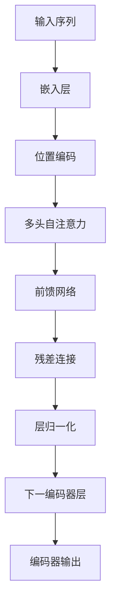
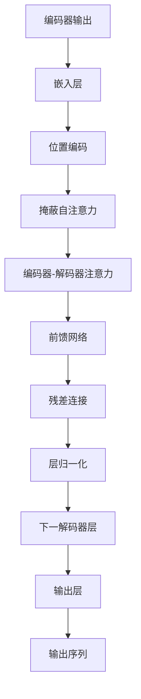

# 大语言模型原理与工程实践：大语言模型训练技术选型技巧

## 1.背景介绍

### 1.1 大语言模型的兴起

近年来,大型语言模型(Large Language Models, LLMs)在自然语言处理领域掀起了一场革命。这些模型通过在海量文本数据上进行预训练,学习了丰富的语言知识和上下文关联,从而在广泛的下游任务中展现出卓越的性能表现。

大语言模型的兴起可以追溯到2018年,当时OpenAI发布了GPT(Generative Pre-trained Transformer)模型,这是第一个在通用语料库上预训练的大型语言模型。随后,谷歌推出了BERT(Bidirectional Encoder Representations from Transformers)模型,它采用了双向编码器结构,在自然语言理解任务上取得了突破性进展。

### 1.2 大语言模型的优势

大语言模型的主要优势在于:

1. **泛化能力强**: 通过在大规模语料库上预训练,模型可以学习到丰富的语义和语法知识,从而在各种下游任务中表现出良好的泛化能力。

2. **多任务学习**: 大语言模型可以通过微调(fine-tuning)的方式,在各种自然语言处理任务上获得良好的性能,实现了多任务学习的能力。

3. **少样本学习**: 由于模型已经在大规模语料上学习到了丰富的知识,因此在下游任务中只需要少量的标注数据即可完成微调,从而实现了少样本学习。

4. **可解释性**: 一些研究表明,大语言模型在一定程度上捕捉了人类语言的内在逻辑和规律,因此具有一定的可解释性。

### 1.3 大语言模型的挑战

尽管大语言模型取得了巨大的成功,但它们也面临着一些重大挑战:

1. **计算资源需求巨大**: 训练大型语言模型需要海量的计算资源,包括GPU、TPU等专用硬件,以及大量的训练时间和存储空间。这对于大多数组织而言是一个巨大的挑战。

2. **数据质量和隐私**: 训练大语言模型需要大量的文本数据,但如何确保数据的质量和隐私是一个棘手的问题。

3. **偏差和不公平性**: 大语言模型可能会从训练数据中学习到一些不公平的偏见和陈旧观念,从而在实际应用中产生不公平的结果。

4. **安全性和可控性**: 由于大语言模型具有强大的生成能力,如何确保它们不会产生有害或不当的输出,是一个亟待解决的问题。

5. **可解释性和可信度**: 尽管大语言模型在某种程度上具有可解释性,但如何真正理解它们的内在机制,并赢得用户的信任,仍然是一个巨大的挑战。

## 2.核心概念与联系

### 2.1 自注意力机制(Self-Attention)

自注意力机制是大语言模型的核心组成部分之一。它允许模型在计算每个单词的表示时,关注整个输入序列中的所有其他单词,并根据它们之间的关联程度动态地分配注意力权重。

自注意力机制的工作原理如下:

1. 将输入序列映射到查询(Query)、键(Key)和值(Value)向量。
2. 计算查询和所有键向量之间的点积,得到注意力分数。
3. 对注意力分数进行缩放和softmax操作,得到注意力权重。
4. 将注意力权重与值向量相乘,得到加权和表示。

自注意力机制的优势在于,它可以有效地捕捉长距离依赖关系,并且计算效率较高。它为大语言模型的强大性能奠定了基础。

### 2.2 transformer架构

Transformer是大语言模型中广泛采用的一种架构,它完全基于自注意力机制,不再使用传统的循环神经网络(RNN)或卷积神经网络(CNN)结构。

Transformer架构的主要组成部分包括:

1. **编码器(Encoder)**: 对输入序列进行编码,生成上下文表示。
2. **解码器(Decoder)**: 根据编码器的输出和目标序列,生成输出序列。
3. **多头注意力(Multi-Head Attention)**: 将多个注意力头的输出进行拼接,捕捉不同的关系。
4. **位置编码(Positional Encoding)**: 将位置信息编码到输入序列中,因为自注意力机制本身不包含位置信息。

Transformer架构的优势在于并行计算能力强、长距离依赖建模能力强,以及可以灵活地应用于不同的任务。它为大语言模型的发展奠定了坚实的基础。

### 2.3 预训练与微调

大语言模型通常采用预训练和微调(Fine-tuning)的范式。预训练是在大规模无标注语料库上进行的自监督学习,目标是学习通用的语言表示。微调则是在特定的下游任务上,使用有标注的数据对预训练模型进行进一步的调整和优化。

预训练通常采用以下几种策略:

1. **掩蔽语言模型(Masked Language Modeling, MLM)**: 随机掩蔽输入序列中的一些单词,模型需要预测被掩蔽的单词。
2. **下一句预测(Next Sentence Prediction, NSP)**: 判断两个句子是否相邻出现。
3. **自回归语言模型(Autoregressive Language Modeling)**: 基于前面的单词预测下一个单词。
4. **对比学习(Contrastive Learning)**: 通过对比不同视图之间的一致性,学习更加鲁棒的表示。

微调则是在特定任务的标注数据上,对预训练模型进行进一步的优化,使其适应特定任务的需求。微调通常只需要少量的计算资源和标注数据,就可以获得良好的性能表现。

### 2.4 模型压缩与知识蒸馏

由于大语言模型通常具有数十亿甚至上百亿的参数,因此在实际应用中存在巨大的计算和存储开销。为了解决这一问题,研究人员提出了模型压缩和知识蒸馏等技术。

**模型压缩**旨在减小模型的参数规模,常见的方法包括:

1. **剪枝(Pruning)**: 移除模型中不重要的权重或神经元。
2. **量化(Quantization)**: 将浮点数参数量化为低精度的定点数或整数。
3. **知识蒸馏(Knowledge Distillation)**: 使用大模型的输出作为"软目标",指导小模型的训练。

**知识蒸馏**是一种常见的模型压缩技术,它的基本思想是将大模型(教师模型)的知识迁移到小模型(学生模型)上。具体步骤如下:

1. 使用大模型对输入数据进行前向传播,获得softmax输出(或其他形式的知识表示)。
2. 将大模型的softmax输出作为"软目标",指导小模型的训练。
3. 在训练过程中,小模型不仅需要最小化与真实标签的差异,还需要最小化与大模型softmax输出的差异。

通过知识蒸馏,小模型可以学习到大模型的知识,同时大幅减小了参数规模,从而降低了计算和存储开销。

## 3.核心算法原理具体操作步骤

在本节中,我们将详细介绍大语言模型训练的核心算法原理和具体操作步骤。

### 3.1 transformer编码器

Transformer编码器是大语言模型的核心组成部分之一,它负责对输入序列进行编码,生成上下文表示。编码器的具体操作步骤如下:

1. **嵌入层(Embedding Layer)**: 将输入序列中的每个单词映射到一个固定维度的向量空间,得到单词嵌入表示。

2. **位置编码(Positional Encoding)**: 由于自注意力机制本身不包含位置信息,因此需要将位置信息编码到输入序列中。常见的位置编码方法包括正弦/余弦编码和可学习的位置嵌入。

3. **多头自注意力(Multi-Head Self-Attention)**: 对输入序列进行自注意力计算,捕捉单词之间的依赖关系。具体步骤如下:
   a. 将输入序列映射到查询(Query)、键(Key)和值(Value)向量。
   b. 计算查询和所有键向量之间的点积,得到注意力分数矩阵。
   c. 对注意力分数矩阵进行缩放和softmax操作,得到注意力权重矩阵。
   d. 将注意力权重矩阵与值向量相乘,得到加权和表示。
   e. 对多个注意力头的输出进行拼接,捕捉不同的关系。

4. **前馈网络(Feed-Forward Network)**: 对自注意力的输出进行进一步的非线性变换,提取更高层次的特征表示。

5. **残差连接(Residual Connection)**: 将自注意力和前馈网络的输出与输入相加,形成残差连接,有助于梯度传播和模型优化。

6. **层归一化(Layer Normalization)**: 对每一层的输出进行归一化,提高模型的稳定性和收敛速度。

通过多个编码器层的堆叠,transformer编码器可以学习到丰富的上下文表示,为下游任务奠定基础。

### 3.2 transformer解码器

Transformer解码器与编码器类似,但增加了一些特殊的机制来处理序列生成任务。解码器的具体操作步骤如下:

1. **嵌入层(Embedding Layer)**: 将目标序列中的每个单词映射到一个固定维度的向量空间,得到单词嵌入表示。

2. **位置编码(Positional Encoding)**: 与编码器类似,将位置信息编码到目标序列中。

3. **掩蔽自注意力(Masked Self-Attention)**: 对目标序列进行自注意力计算,但需要掩蔽当前位置之后的单词,以避免在生成时利用了未来的信息。

4. **编码器-解码器注意力(Encoder-Decoder Attention)**: 将解码器的输出与编码器的输出进行注意力计算,捕捉输入序列和输出序列之间的依赖关系。

5. **前馈网络(Feed-Forward Network)**: 对注意力的输出进行进一步的非线性变换,提取更高层次的特征表示。

6. **残差连接(Residual Connection)**: 将注意力和前馈网络的输出与输入相加,形成残差连接。

7. **层归一化(Layer Normalization)**: 对每一层的输出进行归一化。

8. **输出层(Output Layer)**: 将解码器的输出映射到目标词汇表,得到每个单词的概率分布。

通过多个解码器层的堆叠,transformer解码器可以生成高质量的输出序列,应用于机器翻译、文本生成等任务。

### 3.3 预训练策略

大语言模型通常采用自监督学习的方式进行预训练,以学习通用的语言表示。常见的预训练策略包括:

1. **掩蔽语言模型(Masked Language Modeling, MLM)**: 在输入序列中随机掩蔽一些单词,模型需要预测被掩蔽的单词。具体步骤如下:
   a. 从输入序列中随机选择一些单词进行掩蔽,将它们替换为特殊的[MASK]标记。
   b. 将掩蔽后的序列输入到transformer模型中,得到每个位置的单词概率分布。
   c. 对于被掩蔽的位置,计算预测单词与