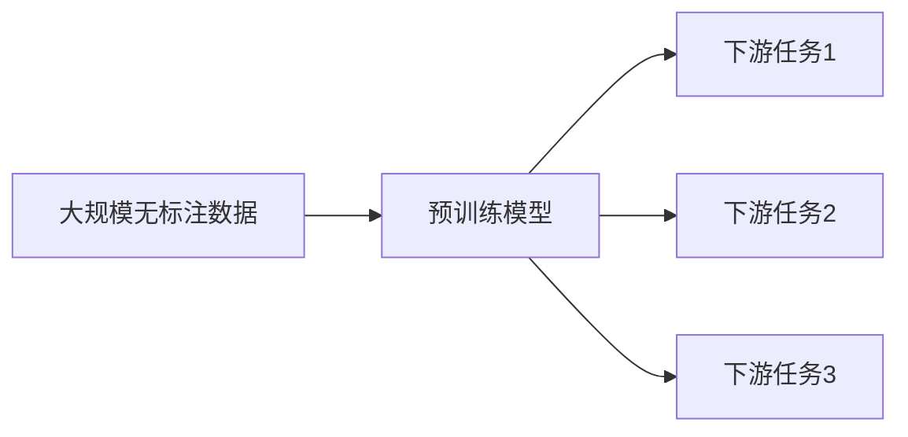

# 大语言模型原理与工程实践：大语言模型训练技术选型技巧

## 1.背景介绍
### 1.1 大语言模型的兴起
近年来,随着深度学习技术的快速发展,自然语言处理(NLP)领域取得了巨大的突破。其中,大语言模型(Large Language Model,LLM)的出现标志着NLP进入了一个新的时代。大语言模型是一种基于海量文本数据训练的语言模型,通过自监督学习的方式,学习语言的内在规律和知识,从而具备了强大的语言理解和生成能力。
### 1.2 大语言模型的应用价值
大语言模型在各个领域展现出了广阔的应用前景。在自然语言处理任务中,如机器翻译、对话系统、文本摘要等,大语言模型可以显著提升系统性能。此外,大语言模型还可以应用于知识图谱构建、信息检索、问答系统等领域,为人机交互和知识管理带来革命性的变化。
### 1.3 大语言模型训练的挑战
尽管大语言模型展现出了巨大的潜力,但训练一个高质量的大语言模型并非易事。大语言模型通常需要海量的训练数据和计算资源,训练过程复杂且耗时。此外,如何选择合适的模型架构、训练技巧和超参数设置,也是一个充满挑战的问题。本文将深入探讨大语言模型训练的关键技术,为工程实践提供指导。

## 2.核心概念与联系
### 2.1 语言模型
语言模型是自然语言处理的基础,它用于刻画语言单元(如单词、字符)的概率分布。给定一个语言单元序列 $S=(w_1,w_2,...,w_n)$,语言模型的目标是估计该序列出现的概率 $P(S)$。传统的 N-gram 语言模型基于马尔可夫假设,利用前 N-1 个单词来预测当前单词:

$$P(S)=\prod_{i=1}^{n}P(w_i|w_{i-N+1},...,w_{i-1})$$

### 2.2 神经语言模型 
神经语言模型使用神经网络来建模语言单元的概率分布。与传统方法相比,神经语言模型可以学习单词的分布式表示(Embedding),捕捉更丰富的语义信息。常见的神经语言模型包括 NNLM、Word2Vec、GloVe 等。以 NNLM 为例,它使用前馈神经网络来预测下一个单词:

$$P(w_i|w_{i-N+1},...,w_{i-1})=\text{softmax}(W\cdot h+b)$$

其中,$h$是隐藏层的输出,$W$和$b$是可学习的参数。

### 2.3 Transformer 模型
Transformer 是一种基于自注意力机制(Self-Attention)的神经网络模型。与循环神经网络(RNN)不同,Transformer 可以并行计算,大大提高了训练效率。Transformer 包含编码器(Encoder)和解码器(Decoder)两部分,其中编码器用于对输入序列进行特征提取,解码器用于生成输出序列。

Transformer 的核心是自注意力机制,它可以捕捉序列中任意两个位置之间的依赖关系。对于输入序列 $X=(x_1,x_2,...,x_n)$,自注意力机制首先计算查询(Query)、键(Key)和值(Value)矩阵:

$$Q=XW^Q,K=XW^K,V=XW^V$$

然后,通过查询和键的点积计算注意力权重:

$$A=\text{softmax}(\frac{QK^T}{\sqrt{d_k}})$$

最后,将注意力权重与值矩阵相乘,得到输出表示:

$$\text{Attention}(Q,K,V)=AV$$

### 2.4 预训练与微调
预训练(Pre-training)是指在大规模无标注数据上训练通用的语言表示模型。预训练的目标是学习语言的一般规律和知识,而不是针对特定任务进行优化。常见的预训练方法包括语言模型预训练(如 BERT)和生成式预训练(如 GPT)。

微调(Fine-tuning)是指在预训练模型的基础上,针对特定任务进行训练。通过微调,预训练模型可以快速适应新任务,并以较少的标注数据取得良好效果。微调通常只需要调整模型的部分参数,如输出层,而保持其他参数不变。

下图展示了预训练与微调的关系:



## 3.核心算法原理具体操作步骤
### 3.1 BERT 预训练
BERT(Bidirectional Encoder Representations from Transformers)是一种基于 Transformer 编码器的预训练模型。BERT 的预训练包括两个任务:
1. 掩码语言模型(Masked Language Model,MLM):随机掩盖输入序列中的部分单词,并让模型预测被掩盖的单词。
2. 下一句预测(Next Sentence Prediction,NSP):给定两个句子,让模型预测它们是否前后相邻。

BERT 预训练的具体步骤如下:
1. 对输入序列进行随机掩码,掩码概率为 15%。被掩盖的单词有 80% 的概率替换为 [MASK] 标记,10% 的概率替换为随机单词,10% 的概率保持不变。
2. 将输入序列传入 Transformer 编码器,得到每个位置的隐藏状态。
3. 对于 MLM 任务,使用被掩盖位置的隐藏状态预测原始单词。对于 NSP 任务,使用 [CLS] 标记的隐藏状态预测两个句子是否相邻。
4. 计算 MLM 和 NSP 任务的损失函数,并进行梯度反向传播和参数更新。

### 3.2 GPT 预训练
GPT(Generative Pre-training)是一种基于 Transformer 解码器的预训练模型。与 BERT 不同,GPT 的预训练只包括语言模型任务,即预测下一个单词。

GPT 预训练的具体步骤如下:
1. 将输入序列传入 Transformer 解码器,得到每个位置的隐藏状态。
2. 使用当前位置的隐藏状态预测下一个单词。
3. 计算语言模型的损失函数,并进行梯度反向传播和参数更新。

### 3.3 微调
在预训练模型的基础上进行微调的具体步骤如下:
1. 根据下游任务的输入格式,对预训练模型进行必要的修改,如添加任务特定的输入表示和输出层。
2. 使用下游任务的标注数据对模型进行微调。通常使用较小的学习率,并且只微调部分参数。
3. 在验证集上评估模型性能,根据需要调整超参数和训练策略。
4. 使用微调后的模型对测试集进行预测,得到最终结果。

## 4.数学模型和公式详细讲解举例说明
### 4.1 Transformer 的自注意力机制
Transformer 的自注意力机制可以捕捉序列中任意两个位置之间的依赖关系。以下是自注意力机制的详细数学描述。

对于输入序列 $X=(x_1,x_2,...,x_n)$,首先计算查询矩阵 $Q$、键矩阵 $K$ 和值矩阵 $V$:

$$Q=XW^Q,K=XW^K,V=XW^V$$

其中,$W^Q,W^K,W^V$是可学习的参数矩阵。

然后,通过查询矩阵和键矩阵的点积计算注意力权重:

$$A=\text{softmax}(\frac{QK^T}{\sqrt{d_k}})$$

其中,$d_k$是键向量的维度,用于缩放点积结果。softmax 函数用于将点积结果归一化为概率分布。

最后,将注意力权重与值矩阵相乘,得到输出表示:

$$\text{Attention}(Q,K,V)=AV$$

输出表示是值矩阵 $V$ 的加权和,权重由注意力权重矩阵 $A$ 决定。

举例说明,假设输入序列为 $X=[[1,2],[3,4],[5,6]]$,查询、键、值矩阵的参数为:

$$W^Q=\begin{bmatrix}1&0\\0&1\end{bmatrix},W^K=\begin{bmatrix}1&0\\0&1\end{bmatrix},W^V=\begin{bmatrix}1&0\\0&1\end{bmatrix}$$

则查询、键、值矩阵为:

$$Q=\begin{bmatrix}1&2\\3&4\\5&6\end{bmatrix},K=\begin{bmatrix}1&2\\3&4\\5&6\end{bmatrix},V=\begin{bmatrix}1&2\\3&4\\5&6\end{bmatrix}$$

假设 $d_k=2$,则注意力权重矩阵为:

$$A=\text{softmax}(\frac{1}{\sqrt{2}}\begin{bmatrix}5&11&17\\11&25&39\\17&39&61\end{bmatrix})=\begin{bmatrix}0.1&0.2&0.7\\0.1&0.2&0.7\\0.1&0.2&0.7\end{bmatrix}$$

最终的输出表示为:

$$\text{Attention}(Q,K,V)=\begin{bmatrix}0.1&0.2&0.7\\0.1&0.2&0.7\\0.1&0.2&0.7\end{bmatrix}\begin{bmatrix}1&2\\3&4\\5&6\end{bmatrix}=\begin{bmatrix}4.7&5.4\\4.7&5.4\\4.7&5.4\end{bmatrix}$$

可以看出,自注意力机制通过注意力权重矩阵 $A$ 对值矩阵 $V$ 进行加权求和,得到了新的表示。注意力权重矩阵刻画了序列中不同位置之间的相关性,使得模型能够捕捉到长距离依赖关系。

### 4.2 BERT 的损失函数
BERT 预训练包括两个任务:掩码语言模型(MLM)和下一句预测(NSP)。以下是这两个任务的损失函数定义。

对于 MLM 任务,假设被掩盖的单词集合为 $\mathcal{M}$,则 MLM 损失函数为:

$$\mathcal{L}_{MLM}=-\sum_{i\in\mathcal{M}}\log P(w_i|w_{\backslash\mathcal{M}})$$

其中,$w_{\backslash\mathcal{M}}$表示去掉掩码单词后的输入序列。$P(w_i|w_{\backslash\mathcal{M}})$是模型预测被掩盖单词 $w_i$ 的概率。

对于 NSP 任务,假设正例(相邻句子对)的标签为 1,负例(不相邻句子对)的标签为 0,则 NSP 损失函数为:

$$\mathcal{L}_{NSP}=-\log P(y=1|s_1,s_2)-(1-y)\log(1-P(y=1|s_1,s_2))$$

其中,$y$是句子对的标签,$s_1$和$s_2$分别是句子对的第一个和第二个句子。$P(y=1|s_1,s_2)$是模型预测句子对为正例的概率。

BERT 的总损失函数是 MLM 损失和 NSP 损失的加权和:

$$\mathcal{L}=\mathcal{L}_{MLM}+\lambda\mathcal{L}_{NSP}$$

其中,$\lambda$是平衡两个任务的超参数。

## 5.项目实践：代码实例和详细解释说明
以下是使用 PyTorch 实现 BERT 预训练的代码示例:

```python
import torch
import torch.nn as nn
from transformers import BertModel, BertTokenizer

# 加载预训练的BERT模型和分词器
model = BertModel.from_pretrained('bert-base-uncased')
tokenizer = BertTokenizer.from_pretrained('bert-base-uncased')

# 定义微调任务的数据集
class Dataset(torch.utils.data.Dataset):
    def __init__(self, texts, labels):
        self.texts = texts
        self.labels = labels
        
    def __getitem__(self, idx):
        text = self.texts[idx]
        label = self.labels[idx]
        encoding = tokenizer(text, return_tensors='pt', max_length=512, padding='max_length', truncation=True)
        return encoding['input_ids'].squeeze(), encoding['attention_